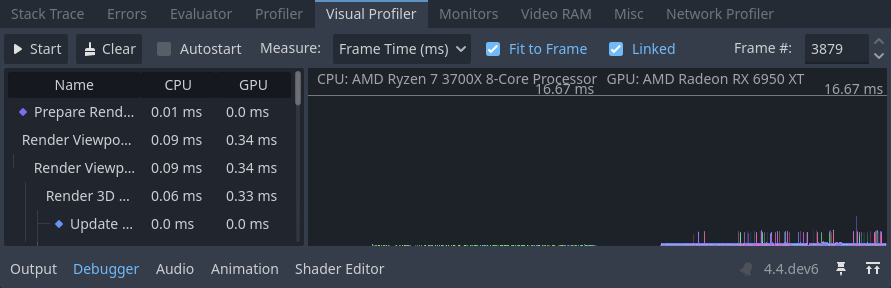
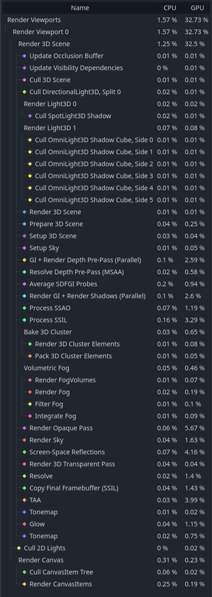
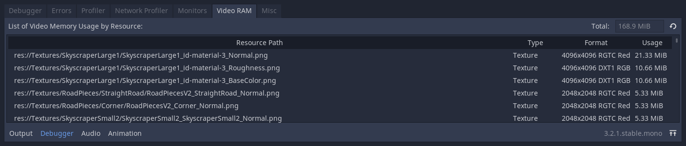

.. _doc_debugger_panel:

Debugger panel
==============

Many of Godot's debugging tools, including the debugger, can be found in the
debugger panel at the bottom of the screen. Click on **Debugger** to open it.

.. image:: img/overview_debugger.webp

The debugger panel is split into several tabs, each focusing on a specific task.

Debugger
--------

The Debugger tab opens automatically when the GDScript compiler reaches
a breakpoint in your code.

It gives you a `stack trace <https://en.wikipedia.org/wiki/Stack_trace>`__,
information about the state of the object, and buttons to control the program's
execution. When the debugger breaks on a breakpoint, a green triangle arrow is
visible in the script editor's gutter. This arrow indicates the line of code the
debugger broke on.

.. tip::

    You can create a breakpoint by clicking the gutter in the left of the script
    editor (on the left of the line numbers). When hovering this gutter, you
    will see a transparent red dot appearing, which turns into an opaque red dot
    after the breakpoint is placed by clicking. Click the red dot again to
    remove the breakpoint. Breakpoints created this way persist across editor
    restarts, even if the script wasn't saved when exiting the editor.

    You can also use the ``breakpoint`` keyword in GDScript to create a
    breakpoint that is stored in the script itself. Unlike breakpoints created by
    clicking in the gutter, this keyword-based breakpoint is persistent across
    different machines when using version control.

You can use the buttons in the top-right corner to:

- Skip all breakpoints. That way, you can save breakpoints for future
  debugging sessions.
- Copy the current error message.
- **Step Into** the code. This button takes you to the next line of code,
  and if it's a function, it steps line-by-line through the function.
- **Step Over** the code. This button goes to the next line of code,
  but it doesn't step line-by-line through functions.
- **Break**. This button pauses the game's execution.
- **Continue**. This button resumes the game after a breakpoint or pause.

Errors
------

This is where error and warning messages are printed while running the game.

You can disable specific warnings in **Project Settings > Debug > GDScript**.

Profiler
--------

The profiler is used to see what code is running while your project is in use,
and how that effects performance.

.. seealso::

    A detailed explanation of how to use the profiler can be found in the
    dedicated :ref:`doc_the_profiler` page.

Visual Profiler
---------------

The Visual Profiler can be used to monitor what is taking the most time when
rendering a frame on the CPU and GPU respectively. This allows tracking sources
of potential CPU and GPU bottlenecks caused by rendering.

.. warning::

    The Visual Profiler only measures CPU time taken for rendering tasks, such
    as performing draw calls. The Visual Profiler does **not** include CPU time
    taken for other tasks such as scripting and physics. Use the standard
    Profiler tab to track non-rendering-related CPU tasks.

To use the visual profiler, run the project, switch to the **Visual Profiler**
tab within the Debugger bottom panel, then click **Start**:

   Visual Profiler tab after clicking **Start**, waiting for a few seconds, then clicking **Stop**

You will see categories and results appearing as the profiler is running. Graph
lines also appear, with the left side being a CPU framegraph and the right side
being a GPU framegraph.

Click **Stop** to finish profiling, which will keep the results visible but
frozen in place. Results remain visible after stopping the running project, but
not after exiting the editor.

Click on result categories on the left to highlight them in the CPU and GPU
graphs on the right. You can also click on the graph to move the cursor to a
specific frame number and highlight the selected data type in the result
categories on the left.

You can switch the result display between a time value (in milliseconds per
frame) or a percentage of the target frametime (which is currently hardcoded to
16.67 milliseconds, or 60 FPS).

If framerate spikes occur during profiling, this can cause the graph to be
poorly scaled. Disable **Fit to Frame** so that the graph will zoom onto the 60
FPS+ portion.

.. note::

    Remember that Visual Profiler results can vary **heavily** based on
    viewport resolution, which is determined by the window size if using the
    ``disabled`` or ``canvas_items`` :ref:`stretch modes
    <doc_multiple_resolutions>`.

    When comparing results across different runs, make sure to use the same
    viewport size for all runs.

Visual Profiler is supported when using any rendering method (Forward+, Mobile
or Compatibility), but the reported categories will vary depending on the
current rendering method as well as the enabled graphics features. For example,
when using Forward+, a simple 2D scene with shadow-casting lights will result in
the following categories appearing:

.. figure:: img/debugger_visual_profiler_2d_example.webp
   :alt: Example results from a 2D scene in the Visual Profiler

   Example results from a 2D scene in the Visual Profiler

To give another example with Forward+, a 3D scene with shadow-casting lights and
various effects enabled will result in the following categories enabled:

   Example results from a 3D scene in the Visual Profiler

Notice how in the 3D example, several of the categories have **(Parallel)**
appended to their name. This hints that multiple tasks are being performed in
parallel on the GPU. This generally means that disabling only one of the
features involved won't improve performance as much as anticipated, as the other
task still needs to be performed sequentially.

Network Profiler
----------------

The Network Profiler contains a list of all the nodes that communicate over the
multiplayer API and, for each one, some counters on the amount of incoming and
outgoing network interactions. It also features a bandwidth meter that displays
the total bandwidth usage at any given moment.

.. note::

    The bandwidth meter does **not** take the :ref:`doc_high_level_multiplayer`
    API's own compression system into account. This means that changing the
    compression algorithm used will not change the metrics reported by the
    bandwidth meter.

Monitors
--------

The monitors are graphs of several aspects of the game while its running such as
FPS, memory usage, how many nodes are in a scene and more. All monitors keep
track of stats automatically, so even if one monitor isn't open while the game
is running, you can open it later and see how the values changed.

.. seealso::

    In addition to the default performance monitors, you can also create
    :ref:`custom performance monitors <doc_custom_performance_monitors>`
    to track arbitrary values in your project.

Video RAM
---------

The **Video RAM** tab shows the video RAM usage of the game while it is running.
It provides a list of every resource using video RAM by resource path, the type
of resource it is, what format it is in, and how much Video RAM that resource is
using. There is also a total video RAM usage number at the top right of the panel.

Misc
----

The **Misc** tab contains tools to identify the control nodes you are clicking
at runtime:

- **Clicked Control** tells you where the clicked node is in the scene tree.
- **Clicked Control Type** tells you the type of the node you clicked is.
