.. _doc_objectdb_profiler:

Using the ObjectDB profiler
===========================

Since Godot 4.6, there is a new **ObjectDB Profiler** tab in the Debugger bottom panel.
This profiler allows you to take snapshots of the current state of the ObjectDB,
which is the database that contains all the :ref:`class_object`-derived classes
currently allocated in memory. This is useful for identifying memory leaks and
understanding the memory usage of your project.

Additionally, this tool is able to visualize differences between two snapshots.
This can be used to identify improvements or regressions in memory usage after
making changes to your project. Reducing memory usage can lead to better performance,
even in cases where memory is not a bottleneck. By reducing memory usage,
you can perform fewer allocations, which can be a costly operation, especially
if performed in large amounts during gameplay.

.. seealso::

   See :ref:`doc_node_alternatives` for information on using lighter-weight
   alternatives to nodes, which can help reduce memory usage in your project.

.. warning::

    The ObjectDB profiler does **not** track every bit of memory used by the engine or
    by external libraries. Native engine classes that are not exposed to the scripting
    API will not appear in snapshots.

    Consider using external memory profiling tools if you need access to this information.

Usage
-----

Open the ObjectDB Profiler tab in the :menu:`Debugger` bottom panel.
You will land on the summary page with no snapshots taken yet.

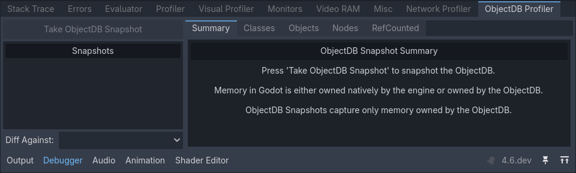

   ObjectDB profiler summary with no snapshots taken

Run the project, then get to a point where you'd like to take a snapshot
(for example, after loading a level). Click :button:`Take ObjectDB Snapshot`
to take a snapshot at the current point in time. If the button appears grayed out,
make sure the project is running first.

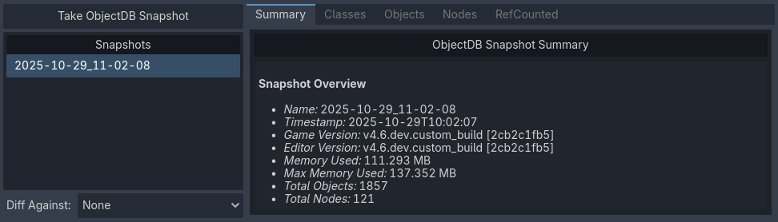

   ObjectDB profiler summary with one snapshot taken

You can take multiple snapshots during a single run of the project.
Also, you can right-click a snapshot in the snapshot list to rename it,
show it in the file manager, or delete it.

.. tip::

    It's a good idea to rename snapshots
    after taking them to give them descriptive names (e.g., ``before_optimization``,
    ``after_optimization``). Regardless of the name, the date at which the snapshot
    was taken remains saved in the snapshot file itself.

    Snapshot files have a ``.odb_snapshot`` extension and are located in
    ``user://objectdb_snapshots/`` (see :ref:`Data paths <doc_data_paths_accessing_persistent_user_data>`
    details). These can safely be copied across devices, as they're platform-independent.

Viewing differences between snapshots
^^^^^^^^^^^^^^^^^^^^^^^^^^^^^^^^^^^^^

After taking at least two snapshots, the :menu:`Diff Against` dropdown becomes
available. Here, you can select another snapshot to compare the currently selected
snapshot with.

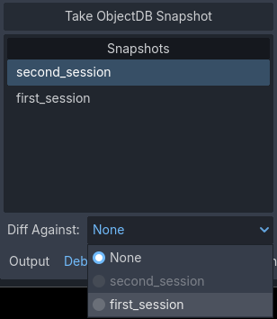

   Diff Against dropdown in the bottom-left corner of the ObjectDB profiler

The summary page will then show the differences between the two snapshots:

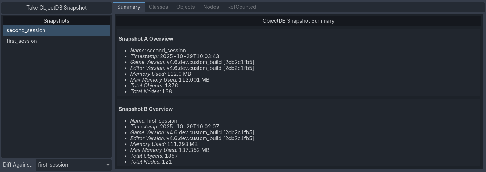

   Two snapshots being compared in the Summary tab

This also applies to every other tab in the ObjectDB profiler, which will show
the differences between the two snapshots in additional columns.

Classes
^^^^^^^

In the Classes tab, you can view how many instances of each class have been
created at the moment the snapshot was taken:

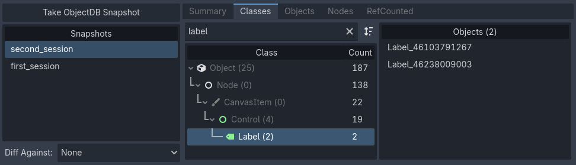

   One snapshots being viewed in the Classes tab

When in diff mode, it will show the class instance count for the currently
selected snapshot (column A) and the snapshot that is being diffed against
(column B). It will also show the difference in instance count in the column Delta.

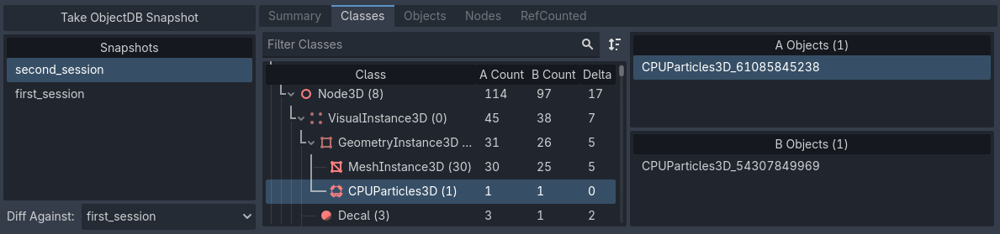

   Two snapshots being compared in the Classes tab. Here, column A is ``second_session``, column B is ``first_session``

You can click on a class in the list on the right to view it in the inspector.

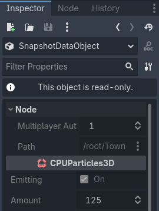

   A selected class instance being viewed in the inspector

.. tip::

   Previewing instances in the inspector is also available in other tabs
   (Nodes, Objects, and RefCounted).

Objects
^^^^^^^

The Objects tab is similar, but differs in the way it presents data. Here,
every instance is listed in a linear fashion, instead of grouping them by class.
When selecting an object, you will see a list of other objects it references
on the right (:menu:`Outbound References`), as well as a list of objects
it's being referenced by (:menu:`Inbound References`).

This allows you to view objects either in a "top-down" manner (viewing
what objects a given object references) or in a "bottom-up" manner (viewing
what objects reference a given object).

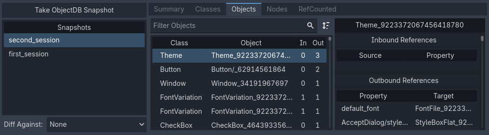

   The Objects tab being used to view objects in a "top-down" manner

In the above image, clicking the ``default_font`` object in the list will
switch the view to the perspective of that object. This object is being
referenced by a lot of other objects as well, which effectively switches
to a "bottom-up" perspective.

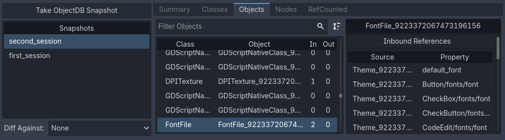

   The Objects tab being used to view objects in a "bottom-up" manner

Nodes
^^^^^

Next, the Nodes tab shows the scene tree at the time the snapshot was taken.

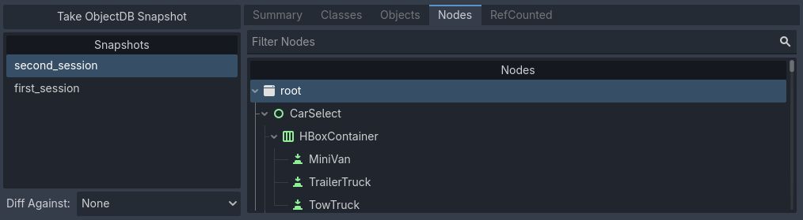

   The Nodes tab being used to view the scene tree

This tab is particularly interesting in diff view, since it supports showing
the difference between the two snapshots in a more visual manner.
When :button:`Combined Diff` is unchecked, you can see the differences side by side.

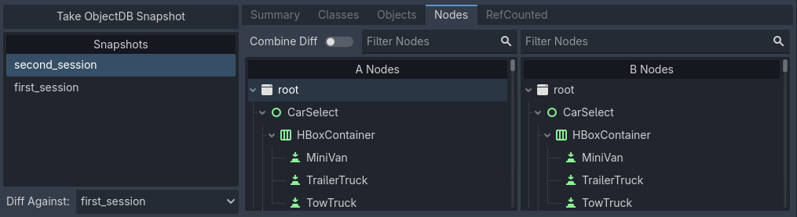

   Separate diff view in the Nodes tab

When :button:`Combined Diff` is checked, you can see the differences merged
into a single tree, with added nodes highlighted in green and removed nodes
highlighted in red.

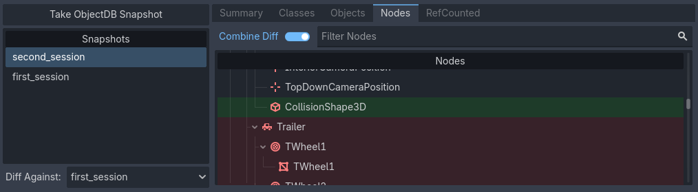

   Combined diff view in the Nodes tab

Additionally, you can view a list of orphan nodes (nodes that are not
attached to the scene tree root) at the end of the tree view. You can view
it more easily by collapsing the root node, since these are listed outside
the main scene tree.

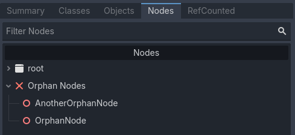

   Orphan nodes at the end of the nodes tree in the ObjectDB profiler

RefCounted
^^^^^^^^^^

The last tab is the RefCounted tab. This tab is similar to the Objects
tab, but it shows the reference counts of :ref:`class_refcounted`-derived
classes directly in the table. The table has four columns:

- **Native Refs:** The number of native engine references to the object.
- **ObjectDB Refs:** The number of ObjectDB references to the object.
- **Total Refs:** The sum of native references and ObjectDB references.
- **ObjectDB Cycles:** The number of circular references detected.

When in diff view, snapshot B is always listed *above* snapshot A
if a RefCounted instance exists in both snapshots.

The list on the right shows details on the selected instance,
including a list of references and whether these are duplicates.

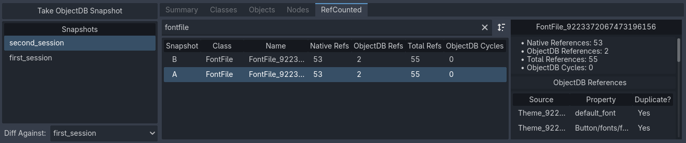

   The RefCounted tab being used to view RefCounted instances

.. note::

   The RefCounted tab does **not** list objects that derive directly from
   :ref:`class_object`, as these don't use reference counting.
