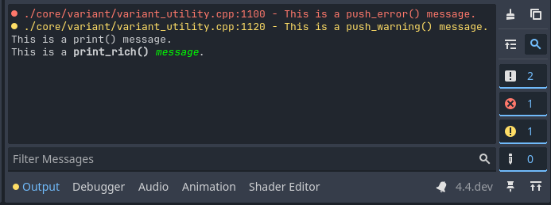

.. _doc_output_panel:

Output panel
============

The output panel is found at the bottom of the screen. Click on **Output** to open it.

The output panel provides several features to make viewing text printed by the
project (and editor) easier.

.. note::

    The output panel automatically opens when running a project by default.
    You can control this behavior by changing the **Run > Bottom Panel > Action on Play**
    editor setting.

Message categories
------------------

Four message categories are available:

- **Log:** Standard messages printed by the project. Displayed in white or black
  (depending on the editor theme).
- **Error:** Messages printed by the project or editor that report important
  information, but do not indicate a failure. Displayed in yellow.
- **Warning:** Messages printed by the project or editor that indicate a failure
  of some kind. Displayed in red.
- **Editor:** Messages printed by the editor, typically intended to be traces of
  undo/redo actions. Displayed in gray.

Filtering messages
------------------

By clicking on the buttons on the right, you can hide certain message categories.
This can make it easier to find specific messages you're looking for.

You can also filter messages by their text content using the **Filter Messages** box
at the bottom of the Output panel.

Clearing messages
-----------------

When running the project, existing messages are automatically cleared by default. This
is controlled by the **Run > Output > Always Clear Output on Play** editor setting.
Additionally, you can manually clear messages by clicking the "cleaning brush" icon
in the top-right corner of the Output panel.

Printing messages
-----------------

Several methods are available to print messages:

- :ref:`print() <class_@GlobalScope_method_print>`: Prints a message.
  This method accepts multiple arguments which are concatenated together upon printing.
- :ref:`print_rich() <class_@GlobalScope_method_print_rich>`: Same as ``print()``,
  but BBCode can be used to format the text that is printed (see below).
- :ref:`push_error() <class_@GlobalScope_method_push_error>`: Prints an error message.
  When an error is printed in a running project, it's displayed in the **Debugger > Errors**
  tab instead.
- :ref:`push_warning() <class_@GlobalScope_method_push_warning>`: Prints a warning message.
  When a warning is printed in a running project, it's displayed in the **Debugger > Errors**
  tab instead.

To get more advanced formatting capabilities, consider using
:ref:`doc_gdscript_printf` along with the above printing functions.

.. _doc_output_panel_printing_rich_text:

Printing rich text
^^^^^^^^^^^^^^^^^^

Using :ref:`print_rich() <class_@GlobalScope_method_print_rich>`, you can print
rich text to the editor Output panel and standard output (visible when the user
runs the project from a terminal). This works by converting the BBCode to
`ANSI escape codes <https://en.wikipedia.org/wiki/ANSI_escape_code>`__ that the
terminal understands.

In the editor output, all BBCode tags are recognized as usual. In the terminal
output, only a subset of BBCode tags will work, as documented in the linked
``print_rich()`` method description above. In the terminal, the colors will look
different depending on the user's theme, while colors in the editor will use the
same colors as they would in the project.

.. note::

    ANSI escape code support varies across terminal emulators. On Windows, only
    Windows 10 and later can display ANSI escape codes in its default terminal
    application.

    The exact colors displayed in terminal output also depend on the terminal
    theme chosen by the user.
