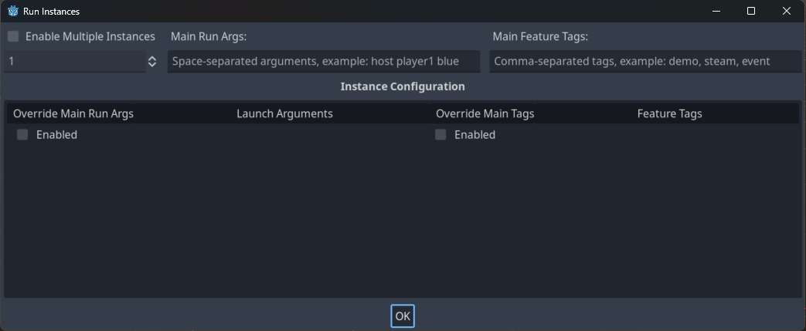

.. _doc_overview_of_debugging_tools:

Overview of debugging tools
===========================

This guide will give you an overview of the available debugging tools in the
engine.

Godot comes with a powerful debugger and profilers to track down bugs, inspect
your game at runtime, monitor essential metrics, and measure performances.
It also offers options to visualize collision boxes and navigation polygons
in the running game.

Finally, you have options to debug the game running on a remote device
and to reload changes to your scenes or your code while the game is running.

Output Panel
--------------

The output panel allows you to see text printed by the project, but also by the editor (e.g. from ``@tool`` scripts).
You can find information about in :ref:`doc_output_panel`.

Debugger Panel
--------------

Many of Godot's debugging tools are part of the Debugger panel, which you can
find information about in :ref:`doc_debugger_panel`.

Debug menu options
------------------

There are a few common debug options you can toggle on or off when running
your game in the editor, which can help you in debugging your game.

You can find these options in the **Debug** editor menu.

.. image:: img/overview_debug.webp

Here are the descriptions of the options:

Deploy with Remote Debug
++++++++++++++++++++++++

When this option is enabled, using one-click deploy will make the executable
attempt to connect to this computer's IP so the running project can be debugged.
This option is intended to be used for remote debugging (typically with a mobile
device).
You don't need to enable it to use the GDScript debugger locally.

Small Deploy with Network Filesystem
++++++++++++++++++++++++++++++++++++

This option speeds up testing for games with a large footprint on remote devices.

When **Small Deploy with Network Filesystem** is on, instead of exporting the
full game, deploying the game builds a minimal executable. The editor then
provides files from the project over the network.

Also, on Android, the game is deployed using the USB cable to speed up
deployment.

Visible Collision Shapes
++++++++++++++++++++++++

When this option is enabled, collision shapes and raycast nodes (for 2D and 3D)
will be visible in the running project.

Visible Paths
+++++++++++++

When this option is enabled, curve resources used by path nodes will be visible
in the running project.

Visible Navigation
++++++++++++++++++

When this option is enabled, navigation meshes, and polygons will be visible in
the running project.

Visible Avoidance
+++++++++++++++++

When this option is enabled, avoidance object shapes, radiuses, and velocities
will be visible in the running project.

Debug CanvasItem Redraws
++++++++++++++++++++++++

When this option is enabled, redraw requests of 2D objects will become visible
(as a short flash) in the running project.
This is useful to troubleshoot low processor mode.

Synchronize Scene Changes
++++++++++++++++++++++++++

When this option is enabled, any changes made to the scene in the editor will be
replicated in the running project.
When used remotely on a device, this is more efficient when the network
filesystem option is enabled.

Synchronize Script Changes
+++++++++++++++++++++++++++

When this option is enabled, any changes made to the script in the editor will
be reloaded in the running project. When used
remotely on a device, this is more efficient with the network filesystem.

Keep Debug Server Open
++++++++++++++++++++++

When this option is enabled, the editor debug server will stay open and listen
for new sessions started outside of the editor itself.

Customize Run Instances...
++++++++++++++++++++++++++

This opens a dialog allowing you to tell Godot to run multiple instances of the
game at once, and to specify the command line arguments for each instance. This
is especially useful when building and debugging multiplayer games.

Enable Multiple Instances
^^^^^^^^^^^^^^^^^^^^^^^^^

When this option is enabled, the editor will run multiple instances of the
project at once when you Run Project.

Below this checkbox is a selector to pick how many instances to run.

Checking the box and setting this to only 1 is the same as not checking this box
at all.

Main Run Args
^^^^^^^^^^^^^

These are the arguments that will be passed to **every** instance of the project
when you Run Project, unless you select "Enabled" under "Override Main Run Args"
for a specific instance.

Note that these arguments are space-separated.

.. tip::

    These arguments can be accessed in your script by using
    :ref:`get_cmdline_args<class_OS_method_get_cmdline_args>`.

.. warning::

    Even if you uncheck "Enable Multiple Instances" these arguments will be
    passed when you Run Project.

Main Feature Tags
^^^^^^^^^^^^^^^^^

These are the feature tags that will be passed to **every** instance of the
project when you Run Project, unless you select "Enabled" under "Override Main
Tags" for a specific instance.

Override Main Run Args
^^^^^^^^^^^^^^^^^^^^^^

When this is enabled, the arguments in the "Main Run Args" field will **not be
passed** to this specific instance of the project when you Run Project.

Launch Arguments
^^^^^^^^^^^^^^^^

These are the arguments that will be passed to this specific instance of the
project when you Run Project. They will be **combined with** the "Main Run Args"
unless you select "Enabled" under "Override Main Run Args".

Override Main Tags
^^^^^^^^^^^^^^^^^^

When this is enabled, the tags in the "Main Feature Tags" field will **not be
passed** to this specific instance of the project when you Run Project.

Feature Tags
^^^^^^^^^^^^

These are the feature tags that will be passed to this specific instance of the
project when you Run Project. They will be **combined with** the "Main Feature
Tags" unless you select "Enabled" under "Override Main Tags".

.. warning::
    If you want to pass "User" arguments, that can be accessed with
    :ref:`get_cmdline_user_args<class_OS_method_get_cmdline_user_args>` then you
    must prefix them with two dashes **and a space** like `-- one two three`.

    Be aware that these dashes will apply to arguments added later in the
    "Launch Arguments" on a per instance basis, which can cause some confusion
    when combining the `Main Run Args` and `Launch Arguments`.

    If you place `-- one two three` in the "Main Run Args" and `-- four five
    six` in the "Launch Arguments" then the final command line arguments will be
    `one two three -- four five six`. This is because the `--` is repeated in
    the "Launch Arguments".

.. _doc_debugger_tools_and_options:

Script editor debug tools and options
-------------------------------------

The script editor has its own set of debug tools for use with breakpoints and
two options. The breakpoint tools can also be found in the **Debugger** tab
of the debugger.

.. tip::

    You can create a breakpoint by clicking the gutter in the left of the script
    editor (on the left of the line numbers). When hovering this gutter, you
    will see a transparent red dot appearing, which turns into an opaque red dot
    after the breakpoint is placed by clicking. Click the red dot again to
    remove the breakpoint. Breakpoints created this way persist across editor
    restarts, even if the script wasn't saved when exiting the editor.

    You can also use the ``breakpoint`` keyword in GDScript to create a
    breakpoint that is stored in the script itself. Unlike breakpoints created by
    clicking in the gutter, this keyword-based breakpoint is persistent across
    different machines when using version control.

.. image:: img/overview_script_editor.webp

The **Break** button causes a break in the script like a breakpoint would.
**Continue** makes the game continue after pausing at a breakpoint.
**Step Over** goes to the next line of code, and **Step Into** goes into
a function if possible. Otherwise, it does the same thing as **Step Over**.

The **Debug with External Editor** option lets you debug your game with an external editor.
You can set a shortcut for it in **Editor Settings > Shortcuts > Debugger**.

When the debugger breaks on a breakpoint, a green triangle arrow is visible in
the script editor's gutter. This arrow indicates the line of code the debugger
broke on.

Debug project settings
----------------------

In the project settings, there is a **Debug** category with subcategories which
control different things. Enable **Advanced Settings** to change these settings.

Settings
++++++++

These are some general settings such as printing the current FPS
to the **Output** panel, the maximum amount of functions when profiling
and others.

File Logging
++++++++++++

These settings allow you to log console output and error messages to files.

GDScript
++++++++

These settings allow you to toggle specific GDScript warnings, such as for
unused variables. You can also turn off warnings completely. See
:ref:`doc_gdscript_warning_system` for more information.

Shader Language
+++++++++++++++

These settings allow you to toggle specific shader warnings, such as for
unused variables. You can also turn off warnings completely.

Canvas Items
++++++++++++

These settings are for canvas item redraw debugging.

Shapes
++++++

Shapes are where you can adjust the color of shapes that only appear for
debugging purposes, such as collision and navigation shapes.

Remote in scene dock
--------------------

When running a game in the editor two options appear at the top of the **Scene**
dock, **Remote** and **Local**. While using **Remote** you can inspect or change
the nodes' parameters in the running project.

.. image:: img/overview_remote.webp

.. note:: Some editor settings related to debugging can be found inside
          the **Editor Settings**, under the **Network > Debug** and **Debugger** sections.
