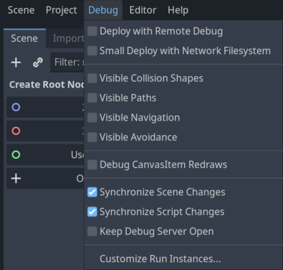
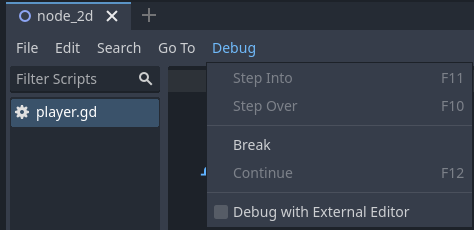

.. _doc_overview_of_debugging_tools:

Overview of debugging tools
===========================

This guide will give you an overview of the available debugging tools in the
engine.

Godot comes with a powerful debugger and profilers to track down bugs, inspect
your game at runtime, monitor essential metrics, and measure performances.
It also offers options to visualize collision boxes and navigation polygons
in the running game.

Finally, you have options to debug the game running on a remote device
and to reload changes to your scenes or your code while the game is running.

Debugger Panel
--------------

Many of Godot's debugging tools are part of the Debugger panel, which you can
find information about in :ref:`doc_debugger_panel`.

Debug menu options
------------------

There are a few common debug options you can toggle on or off when running
your game in the editor, which can help you in debugging your game.

You can find these options in the **Debug** editor menu.

Here are the descriptions of the options:

Deploy with Remote Debug
++++++++++++++++++++++++

When exporting and deploying, the resulting executable will attempt to connect
to the IP of your computer for debugging.

Small Deploy with Network FS
++++++++++++++++++++++++++++

This option speeds up testing for games with a large footprint on remote devices.

When **Small Deploy with Network FS** is on, instead of exporting the full game,
deploying the game builds a minimal executable. The editor then provides files
from the project over the network.

Also, on Android, the game is deployed using the USB cable to speed up deployment.

Visible Collision Shapes
++++++++++++++++++++++++

This option makes collision shapes and raycast nodes visible in the running game.

Visible Navigation
++++++++++++++++++

Navigation meshes and polygons will be visible on the running game.

Sync Scene Changes
++++++++++++++++++

With this option, any change you make to a scene in the editor at runtime
appears instantly. When used remotely on a device, this is more efficient
with the network filesystem.

Sync Script Changes
+++++++++++++++++++

Any script that is saved will be reloaded on the running game. When used
remotely on a device, this is more efficient with the network filesystem.

.. _doc_debugger_tools_and_options:

Script editor debug tools and options
-------------------------------------

The script editor has its own set of debug tools for use with breakpoints and
two options. The breakpoint tools can also be found in the **Debugger** tab
of the debugger.

.. tip::

    You can create a breakpoint by clicking the gutter in the left of the script
    editor (on the left of the line numbers). When hovering this gutter, you
    will see a transparent red dot appearing, which turns into an opaque red dot
    after the breakpoint is placed by clicking. Click the red dot again to
    remove the breakpoint. Breakpoints created this way persist across editor
    restarts, even if the script wasn't saved when exiting the editor.

    You can also use the ``breakpoint`` keyword in GDScript to create a
    breakpoint that is stored in the script itself. Unlike breakpoints created by
    clicking in the gutter, this keyword-based breakpoint is persistent across
    different machines when using version control.

The **Break** button causes a break in the script like a breakpoint would.
**Continue** makes the game continue after pausing at a breakpoint.
**Step Over** goes to the next line of code, and **Step Into** goes into
a function if possible. Otherwise, it does the same thing as **Step Over**.

The **Keep Debugger Open** option keeps the debugger open after a scene
has been closed.
The **Debug with External Editor** option lets you debug your game with an external editor.
This option is also accessible in **Editor Settings > Debugger**.

When the debugger breaks on a breakpoint, a green triangle arrow is visible in
the script editor's gutter. This arrow indicates the line of code the debugger
broke on.

Debug project settings
----------------------

In the project settings, there is a **Debug** category with three subcategories
which control different things.

Settings
++++++++

These are some general settings such as printing the current FPS
to the **Output** panel, the maximum amount of functions when profiling
and others.

GDScript
++++++++

These settings allow you to toggle specific GDScript warnings, such as for
unused variables. You can also turn off warnings completely.

Shapes
++++++

Shapes are where you can adjust the color of shapes that only appear for
debugging purposes, such as collision and navigation shapes.

Remote in scene dock
--------------------

When running a game in the editor two options appear at the top of the **Scene**
dock, **Remote** and **Local**. While using **Remote** you can inspect or change
the nodes' parameters in the running project.

.. image:: img/overview_remote.webp

.. note:: Some editor settings related to debugging can be found inside
          the **Editor Settings**, under the **Network > Debug** and **Debugger** sections.
