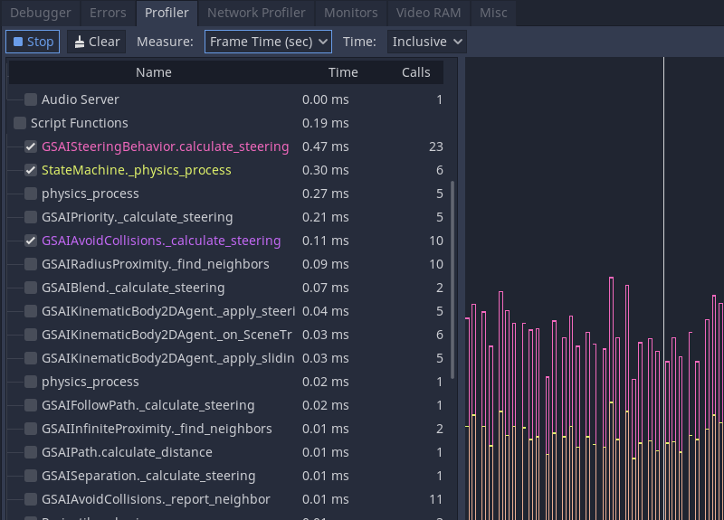
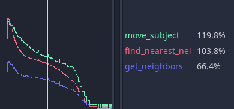

.. _doc_the_profiler:

The Profiler
============

You run your game from Godot and play around. It's fun, it's becoming feature
complete, and you feel it's getting close to release.

But then, you open the skill tree, and it grinds to a halt as something snags in
your code. Watching the skill tree scroll by like it's a slide show is
unacceptable. What went wrong? Is it positioning the skill tree elements, the
UI, or rendering?

You could try to optimize everything and run the game repeatedly, but you can be
smarter about this and narrow down the possibilities. Enter Godot's profiler.

An overview of the profiler
+++++++++++++++++++++++++++

You can open the profiler by opening the **Debugger** panel and clicking on the
**Profiler** tab.

Godot's profiler does not automatically run because profiling is
performance-intensive. It has to continually measure everything happening in the
game and report back to the debugger, so it's off by default.

To begin profiling, click on the **Start** button in the top-left. Run your game
and data will start appearing. You can also start profiling at any time before
or during gameplay, depending on if you want.

.. note::

    The profiler does not currently support C# scripts. C# scripts can be profiled
    using JetBrains Rider and JetBrains dotTrace with the Godot support plugin.

You can clear the data by clicking the **Clear** button anytime. Use the
**Measure** drop-down menu to change the type of data you measure. The
measurements panel and the graph will update accordingly.

The measured data
+++++++++++++++++

The profiler's interface is split into two. There is a list of functions on the
left and the performance graph on the right.

The main measurements are frame time, physics frame, idle time, and physics time.

- The **frame time** is the time it takes Godot to execute all the logic for an
  entire image, from physics to rendering.
- **Physics frame** is the time Godot has allocated between physics updates. In
  an ideal scenario, the frame time is whatever you chose: 16.66 milliseconds by
  default, which corresponds to 60FPS. It's a frame of reference you can use for
  everything else around it.
- **Idle time** is the time Godot took to update logic other than physics, such
  as code that lives in `_process` or timers and cameras set to update on
  **Idle**.
- **Physics time** is the time Godot took to update physics tasks, like
  `_physics_process` and built-in nodes set to **Physics** update.

.. note:: **Frame Time** includes rendering time. Say you find a mysterious
          spike of lag in your game, but your physics and scripts are
          all running fast. The delay could be due to the appearance of
          particles or visual effects!

By default, Godot ticks on Frame Time and Physics Time. This gives you an
overview of how long each frame takes relative to the allocated desired physics
FPS. You can toggle functions on and off by clicking the checkboxes on the left.
Other facilities make appearances as you go down the list, like Physics 2D,
Physics, and Audio, before reaching Script functions, where your code appears.

If you click on the graph, you change which frame's information appears on the
left. In the top right, there is also a frame counter where you can manually
adjust the frame you are looking at more granularly.

Scope of measurement and measurement windows
++++++++++++++++++++++++++++++++++++++++++++

You can change what measurement you are looking at using the **Measure**
drop-down menu. By default, it starts with Frame Time and lists the time it
takes to go through the frame in milliseconds. The average time is the average
time any given function took when called more than once. For example, a function
that took 0.05 milliseconds to run five times should give you an average of 0.01
milliseconds.

If accurate milliseconds count is not important, and you want to see proportions
of time relative to the rest of the frame, use percentage measurements. Frame %
is relative to Frame Time, and Physics % is relative to Physics Time.

The last option is the scope of the time. **Inclusive** measures the time a
function took **with** any nested function calls. For example:

`get_neighbors`, `find_nearest_neighbor` and `move_subject` all took a lot of
time. You could be fooled into thinking that this is because all three of them
are slow.

But when changed to **Self**, Godot measures the time spent in the function body
without considering function calls it made itself.

.. image:: img/self_curve.png

You can see that `get_neighbors` and `move_subject` have lost a lot of their
importance. In effect, that means that `get_neighbors` and `move_subject` have
spent more time waiting for some other function call to finish than not, and
`find_nearest_neighbor` is **actually** slow.

Debugging slow code with the profiler
+++++++++++++++++++++++++++++++++++++

Finding slow code with the profiler boils down to running your game and watching
the performance graph as it draws. When an unacceptable spike occurs in the
frame time, you can click on the graph to pause your game and narrow the _Frame
#_ to the spike's start. You may need to jump back and forth between frames and
functions to find the root cause.

Under the Script functions, turn on the checkboxes for some functions to find
which take time. These are the functions you need to review and optimize.

Measuring manually in microseconds
++++++++++++++++++++++++++++++++++

If your function is complex, it could be challenging to figure out which part
needs optimization. Is it your math or the way you access other pieces of data
to do the math with? Is it the `for` loop? The `if` statements?

You can narrow down the measurement by manually counting ticks as the code runs
with some temporary functions. The two functions are part of the `Time` class
object. They are `get_ticks_msec` and `get_ticks_usec`. The first measures in
milliseconds (1,000 per second), and the second measures in microseconds
(1,000,000 per second).

Either one returns the amount of time since the game engine started in their respective
time frame.

If you wrap a piece of code with a start and end count of microseconds, the
difference between the two is the amount of time it took to run that piece of
code.

.. tabs::
 .. code-tab:: gdscript GDScript

    # Measuring the time it takes for worker_function() to run
    var start = Time.get_ticks_usec()
    worker_function()
    var end = Time.get_ticks_usec()
    var worker_time = (end-start)/1000000.0

    # Measuring the time spent running a calculation over each element of an array
    start = Time.get_ticks_usec()
    for calc in calculations:
        result = pow(2, calc.power) * calc.product
    end = Time.get_ticks_usec()
    var loop_time = (end-start)/1000000.0

    print("Worker time: %s\nLoop time: %s" % [worker_time, loop_time])

As you become a more experienced programmer, this technique becomes less
necessary. You begin to learn what parts of a running program are slow. Knowing
that loops and branches can be slow comes from experience, and you gain
experience by measuring and doing research.

But between the profiler and the ticks functions, you should have enough to get
started finding which parts of your code need optimization.
