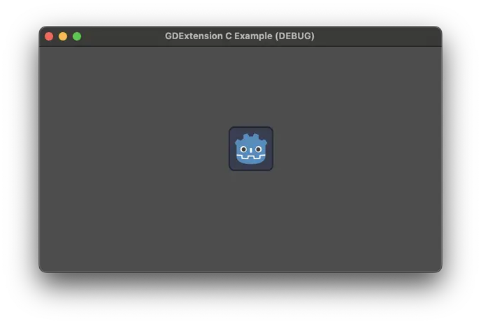
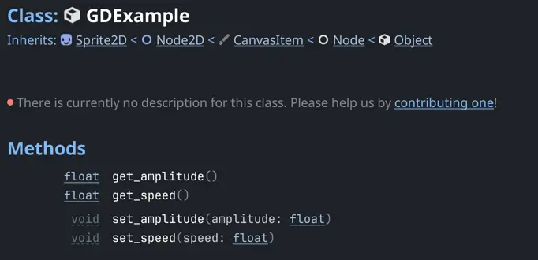
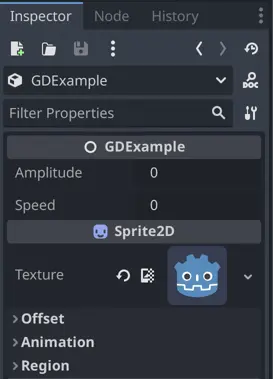
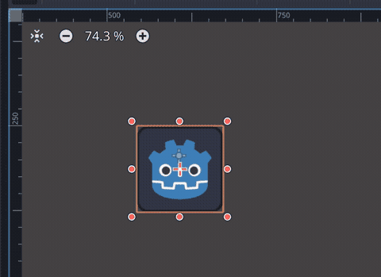
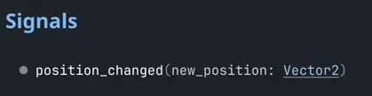
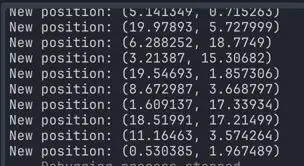

.. _doc_gdextension_c_example:

GDExtension C example
=====================

Introduction
------------

This is a simple example on how to work with GDExtension directly with C code.
Note that the API is not meant to be used directly, so this will definitely be
quite verbose and require a lot of steps even for a small example. However, it
serves as a reference for creating bindings for a different language. It is
still possible to use the API directly if you prefer, which might be convenient
when only binding a third-party library.

In this example we will create a custom node that moves a sprite on the screen
based on the user's parameters. While very simple, it serves to show how to do
some of the things with GDExtension, like registering custom classes with
methods, properties, and signals. It gives an insight on the GDExtension API.

Setting up the project
----------------------

There are a few prerequisites you'll need:

- a Godot 4.2 (or later) executable,
- a C compiler,
- SCons as a build tool.

Since this is using the API directly, there's no need to use the
`godot-cpp repository <https://github.com/godotengine/godot-cpp>`__.

File structure
--------------

To organize our files, we're gonna split into mainly two folders:

.. code-block:: none

    gdextension_c_example/
    |
    +--demo/                  # game example/demo to test the extension
    |
    +--src/                   # source code of the extension we are building

We also need a copy of the ``gdextension_interface.h`` header from the Godot
source code, which can be obtained directly from the Godot executable by running
the following command:

.. code-block:: none

    godot --dump-gdextension-interface

This creates the header in the current folder, so you can just copy it to the ``src``
folder in the example project.

Lastly, there's another source of information we need to refer to, which is the JSON
file with the Godot API reference. This file won't be used by the code directly, we
will only use it to extract some information manually.

To get this JSON file, just call the Godot executable:

.. code-block:: none

    godot --dump-extension-api

The resulting ``extension_api.json`` file will be created in the current
folder. You can copy this file to the example folder to have it handy.

.. note::
    This extension is targeting Godot 4.2, but it should work on later versions as
    well. If you want to target a different minimal version, make sure to get the
    header and the JSON from the version Godot version you are targeting.

Buildsystem
-----------

Using a buildsystem makes our life a lot easier when dealing with C code. For
the sake of convenience, we'll use SCons since it's the same as what Godot
itself uses.

The following ``SConstruct`` file is a simple one that will build your extension
to the current platform that you are using, be it Linux, macOS, or Windows. This
will be a non-optimized build for debugging purposes. It also assumes a 64-bit
build, which is relevant for some parts of the example code. Making other build
types and cross-compilation is out of the scope of this tutorial. Save this file
to the root folder.

.. code-block:: python

    #!/bin/env python
    from SCons.Script import Environment
    from os import path
    import sys

    env = Environment()

    # Set the target path and name.
    target_path = "demo/bin/"
    target_name = "libgdexample"

    # Set the compiler and flags.
    env.Append(CPPPATH=["src"])  # Add the src folder to the include path.
    env.Append(CFLAGS=["-O0", "-g"])  # Make it a debug build.

    # Use Clang on macOS.
    if sys.platform == "darwin":
        env["CC"] = "clang"

    # Add all C files in "src" folder as sources.
    sources = env.Glob("src/*.c")

    # Create a shared library.
    library = env.SharedLibrary(
        target=path.join(target_path, target_name),
        source=sources,
    )

    # Set the library as the default target.
    env.Default(library)

This will include all C files in the ``src`` folder, so we don't need to change
this file when adding new source files.

Initializing the extension
--------------------------

The first bit of code will be responsible for initializing the extension. This is
what makes Godot aware of what our GDExtension provides, such as classes and
plugins.

Create the file ``init.h`` in the ``src`` folder, with the following contents:

.. code-block:: c

    #pragma once

    #include "defs.h"

    #include "gdextension_interface.h"

    void initialize_gdexample_module(void *p_userdata, GDExtensionInitializationLevel p_level);
    void deinitialize_gdexample_module(void *p_userdata, GDExtensionInitializationLevel p_level);
    GDExtensionBool GDE_EXPORT gdexample_library_init(GDExtensionInterfaceGetProcAddress p_get_proc_address, GDExtensionClassLibraryPtr p_library, GDExtensionInitialization *r_initialization);

The functions declared here have the signatures expected by the GDExtension API.

Note the inclusion of the ``defs.h`` file. This is one of our helpers to
simplify writing the extension code. For now it will only contain the definition
of ``GDE_EXPORT``, a macro that makes the function public in the shared library
so Godot can properly call it. This macro helps abstracting what each compiler
expects.

Create the ``defs.h`` file in the ``src`` folder with the following contents:

.. code-block:: c

    #pragma once

    #include <stdbool.h>
    #include <stddef.h>
    #include <stdint.h>

    #if !defined(GDE_EXPORT)
    #if defined(_WIN32)
    #define GDE_EXPORT __declspec(dllexport)
    #elif defined(__GNUC__)
    #define GDE_EXPORT __attribute__((visibility("default")))
    #else
    #define GDE_EXPORT
    #endif
    #endif // ! GDE_EXPORT

We also include some standard headers to make things easier. Now we only have to
include ``defs.h`` and those will come as a bonus.

Now, let's implement the functions we just declared. Create a file called
``init.c`` in the ``src`` folder and add this code:

.. code-block:: c

    #include "init.h"

    void initialize_gdexample_module(void *p_userdata, GDExtensionInitializationLevel p_level)
    {
    }

    void deinitialize_gdexample_module(void *p_userdata, GDExtensionInitializationLevel p_level)
    {
    }

    GDExtensionBool GDE_EXPORT gdexample_library_init(GDExtensionInterfaceGetProcAddress p_get_proc_address, GDExtensionClassLibraryPtr p_library, GDExtensionInitialization *r_initialization)
    {
        r_initialization->initialize = initialize_gdexample_module;
        r_initialization->deinitialize = deinitialize_gdexample_module;
        r_initialization->userdata = NULL;
        r_initialization->minimum_initialization_level = GDEXTENSION_INITIALIZATION_SCENE;

        return true;
    }

What this does is set up the initialization data that Godot expects. The
functions to initialize and deinitialize are set so Godot will call then when
needed. It also sets the initialization level which varies per extension. Since
we plan to add a custom node, the ``SCENE`` level is enough.

We will fill the ``initialize_gdexample_module()`` function later to register our custom class.

A basic class
-------------

In order to make an actual node, first we'll create a C struct to hold data and
functions that will act as methods. The plan is to make this a custom node that
inherits from :ref:`Sprite2D <class_Sprite2D>`.

Create a file called ``gdexample.h`` in the ``src`` folder with the following
contents:

.. code-block:: c

    #pragma once

    #include "gdextension_interface.h"

    #include "defs.h"

    // Struct to hold the node data.
    typedef struct
    {
        // Metadata.
        GDExtensionObjectPtr object; // Stores the underlying Godot object.
    } GDExample;

    // Constructor for the node.
    void gdexample_class_constructor(GDExample *self);

    // Destructor for the node.
    void gdexample_class_destructor(GDExample *self);

    // Bindings.
    void gdexample_class_bind_methods();

Noteworthy here is the ``object`` field, which holds a pointer to
the Godot object, and the ``gdexample_class_bind_methods()`` function, which will
register the metadata of our custom class (properties, methods, and signals).
The latter is not entirely necessary, as we can do it when registering the
class, but it makes clearer to separate the concerns and let our class register
its own metadata.

The ``object`` field is necessary because our class will inherit a Godot class.
Since we can't inherit it directly, as we are not interacting with the source
code (and C doesn't even have classes), we instead tell Godot to create an
object of a type it knows and attach our extension to it. We will need the
reference to such objects when calling methods on the parent class, for
instance.

Let's create the source counterpart of this header. Create the file
``gdexample.c`` in the ``src`` folder and add the following code to it:

.. code-block:: c

    #include "gdexample.h"

    void gdexample_class_constructor(GDExample *self)
    {
    }

    void gdexample_class_destructor(GDExample *self)
    {
    }

    void gdexample_class_bind_methods()
    {
    }

As we don't have anything to do with those functions yet, they'll stay empty
for a while.

The next step is registering our class. However, in order to do so we need to
create a :ref:`StringName <class_StringName>` and for that we have to get a
function from the GDExtension API. Since we'll need this a few times and we'll
also need other things, let's create a wrapper API to facilitate this kind of
chore.

A wrapper API
-------------

We'll start by creating an ``api.h`` file in the ``src`` folder:

.. code-block:: c

    #pragma once

    /*
    This file works as a collection of helpers to call the GDExtension API
    in a less verbose way, as well as a cache for methods from the discovery API,
    just so we don't have to keep loading the same methods again.
    */

    #include "gdextension_interface.h"

    #include "defs.h"

    extern GDExtensionClassLibraryPtr class_library;

    // API methods.

    struct Constructors
    {
        GDExtensionInterfaceStringNameNewWithLatin1Chars string_name_new_with_latin1_chars;
    } constructors;

    struct Destructors
    {
        GDExtensionPtrDestructor string_name_destructor;
    } destructors;

    struct API
    {
        GDExtensionInterfaceClassdbRegisterExtensionClass2 classdb_register_extension_class2;
    } api;

    void load_api(GDExtensionInterfaceGetProcAddress p_get_proc_address);

This file will include many other helpers as we fill our extension with
something useful. For now it only has a pointer to a function that creates a
StringName from a C string (in Latin-1 encoding) and another to destruct a
StringName, which we'll need to use to avoid leaking memory, as well as the
function to register a class, which is our initial goal.

We also keep a reference to the ``class_library`` here. This is something that
Godot provides to us when initializing the extension and we'll need to use it
when registering the things we create so Godot can tell which extension is
making the call.

There's also a function to load those function pointers from the GDExtension API.

Let's work on the source counterpart of this header. Create the ``api.c`` file
in the ``src`` folder, adding the following code:

.. code-block:: c

    #include "api.h"

    GDExtensionClassLibraryPtr class_library = NULL;

    void load_api(GDExtensionInterfaceGetProcAddress p_get_proc_address)
    {
        // Get helper functions first.
        GDExtensionInterfaceVariantGetPtrDestructor variant_get_ptr_destructor = (GDExtensionInterfaceVariantGetPtrDestructor)p_get_proc_address("variant_get_ptr_destructor");

        // API.
        api.classdb_register_extension_class2 = p_get_proc_address("classdb_register_extension_class2");

        // Constructors.
        constructors.string_name_new_with_latin1_chars = p_get_proc_address("string_name_new_with_latin1_chars");

        // Destructors.
        destructors.string_name_destructor = variant_get_ptr_destructor(GDEXTENSION_VARIANT_TYPE_STRING_NAME);
    }

The first important thing here is ``p_get_proc_address``. This a function from
the GDExtension API that is passed during initialization. You can use this
function to request specific functions from the API by their name. Here we are
caching the results so we don't have to keep a reference for
``p_get_proc_address`` everywhere and use our wrapper instead.

At the start we request the ``variant_get_ptr_destructor()`` function. This is not
going to be used outside of this function, so we don't add to our wrapper and
only cache it locally. The cast is necessary to silence compiler warnings.

Then we get the function that creates a StringName from a C string, exactly what
we mentioned before as a needed function. We store that in our ``constructors``
struct.

Next, we use the ``variant_get_ptr_destructor()`` function we just got to query
for the destructor for StringName, using the enum value from
``gdextension_interface.h`` API as a parameter. We could get destructors for
other types in a similar manner, but we'll limit ourselves to what is needed for
the example.

Lastly, we get the ``classdb_register_extension_class2()`` function, which we'll
need in order to register our custom class.

.. note::
    You may wonder why the ``2`` is there in the function name. This means it's the
    second version of this function. The old version is kept to ensure backwards
    compatibility with older extensions, but since we have the second version
    available, it's best to use the new one, because we don't intend to support older
    Godot versions in this example.

    The ``gdextension_interface.h`` header documents in which Godot version each
    function was introduced.

We also define the ``class_library`` variable here, which will be set during
initialization.

Speaking of initialization, now we have to change the ``init.c`` file in
order to fill the things we just added:

.. code-block:: c

    GDExtensionBool GDE_EXPORT gdexample_library_init(GDExtensionInterfaceGetProcAddress p_get_proc_address, GDExtensionClassLibraryPtr p_library, GDExtensionInitialization *r_initialization)
    {
        class_library = p_library;
        load_api(p_get_proc_address);

        ...

Here we set the ``class_library`` as needed and call our new ``load_api()``
function. Don't forget to also include the new headers at the top of this file:

.. code-block:: c

    #include "init.h"

    #include "api.h"
    #include "gdexample.h"
    ...

Since we are here, we can register our new custom class. Let's fill the
``initialize_gdexample_module()`` function:

.. code-block:: c

    void initialize_gdexample_module(void *p_userdata, GDExtensionInitializationLevel p_level)
    {
        if (p_level != GDEXTENSION_INITIALIZATION_SCENE)
        {
            return;
        }

        // Register class.
        StringName class_name;
        constructors.string_name_new_with_latin1_chars(&class_name, "GDExample", false);
        StringName parent_class_name;
        constructors.string_name_new_with_latin1_chars(&parent_class_name, "Sprite2D", false);

        GDExtensionClassCreationInfo2 class_info = {
            .is_virtual = false,
            .is_abstract = false,
            .is_exposed = true,
            .set_func = NULL,
            .get_func = NULL,
            .get_property_list_func = NULL,
            .free_property_list_func = NULL,
            .property_can_revert_func = NULL,
            .property_get_revert_func = NULL,
            .validate_property_func = NULL,
            .notification_func = NULL,
            .to_string_func = NULL,
            .reference_func = NULL,
            .unreference_func = NULL,
            .create_instance_func = gdexample_class_create_instance,
            .free_instance_func = gdexample_class_free_instance,
            .recreate_instance_func = NULL,
            .get_virtual_func = NULL,
            .get_virtual_call_data_func = NULL,
            .call_virtual_with_data_func = NULL,
            .get_rid_func = NULL,
            .class_userdata = NULL,
        };

        api.classdb_register_extension_class2(class_library, &class_name, &parent_class_name, &class_info);

        // Bind methods.
        gdexample_class_bind_methods();

        // Destruct things.
        destructors.string_name_destructor(&class_name);
        destructors.string_name_destructor(&parent_class_name);
    }

The struct with the class information is the biggest thing here. None of its
fields are required with the exception of ``create_instance_func`` and
``free_instance_func``. We haven't made those functions yet, so we'll have
to work on them soon. Note that we skip the initialization if it isn't at the
``SCENE`` level. This function may be called multiple times, once for each
level, but we only want to register our class once.

The other undefined thing here is ``StringName``. This will be an opaque struct
meant to hold the data of a Godot StringName in our extension. We'll define it
in the appropriately named ``defs.h`` file:

.. code-block:: c

    ...
    // The sizes can be obtained from the extension_api.json file.
    #ifdef BUILD_32
    #define STRING_NAME_SIZE 4
    #else
    #define STRING_NAME_SIZE 8
    #endif

    // Types.

    typedef struct
    {
        uint8_t data[STRING_NAME_SIZE];
    } StringName;

    #endif // DEFS_H

As mentioned in the comment, the sizes can be found in the
``extension_api.json`` file that we generated earlier, under the
``builtin_class_sizes`` property. The ``BUILD_32`` is never defined, as we
assume we are working with a 64-bits build of Godot here, but if you need it you
can add ``env.Append(CPPDEFINES=["BUILD_32"])`` to your ``SConstruct`` file.

The ``// Types.`` comment foreshadows that we'll be adding more types to this
file. Let's leave that for later.

The ``StringName`` struct here is just to hold Godot data, so we don't really
care what is inside of it. Though, in this case, it is just a pointer to the
data in the heap. We'll use this struct when we need to allocate data for a
StringName ourselves, like we are doing when registering our class.

Back to registering, we need to work on our create and free functions. Let's
include them in ``gdexample.h`` since they're specific to the custom class:

.. code-block:: c

    ...
    // Bindings.
    void gdexample_class_bind_methods();
    GDExtensionObjectPtr gdexample_class_create_instance(void *p_class_userdata);
    void gdexample_class_free_instance(void *p_class_userdata, GDExtensionClassInstancePtr p_instance);
    ...

Before we can implement those function, we'll need a few more things in our API.
We need a way to allocate and free memory. While we could do this with good ol'
``malloc()``, we can instead make use of Godot's memory management functions.
We'll also need a way to create a Godot object and set it with our custom
instance.

So let's change the ``api.h`` to include these new functions:

.. code-block:: c

    ...
    struct API
    {
        GDExtensionInterfaceClassdbRegisterExtensionClass2 classdb_register_extension_class2;
        GDExtensionInterfaceClassdbConstructObject classdb_construct_object;
        GDExtensionInterfaceObjectSetInstance object_set_instance;
        GDExtensionInterfaceObjectSetInstanceBinding object_set_instance_binding;
        GDExtensionInterfaceMemAlloc mem_alloc;
        GDExtensionInterfaceMemFree mem_free;
    } api;

Then we change the ``load_api()`` function in ``api.c`` to grab these new functions:

.. code-block:: c

    ...
    void load_api(GDExtensionInterfaceGetProcAddress p_get_proc_address)
    {
        ...
        // API.
        api.classdb_register_extension_class2 = p_get_proc_address("classdb_register_extension_class2");
        api.classdb_construct_object = (GDExtensionInterfaceClassdbConstructObject)p_get_proc_address("classdb_construct_object");
        api.object_set_instance = p_get_proc_address("object_set_instance");
        api.object_set_instance_binding = p_get_proc_address("object_set_instance_binding");
        api.mem_alloc = (GDExtensionInterfaceMemAlloc)p_get_proc_address("mem_alloc");
        api.mem_free = (GDExtensionInterfaceMemFree)p_get_proc_address("mem_free");
    }

Now we can go back to ``gdexample.c`` and define the new functions, without forgetting to
include the ``api.h`` header:

.. code-block:: c

    #include "gdexample.h"

    #include "api.h"

    ...

    const GDExtensionInstanceBindingCallbacks gdexample_class_binding_callbacks = {
        .create_callback = NULL,
        .free_callback = NULL,
        .reference_callback = NULL,
    };

    GDExtensionObjectPtr gdexample_class_create_instance(void *p_class_userdata)
    {
        // Create native Godot object;
        StringName class_name;
        constructors.string_name_new_with_latin1_chars(&class_name, "Sprite2D", false);
        GDExtensionObjectPtr object = api.classdb_construct_object(&class_name);
        destructors.string_name_destructor(&class_name);

        // Create extension object.
        GDExample *self = (GDExample *)api.mem_alloc(sizeof(GDExample));
        gdexample_class_constructor(self);
        self->object = object;

        // Set the extension instance in the native Godot object.
        constructors.string_name_new_with_latin1_chars(&class_name, "GDExample", false);
        api.object_set_instance(object, &class_name, self);
        api.object_set_instance_binding(object, class_library, self, &gdexample_class_binding_callbacks);
        destructors.string_name_destructor(&class_name);

        return object;
    }

    void gdexample_class_free_instance(void *p_class_userdata, GDExtensionClassInstancePtr p_instance)
    {
        if (p_instance == NULL)
        {
            return;
        }
        GDExample *self = (GDExample *)p_instance;
        gdexample_class_destructor(self);
        api.mem_free(self);
    }

When instantiating an object, first we create a new Sprite2D object, since
that's the parent of our class. Then we allocate memory for our custom struct
and call its constructor. We save the pointer to the Godot object in the struct
as well like we mentioned earlier.

Then we set our custom struct as the instance data. This will make Godot know
that the object is an instance of our custom class and properly call our custom
methods for instance, as well as passing this data back.

Note that we return the Godot object we created, not our custom struct.

For the ``gdextension_free_instance()`` function, we only call the destructor and free the memory we
allocated for the custom data. It is not necessary to destruct the Godot object
since that will be taken care of by the engine itself.

A demo project
--------------

Now that we can create and free our custom object, we should be able to try it
out in an actual project. For this, you need to open Godot and create a new
project on the ``demo`` folder. The project manager may warn you the folder
isn't empty if you have compiled the extension before, you can safely ignore
this warning this time.

If you didn't compile the extension yet, it is the time to do it now. To do
that, open a terminal or command prompt, navigate to the root folder of the
extension and run ``scons``. It should compile quickly since the extension is
very simple.

Then, create a file called ``gdexample.gdextension`` inside the ``demo`` folder.
This is a Godot resource that describes the extension, allowing the engine to
properly load it. Put the following content in this file:

.. code-block::

    [configuration]

    entry_symbol = "gdexample_library_init"
    compatibility_minimum = "4.2"

    [libraries]
    macos.debug = "res://bin/libgdexample.dylib"
    linux.debug = "res://bin/libgdexample.so"
    windows.debug = "res://bin/libgdexample.dll"

As you can see, ``gdexample_library_init()`` is the same name of the function we
defined in our ``init.c`` file. It is important that the names match because it
is how Godot calls the entry point of the extension.

We also set the compatibility minimum to 4.2, since we are targeting this
version. It should still work on later versions. If you are using a later Godot
version and rely on the new features, you need to increase this value to a
version number that has everything you use.
See :ref:`doc_what_is_gdextension_version_compatibility` for more information.

In the ``[libraries]`` section we set up the paths to the shared library on
different platforms. Here there's only the debug versions since that's what we
are working on for the example. Using :ref:`feature tags <doc_feature_tags>` you
can fine tune this to also provide release versions, add more target operating systems, as
well as providing 32-bit and 64-bit binaries.

You can also add library dependencies and custom icons for your classes in this
file, but this is out of the scope for this tutorial.

After saving the file, go back to the editor. Godot should automatically load
the extension. Nothing will be seen because our extension only registers a new
class. To use this class add a ``Node2D`` as a root of the scene. Move it to
the middle of viewport for better visibility. Then add a new child node to the
root and in the **Create New Node** dialog search for "GDExample", the name of
our class, as it should be listed there. If it isn't, it means that Godot didn't
load the extension properly, so try restarting the editor and retrace the steps
to see if anything went missing.

Our custom class is derived from ``Sprite2D``, so it has a **Texture** property
in the Inspector. Set this to the ``icon.svg`` file that Godot handily created
for us when making the project. Save this scene as ``main.tscn`` and run it. You
may want to set it as the main scene for convenience.

Voilà! We have a custom node running in Godot. However, it does not do anything
and has nothing different than a regular ``Sprite2D`` node. We will fix that next by
adding custom methods and properties.

Custom methods
--------------

A common thing in extensions is creating methods for the custom classes and
exposing those to the Godot API. We are going to create a couple of getters and
setters which are need for binding the properties afterwards.

First, let's add the new fields in our struct to hold the values for
``amplitude`` and ``speed``, which we will use later on when creating the
behavior for the node. Add them to the ``gdexample.h`` file, changing the
``GDExample`` struct:

.. code-block:: c

    ...

    typedef struct
    {
        // Public properties.
        double amplitude;
        double speed;
        // Metadata.
        GDExtensionObjectPtr object; // Stores the underlying Godot object.
    } GDExample;

    ...

In the same file, add the declaration for the getters and setters, right after
the destructor.

.. code-block:: c

    ...

    // Destructor for the node.
    void gdexample_class_destructor(GDExample *self);

    // Properties.
    void gdexample_class_set_amplitude(GDExample *self, double amplitude);
    double gdexample_class_get_amplitude(const GDExample *self);
    void gdexample_class_set_speed(GDExample *self, double speed);
    double gdexample_class_get_speed(const GDExample *self);

    ...

In the ``gdexample.c`` file, we will initialize these values in the constructor
and add the implementations for those new functions, which are quite trivial:

.. code-block:: c

    void gdexample_class_constructor(GDExample *self)
    {
        self->amplitude = 10.0;
        self->speed = 1.0;
    }

    void gdexample_class_set_amplitude(GDExample *self, double amplitude)
    {
        self->amplitude = amplitude;
    }

    double gdexample_class_get_amplitude(const GDExample *self)
    {
        return self->amplitude;
    }

    void gdexample_class_set_speed(GDExample *self, double speed)
    {
        self->speed = speed;
    }

    double gdexample_class_get_speed(const GDExample *self)
    {
        return self->speed;
    }

To make those simple functions work when called by Godot, we will need some
wrappers to help us properly convert the data to and from the engine.

First, we will create wrappers for ``ptrcall``. This is what Godot uses when the
types of the values are known to be exact, which avoids using Variant. We're
gonna need two of those: one for the functions that take no arguments and
return a ``double`` (for the getters) and another for the functions that take a
single ``double`` argument and return nothing (for the setters).

Add the declarations to the ``api.h`` file:

.. code-block:: c

    void ptrcall_0_args_ret_float(void *method_userdata, GDExtensionClassInstancePtr p_instance, const GDExtensionConstTypePtr *p_args, GDExtensionTypePtr r_ret);
    void ptrcall_1_float_arg_no_ret(void *method_userdata, GDExtensionClassInstancePtr p_instance, const GDExtensionConstTypePtr *p_args, GDExtensionTypePtr r_ret);

Those two functions follow the ``GDExtensionClassMethodPtrCall`` type, as
defined in the ``gdextension_interface.h``. We use ``float`` as a name here
because in Godot the ``float`` type has double precision, so we keep this
convention.

Then we implement those functions in the ``api.c`` file:

.. code-block:: c

    void ptrcall_0_args_ret_float(void *method_userdata, GDExtensionClassInstancePtr p_instance, const GDExtensionConstTypePtr *p_args, GDExtensionTypePtr r_ret)
    {
        // Call the function.
        double (*function)(void *) = method_userdata;
        *((double *)r_ret) = function(p_instance);
    }

    void ptrcall_1_float_arg_no_ret(void *method_userdata, GDExtensionClassInstancePtr p_instance, const GDExtensionConstTypePtr *p_args, GDExtensionTypePtr r_ret)
    {
        // Call the function.
        void (*function)(void *, double) = method_userdata;
        function(p_instance, *((double *)p_args[0]));
    }

The ``method_userdata`` argument is a custom value that we give to Godot, in
this case we will set as the function pointer for the one we want to call. So
first we convert it to the function type, then we just call it by passing the
arguments when needed, or setting the return value.

The ``p_instance`` argument contains the custom instance of our class, which we
gave with ``object_set_instance()`` when creating the object.

``p_args`` is an array of arguments. Note this contains **pointers** to the
values. That's why we dereference it when passing to our functions. The number
of arguments will be declared when binding the function (which we will do soon)
and it will always include default ones if those exist.

Finally, the ``r_ret`` is a pointer to the variable where the return value needs to
be set. Like the arguments, it will be the correct type as declared. For the
function that does not return, we have to avoid setting it.

Note how the type and argument counts are exact, so if we needed different
types, for example, we would have to create more wrappers. This could be
automated using some code generation, but this is out of the scope for this
tutorial.

While the ``ptrcall`` functions are used when types are exact, sometimes Godot cannot know
if that's the case (when the call comes from a dynamically typed language, such
as GDScript). In those situations it uses regular ``call`` functions, so we need to
provide those as well when binding.

Let's create two new wrappers in the ``api.h`` file:

.. code-block:: c

    void call_0_args_ret_float(void *method_userdata, GDExtensionClassInstancePtr p_instance, const GDExtensionConstVariantPtr *p_args, GDExtensionInt p_argument_count, GDExtensionVariantPtr r_return, GDExtensionCallError *r_error);
    void call_1_float_arg_no_ret(void *method_userdata, GDExtensionClassInstancePtr p_instance, const GDExtensionConstVariantPtr *p_args, GDExtensionInt p_argument_count, GDExtensionVariantPtr r_return, GDExtensionCallError *r_error);

These follow the ``GDExtensionClassMethodCall`` type, which is a bit different.
First, you receive pointers to Variants instead of exact types. There's also the
amount of arguments and an error struct that you can set if something goes
wrong.

In order to check the type and also extract interact with Variant, we will need
a few more functions from the GDExtension API. So let's expand our wrapper
structs:

.. code-block:: c

    struct Constructors {
        ...
        GDExtensionVariantFromTypeConstructorFunc variant_from_float_constructor;
        GDExtensionTypeFromVariantConstructorFunc float_from_variant_constructor;
    } constructors;

    struct API
    {
        ...
        GDExtensionInterfaceGetVariantFromTypeConstructor get_variant_from_type_constructor;
        GDExtensionInterfaceGetVariantToTypeConstructor get_variant_to_type_constructor;
        GDExtensionInterfaceVariantGetType variant_get_type;
    } api;

The names say all about what those do. We have a couple of constructors to
create and extract a floating point value to and from a Variant. We also have a
couple of helpers to actually get those constructors, as well as a function to
find out the type of a Variant.

Let's get those from the API, like we did before, by changing the ``load_api()``
function in the ``api.c`` file:

.. code-block:: c

    void load_api(GDExtensionInterfaceGetProcAddress p_get_proc_address)
    {
        ...

        // API.
        ...
        api.get_variant_from_type_constructor = (GDExtensionInterfaceGetVariantFromTypeConstructor)p_get_proc_address("get_variant_from_type_constructor");
        api.get_variant_to_type_constructor = (GDExtensionInterfaceGetVariantToTypeConstructor)p_get_proc_address("get_variant_to_type_constructor");
        api.variant_get_type = (GDExtensionInterfaceVariantGetType)p_get_proc_address("variant_get_type");
        ...

        // Constructors.
        ...
        constructors.variant_from_float_constructor = api.get_variant_from_type_constructor(GDEXTENSION_VARIANT_TYPE_FLOAT);
        constructors.float_from_variant_constructor = api.get_variant_to_type_constructor(GDEXTENSION_VARIANT_TYPE_FLOAT);
        ...
    }

Now that we have these set, we can implement our call wrappers in the same file:

.. code-block:: c

    void call_0_args_ret_float(void *method_userdata, GDExtensionClassInstancePtr p_instance, const GDExtensionConstVariantPtr *p_args, GDExtensionInt p_argument_count, GDExtensionVariantPtr r_return, GDExtensionCallError *r_error)
    {
        // Check argument count.
        if (p_argument_count != 0)
        {
            r_error->error = GDEXTENSION_CALL_ERROR_TOO_MANY_ARGUMENTS;
            r_error->expected = 0;
            return;
        }

        // Call the function.
        double (*function)(void *) = method_userdata;
        double result = function(p_instance);
        // Set resulting Variant.
        constructors.variant_from_float_constructor(r_return, &result);
    }

    void call_1_float_arg_no_ret(void *method_userdata, GDExtensionClassInstancePtr p_instance, const GDExtensionConstVariantPtr *p_args, GDExtensionInt p_argument_count, GDExtensionVariantPtr r_return, GDExtensionCallError *r_error)
    {
        // Check argument count.
        if (p_argument_count < 1)
        {
            r_error->error = GDEXTENSION_CALL_ERROR_TOO_FEW_ARGUMENTS;
            r_error->expected = 1;
            return;
        }
        else if (p_argument_count > 1)
        {
            r_error->error = GDEXTENSION_CALL_ERROR_TOO_MANY_ARGUMENTS;
            r_error->expected = 1;
            return;
        }

        // Check the argument type.
        GDExtensionVariantType type = api.variant_get_type(p_args[0]);
        if (type != GDEXTENSION_VARIANT_TYPE_FLOAT)
        {
            r_error->error = GDEXTENSION_CALL_ERROR_INVALID_ARGUMENT;
            r_error->expected = GDEXTENSION_VARIANT_TYPE_FLOAT;
            r_error->argument = 0;
            return;
        }

        // Extract the argument.
        double arg1;
        constructors.float_from_variant_constructor(&arg1, (GDExtensionVariantPtr)p_args[0]);

        // Call the function.
        void (*function)(void *, double) = method_userdata;
        function(p_instance, arg1);
    }

These functions are a bit longer but easy to follow. First they check if the
argument count is as expected and if not they set the error struct and
return. For the one that has one parameter, it also checks if the argument type
is correct. This is important because mismatched types when extracting from
Variant can cause crashes.

Then it proceeds to extract the argument using the constructor we setup before.
The one with no arguments instead sets the return value after calling the
function. Note how they use a pointer to a ``double`` variable, since this is
what those constructors expect.

Before we can actually bind our methods, we need a way to create
``GDExtensionPropertyInfo`` instances. While we could do them inside the binding
functions that we'll implement afterwards, it's easier to have a helper for it
since we'll need it multiple times, including for when we bind properties.

Let's create these two functions in the ``api.h`` file:

.. code-block:: c

    // Create a PropertyInfo struct.
    GDExtensionPropertyInfo make_property(
        GDExtensionVariantType type,
        const char *name);

    GDExtensionPropertyInfo make_property_full(
        GDExtensionVariantType type,
        const char *name,
        uint32_t hint,
        const char *hint_string,
        const char *class_name,
        uint32_t usage_flags);

    void destruct_property(GDExtensionPropertyInfo *info);

The first one is a simplified version of the second since we usually don't need
all the arguments for the property and are okay with the defaults. Then we also
have a function to destruct the PropertyInfo since we need to create Strings and
StringNames that need to be properly disposed of.

Speaking of which, we also need a way to create and destruct Strings, so we'll
make an addition to existing structs in this same file. We'll also get a new API
function for actually binding our custom method.

.. code-block:: c

    struct Constructors
    {
        ...
        GDExtensionInterfaceStringNewWithUtf8Chars string_new_with_utf8_chars;
    } constructors;

    struct Destructors
    {
        ...
        GDExtensionPtrDestructor string_destructor;
    } destructors;

    struct API
    {
        ...
        GDExtensionInterfaceClassdbRegisterExtensionClassMethod classdb_register_extension_class_method;
    } api;

Before implementing those, let's do a quick stop in the ``defs.h`` file and
include the size of the ``String`` type and a couple of enums:

.. code-block:: c

    // The sizes can be obtained from the extension_api.json file.
    #ifdef BUILD_32
    #define STRING_SIZE 4
    #define STRING_NAME_SIZE 4
    #else
    #define STRING_SIZE 8
    #define STRING_NAME_SIZE 8
    #endif

    ...

    typedef struct
    {
        uint8_t data[STRING_SIZE];
    } String;

    // Enums.

    typedef enum
    {
        PROPERTY_HINT_NONE = 0,
    } PropertyHint;

    typedef enum
    {
        PROPERTY_USAGE_NONE = 0,
        PROPERTY_USAGE_STORAGE = 2,
        PROPERTY_USAGE_EDITOR = 4,
        PROPERTY_USAGE_DEFAULT = PROPERTY_USAGE_STORAGE | PROPERTY_USAGE_EDITOR,
    } PropertyUsageFlags;

While it's the same size as ``StringName``, it is more clear to use a different
name for it.

The enums here are just helpers to give names to the numbers they represent. The
information about them is present in the ``extension_api.json`` file. Here we
just set up the ones we need for the tutorial, to keep it more concise.

Going now to the ``api.c``, we need to load the pointers to the new functions we
added to the API.

.. code-block:: c

    void load_api(GDExtensionInterfaceGetProcAddress p_get_proc_address)
    {
        ...
        // API
        ...
        api.classdb_register_extension_class_method = p_get_proc_address("classdb_register_extension_class_method");

        // Constructors.
        ...
        constructors.string_new_with_utf8_chars = p_get_proc_address("string_new_with_utf8_chars");

        // Destructors.
        ...
        destructors.string_destructor = variant_get_ptr_destructor(GDEXTENSION_VARIANT_TYPE_STRING);
    }

Then we can also implement the functions to create the ``PropertyInfo`` struct.

.. code-block:: c

    GDExtensionPropertyInfo make_property(
        GDExtensionVariantType type,
        const char *name)
    {

        return make_property_full(type, name, PROPERTY_HINT_NONE, "", "", PROPERTY_USAGE_DEFAULT);
    }

    GDExtensionPropertyInfo make_property_full(
        GDExtensionVariantType type,
        const char *name,
        uint32_t hint,
        const char *hint_string,
        const char *class_name,
        uint32_t usage_flags)
    {

        StringName *prop_name = api.mem_alloc(sizeof(StringName));
        constructors.string_name_new_with_latin1_chars(prop_name, name, false);
        String *prop_hint_string = api.mem_alloc(sizeof(String));
        constructors.string_new_with_utf8_chars(prop_hint_string, hint_string);
        StringName *prop_class_name = api.mem_alloc(sizeof(StringName));
        constructors.string_name_new_with_latin1_chars(prop_class_name, class_name, false);

        GDExtensionPropertyInfo info = {
            .name = prop_name,
            .type = type,
            .hint = hint,
            .hint_string = prop_hint_string,
            .class_name = prop_class_name,
            .usage = usage_flags,
        };

        return info;
    }

    void destruct_property(GDExtensionPropertyInfo *info)
    {
        destructors.string_name_destructor(info->name);
        destructors.string_destructor(info->hint_string);
        destructors.string_name_destructor(info->class_name);
        api.mem_free(info->name);
        api.mem_free(info->hint_string);
        api.mem_free(info->class_name);
    }

The simple version of ``make_property()`` just calls the more complete one with a
some default arguments. What those values mean exactly is out of the scope of
this tutorial, check the page about the :ref:`Object class <doc_object_class>`
for more details about binding methods and properties.

The complete version is more involved. First, it creates ``String``'s and
``StringName``'s for the needed fields, by allocating memory and calling their
constructors. Then it creates a ``GDExtensionPropertyInfo`` struct and sets all
the fields with the arguments provided. Finally it returns this created struct.

The ``destruct_property()`` function is straightforward, it simply calls the
destructors for the created objects and frees their allocated memory.

Let's go back again to the header ``api.h`` to create the functions that will
actually bind the methods:

.. code-block:: c

    // Version for 0 arguments, with return.
    void bind_method_0_r(
        const char *class_name,
        const char *method_name,
        void *function,
        GDExtensionVariantType return_type);

    // Version for 1 argument, no return.
    void bind_method_1(
        const char *class_name,
        const char *method_name,
        void *function,
        const char *arg1_name,
        GDExtensionVariantType arg1_type);

Then switch back to the ``api.c`` file to implement these:

.. code-block:: c

    // Version for 0 arguments, with return.
    void bind_method_0_r(
        const char *class_name,
        const char *method_name,
        void *function,
        GDExtensionVariantType return_type)
    {
        StringName method_name_string;
        constructors.string_name_new_with_latin1_chars(&method_name_string, method_name, false);

        GDExtensionClassMethodCall call_func = call_0_args_ret_float;
        GDExtensionClassMethodPtrCall ptrcall_func = ptrcall_0_args_ret_float;

        GDExtensionPropertyInfo return_info = make_property(return_type, "");

        GDExtensionClassMethodInfo method_info = {
            .name = &method_name_string,
            .method_userdata = function,
            .call_func = call_func,
            .ptrcall_func = ptrcall_func,
            .method_flags = GDEXTENSION_METHOD_FLAGS_DEFAULT,
            .has_return_value = true,
            .return_value_info = &return_info,
            .return_value_metadata = GDEXTENSION_METHOD_ARGUMENT_METADATA_NONE,
            .argument_count = 0,
        };

        StringName class_name_string;
        constructors.string_name_new_with_latin1_chars(&class_name_string, class_name, false);

        api.classdb_register_extension_class_method(class_library, &class_name_string, &method_info);

        // Destruct things.
        destructors.string_name_destructor(&method_name_string);
        destructors.string_name_destructor(&class_name_string);
        destruct_property(&return_info);
    }

    // Version for 1 argument, no return.
    void bind_method_1(
        const char *class_name,
        const char *method_name,
        void *function,
        const char *arg1_name,
        GDExtensionVariantType arg1_type)
    {

        StringName method_name_string;
        constructors.string_name_new_with_latin1_chars(&method_name_string, method_name, false);

        GDExtensionClassMethodCall call_func = call_1_float_arg_no_ret;
        GDExtensionClassMethodPtrCall ptrcall_func = ptrcall_1_float_arg_no_ret;

        GDExtensionPropertyInfo args_info[] = {
            make_property(arg1_type, arg1_name),
        };
        GDExtensionClassMethodArgumentMetadata args_metadata[] = {
            GDEXTENSION_METHOD_ARGUMENT_METADATA_NONE,
        };

        GDExtensionClassMethodInfo method_info = {
            .name = &method_name_string,
            .method_userdata = function,
            .call_func = call_func,
            .ptrcall_func = ptrcall_func,
            .method_flags = GDEXTENSION_METHOD_FLAGS_DEFAULT,
            .has_return_value = false,
            .argument_count = 1,
            .arguments_info = args_info,
            .arguments_metadata = args_metadata,
        };

        StringName class_name_string;
        constructors.string_name_new_with_latin1_chars(&class_name_string, class_name, false);

        api.classdb_register_extension_class_method(class_library, &class_name_string, &method_info);

        // Destruct things.
        destructors.string_name_destructor(&method_name_string);
        destructors.string_name_destructor(&class_name_string);
        destruct_property(&args_info[0]);
    }

Both functions are very similar. First, they create a ``StringName`` with the
method name. This is created in the stack since we don't need to keep it after
the function ends. Then they create local variables to hold the ``call_func``
and ``ptrcall_func``, pointing to the helper functions we defined earlier.

In the next step they diverge a bit. The first one creates a property for the
return value, which has an empty name since it's not needed. The other creates
an array of properties for the arguments, which in this case has a single
element. This one also has an array of metadata, which can be used if there's
something special about the argument (e.g. if an ``int`` value is 32 bits long
instead of the default of 64 bits).

Afterwards, they create the ``GDExtensionClassMethodInfo`` with the required
fields for each case. Then they make a ``StringName`` for the class name, in
order to associate the method with the class. Next, they call the API function
to actually bind this method to the class. Finally, we destruct the objects we
created since they aren't needed anymore.

.. note::
    The bind helpers here use the call helpers we created earlier, so do note that
    those call helpers only accept the Godot ``FLOAT`` type (which is equivalent to
    ``double`` in C). If you intend to use this for other types, you would need to
    check the type of the arguments and return type and select an appropriate
    function callback. This is avoided here only to keep the example from becoming
    even longer.

Now that we have the means to bind methods, we can actually do so in our custom
class. Go to the ``gdexample.c`` file and fill up the
``gdexample_class_bind_methods()`` function:

.. code-block:: c

    void gdexample_class_bind_methods()
    {
        bind_method_0_r("GDExample", "get_amplitude", gdexample_class_get_amplitude, GDEXTENSION_VARIANT_TYPE_FLOAT);
        bind_method_1("GDExample", "set_amplitude", gdexample_class_set_amplitude, "amplitude", GDEXTENSION_VARIANT_TYPE_FLOAT);

        bind_method_0_r("GDExample", "get_speed", gdexample_class_get_speed, GDEXTENSION_VARIANT_TYPE_FLOAT);
        bind_method_1("GDExample", "set_speed", gdexample_class_set_speed, "speed", GDEXTENSION_VARIANT_TYPE_FLOAT);
    }

Since this function is already being called by the initialization process, we
can stop here. This function is much more straightforward after we created all the
infrastructure to make this work. You can see that implementing the binding
functions inline here would take some space and also be quite repetitive. This
also makes it easier to add another method in the future.

If you compile the code and reopen the demo project, nothing will be different
at first, since we only added two new methods. To ensure those are registered
properly, you can search for ``GDExample`` in the editor help and verify they
are present in the documentation page.

Custom properties
-----------------

Since we now have the getter and setter for our properties already bound, we can
move forward to create actual properties that will be displayed in the Godot
editor inspector.

Given our extensive setup in the previous section, there are only a few things
needed to enable us to bind properties. First, let's get a new API function in
the ``api.h`` file:

.. code-block:: c

    struct API {
        ...
        GDExtensionInterfaceClassdbRegisterExtensionClassProperty classdb_register_extension_class_property;
    } api;

Let's also declare a function here to bind properties:

.. code-block:: c

    void bind_property(
        const char *class_name,
        const char *name,
        GDExtensionVariantType type,
        const char *getter,
        const char *setter);

In the ``api.c`` file, we can load the new API function:

.. code-block:: c

    void load_api(GDExtensionInterfaceGetProcAddress p_get_proc_address)
    {
        // API
        ...
        api.classdb_register_extension_class_property = p_get_proc_address("classdb_register_extension_class_property");

        ...
    }

Then we can implement our new helper function in this same file:

.. code-block:: c

    void bind_property(
        const char *class_name,
        const char *name,
        GDExtensionVariantType type,
        const char *getter,
        const char *setter)
    {
        StringName class_string_name;
        constructors.string_name_new_with_latin1_chars(&class_string_name, class_name, false);
        GDExtensionPropertyInfo info = make_property(type, name);
        StringName getter_name;
        constructors.string_name_new_with_latin1_chars(&getter_name, getter, false);
        StringName setter_name;
        constructors.string_name_new_with_latin1_chars(&setter_name, setter, false);

        api.classdb_register_extension_class_property(class_library, &class_string_name, &info, &setter_name, &getter_name);

        // Destruct things.
        destructors.string_name_destructor(&class_string_name);
        destruct_property(&info);
        destructors.string_name_destructor(&getter_name);
        destructors.string_name_destructor(&setter_name);
    }

This function is similar to the one for binding methods. The main difference is
that we don't need an extra struct since we can simply use the
``GDExtensionPropertyInfo`` that is created by our helper function, so it's more
straightforward. It only creates the ``StringName`` values from the
C strings, creates a property info struct using our helper, calls the API
function to register the property in the class and then destructs all the objects
we created.

With this done, we can extend the ``gdexample_class_bind_methods()`` function in the
``gdexample.c`` file:

.. code-block:: c

    void gdexample_class_bind_methods()
    {
        bind_method_0_r("GDExample", "get_amplitude", gdexample_class_get_amplitude, GDEXTENSION_VARIANT_TYPE_FLOAT);
        bind_method_1("GDExample", "set_amplitude", gdexample_class_set_amplitude, "amplitude", GDEXTENSION_VARIANT_TYPE_FLOAT);
        bind_property("GDExample", "amplitude", GDEXTENSION_VARIANT_TYPE_FLOAT, "get_amplitude", "set_amplitude");

        bind_method_0_r("GDExample", "get_speed", gdexample_class_get_speed, GDEXTENSION_VARIANT_TYPE_FLOAT);
        bind_method_1("GDExample", "set_speed", gdexample_class_set_speed, "speed", GDEXTENSION_VARIANT_TYPE_FLOAT);
        bind_property("GDExample", "speed", GDEXTENSION_VARIANT_TYPE_FLOAT, "get_speed", "set_speed");
    }

If you build the extension with ``scons``, you'll see in the Godot editor the new property shown
not only on the documentation page for the custom class but also in the Inspector dock when the
``GDExample`` node is selected.

Binding virtual methods
-----------------------

Our custom node now has properties to influence how it operates, but it still
doesn't do anything. In this section, we will bind the virtual method
:ref:`_process() <class_Node_private_method__process>` and make our custom sprite
move a little bit.

In the ``gdexample.h`` file, let's add a function that represents the custom
``_process()`` method:

.. code-block:: c

    // Methods.
    void gdexample_class_process(GDExample *self, double delta);

We'll also add a "private" field to keep track of the time passed in our custom
struct. This is "private" only in the sense that it won't be bound to the Godot
API, even though it is public in the C side, given the language lacks access
modifiers.

.. code-block:: c

    typedef struct
    {
        // Private properties.
        double time_passed;
        ...
    } GDExample;

On the counterpart source file ``gdexample.c`` we need to initialize the new
field in the constructor:

.. code-block:: c

    void gdexample_class_constructor(GDExample *self)
    {
        self->time_passed = 0.0;
        self->amplitude = 10.0;
        self->speed = 1.0;
    }

Then we can create the simplest implementation for the ``_process`` method:

.. code-block:: c

    void gdexample_class_process(GDExample *self, double delta)
    {
        self->time_passed += self->speed * delta;
    }

For now it will do nothing but update the private field we created. We'll come
back to this after the method is properly bound.

Virtual methods are a bit different from the regular bindings. Instead of
explicitly registering the method itself, we'll register a special function that
Godot will call to ask if a particular virtual method is implemented in our
extension. The engine will pass a ``StringName`` as an argument so, following
the spirit of this tutorial, we'll create a helper function to check if it is
equal to a C string.

Let's add the declaration to the ``api.h`` file:

.. code-block:: c

    // Compare a StringName with a C string.
    bool is_string_name_equal(GDExtensionConstStringNamePtr p_a, const char *p_b);

We'll also add a new struct to this file, to hold function pointers for custom operators:

.. code-block:: c

    struct Operators
    {
        GDExtensionPtrOperatorEvaluator string_name_equal;
    } operators;

Then in the ``api.c`` file we'll load the function pointer from the API:

.. code-block:: c

    void load_api(GDExtensionInterfaceGetProcAddress p_get_proc_address)
    {
        // Get helper functions first.
        ...
        GDExtensionInterfaceVariantGetPtrOperatorEvaluator variant_get_ptr_operator_evaluator = (GDExtensionInterfaceVariantGetPtrOperatorEvaluator)p_get_proc_address("variant_get_ptr_operator_evaluator");

        ...

        // Operators.
        operators.string_name_equal = variant_get_ptr_operator_evaluator(GDEXTENSION_VARIANT_OP_EQUAL, GDEXTENSION_VARIANT_TYPE_STRING_NAME, GDEXTENSION_VARIANT_TYPE_STRING_NAME);
    }

As you can see we need a new local helper here in order to grab the function
pointer for the operator.

With this handy, we can easily create our comparison function in the same file:

.. code-block:: c

    bool is_string_name_equal(GDExtensionConstStringNamePtr p_a, const char *p_b)
    {
        // Create a StringName for the C string.
        StringName string_name;
        constructors.string_name_new_with_latin1_chars(&string_name, p_b, false);

        // Compare both StringNames.
        bool is_equal = false;
        operators.string_name_equal(p_a, &string_name, &is_equal);

        // Destroy the created StringName.
        destructors.string_name_destructor(&string_name);

        // Return the result.
        return is_equal;
    }

This function creates a ``StringName`` from the argument, compares with
the other one using the operator function pointer, and returns the result. Note
that the return value for the operator is passed as an out reference, this is a
common thing in the API.

Let's go back to the ``gdexample.h`` file and add a couple of functions that
will be used as the callbacks for the Godot API:

.. code-block:: c

    void *gdexample_class_get_virtual_with_data(void *p_class_userdata, GDExtensionConstStringNamePtr p_name);
    void gdexample_class_call_virtual_with_data(GDExtensionClassInstancePtr p_instance, GDExtensionConstStringNamePtr p_name, void *p_virtual_call_userdata, const GDExtensionConstTypePtr *p_args, GDExtensionTypePtr r_ret);

There are actually two ways of registering virtual methods. Only one has the
``get`` part, in which you give Godot a properly crafted function pointer which
will be called. For this we would need to create another helper for each virtual
method, something that is not very convenient. Instead, we use the second method
which allows us to return any data, and then Godot will call a second callback
and give us back this data along with the call information. We can simply give
our own function pointer as custom data and then have a single callback for all
virtual methods. Although in this example we will only use it for one method,
this way is simpler to expand.

So let's implement those two functions in the ``gdexample.c`` file:

.. code-block:: c

    void *gdexample_class_get_virtual_with_data(void *p_class_userdata, GDExtensionConstStringNamePtr p_name)
    {
        // If it is the "_process" method, return a pointer to the gdexample_class_process function.
        if (is_string_name_equal(p_name, "_process"))
        {
            return (void *)gdexample_class_process;
        }
        // Otherwise, return NULL.
        return NULL;
    }

    void gdexample_class_call_virtual_with_data(GDExtensionClassInstancePtr p_instance, GDExtensionConstStringNamePtr p_name, void *p_virtual_call_userdata, const GDExtensionConstTypePtr *p_args, GDExtensionTypePtr r_ret)
    {
        // If it is the "_process" method, call it with a helper.
        if (p_virtual_call_userdata == &gdexample_class_process)
        {
            ptrcall_1_float_arg_no_ret(p_virtual_call_userdata, p_instance, p_args, r_ret);
        }
    }

Those functions are also quite straightforward after making all the helpers
previously.

For the first one, we simply check if the function name requested is
``_process`` and if it is we return a function pointer to our implementation of
it. Otherwise we return ``NULL``, signaling that the method is not being
overridden. We don't use the ``p_class_userdata`` here since this function is
meant only for one class and we don't have any data associated with it.

The second one is similar. If it is the ``_process()`` method, it uses the given
function pointer to call the ``ptrcall`` helper, passing the call arguments
forward. Otherwise it simply does nothing, since we don't have any other virtual
methods being implemented.

The only thing missing is using those callbacks when the class is registered. Go
to the ``init.c`` file and change the ``class_info`` initialization to include
those, replacing the ``NULL`` value used previously:

.. code-block:: c

    void initialize_gdexample_module(void *p_userdata, GDExtensionInitializationLevel p_level)
    {
        ...

        GDExtensionClassCreationInfo2 class_info = {
            ...
            .get_virtual_call_data_func = gdexample_class_get_virtual_with_data,
            .call_virtual_with_data_func = gdexample_class_call_virtual_with_data,
            ...
        };

        ...
    }

This is enough to bind the virtual method. If you build the extension and run
the demo project again, the ``_process()`` function will be called. You just won't
be able to tell since the function itself does nothing visible. We will solve
this now by making the custom node move following a pattern.

In order to make our node do stuff, we'll need to call Godot methods. Not only
the GDExtension API functions as we've being doing so far, but actual engine
methods, as we would do with scripting. This naturally requires some extra setup.

First, let's add :ref:`class_Vector2` to our ``defs.h`` file, so we
can use it in our method:

.. code-block:: c

    // The sizes can be obtained from the extension_api.json file.
    ...
    #ifdef REAL_T_IS_DOUBLE
    #define VECTOR2_SIZE 16
    #else
    #define VECTOR2_SIZE 8
    #endif

    ...

    // Types.

    ...

    typedef struct
    {
        uint8_t data[VECTOR2_SIZE];
    } Vector2;

The ``REAL_T_IS_DOUBLE`` define is only needed if your Godot version was built
with double precision support, which is not the default.

Now, in the ``api.h`` file, we'll add few things to the API structs, including a
new one for holding engine methods to call.

.. code-block:: c

    struct Constructors
    {
        ...
        GDExtensionPtrConstructor vector2_constructor_x_y;
    } constructors;

    ...

    struct Methods
    {
        GDExtensionMethodBindPtr node2d_set_position;
    } methods;

    struct API
    {
        ...
        GDExtensionInterfaceClassdbGetMethodBind classdb_get_method_bind;
        GDExtensionInterfaceObjectMethodBindPtrcall object_method_bind_ptrcall;
    } api;

Then in the ``api.c`` file we can grab the function pointers from Godot:

.. code-block::

    void load_api(GDExtensionInterfaceGetProcAddress p_get_proc_address)
    {
        // Get helper functions first.
        ...
        GDExtensionInterfaceVariantGetPtrConstructor variant_get_ptr_constructor = (GDExtensionInterfaceVariantGetPtrConstructor)p_get_proc_address("variant_get_ptr_constructor");

        // API.
        ...
        api.classdb_get_method_bind = (GDExtensionInterfaceClassdbGetMethodBind)p_get_proc_address("classdb_get_method_bind");
        api.object_method_bind_ptrcall = p_get_proc_address("object_method_bind_ptrcall");

        // Constructors.
        ...
        constructors.vector2_constructor_x_y = variant_get_ptr_constructor(GDEXTENSION_VARIANT_TYPE_VECTOR2, 3); // See extension_api.json for indices.

        ...
    }

The only noteworthy part here is the ``Vector2`` constructor, for which we request the
index ``3``. Since there are multiple constructors with different kinds of
arguments, we need to specify which one we want. In this case we're getting the
one that takes two float numbers as the ``x`` and ``y`` coordinates, hence the
name. This index can be retrieved from the ``extension_api.json`` file. Note we
also need a new local helper to get it.

Be aware that we don't get anything for the methods struct here. This is because
this function is called too early in the initialization process, so classes
won't be properly registered yet.

Instead, we're gonna use the initialization level callback to grab those when we
are registering our custom class. Add this to the ``init.c`` file:

.. code-block:: c

    void initialize_gdexample_module(void *p_userdata, GDExtensionInitializationLevel p_level)
    {
        if (p_level != GDEXTENSION_INITIALIZATION_SCENE)
        {
            return;
        }

        // Get ClassDB methods here because the classes we need are all properly registered now.
        // See extension_api.json for hashes.
        StringName native_class_name;
        StringName method_name;

        constructors.string_name_new_with_latin1_chars(&native_class_name, "Node2D", false);
        constructors.string_name_new_with_latin1_chars(&method_name, "set_position", false);
        methods.node2d_set_position = api.classdb_get_method_bind(&native_class_name, &method_name, 743155724);
        destructors.string_name_destructor(&native_class_name);
        destructors.string_name_destructor(&method_name);

        ...
    }

Here we create ``StringName``'s for the class and method we want to get, then use
the GDExtension API to retrieve their ``MethodBind``, which is an object that
represents the bound method. We get the ``set_position`` method from ``Node2D``
since this is where it was registered, even though we're going to use it in a
``Sprite2D``, a derived class.

The seemingly random number for getting the bind is actually a hash of the
method signature. This allows Godot to match the method you're requesting even
if in a future Godot version this signature changes, by providing a
compatibility method that matches what you're asking for. This is one of the
systems that allow the engine to load extensions made for previous versions. You
can get the value of this hash from the ``extension_api.json`` file.

With all that, we can finally implement our custom ``_process()`` method in the
``gdexample.c`` file:

.. code-block:: c

    ...

    #include <math.h>

    ...

    void gdexample_class_process(GDExample *self, double delta)
    {
        self->time_passed += self->speed * delta;

        Vector2 new_position;

        // Set up the arguments for the Vector2 constructor.
        double x = self->amplitude + (self->amplitude * sin(self->time_passed * 2.0));
        double y = self->amplitude + (self->amplitude * cos(self->time_passed * 1.5));
        GDExtensionConstTypePtr args[] = {&x, &y};
        // Call the Vector2 constructor.
        constructors.vector2_constructor_x_y(&new_position, args);

        // Set up the arguments for the set_position method.
        GDExtensionConstTypePtr args2[] = {&new_position};
        // Call the set_position method.
        api.object_method_bind_ptrcall(methods.node2d_set_position, self->object, args2, NULL);
    }

After updating the time passed scaled by the ``speed`` property, it creates
``x`` and ``y`` values based on that, also modulated by the ``amplitude``
property. This is what will give the pattern effect. The ``math.h`` header is
needed for the ``sin()`` and ``cos()`` functions used here.

Then it sets up an array of arguments to construct a ``Vector2``, followed by
calling the constructor. It sets up another array of arguments and use it to
call the ``set_position()`` method via the bind we acquired previously.

Since nothing here allocates any memory, there's not a need to cleanup.

Now we can build the extension again and reopen Godot. Even in the editor you'll
see the custom sprite moving.

Try changing the **Speed** and **Amplitude** properties and see how the sprite
react.

Registering and emitting a signal
---------------------------------

To complete this tutorial, let's see how you can register a custom signal and
emit it when appropriate. As you might have guessed, we'll need a few more
function pointers from the API and more helper functions.

In the ``api.h`` file we're adding two things. One is an API function to
register a signal, the other is a helper function to wrap the signal binding.

.. code-block:: c

    struct API
    {
        ...
        GDExtensionInterfaceClassdbRegisterExtensionClassSignal classdb_register_extension_class_signal;
    } api;

    ...

    // Version for 1 argument.
    void bind_signal_1(
        const char *class_name,
        const char *signal_name,
        const char *arg1_name,
        GDExtensionVariantType arg1_type);

In this case we only have a version for one argument, since it's what we're
going to use.

Moving to the ``api.c`` file, we can load this new function pointer and
implement the helper:

.. code-block:: c

    void load_api(GDExtensionInterfaceGetProcAddress p_get_proc_address)
    {
        // API.
        ...
        api.classdb_register_extension_class_signal = p_get_proc_address("classdb_register_extension_class_signal");

        ...
    }

    void bind_signal_1(
        const char *class_name,
        const char *signal_name,
        const char *arg1_name,
        GDExtensionVariantType arg1_type)
    {
        StringName class_string_name;
        constructors.string_name_new_with_latin1_chars(&class_string_name, class_name, false);
        StringName signal_string_name;
        constructors.string_name_new_with_latin1_chars(&signal_string_name, signal_name, false);

        GDExtensionPropertyInfo args_info[] = {
            make_property(arg1_type, arg1_name),
        };

        api.classdb_register_extension_class_signal(class_library, &class_string_name, &signal_string_name, args_info, 1);

        // Destruct things.
        destructors.string_name_destructor(&class_string_name);
        destructors.string_name_destructor(&signal_string_name);
        destruct_property(&args_info[0]);
    }

This one is very similar to the function to bind methods. The main difference is
that we don't need to fill another struct, we just pass the needed names and the
array of arguments. The ``1`` at the end means the amount of arguments the
signal provides.

With this we can bind the signal in ``gdexample.c``:

.. code-block:: c

    void gdexample_class_bind_methods()
    {
        ...
        bind_signal_1("GDExample", "position_changed", "new_position", GDEXTENSION_VARIANT_TYPE_VECTOR2);
    }

In order to emit a signal, we need to call the
:ref:`emit_signal() <class_Object_method_emit_signal>` method on our custom node.
Since this is a ``vararg`` function (meaning it takes any amount of arguments),
we cannot use ``ptrcall``. To do a regular call, we have to create Variants,
which require a few more steps of plumbing to get done.

First, in the ``defs.h`` file we create a definition for Variant:

.. code-block:: c

    ...

    // The sizes can be obtained from the extension_api.json file.
    ...
    #ifdef REAL_T_IS_DOUBLE
    #define VARIANT_SIZE 40
    #define VECTOR2_SIZE 16
    #else
    #define VARIANT_SIZE 24
    #define VECTOR2_SIZE 8
    #endif

    ...

    // Types.

    ...

    typedef struct
    {
        uint8_t data[VARIANT_SIZE];
    } Variant;

We first set the size of Variant together with the size of Vector2 that we added
before. Then we use it to create an opaque struct that is enough to hold the
Variant data. Again, we set the size for double precision builds as a fallback,
since by the official Godot builds use single precision.

The ``emit_signal()`` function will be called with two arguments. The first is
the name of the signal to be emitted and the second is the argument we're
passing to the signal connections, which is a Vector2 as we declared when
binding it. So we're gonna create a helper function that can call a MethodBind
with these types. Even though it does return something (an error code), we don't
need to deal with it, so for now we're just going to ignore it.

In the ``api.h``, we're adding a few things to the existing structs, plus a new
helper function for the call:

.. code-block:: c

    struct Constructors
    {
        ...
        GDExtensionVariantFromTypeConstructorFunc variant_from_string_name_constructor;
        GDExtensionVariantFromTypeConstructorFunc variant_from_vector2_constructor;
    } constructors;

    struct Destructors
    {
        ..
        GDExtensionInterfaceVariantDestroy variant_destroy;
    } destructors;

    ...

    struct Methods
    {
        ...
        GDExtensionMethodBindPtr object_emit_signal;
    } methods;

    struct API
    {
        ...
        GDExtensionInterfaceObjectMethodBindCall object_method_bind_call;
    } api;

    ...

    // Helper to call with Variant arguments.
    void call_2_args_stringname_vector2_no_ret_variant(
        GDExtensionMethodBindPtr p_method_bind,
        GDExtensionObjectPtr p_instance,
        const GDExtensionTypePtr p_arg1,
        const GDExtensionTypePtr p_arg2);

Now let's switch to the ``api.c`` file to load these new function pointers and
implement the helper function.

.. code-block:: c

    void load_api(GDExtensionInterfaceGetProcAddress p_get_proc_address)
    {
        // API.
        ...
        api.object_method_bind_call = p_get_proc_address("object_method_bind_call");

        // Constructors.
        ...
        constructors.variant_from_string_name_constructor = api.get_variant_from_type_constructor(GDEXTENSION_VARIANT_TYPE_STRING_NAME);
        constructors.variant_from_vector2_constructor = api.get_variant_from_type_constructor(GDEXTENSION_VARIANT_TYPE_VECTOR2);

        // Destructors.
        ...
        destructors.variant_destroy = p_get_proc_address("variant_destroy");

        ...
    }

    ...

    void call_2_args_stringname_vector2_no_ret_variant(GDExtensionMethodBindPtr p_method_bind, GDExtensionObjectPtr p_instance, const GDExtensionTypePtr p_arg1, const GDExtensionTypePtr p_arg2)
    {
        // Set up the arguments for the call.
        Variant arg1;
        constructors.variant_from_string_name_constructor(&arg1, p_arg1);
        Variant arg2;
        constructors.variant_from_vector2_constructor(&arg2, p_arg2);
        GDExtensionConstVariantPtr args[] = {&arg1, &arg2};

        // Add dummy return value storage.
        Variant ret;

        // Call the function.
        api.object_method_bind_call(p_method_bind, p_instance, args, 2, &ret, NULL);

        // Destroy the arguments that need it.
        destructors.variant_destroy(&arg1);
        destructors.variant_destroy(&ret);
    }

This helper function has some boilerplate code but is quite straightforward. It sets up the
two arguments inside stack allocated Variants, then creates an array with
pointers to those. It also sets up another Variant to keep the return value,
which we don't need to construct since the call expects it to be uninitialized.

Then it actually calls the MethodBind using the instance we provided and the
arguments. The ``NULL`` at the end would be a pointer to a
``GDExtensionCallError`` struct. This can be used to treat potential errors when
calling the functions (such as wrong arguments). For the sake of simplicity
we're not gonna handle that here.

At the end we need to destruct the Variants we created. While technically the
Vector2 one does not require destructing, it is clearer to cleanup everything.

We also need to load the MethodBind, which we'll do in the ``init.c`` file,
right after loading the one for the ``set_position`` method we did before:

.. code-block:: c

    void initialize_gdexample_module(void *p_userdata, GDExtensionInitializationLevel p_level)
    {
        ...

        constructors.string_name_new_with_latin1_chars(&native_class_name, "Object", false);
        constructors.string_name_new_with_latin1_chars(&method_name, "emit_signal", false);
        methods.object_emit_signal = api.classdb_get_method_bind(&native_class_name, &method_name, 4047867050);
        destructors.string_name_destructor(&native_class_name);
        destructors.string_name_destructor(&method_name);

        // Register class.
        ...
    }

Note that we reuse the ``native_class_name`` and ``method_name`` variables here,
so we don't need to declare new ones.

Now go to the ``gdexample.h`` file where we're going to add a couple of fields:

.. code-block:: c

    typedef struct
    {
        // Private properties.
        ..
        double time_emit;
        ..
        // Metadata.
        StringName position_changed; // For signal.
    } GDExample;

The first one will store the time passed since the last signal was emitted,
since we'll be doing so at regular intervals. The other is just to cache the
signal name so we don't need to create a new StringName every time.

In the source ``gdexample.c`` file we can change the constructor and destructor
to deal with the new fields:

.. code-block:: c

    void gdexample_class_constructor(GDExample *self)
    {
        ...
        self->time_emit = 0.0;

        // Construct the StringName for the signal.
        constructors.string_name_new_with_latin1_chars(&self->position_changed, "position_changed", false);
    }

    void gdexample_class_destructor(GDExample *self)
    {
        // Destruct the StringName for the signal.
        destructors.string_name_destructor(&self->position_changed);
    }

It is important to destruct the StringName to avoid memory leaks.

Now we can add to the ``gdexample_class_process()`` function to actually emit the
signal:

.. code-block:: c

    void gdexample_class_process(GDExample *self, double delta)
    {
        ...

        self->time_emit += delta;
        if (self->time_emit >= 1.0)
        {
            // Call the emit_signal method.
            call_2_args_stringname_vector2_no_ret_variant(methods.object_emit_signal, self->object, &self->position_changed, &new_position);
            self->time_emit = 0.0;
        }
    }

This updates the time passed for the signal emission and, if it is over one
second it calls the ``emit_signal()`` function on the current instance, passing
the name of the signal and the new position as arguments.

Now we're done with our C GDExtension. Build it once more and reopen the demo
project in the editor.

In the documentation page for ``GDExample`` you can see the new signal we bound:

To check it's working, let's add a small script to the root node, parent of our
custom one, that prints the position to the output every time it receives the
signal:

.. code-block:: gdscript

    extends Node2D

    func _ready():
        $GDExample.position_changed.connect(on_position_changed)

    func on_position_changed(new_position):
        prints("New position:", new_position)

Run the project and you can observe the values being printed in the Output dock
in the editor:

Conclusion
----------

This tutorial shows a basic extension with custom methods, properties, and
signals. While it does require a good amount of boilerplate, it can scale well
by creating helper functions to handle the tedious tasks.

This should serve as a good basis to understand the GDExtension API and as a
starting point to create custom binding generators. In fact, it would be
possible to create bindings for C using such type of generator, making the
actual coding look more like the ``gdexample.c`` file in this example, which is
quite straightforward and not very verbose.

If you want to create actual extensions, it is preferred to use the C++ bindings
instead, as it takes away all of the boilerplate from your code. Check the
:ref:`godot-cpp documentation <doc_godot_cpp>` to see how you can
do this.
