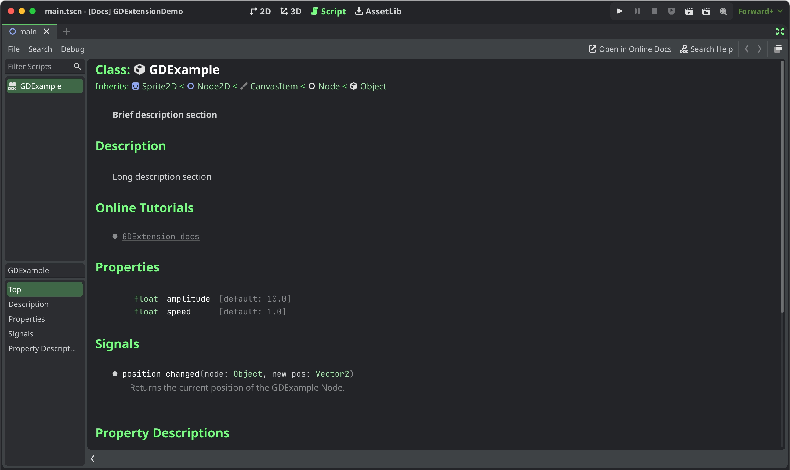

.. _doc_gdextension_docs_system:

GDExtension documentation system
================================

.. note::

    Adding documentation for GDExtensions is only possible for 4.3 and later. The support can be integrated into your project
    regardless because the snippet will check if you use the appropriate godot-cpp version.

The GDExtension documentation system works in a similar manner to the built-in engine documentation. It uses a series of
XML files (one per class) to document the exposed constructors, properties, methods, constants, signals, and theme items of each class.

.. note::

    We are assuming you are using the project files explained in the :ref:`GDExtension C++ Example <doc_gdextension_cpp_example>`
    with the following structure:

    gdextension_cpp_example/  # GDExtension directory
    |
    +--demo/                  # game example/demo to test the extension
    |   |
    |   +--main.tscn
    |   |
    |   +--bin/
    |       |
    |       +--gdexample.gdextension
    |
    +--godot-cpp/             # C++ bindings
    |
    +--src/                   # source code of the extension we are building
    |   |
    |   +--register_types.cpp
    |   +--register_types.h
    |   +--gdexample.cpp
    |   +--gdexample.h

Inside the Godot demo project directory of your GDExtension directory, run the following terminal command:

.. code-block:: none

    # Replace "godot" with the full path to a Godot editor binary
    # if Godot is not installed in your `PATH`.
    godot --doctool ../ --gdextension-docs

This command calls upon the Godot editor binary to generate documentation via the ``--doctool``
and ``--gdextension-docs`` commands. The ``../`` addition is to let Godot know where the GDExtension
SConstruct file is located. By calling this command, Godot generates a ``doc_classes`` directory inside the
project directory in which it generates XML files for the GDExtension classes. Those files
can then be edited to add information about member variables, methods, signals, and more.

To add the now edited documentation to the GDExtension and let the editor load it,
you need to add the following lines to your SConstruct file:

.. code-block:: py

    if env["target"] in ["editor", "template_debug"]:
    try:
        doc_data = env.GodotCPPDocData("src/gen/doc_data.gen.cpp", source=Glob("doc_classes/*.xml"))
        sources.append(doc_data)
    except AttributeError:
        print("Not including class reference as we're targeting a pre-4.3 baseline.")

The if-statement checks if we are compiling the GDExtension library with the ``editor`` and ``template_debug``
flags. SCons then tries to load all the XML files inside the ``doc_classes`` directory and appends them
to the ``sources`` variable which already includes all the source files of your extension. If it fails
it means we are currently trying to compile the library when the ``godot_cpp`` is set to a version before 4.3.

After loading the extension in a 4.3 Godot editor or later and open the documentation of your extension class
either by :kbd:`Ctrl + Click` in the script editor or the Editor help dialog you will see something like this:

Documentation styling
---------------------

To style specific parts of text you can use BBCode tags similarly to how they can be used in :ref:`RichTextLabels <doc_bbcode_in_richtextlabel>`.
You can set text as bold, italic, underlined, colored, codeblocks etc. by embedding them in tags like this:

.. code-block:: none

    [b]this text will be shown as bold[/b]

Currently they supported tags for the GDExtension documentation system are:

.. list-table::
  :class: wrap-normal
  :width: 100%
  :widths: 60 40

  * - Tag
    - Example

  * - | **b**
      | Makes ``{text}`` use the bold (or bold italics) font of ``RichTextLabel``.

    - ``[b]{text}[/b]``

  * - | **i**
      | Makes ``{text}`` use the italics (or bold italics) font of ``RichTextLabel``.

    - ``[i]{text}[/i]``

  * - | **u**
      | Makes ``{text}`` underlined.

    - ``[u]{text}[/u]``

  * - | **s**
      | Makes ``{text}`` strikethrough.

    - ``[s]{text}[/s]``

  * - | **kbd**
      | Makes ``{text}`` use the mono font and styles the text color and background like a shortcut.

    - ``[code]{text}[/code]``

  * - | **code**
      | Makes inline ``{text}`` use the mono font and styles the text color and background like code.

    - ``[code]{text}[/code]``

  * - | **codeblocks**
      | Makes multiline ``{text}`` use the mono font and styles the text color and background like code.
      | The addition of the ``[gdscript]`` tag highlights the GDScript specific syntax.

    - | ``[codeblocks]``
      | ``[gdscript]``
      | ``{text}``
      | ``[/gdscript]``
      | ``[/codeblocks]``

  * - | **center**
      | Makes ``{text}`` horizontally centered.
      | Same as ``[p align=center]``.

    - ``[center]{text}[/center]``

  * - | **url**
      | Creates a hyperlink (underlined and clickable text). Can contain optional
        ``{text}`` or display ``{link}`` as is.
      | **Must be handled with the "meta_clicked" signal to have an effect,** see :ref:`doc_bbcode_in_richtextlabel_handling_url_tag_clicks`.

    - | ``[url]{link}[/url]``
      | ``[url={link}]{text}[/url]``

  * - | **img**
      | Inserts an image from the ``{path}`` (can be any valid :ref:`class_Texture2D` resource).
      | If ``{width}`` is provided, the image will try to fit that width maintaining
        the aspect ratio.
      | If both ``{width}`` and ``{height}`` are provided, the image will be scaled
        to that size.
      | Add ``%`` to the end of ``{width}`` or ``{height}`` value to specify it as percentages of the control width instead of pixels.
      | If ``{valign}`` configuration is provided, the image will try to align to the
        surrounding text, see :ref:`doc_bbcode_in_richtextlabel_image_and_table_alignment`.
      | Supports configuration options, see :ref:`doc_bbcode_in_richtextlabel_image_options`.

    - | ``[img]{path}[/img]``
      | ``[img={width}]{path}[/img]``
      | ``[img={width}x{height}]{path}[/img]``
      | ``[img={valign}]{path}[/img]``
      | ``[img {options}]{path}[/img]``

  * - | **color**
      | Changes the color of ``{text}``. Color must be provided by a common name (see
        :ref:`doc_bbcode_in_richtextlabel_named_colors`) or using the HEX format (e.g.
        ``#ff00ff``, see :ref:`doc_bbcode_in_richtextlabel_hex_colors`).

    - ``[color={code/name}]{text}[/color]``
