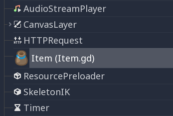
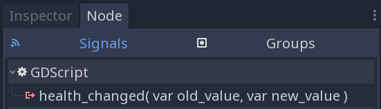

.. _doc_gdscript_reference:

GDScript reference
==================

:ref:`GDScript<doc_gdscript>` is a high-level, `object-oriented
<https://en.wikipedia.org/wiki/Object-oriented_programming>`_, `imperative
<https://en.wikipedia.org/wiki/Imperative_programming>`_, and `gradually typed
<https://en.wikipedia.org/wiki/Gradual_typing>`_ programming language built for Godot.
It uses an indentation-based syntax similar to languages like
`Python <https://en.wikipedia.org/wiki/Python_%28programming_language%29>`_.
Its goal is to be optimized for and tightly integrated with Godot Engine,
allowing great flexibility for content creation and integration.

GDScript is entirely independent from Python and is not based on it.

History
-------

.. note::

    Documentation about GDScript's history has been moved to the
    :ref:`Frequently Asked Questions <doc_faq_what_is_gdscript>`.

Example of GDScript
-------------------

Some people can learn better by taking a look at the syntax, so
here's an example of how GDScript looks.

::

    # Everything after "#" is a comment.
    # A file is a class!

    # (optional) icon to show in the editor dialogs:
    @icon("res://path/to/optional/icon.svg")

    # (optional) class definition:
    class_name MyClass

    # Inheritance:
    extends BaseClass

    # Member variables.
    var a = 5
    var s = "Hello"
    var arr = [1, 2, 3]
    var dict = {"key": "value", 2: 3}
    var other_dict = {key = "value", other_key = 2}
    var typed_var: int
    var inferred_type := "String"

    # Constants.
    const ANSWER = 42
    const THE_NAME = "Charly"

    # Enums.
    enum {UNIT_NEUTRAL, UNIT_ENEMY, UNIT_ALLY}
    enum Named {THING_1, THING_2, ANOTHER_THING = -1}

    # Built-in vector types.
    var v2 = Vector2(1, 2)
    var v3 = Vector3(1, 2, 3)

    # Functions.
    func some_function(param1, param2, param3):
        const local_const = 5

        if param1 < local_const:
            print(param1)
        elif param2 > 5:
            print(param2)
        else:
            print("Fail!")

        for i in range(20):
            print(i)

        while param2 != 0:
            param2 -= 1

        match param3:
            3:
                print("param3 is 3!")
            _:
                print("param3 is not 3!")

        var local_var = param1 + 3
        return local_var

    # Functions override functions with the same name on the base/super class.
    # If you still want to call them, use "super":
    func something(p1, p2):
        super(p1, p2)

    # It's also possible to call another function in the super class:
    func other_something(p1, p2):
        super.something(p1, p2)

    # Inner class
    class Something:
        var a = 10

    # Constructor
    func _init():
        print("Constructed!")
        var lv = Something.new()
        print(lv.a)

If you have previous experience with statically typed languages such as
C, C++, or C# but never used a dynamically typed one before, it is advised you
read this tutorial: :ref:`doc_gdscript_more_efficiently`.

Identifiers
-----------

Any string that restricts itself to alphabetic characters (``a`` to ``z`` and
``A`` to ``Z``), digits (``0`` to ``9``) and ``_`` qualifies as an identifier.
Additionally, identifiers must not begin with a digit. Identifiers are
case-sensitive (``foo`` is different from ``FOO``).

Identifiers may also contain most Unicode characters part of
`UAX#31 <https://www.unicode.org/reports/tr31/>`__. This allows you to use
identifier names written in languages other than English. Unicode characters
that are considered "confusable" for ASCII characters and emoji are not allowed
in identifiers.

Keywords
--------

The following is the list of keywords supported by the language. Since
keywords are reserved words (tokens), they can't be used as identifiers.
Operators (like ``in``, ``not``, ``and`` or ``or``) and names of built-in types
as listed in the following sections are also reserved.

Keywords are defined in the `GDScript tokenizer <https://github.com/godotengine/godot/blob/master/modules/gdscript/gdscript_tokenizer.cpp>`_
in case you want to take a look under the hood.

+------------+---------------------------------------------------------------------------------------------------------------------------------------------------+
|  Keyword   | Description                                                                                                                                       |
+============+===================================================================================================================================================+
| if         | See `if/else/elif`_.                                                                                                                              |
+------------+---------------------------------------------------------------------------------------------------------------------------------------------------+
| elif       | See `if/else/elif`_.                                                                                                                              |
+------------+---------------------------------------------------------------------------------------------------------------------------------------------------+
| else       | See `if/else/elif`_.                                                                                                                              |
+------------+---------------------------------------------------------------------------------------------------------------------------------------------------+
| for        | See for_.                                                                                                                                         |
+------------+---------------------------------------------------------------------------------------------------------------------------------------------------+
| while      | See while_.                                                                                                                                       |
+------------+---------------------------------------------------------------------------------------------------------------------------------------------------+
| match      | See match_.                                                                                                                                       |
+------------+---------------------------------------------------------------------------------------------------------------------------------------------------+
| when       | Used by `pattern guards <Pattern guards_>`_ in ``match`` statements.                                                                              |
+------------+---------------------------------------------------------------------------------------------------------------------------------------------------+
| break      | Exits the execution of the current ``for`` or ``while`` loop.                                                                                     |
+------------+---------------------------------------------------------------------------------------------------------------------------------------------------+
| continue   | Immediately skips to the next iteration of the ``for`` or ``while`` loop.                                                                         |
+------------+---------------------------------------------------------------------------------------------------------------------------------------------------+
| pass       | Used where a statement is required syntactically but execution of code is undesired, e.g. in empty functions.                                     |
+------------+---------------------------------------------------------------------------------------------------------------------------------------------------+
| return     | Returns a value from a function.                                                                                                                  |
+------------+---------------------------------------------------------------------------------------------------------------------------------------------------+
| class      | Defines an inner class. See `Inner classes`_.                                                                                                     |
+------------+---------------------------------------------------------------------------------------------------------------------------------------------------+
| class_name | Defines the script as a globally accessible class with the specified name. See `Registering named classes`_.                                      |
+------------+---------------------------------------------------------------------------------------------------------------------------------------------------+
| extends    | Defines what class to extend with the current class.                                                                                              |
+------------+---------------------------------------------------------------------------------------------------------------------------------------------------+
| is         | Tests whether a variable extends a given class, or is of a given built-in type.                                                                   |
+------------+---------------------------------------------------------------------------------------------------------------------------------------------------+
| in         | Tests whether a value is within a string, array, range, dictionary, or node. When used with ``for``, it iterates through them instead of testing. |
+------------+---------------------------------------------------------------------------------------------------------------------------------------------------+
| as         | Cast the value to a given type if possible.                                                                                                       |
+------------+---------------------------------------------------------------------------------------------------------------------------------------------------+
| self       | Refers to current class instance. See `self`_.                                                                                                    |
+------------+---------------------------------------------------------------------------------------------------------------------------------------------------+
| super      | Resolves the scope of the parent method. See `Inheritance`_.                                                                                      |
+------------+---------------------------------------------------------------------------------------------------------------------------------------------------+
| signal     | Defines a signal. See `Signals`_.                                                                                                                 |
+------------+---------------------------------------------------------------------------------------------------------------------------------------------------+
| func       | Defines a function.  See `Functions`_.                                                                                                            |
+------------+---------------------------------------------------------------------------------------------------------------------------------------------------+
| static     | Defines a static function or a static member variable.                                                                                            |
+------------+---------------------------------------------------------------------------------------------------------------------------------------------------+
| const      | Defines a constant. See `Constants`_.                                                                                                             |
+------------+---------------------------------------------------------------------------------------------------------------------------------------------------+
| enum       | Defines an enum. See `Enums`_.                                                                                                                    |
+------------+---------------------------------------------------------------------------------------------------------------------------------------------------+
| var        | Defines a variable. See `Variables`_.                                                                                                             |
+------------+---------------------------------------------------------------------------------------------------------------------------------------------------+
| breakpoint | Editor helper for debugger breakpoints. Unlike breakpoints created by clicking in the gutter, ``breakpoint`` is stored in the script itself.      |
|            | This makes it persistent across different machines when using version control.                                                                    |
+------------+---------------------------------------------------------------------------------------------------------------------------------------------------+
| preload    | Preloads a class or variable. See `Classes as resources`_.                                                                                        |
+------------+---------------------------------------------------------------------------------------------------------------------------------------------------+
| await      | Waits for a signal or a coroutine to finish. See `Awaiting signals or coroutines`_.                                                               |
+------------+---------------------------------------------------------------------------------------------------------------------------------------------------+
| yield      | Previously used for coroutines. Kept as keyword for transition.                                                                                   |
+------------+---------------------------------------------------------------------------------------------------------------------------------------------------+
| assert     | Asserts a condition, logs error on failure. Ignored in non-debug builds. See `Assert keyword`_.                                                   |
+------------+---------------------------------------------------------------------------------------------------------------------------------------------------+
| void       | Used to represent that a function does not return any value.                                                                                      |
+------------+---------------------------------------------------------------------------------------------------------------------------------------------------+
| PI         | PI constant.                                                                                                                                      |
+------------+---------------------------------------------------------------------------------------------------------------------------------------------------+
| TAU        | TAU constant.                                                                                                                                     |
+------------+---------------------------------------------------------------------------------------------------------------------------------------------------+
| INF        | Infinity constant. Used for comparisons and as result of calculations.                                                                            |
+------------+---------------------------------------------------------------------------------------------------------------------------------------------------+
| NAN        | NAN (not a number) constant. Used as impossible result from calculations.                                                                         |
+------------+---------------------------------------------------------------------------------------------------------------------------------------------------+

Operators
---------

The following is the list of supported operators and their precedence. All binary operators are `left-associative <https://en.wikipedia.org/wiki/Operator_associativity>`_,
including the ``**`` operator. This means that ``2 ** 2 ** 3`` is equal to ``(2 ** 2) ** 3``. Use parentheses to explicitly specify precedence you need, for
example ``2 ** (2 ** 3)``. The ternary ``if/else`` operator is right-associative.

+---------------------------------------+-----------------------------------------------------------------------------+
| **Operator**                          | **Description**                                                             |
+=======================================+=============================================================================+
| ``(`` ``)``                           | Grouping (highest priority)                                                 |
|                                       |                                                                             |
|                                       | Parentheses are not really an operator, but allow you to explicitly specify |
|                                       | the precedence of an operation.                                             |
+---------------------------------------+-----------------------------------------------------------------------------+
| ``x[index]``                          | Subscription                                                                |
+---------------------------------------+-----------------------------------------------------------------------------+
| ``x.attribute``                       | Attribute reference                                                         |
+---------------------------------------+-----------------------------------------------------------------------------+
| ``foo()``                             | Function call                                                               |
+---------------------------------------+-----------------------------------------------------------------------------+
| ``await x``                           | `Awaiting signals or coroutines`_                                           |
+---------------------------------------+-----------------------------------------------------------------------------+
| | ``x is Node``                       | Type checking                                                               |
| | ``x is not Node``                   |                                                                             |
|                                       | See also :ref:`is_instance_of() <class_@GDScript_method_is_instance_of>`    |
|                                       | function.                                                                   |
+---------------------------------------+-----------------------------------------------------------------------------+
| ``x ** y``                            | Power                                                                       |
|                                       |                                                                             |
|                                       | Multiplies ``x`` by itself ``y`` times, similar to calling                  |
|                                       | :ref:`pow() <class_@GlobalScope_method_pow>` function.                      |
+---------------------------------------+-----------------------------------------------------------------------------+
| ``~x``                                | Bitwise NOT                                                                 |
+---------------------------------------+-----------------------------------------------------------------------------+
| | ``+x``                              | Identity / Negation                                                         |
| | ``-x``                              |                                                                             |
+---------------------------------------+-----------------------------------------------------------------------------+
| | ``x * y``                           | Multiplication / Division / Remainder                                       |
| | ``x / y``                           |                                                                             |
| | ``x % y``                           | The ``%`` operator is additionally used for                                 |
|                                       | :ref:`format strings <doc_gdscript_printf>`.                                |
|                                       |                                                                             |
|                                       | **Note:** These operators have the same behavior as C++, which may be       |
|                                       | unexpected for users coming from Python, JavaScript, etc. See a detailed    |
|                                       | note after the table.                                                       |
+---------------------------------------+-----------------------------------------------------------------------------+
| | ``x + y``                           | Addition (or Concatenation) / Subtraction                                   |
| | ``x - y``                           |                                                                             |
+---------------------------------------+-----------------------------------------------------------------------------+
| | ``x << y``                          | Bit shifting                                                                |
| | ``x >> y``                          |                                                                             |
+---------------------------------------+-----------------------------------------------------------------------------+
| ``x & y``                             | Bitwise AND                                                                 |
+---------------------------------------+-----------------------------------------------------------------------------+
| ``x ^ y``                             | Bitwise XOR                                                                 |
+---------------------------------------+-----------------------------------------------------------------------------+
| ``x | y``                             | Bitwise OR                                                                  |
+---------------------------------------+-----------------------------------------------------------------------------+
| | ``x == y``                          | Comparison                                                                  |
| | ``x != y``                          |                                                                             |
| | ``x < y``                           | See a detailed note after the table.                                        |
| | ``x > y``                           |                                                                             |
| | ``x <= y``                          |                                                                             |
| | ``x >= y``                          |                                                                             |
+---------------------------------------+-----------------------------------------------------------------------------+
| | ``x in y``                          | Inclusion checking                                                          |
| | ``x not in y``                      |                                                                             |
|                                       | ``in`` is also used with the for_ keyword as part of the syntax.            |
+---------------------------------------+-----------------------------------------------------------------------------+
| | ``not x``                           | Boolean NOT and its :ref:`unrecommended <boolean_operators>` alias          |
| | ``!x``                              |                                                                             |
+---------------------------------------+-----------------------------------------------------------------------------+
| | ``x and y``                         | Boolean AND and its :ref:`unrecommended <boolean_operators>` alias          |
| | ``x && y``                          |                                                                             |
+---------------------------------------+-----------------------------------------------------------------------------+
| | ``x or y``                          | Boolean OR and its :ref:`unrecommended <boolean_operators>` alias           |
| | ``x || y``                          |                                                                             |
+---------------------------------------+-----------------------------------------------------------------------------+
| ``true_expr if cond else false_expr`` | Ternary if/else                                                             |
+---------------------------------------+-----------------------------------------------------------------------------+
| ``x as Node``                         | `Type casting <casting_>`_                                                  |
+---------------------------------------+-----------------------------------------------------------------------------+
| | ``x = y``                           | Assignment (lowest priority)                                                |
| | ``x += y``                          |                                                                             |
| | ``x -= y``                          | You cannot use an assignment operator inside an expression.                 |
| | ``x *= y``                          |                                                                             |
| | ``x /= y``                          |                                                                             |
| | ``x **= y``                         |                                                                             |
| | ``x %= y``                          |                                                                             |
| | ``x &= y``                          |                                                                             |
| | ``x |= y``                          |                                                                             |
| | ``x ^= y``                          |                                                                             |
| | ``x <<= y``                         |                                                                             |
| | ``x >>= y``                         |                                                                             |
+---------------------------------------+-----------------------------------------------------------------------------+

.. note::

    The behavior of some operators may differ from what you expect:

    1. If both operands of the ``/`` operator are :ref:`int <class_int>`, then integer division is performed instead of fractional. For example ``5 / 2 == 2``, not ``2.5``.
       If this is not desired, use at least one :ref:`float <class_float>` literal (``x / 2.0``), cast (``float(x) / y``), or multiply by ``1.0`` (``x * 1.0 / y``).
    2. The ``%`` operator is only available for ints, for floats use the :ref:`fmod() <class_@GlobalScope_method_fmod>` function.
    3. For negative values, the ``%`` operator and ``fmod()`` use `truncation <https://en.wikipedia.org/wiki/Truncation>`_ instead of rounding towards negative infinity.
       This means that the remainder has a sign. If you need the remainder in a mathematical sense, use the :ref:`posmod() <class_@GlobalScope_method_posmod>` and
       :ref:`fposmod() <class_@GlobalScope_method_fposmod>` functions instead.
    4. The ``==`` and ``!=`` operators sometimes allow you to compare values of different types (for example, ``1 == 1.0`` is true), but in other cases it can cause
       a runtime error. If you're not sure about the types of the operands, you can safely use the :ref:`is_same() <class_@GlobalScope_method_is_same>` function
       (but note that it is more strict about types and references). To compare floats, use the :ref:`is_equal_approx() <class_@GlobalScope_method_is_equal_approx>`
       and :ref:`is_zero_approx() <class_@GlobalScope_method_is_zero_approx>` functions instead.

Literals
--------

+---------------------------------+-------------------------------------------+
| **Example(s)**                  | **Description**                           |
+---------------------------------+-------------------------------------------+
| ``null``                        | Null value                                |
+---------------------------------+-------------------------------------------+
| ``false``, ``true``             | Boolean values                            |
+---------------------------------+-------------------------------------------+
| ``45``                          | Base 10 integer                           |
+---------------------------------+-------------------------------------------+
| ``0x8f51``                      | Base 16 (hexadecimal) integer             |
+---------------------------------+-------------------------------------------+
| ``0b101010``                    | Base 2 (binary) integer                   |
+---------------------------------+-------------------------------------------+
| ``3.14``, ``58.1e-10``          | Floating-point number (real)              |
+---------------------------------+-------------------------------------------+
| ``"Hello"``, ``'Hi'``           | Regular strings                           |
+---------------------------------+-------------------------------------------+
| ``"""Hello"""``, ``'''Hi'''``   | Triple-quoted regular strings             |
+---------------------------------+-------------------------------------------+
| ``r"Hello"``, ``r'Hi'``         | Raw strings                               |
+---------------------------------+-------------------------------------------+
| ``r"""Hello"""``, ``r'''Hi'''`` | Triple-quoted raw strings                 |
+---------------------------------+-------------------------------------------+
| ``&"name"``                     | :ref:`StringName <class_StringName>`      |
+---------------------------------+-------------------------------------------+
| ``^"Node/Label"``               | :ref:`NodePath <class_NodePath>`          |
+---------------------------------+-------------------------------------------+

There are also two constructs that look like literals, but actually are not:

+---------------------------------+-------------------------------------------+
| **Example**                     | **Description**                           |
+---------------------------------+-------------------------------------------+
| ``$NodePath``                   | Shorthand for ``get_node("NodePath")``    |
+---------------------------------+-------------------------------------------+
| ``%UniqueNode``                 | Shorthand for ``get_node("%UniqueNode")`` |
+---------------------------------+-------------------------------------------+

Integers and floats can have their numbers separated with ``_`` to make them more readable.
The following ways to write numbers are all valid:

::

    12_345_678  # Equal to 12345678.
    3.141_592_7  # Equal to 3.1415927.
    0x8080_0000_ffff  # Equal to 0x80800000ffff.
    0b11_00_11_00  # Equal to 0b11001100.

**Regular string literals** can contain the following escape sequences:

+---------------------+---------------------------------+
| **Escape sequence** | **Expands to**                  |
+---------------------+---------------------------------+
| ``\n``              | Newline (line feed)             |
+---------------------+---------------------------------+
| ``\t``              | Horizontal tab character        |
+---------------------+---------------------------------+
| ``\r``              | Carriage return                 |
+---------------------+---------------------------------+
| ``\a``              | Alert (beep/bell)               |
+---------------------+---------------------------------+
| ``\b``              | Backspace                       |
+---------------------+---------------------------------+
| ``\f``              | Formfeed page break             |
+---------------------+---------------------------------+
| ``\v``              | Vertical tab character          |
+---------------------+---------------------------------+
| ``\"``              | Double quote                    |
+---------------------+---------------------------------+
| ``\'``              | Single quote                    |
+---------------------+---------------------------------+
| ``\\``              | Backslash                       |
+---------------------+---------------------------------+
| ``\uXXXX``          | UTF-16 Unicode codepoint        |
|                     | ``XXXX``                        |
|                     | (hexadecimal, case-insensitive) |
+---------------------+---------------------------------+
| ``\UXXXXXX``        | UTF-32 Unicode codepoint        |
|                     | ``XXXXXX``                      |
|                     | (hexadecimal, case-insensitive) |
+---------------------+---------------------------------+

There are two ways to represent an escaped Unicode character above ``0xFFFF``:

- as a `UTF-16 surrogate pair <https://en.wikipedia.org/wiki/UTF-16#Code_points_from_U+010000_to_U+10FFFF>`_ ``\uXXXX\uXXXX``.
- as a single UTF-32 codepoint ``\UXXXXXX``.

Also, using ``\`` followed by a newline inside a string will allow you to continue it in the next line,
without inserting a newline character in the string itself.

A string enclosed in quotes of one type (for example ``"``) can contain quotes of another type
(for example ``'``) without escaping. Triple-quoted strings allow you to avoid escaping up to
two consecutive quotes of the same type (unless they are adjacent to the string edges).

**Raw string literals** always encode the string as it appears in the source code.
This is especially useful for regular expressions. A raw string literal doesn't process escape sequences,
however it does recognize ``\\`` and ``\"`` (``\'``) and replaces them with themselves.
Thus, a string can have a quote that matches the opening one, but only if it's preceded by a backslash.

::

    print("\tchar=\"\\t\"")  # Prints `    char="\t"`.
    print(r"\tchar=\"\\t\"") # Prints `\tchar=\"\\t\"`.

.. note::

    Some strings cannot be represented using raw string literals: you cannot have an odd number
    of backslashes at the end of a string or have an unescaped opening quote inside the string.
    However, in practice this doesn't matter since you can use a different quote type
    or use concatenation with a regular string literal.

GDScript also supports :ref:`format strings <doc_gdscript_printf>`.

Annotations
-----------

Annotations are special tokens in GDScript that act as modifiers to a script or
its code and may affect how the script is treated by the Godot engine or
editor.

Every annotation starts with the ``@`` character and is specified by a name. A
detailed description and example for each annotation can be found inside the
:ref:`GDScript class reference <class_@GDScript>`.

For instance, you can use it to export a value to the editor:

::

    @export_range(1, 100, 1, "or_greater")
    var ranged_var: int = 50

For more information about exporting properties, read the :ref:`GDScript exports <doc_gdscript_exports>`
article.

Any constant expression compatible with the required argument type can be passed as an annotation argument value:

::

    const MAX_SPEED = 120.0

    @export_range(0.0, 0.5 * MAX_SPEED)
    var initial_speed: float = 0.25 * MAX_SPEED

Annotations can be specified one per line or all in the same line. They affect
the next statement that isn't an annotation. Annotations can have arguments sent
between parentheses and separated by commas.

Both of these are the same:

::

    @annotation_a
    @annotation_b
    var variable

    @annotation_a @annotation_b var variable

.. _doc_gdscript_onready_annotation:

``@onready`` annotation
~~~~~~~~~~~~~~~~~~~~~~~

When using nodes, it's common to desire to keep references to parts
of the scene in a variable. As scenes are only warranted to be
configured when entering the active scene tree, the sub-nodes can only
be obtained when a call to ``Node._ready()`` is made.

::

    var my_label

    func _ready():
        my_label = get_node("MyLabel")

This can get a little cumbersome, especially when nodes and external
references pile up. For this, GDScript has the ``@onready`` annotation, that
defers initialization of a member variable until ``_ready()`` is called. It
can replace the above code with a single line:

::

    @onready var my_label = get_node("MyLabel")

.. warning::

    Applying ``@onready`` and any ``@export`` annotation to the same variable
    doesn't work as you might expect. The ``@onready`` annotation will cause
    the default value to be set after the ``@export`` takes effect and will
    override it:

    ::

        @export var a = "init_value_a"
        @onready @export var b = "init_value_b"

        func _init():
            prints(a, b) # init_value_a <null>

        func _notification(what):
            if what == NOTIFICATION_SCENE_INSTANTIATED:
                prints(a, b) # exported_value_a exported_value_b

        func _ready():
            prints(a, b) # exported_value_a init_value_b

    Therefore, the ``ONREADY_WITH_EXPORT`` warning is generated, which is treated
    as an error by default. We do not recommend disabling or ignoring it.

Comments
--------

Anything from a ``#`` to the end of the line is ignored and is
considered a comment.

::

    # This is a comment.

.. tip::

    In the Godot script editor, special keywords are highlighted within comments
    to bring the user's attention to specific comments:

    - **Critical** *(appears in red)*: ``ALERT``, ``ATTENTION``, ``CAUTION``,
      ``CRITICAL``, ``DANGER``, ``SECURITY``
    - **Warning** *(appears in yellow)*: ``BUG``, ``DEPRECATED``, ``FIXME``,
      ``HACK``, ``TASK``, ``TBD``, ``TODO``, ``WARNING``
    - **Notice** *(appears in green)*: ``INFO``, ``NOTE``, ``NOTICE``, ``TEST``,
      ``TESTING``

    These keywords are case-sensitive, so they must be written in uppercase for them
    to be recognized:

    ::

        # In the example below, "TODO" will appear in yellow by default.
        # The `:` symbol after the keyword is not required, but it's often used.

        # TODO: Add more items for the player to choose from.

    The list of highlighted keywords and their colors can be changed in the **Text
    Editor > Theme > Comment Markers** section of the Editor Settings.

Use two hash symbols (``##``) instead of one (``#``) to add a *documentation
comment*, which will appear in the script documentation and in the inspector
description of an exported variable. Documentation comments must be placed
directly *above* a documentable item (such as a member variable), or at the top
of a file. Dedicated formatting options are also available. See
:ref:`doc_gdscript_documentation_comments` for details.

::

    ## This comment will appear in the script documentation.
    var value

    ## This comment will appear in the inspector tooltip, and in the documentation.
    @export var exported_value

Code regions
------------

Code regions are special types of comments that the script editor understands as
*foldable regions*. This means that after writing code region comments, you can
collapse and expand the region by clicking the arrow that appears at the left of
the comment. This arrow appears within a purple square to be distinguishable
from standard code folding.

The syntax is as follows:

::

    # Important: There must be *no* space between the `#` and `region` or `endregion`.

    # Region without a description:
    #region
    ...
    #endregion

    # Region with a description:
    #region Some description that is displayed even when collapsed
    ...
    #endregion

.. tip::

    To create a code region quickly, select several lines in the script editor,
    right-click the selection then choose **Create Code Region**. The region
    description will be selected automatically for editing.

    It is possible to nest code regions within other code regions.

Here's a concrete usage example of code regions:

::

    # This comment is outside the code region. It will be visible when collapsed.
    #region Terrain generation
    # This comment is inside the code region. It won't be visible when collapsed.
    func generate_lakes():
        pass

    func generate_hills():
        pass
    #endregion

    #region Terrain population
    func place_vegetation():
        pass

    func place_roads():
        pass
    #endregion

This can be useful to organize large chunks of code into easier to understand
sections. However, remember that external editors generally don't support this
feature, so make sure your code is easy to follow even when not relying on
folding code regions.

.. note::

    Individual functions and indented sections (such as ``if`` and ``for``) can
    *always* be collapsed in the script editor. This means you should avoid
    using a code region to contain a single function or indented section, as it
    won't bring much of a benefit. Code regions work best when they're used to
    group multiple elements together.

Line continuation
-----------------

A line of code in GDScript can be continued on the next line by using a backslash
(``\``). Add one at the end of a line and the code on the next line will act like
it's where the backslash is. Here is an example:

::

    var a = 1 + \
    2

A line can be continued multiple times like this:

::

    var a = 1 + \
    4 + \
    10 + \
    4

.. _doc_gdscript_builtin_types:

Built-in types
--------------

Built-in types are stack-allocated. They are passed as values. This means a copy
is created on each assignment or when passing them as arguments to functions.
The exceptions are ``Object``, ``Array``, ``Dictionary``, and packed arrays
(such as ``PackedByteArray``), which are passed by reference so they are shared.
All arrays, ``Dictionary``, and some objects (``Node``, ``Resource``)
have a ``duplicate()`` method that allows you to make a copy.

Basic built-in types
~~~~~~~~~~~~~~~~~~~~

A variable in GDScript can be assigned to several built-in types.

null
^^^^

``null`` is an empty data type that contains no information and can not
be assigned any other value.

Only types that inherit from Object can have a ``null`` value
(Object is therefore called a "nullable" type).
:ref:`Variant types <doc_variant_class>` must have a valid value at all times,
and therefore cannot have a ``null`` value.

:ref:`bool <class_bool>`
^^^^^^^^^^^^^^^^^^^^^^^^

Short for "boolean", it can only contain ``true`` or ``false``.

:ref:`int <class_int>`
^^^^^^^^^^^^^^^^^^^^^^

Short for "integer", it stores whole numbers (positive and negative).
It is stored as a 64-bit value, equivalent to ``int64_t`` in C++.

:ref:`float <class_float>`
^^^^^^^^^^^^^^^^^^^^^^^^^^

Stores real numbers, including decimals, using floating-point values.
It is stored as a 64-bit value, equivalent to ``double`` in C++.
Note: Currently, data structures such as ``Vector2``, ``Vector3``, and
``PackedFloat32Array`` store 32-bit single-precision ``float`` values.

:ref:`String <class_String>`
^^^^^^^^^^^^^^^^^^^^^^^^^^^^

A sequence of characters in `Unicode format <https://en.wikipedia.org/wiki/Unicode>`_.

:ref:`StringName <class_StringName>`
^^^^^^^^^^^^^^^^^^^^^^^^^^^^^^^^^^^^

An immutable string that allows only one instance of each name. They are slower to
create and may result in waiting for locks when multithreading. In exchange, they're
very fast to compare, which makes them good candidates for dictionary keys.

:ref:`NodePath <class_NodePath>`
^^^^^^^^^^^^^^^^^^^^^^^^^^^^^^^^

A pre-parsed path to a node or a node property.  It can be
easily assigned to, and from, a String. They are useful to interact with
the tree to get a node, or affecting properties like with :ref:`Tweens <class_Tween>`.

Vector built-in types
~~~~~~~~~~~~~~~~~~~~~

:ref:`Vector2 <class_Vector2>`
^^^^^^^^^^^^^^^^^^^^^^^^^^^^^^

2D vector type containing ``x`` and ``y`` fields. Can also be
accessed as an array.

:ref:`Vector2i <class_Vector2i>`
^^^^^^^^^^^^^^^^^^^^^^^^^^^^^^^^

Same as a Vector2 but the components are integers. Useful for representing
items in a 2D grid.

:ref:`Rect2 <class_Rect2>`
^^^^^^^^^^^^^^^^^^^^^^^^^^

2D Rectangle type containing two vectors fields: ``position`` and ``size``.
Also contains an ``end`` field which is ``position + size``.

:ref:`Vector3 <class_Vector3>`
^^^^^^^^^^^^^^^^^^^^^^^^^^^^^^

3D vector type containing ``x``, ``y`` and ``z`` fields. This can also
be accessed as an array.

:ref:`Vector3i <class_Vector3i>`
^^^^^^^^^^^^^^^^^^^^^^^^^^^^^^^^

Same as Vector3 but the components are integers. Can be use for indexing items
in a 3D grid.

:ref:`Transform2D <class_Transform2D>`
^^^^^^^^^^^^^^^^^^^^^^^^^^^^^^^^^^^^^^

3×2 matrix used for 2D transforms.

:ref:`Plane <class_Plane>`
^^^^^^^^^^^^^^^^^^^^^^^^^^

3D Plane type in normalized form that contains a ``normal`` vector field
and a ``d`` scalar distance.

:ref:`Quaternion <class_Quaternion>`
^^^^^^^^^^^^^^^^^^^^^^^^^^^^^^^^^^^^

Quaternion is a datatype used for representing a 3D rotation. It's
useful for interpolating rotations.

:ref:`AABB <class_AABB>`
^^^^^^^^^^^^^^^^^^^^^^^^

Axis-aligned bounding box (or 3D box) contains 2 vectors fields: ``position``
and ``size``. Also contains an ``end`` field which is
``position + size``.

:ref:`Basis <class_Basis>`
^^^^^^^^^^^^^^^^^^^^^^^^^^

3x3 matrix used for 3D rotation and scale. It contains 3 vector fields
(``x``, ``y`` and ``z``) and can also be accessed as an array of 3D
vectors.

:ref:`Transform3D <class_Transform3D>`
^^^^^^^^^^^^^^^^^^^^^^^^^^^^^^^^^^^^^^

3D Transform contains a Basis field ``basis`` and a Vector3 field
``origin``.

Engine built-in types
~~~~~~~~~~~~~~~~~~~~~

:ref:`Color <class_Color>`
^^^^^^^^^^^^^^^^^^^^^^^^^^

Color data type contains ``r``, ``g``, ``b``, and ``a`` fields. It can
also be accessed as ``h``, ``s``, and ``v`` for hue/saturation/value.

:ref:`RID <class_RID>`
^^^^^^^^^^^^^^^^^^^^^^

Resource ID (RID). Servers use generic RIDs to reference opaque data.

:ref:`Object <class_Object>`
^^^^^^^^^^^^^^^^^^^^^^^^^^^^

Base class for anything that is not a built-in type.

Container built-in types
~~~~~~~~~~~~~~~~~~~~~~~~

:ref:`Array <class_Array>`
^^^^^^^^^^^^^^^^^^^^^^^^^^

Generic sequence of arbitrary object types, including other arrays or dictionaries (see below).
The array can resize dynamically. Arrays are indexed starting from index ``0``.
Negative indices count from the end.

::

    var arr = []
    arr = [1, 2, 3]
    var b = arr[1] # This is 2.
    var c = arr[arr.size() - 1] # This is 3.
    var d = arr[-1] # Same as the previous line, but shorter.
    arr[0] = "Hi!" # Replacing value 1 with "Hi!".
    arr.append(4) # Array is now ["Hi!", 2, 3, 4].

Typed arrays
^^^^^^^^^^^^

Godot 4.0 added support for typed arrays. On write operations, Godot checks that
element values match the specified type, so the array cannot contain invalid values.
The GDScript static analyzer takes typed arrays into account, however array methods like
``front()`` and ``back()`` still have the ``Variant`` return type.

Typed arrays have the syntax ``Array[Type]``, where ``Type`` can be any ``Variant`` type,
native or user class, or enum. Nested array types (like ``Array[Array[int]]``) are not supported.

::

    var a: Array[int]
    var b: Array[Node]
    var c: Array[MyClass]
    var d: Array[MyEnum]
    var e: Array[Variant]

``Array`` and ``Array[Variant]`` are the same thing.

.. note::

    Arrays are passed by reference, so the array element type is also an attribute of the in-memory
    structure referenced by a variable in runtime. The static type of a variable restricts the structures
    that it can reference to. Therefore, you **cannot** assign an array with a different element type,
    even if the type is a subtype of the required type.

    If you want to *convert* a typed array, you can create a new array and use the
    :ref:`Array.assign() <class_Array_method_assign>` method:

    ::

        var a: Array[Node2D] = [Node2D.new()]

        # (OK) You can add the value to the array because `Node2D` extends `Node`.
        var b: Array[Node] = [a[0]]

        # (Error) You cannot assign an `Array[Node2D]` to an `Array[Node]` variable.
        b = a

        # (OK) But you can use the `assign()` method instead. Unlike the `=` operator,
        # the `assign()` method copies the contents of the array, not the reference.
        b.assign(a)

    The only exception was made for the ``Array`` (``Array[Variant]``) type, for user convenience
    and compatibility with old code. However, operations on untyped arrays are considered unsafe.

.. _doc_gdscript_packed_arrays:

Packed arrays
^^^^^^^^^^^^^

PackedArrays are generally faster to iterate on and modify compared to a typed
Array of the same type (e.g. PackedInt64Array versus Array[int]) and consume
less memory. In the worst case, they are expected to be as fast as an untyped
Array. Conversely, non-Packed Arrays (typed or not) have extra convenience
methods such as :ref:`Array.map <class_Array_method_map>` that PackedArrays
lack. Consult the :ref:`class reference <class_PackedFloat32Array>` for details
on the methods available. Typed Arrays are generally faster to iterate on and
modify than untyped Arrays.

While all Arrays can cause memory fragmentation when they become large enough,
if memory usage and performance (iteration and modification speed) is a concern
and the type of data you're storing is compatible with one of the ``Packed``
Array types, then using those may yield improvements. However, if you do not
have such concerns (e.g. the size of your array does not reach the tens of
thousands of elements) it is likely more helpful to use regular or typed
Arrays, as they provide convenience methods that can make your code easier to
write and maintain (and potentially faster if your data requires such
operations a lot). If the data you will store is of a known type (including
your own defined classes), prefer to use a typed Array as it may yield better
performance in iteration and modification compared to an untyped Array.

- :ref:`PackedByteArray <class_PackedByteArray>`: An array of bytes (integers from 0 to 255).
- :ref:`PackedInt32Array <class_PackedInt32Array>`: An array of 32-bit integers.
- :ref:`PackedInt64Array <class_PackedInt64Array>`: An array of 64-bit integers.
- :ref:`PackedFloat32Array <class_PackedFloat32Array>`: An array of 32-bit floats.
- :ref:`PackedFloat64Array <class_PackedFloat64Array>`: An array of 64-bit floats.
- :ref:`PackedStringArray <class_PackedStringArray>`: An array of strings.
- :ref:`PackedVector2Array <class_PackedVector2Array>`: An array of :ref:`Vector2 <class_Vector2>` values.
- :ref:`PackedVector3Array <class_PackedVector3Array>`: An array of :ref:`Vector3 <class_Vector3>` values.
- :ref:`PackedVector4Array <class_PackedVector4Array>`: An array of :ref:`Vector4 <class_Vector4>` values.
- :ref:`PackedColorArray <class_PackedColorArray>`: An array of :ref:`Color <class_Color>` values.

:ref:`Dictionary <class_Dictionary>`
^^^^^^^^^^^^^^^^^^^^^^^^^^^^^^^^^^^^

Associative container which contains values referenced by unique keys.

::

    var d = {4: 5, "A key": "A value", 28: [1, 2, 3]}
    d["Hi!"] = 0
    d = {
        22: "value",
        "some_key": 2,
        "other_key": [2, 3, 4],
        "more_key": "Hello"
    }

Lua-style table syntax is also supported. Lua-style uses ``=`` instead of ``:``
and doesn't use quotes to mark string keys (making for slightly less to write).
However, keys written in this form can't start with a digit (like any GDScript
identifier), and must be string literals.

::

    var d = {
        test22 = "value",
        some_key = 2,
        other_key = [2, 3, 4],
        more_key = "Hello"
    }

To add a key to an existing dictionary, access it like an existing key and
assign to it:

::

    var d = {} # Create an empty Dictionary.
    d.waiting = 14 # Add String "waiting" as a key and assign the value 14 to it.
    d[4] = "hello" # Add integer 4 as a key and assign the String "hello" as its value.
    d["Godot"] = 3.01 # Add String "Godot" as a key and assign the value 3.01 to it.

    var test = 4
    # Prints "hello" by indexing the dictionary with a dynamic key.
    # This is not the same as `d.test`. The bracket syntax equivalent to
    # `d.test` is `d["test"]`.
    print(d[test])

.. note::

    The bracket syntax can be used to access properties of any
    :ref:`class_Object`, not just Dictionaries. Keep in mind it will cause a
    script error when attempting to index a non-existing property. To avoid
    this, use the :ref:`Object.get() <class_Object_method_get>` and
    :ref:`Object.set() <class_Object_method_set>` methods instead.

Typed dictionaries
^^^^^^^^^^^^^^^^^^

Godot 4.4 added support for typed dictionaries. On write operations, Godot checks that
element keys and values match the specified type, so the dictionary cannot contain invalid
keys or values. The GDScript static analyzer takes typed dictionaries into account. However,
dictionary methods that return values still have the ``Variant`` return type.

Typed dictionaries have the syntax ``Dictionary[KeyType, ValueType]``, where ``KeyType`` and ``ValueType``
can be any ``Variant`` type, native or user class, or enum. Both the key and value type **must** be specified,
but you can use ``Variant`` to make either of them untyped.
Nested typed collections (like ``Dictionary[String, Dictionary[String, int]]``)
are not supported.

::

    var a: Dictionary[String, int]
    var b: Dictionary[String, Node]
    var c: Dictionary[Vector2i, MyClass]
    var d: Dictionary[MyEnum, float]
    # String keys, values can be any type.
    var e: Dictionary[String, Variant]
    # Keys can be any type, boolean values.
    var f: Dictionary[Variant, bool]

``Dictionary`` and ``Dictionary[Variant, Variant]`` are the same thing.

:ref:`Signal <class_Signal>`
^^^^^^^^^^^^^^^^^^^^^^^^^^^^

A signal is a message that can be emitted by an object to those who want to
listen to it. The Signal type can be used for passing the emitter around.

Signals are better used by getting them from actual objects, e.g. ``$Button.button_up``.

:ref:`Callable <class_Callable>`
^^^^^^^^^^^^^^^^^^^^^^^^^^^^^^^^

Contains an object and a function, which is useful for passing functions as
values (e.g. when connecting to signals).

Getting a method as a member returns a callable. ``var x = $Sprite2D.rotate``
will set the value of ``x`` to a callable with ``$Sprite2D`` as the object and
``rotate`` as the method.

You can call it using the ``call`` method: ``x.call(PI)``.

Variables
---------

Variables can exist as class members or local to functions. They are
created with the ``var`` keyword and may, optionally, be assigned a
value upon initialization.

::

    var a # Data type is 'null' by default.
    var b = 5
    var c = 3.8
    var d = b + c # Variables are always initialized in direct order (see below).

Variables can optionally have a type specification. When a type is specified,
the variable will be forced to have always that same type, and trying to assign
an incompatible value will raise an error.

Types are specified in the variable declaration using a ``:`` (colon) symbol
after the variable name, followed by the type.

::

    var my_vector2: Vector2
    var my_node: Node = Sprite2D.new()

If the variable is initialized within the declaration, the type can be inferred, so
it's possible to omit the type name:

::

    var my_vector2 := Vector2() # 'my_vector2' is of type 'Vector2'.
    var my_node := Sprite2D.new() # 'my_node' is of type 'Sprite2D'.

Type inference is only possible if the assigned value has a defined type, otherwise
it will raise an error.

Valid types are:

- Built-in types (Array, Vector2, int, String, etc.).
- Engine classes (Node, Resource, RefCounted, etc.).
- Constant names if they contain a script resource (``MyScript`` if you declared ``const MyScript = preload("res://my_script.gd")``).
- Other classes in the same script, respecting scope (``InnerClass.NestedClass`` if you declared ``class NestedClass`` inside the ``class InnerClass`` in the same scope).
- Script classes declared with the ``class_name`` keyword.
- Autoloads registered as singletons.

.. note::

    While ``Variant`` is a valid type specification, it's not an actual type. It
    only means there's no set type and is equivalent to not having a static type
    at all. Therefore, inference is not allowed by default for ``Variant``,
    since it's likely a mistake.

    You can turn off this check, or make it only a warning, by changing it in
    the project settings. See :ref:`doc_gdscript_warning_system` for details.

Initialization order
~~~~~~~~~~~~~~~~~~~~

Member variables are initialized in the following order:

1. Depending on the variable's static type, the variable is either ``null``
   (untyped variables and objects) or has a default value of the type
   (``0`` for ``int``, ``false`` for ``bool``, etc.).
2. The specified values are assigned in the order of the variables in the script,
   from top to bottom.

   - (Only for ``Node``-derived classes) If the ``@onready`` annotation is applied to a variable,
     its initialization is deferred to step 5.

3. If defined, the ``_init()`` method is called.
4. When instantiating scenes and resources, the exported values are assigned.
5. (Only for ``Node``-derived classes) ``@onready`` variables are initialized.
6. (Only for ``Node``-derived classes) If defined, the ``_ready()`` method is called.

.. warning::

    You can specify a complex expression as a variable initializer, including function calls.
    Make sure the variables are initialized in the correct order, otherwise your values
    may be overwritten. For example:

    ::

        var a: int = proxy("a", 1)
        var b: int = proxy("b", 2)
        var _data: Dictionary = {}

        func proxy(key: String, value: int):
            _data[key] = value
            print(_data)
            return value

        func _init() -> void:
            print(_data)

    Will print:

    ::

        { "a": 1 }
        { "a": 1, "b": 2 }
        {  }

    To fix this, move the ``_data`` variable definition above the ``a`` definition
    or remove the empty dictionary assignment (``= {}``).

.. _doc_gdscript_basics_static_variables:

Static variables
~~~~~~~~~~~~~~~~

A class member variable can be declared static:

::

    static var a

Static variables belong to the class, not instances. This means that static variables
share values between multiple instances, unlike regular member variables.

From inside a class, you can access static variables from any function, both static and non-static.
From outside the class, you can access static variables using the class or an instance
(the second is not recommended as it is less readable).

.. note::

    The ``@export`` and ``@onready`` annotations cannot be applied to a static variable.
    Local variables cannot be static.

The following example defines a ``Person`` class with a static variable named ``max_id``.
We increment the ``max_id`` in the ``_init()`` function. This makes it easy to keep track
of the number of ``Person`` instances in our game.

::

    # person.gd
    class_name Person

    static var max_id = 0

    var id
    var name

    func _init(p_name):
        max_id += 1
        id = max_id
        name = p_name

In this code, we create two instances of our ``Person`` class and check that the class
and every instance have the same ``max_id`` value, because the variable is static and accessible to every instance.

::

    # test.gd
    extends Node

    func _ready():
        var person1 = Person.new("John Doe")
        var person2 = Person.new("Jane Doe")

        print(person1.id) # 1
        print(person2.id) # 2

        print(Person.max_id)  # 2
        print(person1.max_id) # 2
        print(person2.max_id) # 2

Static variables can have type hints, setters and getters:

::

    static var balance: int = 0

    static var debt: int:
        get:
            return -balance
        set(value):
            balance = -value

A base class static variable can also be accessed via a child class:

::

    class A:
        static var x = 1

    class B extends A:
        pass

    func _ready():
        prints(A.x, B.x) # 1 1
        A.x = 2
        prints(A.x, B.x) # 2 2
        B.x = 3
        prints(A.x, B.x) # 3 3

.. note::

    When referencing a static variable from a tool script, the other script
    containing the static variable **must** also be a tool script.
    See :ref:`Running code in the editor <doc_running_code_in_the_editor_important_information>`
    for details.

``@static_unload`` annotation
~~~~~~~~~~~~~~~~~~~~~~~~~~~~~

Since GDScript classes are resources, having static variables in a script prevents it from being unloaded
even if there are no more instances of that class and no other references left. This can be important
if static variables store large amounts of data or hold references to other project resources, such as scenes.
You should clean up this data manually, or use the :ref:`@static_unload <class_@GDScript_annotation_@static_unload>`
annotation if static variables don't store important data and can be reset.

.. warning::

    Currently, due to a bug, scripts are never freed, even if ``@static_unload`` annotation is used.

Note that ``@static_unload`` applies to the entire script (including inner classes)
and must be placed at the top of the script, before ``class_name`` and ``extends``:

::

    @static_unload
    class_name MyNode
    extends Node

See also `Static functions`_ and `Static constructor`_.

Casting
~~~~~~~

Values assigned to typed variables must have a compatible type. If it's needed to
coerce a value to be of a certain type, in particular for object types, you can
use the casting operator ``as``.

Casting between object types results in the same object if the value is of the
same type or a subtype of the cast type.

::

    var my_node2D: Node2D
    my_node2D = $Sprite2D as Node2D # Works since Sprite2D is a subtype of Node2D.

If the value is not a subtype, the casting operation will result in a ``null`` value.

::

    var my_node2D: Node2D
    my_node2D = $Button as Node2D # Results in 'null' since a Button is not a subtype of Node2D.

For built-in types, they will be forcibly converted if possible, otherwise the
engine will raise an error.

::

    var my_int: int
    my_int = "123" as int # The string can be converted to int.
    my_int = Vector2() as int # A Vector2 can't be converted to int, this will cause an error.

Casting is also useful to have better type-safe variables when interacting with
the scene tree:

::

    # Will infer the variable to be of type Sprite2D.
    var my_sprite := $Character as Sprite2D

    # Will fail if $AnimPlayer is not an AnimationPlayer, even if it has the method 'play()'.
    ($AnimPlayer as AnimationPlayer).play("walk")

Constants
---------

Constants are values you cannot change when the game is running.
Their value must be known at compile-time. Using the
``const`` keyword allows you to give a constant value a name. Trying to assign a
value to a constant after it's declared will give you an error.

We recommend using constants whenever a value is not meant to change.

::

    const A = 5
    const B = Vector2(20, 20)
    const C = 10 + 20 # Constant expression.
    const D = Vector2(20, 30).x # Constant expression: 20.
    const E = [1, 2, 3, 4][0] # Constant expression: 1.
    const F = sin(20) # 'sin()' can be used in constant expressions.
    const G = x + 20 # Invalid; this is not a constant expression!
    const H = A + 20 # Constant expression: 25 (`A` is a constant).

Although the type of constants is inferred from the assigned value, it's also
possible to add explicit type specification:

::

    const A: int = 5
    const B: Vector2 = Vector2()

Assigning a value of an incompatible type will raise an error.

You can also create constants inside a function, which is useful to name local
magic values.

Enums
~~~~~

Enums are basically a shorthand for constants, and are pretty useful if you
want to assign consecutive integers to some constant.

::

    enum {TILE_BRICK, TILE_FLOOR, TILE_SPIKE, TILE_TELEPORT}

    # Is the same as:
    const TILE_BRICK = 0
    const TILE_FLOOR = 1
    const TILE_SPIKE = 2
    const TILE_TELEPORT = 3

If you pass a name to the enum, it will put all the keys inside a constant
:ref:`Dictionary <class_Dictionary>` of that name. This means all constant methods of
a dictionary can also be used with a named enum.

.. important:: Keys in a named enum are not registered
               as global constants. They should be accessed prefixed
               by the enum's name (``Name.KEY``).

::

    enum State {STATE_IDLE, STATE_JUMP = 5, STATE_SHOOT}

    # Is the same as:
    const State = {STATE_IDLE = 0, STATE_JUMP = 5, STATE_SHOOT = 6}
    # Access values with State.STATE_IDLE, etc.

    func _ready():
        # Access values with Name.KEY, prints '5'
        print(State.STATE_JUMP)
        # Use dictionary methods:
        # prints '["STATE_IDLE", "STATE_JUMP", "STATE_SHOOT"]'
        print(State.keys())
        # prints '{ "STATE_IDLE": 0, "STATE_JUMP": 5, "STATE_SHOOT": 6 }'
        print(State)
        # prints '[0, 5, 6]'
        print(State.values())

If not assigning a value to a key of an enum it will be assigned the previous value plus one,
or ``0`` if it is the first entry in the enum. Multiple keys with the same value are allowed.

Functions
---------

Functions always belong to a `class <Classes_>`_. The scope priority for
variable look-up is: local → class member → global. The ``self`` variable is
always available and is provided as an option for accessing class members
(see `self`_), but is not always required (and should *not* be sent as the
function's first argument, unlike Python).

::

    func my_function(a, b):
        print(a)
        print(b)
        return a + b  # Return is optional; without it 'null' is returned.

A function can ``return`` at any point. The default return value is ``null``.

If a function contains only one line of code, it can be written on one line:

::

    func square(a): return a * a

    func hello_world(): print("Hello World")

    func empty_function(): pass

Functions can also have type specification for the arguments and for the return
value. Types for arguments can be added in a similar way to variables:

::

    func my_function(a: int, b: String):
        pass

If a function argument has a default value, it's possible to infer the type:

::

    func my_function(int_arg := 42, String_arg := "string"):
        pass

The return type of the function can be specified after the arguments list using
the arrow token (``->``):

::

    func my_int_function() -> int:
        return 0

Functions that have a return type **must** return a proper value. Setting the
type as ``void`` means the function doesn't return anything. Void functions can
return early with the ``return`` keyword, but they can't return any value.

::

    func void_function() -> void:
        return # Can't return a value.

.. note:: Non-void functions must **always** return a value, so if your code has
          branching statements (such as an ``if``/``else`` construct), all the
          possible paths must have a return. E.g., if you have a ``return``
          inside an ``if`` block but not after it, the editor will raise an
          error because if the block is not executed, the function won't have a
          valid value to return.

Referencing functions
~~~~~~~~~~~~~~~~~~~~~

Functions are first-class values in terms of the :ref:`Callable <class_Callable>` object.
Referencing a function by name without calling it will automatically generate the proper
callable. This can be used to pass functions as arguments.

::

    func map(arr: Array, function: Callable) -> Array:
        var result = []
        for item in arr:
            result.push_back(function.call(item))
        return result

    func add1(value: int) -> int:
        return value + 1;

    func _ready() -> void:
        var my_array = [1, 2, 3]
        var plus_one = map(my_array, add1)
        print(plus_one) # Prints `[2, 3, 4]`.

.. note::

    Callables **must** be called with the :ref:`call() <class_Callable_method_call>` method.
    You cannot use the ``()`` operator directly. This behavior is implemented to avoid
    performance issues on direct function calls.

Lambda functions
~~~~~~~~~~~~~~~~

Lambda functions allow you to declare functions that do not belong to a class. Instead, a
:ref:`Callable <class_Callable>` object is created and assigned to a variable directly.
This can be useful to create callables to pass around without polluting the class scope.

::

    var lambda = func (x):
        print(x)

To call the created lambda you can use the :ref:`call() <class_Callable_method_call>` method:

::

    lambda.call(42) # Prints `42`.

Lambda functions can be named for debugging purposes (the name is displayed in the Debugger):

::

    var lambda = func my_lambda(x):
        print(x)

You can specify type hints for lambda functions in the same way as for regular ones:

::

    var lambda := func (x: int) -> void:
        print(x)

Note that if you want to return a value from a lambda function, an explicit ``return``
is required (you can't omit ``return``):

::

    var lambda = func (x): return x ** 2
    print(lambda.call(2)) # Prints `4`.

Lambda functions capture the local environment:

::

    var x = 42
    var lambda = func ():
        print(x) # Prints `42`.
    lambda.call()

.. warning::

    Local variables are captured by value once, when the lambda is created.
    So they won't be updated in the lambda if reassigned in the outer function:

    ::

        var x = 42
        var lambda = func (): print(x)
        lambda.call() # Prints `42`.
        x = "Hello"
        lambda.call() # Prints `42`.

    Also, a lambda cannot reassign an outer local variable. After exiting the lambda,
    the variable will be unchanged, because the lambda capture implicitly shadows it:

    ::

        var x = 42
        var lambda = func ():
            print(x) # Prints `42`.
            x = "Hello" # Produces the `CONFUSABLE_CAPTURE_REASSIGNMENT` warning.
            print(x) # Prints `Hello`.
        lambda.call()
        print(x) # Prints `42`.

    However, if you use pass-by-reference data types (arrays, dictionaries, and objects),
    then the content changes are shared until you reassign the variable:

    ::

        var a = []
        var lambda = func ():
            a.append(1)
            print(a) # Prints `[1]`.
            a = [2] # Produces the `CONFUSABLE_CAPTURE_REASSIGNMENT` warning.
            print(a) # Prints `[2]`.
        lambda.call()
        print(a) # Prints `[1]`.

Static functions
~~~~~~~~~~~~~~~~

A function can be declared static. When a function is static, it has no access to the instance member variables or ``self``.
A static function has access to static variables. Also static functions are useful to make libraries of helper functions:

::

    static func sum2(a, b):
        return a + b

Lambda functions cannot be declared static.

See also `Static variables`_ and `Static constructor`_.

Variadic functions
~~~~~~~~~~~~~~~~~~

A variadic function is a function that can take a variable number of arguments.
Since Godot 4.5, GDScript supports variadic functions. To declare a variadic function,
you need to use the *rest parameter*, which collects all the excess arguments into an array.

::

    func my_func(a, b = 0, ...args):
        prints(a, b, args)

    func _ready():
        my_func(1)             # 1 0 []
        my_func(1, 2)          # 1 2 []
        my_func(1, 2, 3)       # 1 2 [3]
        my_func(1, 2, 3, 4)    # 1 2 [3, 4]
        my_func(1, 2, 3, 4, 5) # 1 2 [3, 4, 5]

A function can have at most one rest parameter, which must be the last one in the parameter list.
The rest parameter cannot have a default value. Static and lambda functions can also be variadic.

Static typing works for variadic functions too. However, typed arrays are currently not supported
as a static type of the rest parameter:

::

    # You cannot specify `...values: Array[int]`.
    func sum(...values: Array) -> int:
        var result := 0
        for value in values:
            assert(value is int)
            result += value
        return result

.. note::

    Although you can declare functions as variadic using the rest parameter, unpacking parameters
    when calling a function using *spread syntax* that exists in some languages ​​(JavaScript, PHP)
    is currently not supported in GDScript. However, you can use ``callv()`` to call a function
    with an array of arguments:

    ::

        func log_data(...values):
            # ...

        func other_func(...args):
            #log_data(...args) # This won't work.
            log_data.callv(args) # This will work.

Abstract functions
~~~~~~~~~~~~~~~~~~

See `Abstract classes and methods`_.

Statements and control flow
---------------------------

Statements are standard and can be assignments, function calls, control
flow structures, etc (see below). ``;`` as a statement separator is
entirely optional.

Expressions
~~~~~~~~~~~

Expressions are sequences of operators and their operands in orderly fashion. An expression by itself can be a
statement too, though only calls are reasonable to use as statements since other expressions don't have side effects.

Expressions return values that can be assigned to valid targets. Operands to some operator can be another
expression. An assignment is not an expression and thus does not return any value.

Here are some examples of expressions:

::

    2 + 2 # Binary operation.
    -5 # Unary operation.
    "okay" if x > 4 else "not okay" # Ternary operation.
    x # Identifier representing variable or constant.
    x.a # Attribute access.
    x[4] # Subscript access.
    x > 2 or x < 5 # Comparisons and logic operators.
    x == y + 2 # Equality test.
    do_something() # Function call.
    [1, 2, 3] # Array definition.
    {A = 1, B = 2} # Dictionary definition.
    preload("res://icon.png") # Preload builtin function.
    self # Reference to current instance.

Identifiers, attributes, and subscripts are valid assignment targets. Other expressions cannot be on the left side of
an assignment.

self
^^^^

``self`` can be used to refer to the current instance and is often equivalent to
directly referring to symbols available in the current script. However, ``self``
also allows you to access properties, methods, and other names that are defined
dynamically (i.e. are expected to exist in subtypes of the current class, or are
provided using :ref:`_set() <class_Object_private_method__set>` and/or
:ref:`_get() <class_Object_private_method__get>`).

::

    extends Node

    func _ready():
        # Compile time error, as `my_var` is not defined in the current class or its ancestors.
        print(my_var)
        # Checked at runtime, thus may work for dynamic properties or descendant classes.
        print(self.my_var)

        # Compile time error, as `my_func()` is not defined in the current class or its ancestors.
        my_func()
        # Checked at runtime, thus may work for descendant classes.
        self.my_func()

.. warning::

    Beware that accessing members of child classes in the base class is often
    considered a bad practice, because this blurs the area of responsibility of
    any given piece of code, making the overall relationship between parts of
    your game harder to reason about. Besides that, one can simply forget that
    the parent class had some expectations about it's descendants.

if/else/elif
~~~~~~~~~~~~

Simple conditions are created by using the ``if``/``else``/``elif`` syntax.
Parenthesis around conditions are allowed, but not required. Given the
nature of the tab-based indentation, ``elif`` can be used instead of
``else``/``if`` to maintain a level of indentation.

::

    if (expression):
        statement(s)
    elif (expression):
        statement(s)
    else:
        statement(s)

Short statements can be written on the same line as the condition:

::

    if 1 + 1 == 2: return 2 + 2
    else:
        var x = 3 + 3
        return x

Sometimes, you might want to assign a different initial value based on a
boolean expression. In this case, ternary-if expressions come in handy:

::

    var x = (value) if (expression) else (value)
    y += 3 if y < 10 else -1

Ternary-if expressions can be nested to handle more than 2 cases. When nesting
ternary-if expressions, it is recommended to wrap the complete expression over
multiple lines to preserve readability:

::

    var count = 0

    var fruit = (
            "apple" if count == 2
            else "pear" if count == 1
            else "banana" if count == 0
            else "orange"
    )
    print(fruit)  # banana

    # Alternative syntax with backslashes instead of parentheses (for multi-line expressions).
    # Less lines required, but harder to refactor.
    var fruit_alt = \
            "apple" if count == 2 \
            else "pear" if count == 1 \
            else "banana" if count == 0 \
            else "orange"
    print(fruit_alt)  # banana

You may also wish to check if a value is contained within something. You can
use an ``if`` statement combined with the ``in`` operator to accomplish this:

::

    # Check if a letter is in a string.
    var text = "abc"
    if 'b' in text: print("The string contains b")

    # Check if a variable is contained within a node.
    if "varName" in get_parent(): print("varName is defined in parent!")

while
~~~~~

Simple loops are created by using ``while`` syntax. Loops can be broken
using ``break`` or continued using ``continue`` (which skips to the next
iteration of the loop without executing any further code in the current iteration):

::

    while (expression):
        statement(s)

for
~~~

To iterate through a range, such as an array or table, a *for* loop is
used. When iterating over an array, the current array element is stored in
the loop variable. When iterating over a dictionary, the *key* is stored
in the loop variable.

::

    for x in [5, 7, 11]:
        statement # Loop iterates 3 times with 'x' as 5, then 7 and finally 11.

    var names = ["John", "Marta", "Samantha", "Jimmy"]
    for name: String in names: # Typed loop variable.
        print(name) # Prints name's content.

    var dict = {"a": 0, "b": 1, "c": 2}
    for i in dict:
        print(dict[i]) # Prints 0, then 1, then 2.

    for i in range(3):
        statement # Similar to [0, 1, 2] but does not allocate an array.

    for i in range(1, 3):
        statement # Similar to [1, 2] but does not allocate an array.

    for i in range(2, 8, 2):
        statement # Similar to [2, 4, 6] but does not allocate an array.

    for i in range(8, 2, -2):
        statement # Similar to [8, 6, 4] but does not allocate an array.

    for c in "Hello":
        print(c) # Iterate through all characters in a String, print every letter on new line.

    for i in 3:
        statement # Similar to range(3).

    for i in 2.2:
        statement # Similar to range(ceil(2.2)).

If you want to assign values on an array as it is being iterated through, it
is best to use ``for i in array.size()``.

::

    for i in array.size():
        array[i] = "Hello World"

The loop variable is local to the for-loop and assigning to it will not change
the value on the array. Objects passed by reference (such as nodes) can still
be manipulated by calling methods on the loop variable.

::

    for string in string_array:
        string = "Hello World" # This has no effect

    for node in node_array:
        node.add_to_group("Cool_Group") # This has an effect

match
~~~~~

A ``match`` statement is used to branch execution of a program.
It's the equivalent of the ``switch`` statement found in many other languages, but offers some additional features.

.. warning::

    ``match`` is more type strict than the ``==`` operator. For example ``1`` will **not** match ``1.0``. The only exception is ``String`` vs ``StringName`` matching:
    for example, the String ``"hello"`` is considered equal to the StringName ``&"hello"``.

Basic syntax
^^^^^^^^^^^^

::

    match <test value>:
        <pattern(s)>:
            <block>
        <pattern(s)> when <pattern guard>:
            <block>
        <...>

Crash-course for people who are familiar with switch statements
^^^^^^^^^^^^^^^^^^^^^^^^^^^^^^^^^^^^^^^^^^^^^^^^^^^^^^^^^^^^^^^

1. Replace ``switch`` with ``match``.
2. Remove ``case``.
3. Remove any ``break``\ s.
4. Change ``default`` to a single underscore.

Control flow
^^^^^^^^^^^^

The patterns are matched from top to bottom.
If a pattern matches, the first corresponding block will be executed. After that, the execution continues below the ``match`` statement.

.. note::

    The special ``continue`` behavior in ``match`` supported in 3.x was removed in Godot 4.0.

The following pattern types are available:

- Literal pattern
    Matches a `literal <Literals_>`_:

    ::

        match x:
            1:
                print("We are number one!")
            2:
                print("Two are better than one!")
            "test":
                print("Oh snap! It's a string!")

- Expression pattern
    Matches a constant expression, an identifier, or an attribute access (``A.B``):

    ::

        match typeof(x):
            TYPE_FLOAT:
                print("float")
            TYPE_STRING:
                print("text")
            TYPE_ARRAY:
                print("array")

- Wildcard pattern
    This pattern matches everything. It's written as a single underscore.

    It can be used as the equivalent of the ``default`` in a ``switch`` statement in other languages:

    ::

        match x:
            1:
                print("It's one!")
            2:
                print("It's one times two!")
            _:
                print("It's not 1 or 2. I don't care to be honest.")

- Binding pattern
    A binding pattern introduces a new variable. Like the wildcard pattern, it matches everything - and also gives that value a name.
    It's especially useful in array and dictionary patterns:

    ::

        match x:
            1:
                print("It's one!")
            2:
                print("It's one times two!")
            var new_var:
                print("It's not 1 or 2, it's ", new_var)

- Array pattern
    Matches an array. Every single element of the array pattern is a pattern itself, so you can nest them.

    The length of the array is tested first, it has to be the same size as the pattern, otherwise the pattern doesn't match.

    **Open-ended array**: An array can be bigger than the pattern by making the last subpattern ``..``.

    Every subpattern has to be comma-separated.

    ::

        match x:
            []:
                print("Empty array")
            [1, 3, "test", null]:
                print("Very specific array")
            [var start, _, "test"]:
                print("First element is ", start, ", and the last is \"test\"")
            [42, ..]:
                print("Open ended array")

- Dictionary pattern
    Works in the same way as the array pattern. Every key has to be a constant pattern.

    The size of the dictionary is tested first, it has to be the same size as the pattern, otherwise the pattern doesn't match.

    **Open-ended dictionary**: A dictionary can be bigger than the pattern by making the last subpattern ``..``.

    Every subpattern has to be comma separated.

    If you don't specify a value, then only the existence of the key is checked.

    A value pattern is separated from the key pattern with a ``:``.

    ::

        match x:
            {}:
                print("Empty dict")
            {"name": "Dennis"}:
                print("The name is Dennis")
            {"name": "Dennis", "age": var age}:
                print("Dennis is ", age, " years old.")
            {"name", "age"}:
                print("Has a name and an age, but it's not Dennis :(")
            {"key": "godotisawesome", ..}:
                print("I only checked for one entry and ignored the rest")

- Multiple patterns
    You can also specify multiple patterns separated by a comma. These patterns aren't allowed to have any bindings in them.

    ::

        match x:
            1, 2, 3:
                print("It's 1 - 3")
            "Sword", "Splash potion", "Fist":
                print("Yep, you've taken damage")

Pattern guards
^^^^^^^^^^^^^^

A *pattern guard* is an optional condition that follows the pattern list
and allows you to make additional checks before choosing a ``match`` branch.
Unlike a pattern, a pattern guard can be an arbitrary expression.

Only one branch can be executed per ``match``. Once a branch is chosen, the rest are not checked.
If you want to use the same pattern for multiple branches or to prevent choosing a branch with too general pattern,
you can specify a pattern guard after the list of patterns with the ``when`` keyword:

::

    match point:
        [0, 0]:
            print("Origin")
        [_, 0]:
            print("Point on X-axis")
        [0, _]:
            print("Point on Y-axis")
        [var x, var y] when y == x:
            print("Point on line y = x")
        [var x, var y] when y == -x:
            print("Point on line y = -x")
        [var x, var y]:
            print("Point (%s, %s)" % [x, y])

- If there is no matching pattern for the current branch, the pattern guard
  is **not** evaluated and the patterns of the next branch are checked.
- If a matching pattern is found, the pattern guard is evaluated.

  - If it's true, then the body of the branch is executed and ``match`` ends.
  - If it's false, then the patterns of the next branch are checked.

Classes
-------

By default, all script files are unnamed classes. In this case, you can only
reference them using the file's path, using either a relative or an absolute
path. For example, if you name a script file ``character.gd``:

::

   # Inherit from 'character.gd'.

   extends "res://path/to/character.gd"

   # Load character.gd and create a new node instance from it.

   var Character = load("res://path/to/character.gd")
   var character_node = Character.new()

.. _doc_gdscript_basics_class_name:

Registering named classes
~~~~~~~~~~~~~~~~~~~~~~~~~

You can give your class a name to register it as a new type in Godot's
editor. For that, you use the ``class_name`` keyword. You can optionally use
the ``@icon`` annotation with a path to an image, to use it as an icon. Your
class will then appear with its new icon in the editor:

::

   # item.gd

   @icon("res://interface/icons/item.png")
   class_name Item
   extends Node

.. tip::

    SVG images that are used as custom node icons should have the
    **Editor > Scale With Editor Scale** and **Editor > Convert Icons With Editor Theme**
    :ref:`import options <doc_importing_images_editor_import_options>` enabled. This allows
    icons to follow the editor's scale and theming settings if the icons are designed with
    the same color palette as Godot's own icons.

Here's a class file example:

::

    # Saved as a file named 'character.gd'.

    class_name Character

    var health = 5

    func print_health():
        print(health)

    func print_this_script_three_times():
        print(get_script())
        print(ResourceLoader.load("res://character.gd"))
        print(Character)

If you want to use ``extends`` too, you can keep both on the same line:

::

    class_name MyNode extends Node

Named classes are globally registered, which means they become available to use
in other scripts without the need to ``load`` or ``preload`` them:

::

    var player

    func _ready():
        player = Character.new()

.. note::

    Godot initializes non-static variables every time you create an instance,
    and this includes arrays and dictionaries. This is in the spirit of thread safety,
    since scripts can be initialized in separate threads without the user knowing.

.. warning::

    The Godot editor will hide these custom classes with names that begin with the prefix
    "Editor" in the 'Create New Node' or 'Create New Scene' dialog windows. The classes
    are available for instantiation at runtime via their class names, but are
    automatically hidden by the editor windows along with the built-in editor nodes used
    by the Godot editor.

.. _doc_gdscript_basics_abstract_class:

Abstract classes and methods
~~~~~~~~~~~~~~~~~~~~~~~~~~~~

Since Godot 4.5, you can define abstract classes and methods using
the ``@abstract`` annotation.

An abstract class is a class that cannot be instantiated directly.
Instead, it is meant to be inherited by other classes. Attempting to instantiate
an abstract class will result in an error.

An abstract method is a method that has no implementation. Therefore, a newline
or a semicolon is expected after the function header. This defines a contract that
inheriting classes must conform to, because the method signature must be compatible
when overriding.

Inheriting classes must either provide implementations for all abstract methods,
or the inheriting class must be marked as abstract. If a class has at least one
abstract method (either its own or an unimplemented inherited one),
then it must also be marked as abstract. However, the reverse is not true:
an abstract class is allowed to have no abstract methods.

.. tip::

    If you want to declare a method as optional to be overridden, you should use
    a non-abstract method and provide a default implementation.

For example, you could have an abstract class called ``Shape`` that defines
an abstract method called ``draw()``. You can then create subclasses like ``Circle``
and ``Square`` that implement the ``draw()`` method in their own way.
This allows you to define a common *interface* for all shapes without
having to implement all the details in the abstract class itself:

::

    @abstract class Shape:
        @abstract func draw()

    # This is a concrete (non-abstract) subclass of Shape.
    # You **must** implement all abstract methods in concrete classes.
    class Circle extends Shape:
        func draw():
            print("Drawing a circle.")

    class Square extends Shape:
        func draw():
            print("Drawing a square.")

Both inner classes and classes created using ``class_name`` can be abstract.
This example creates two abstract classes, one of which is a subclass of another
abstract class:

::

    @abstract
    class_name AbstractClass
    extends Node

    @abstract class AbstractSubClass:
        func _ready():
            pass

    # This is an example of a concrete subclass of AbstractSubClass.
    # This class can be instantiated using `AbstractClass.ConcreteSubclass.new()`
    # in other scripts, even though it's part of an abstract `class_name` script.
    class ConcreteClass extends AbstractSubClass:
        func _ready():
            print("Concrete class ready.")

.. warning::

    Since an abstract class cannot be instantiated, it is not possible to attach
    an abstract class to a node. If you attempt to do so, the engine will print
    an error when running the scene:

    ::

        Cannot set object script. Script '<path to script>' should not be abstract.

Unnamed classes can also be defined as abstract, the ``@abstract`` annotation
must precede ``extends``:

::

    @abstract
    extends Node

Inheritance
~~~~~~~~~~~

A class (stored as a file) can inherit from:

- A global class.
- Another class file.
- An inner class inside another class file.

Multiple inheritance is not allowed.

Inheritance uses the ``extends`` keyword:

::

    # Inherit/extend a globally available class.
    extends SomeClass

    # Inherit/extend a named class file.
    extends "somefile.gd"

    # Inherit/extend an inner class in another file.
    extends "somefile.gd".SomeInnerClass

.. note::

    If inheritance is not explicitly defined, the class will default to inheriting
    :ref:`class_RefCounted`.

To check if a given instance inherits from a given class,
the ``is`` keyword can be used:

::

    # Cache the enemy class.
    const Enemy = preload("enemy.gd")

    # [...]

    # Use 'is' to check inheritance.
    if entity is Enemy:
        entity.apply_damage()

To call a function in a *super class* (i.e. one ``extend``-ed in your current
class), use the ``super`` keyword:

::

    super(args)

This is especially useful because functions in extending classes replace
functions with the same name in their super classes. If you still want to
call them, you can use ``super``:

::

    func some_func(x):
        super(x) # Calls the same function on the super class.

If you need to call a different function from the super class, you can specify
the function name with the attribute operator:

::

    func overriding():
        return 0 # This overrides the method in the base class.

    func dont_override():
        return super.overriding() # This calls the method as defined in the base class.

.. warning::

    One of the common misconceptions is trying to override *non-virtual* engine methods
    such as ``get_class()``, ``queue_free()``, etc. This is not supported for technical reasons.

    In Godot 3, you can *shadow* engine methods in GDScript, and it will work if you call this method in GDScript.
    However, the engine will **not** execute your code if the method is called inside the engine on some event.

    In Godot 4, even shadowing may not always work, as GDScript optimizes native method calls.
    Therefore, we added the ``NATIVE_METHOD_OVERRIDE`` warning, which is treated as an error by default.
    We strongly advise against disabling or ignoring the warning.

    Note that this does not apply to virtual methods such as ``_ready()``, ``_process()`` and others
    (marked with the ``virtual`` qualifier in the documentation and the names start with an underscore).
    These methods are specifically for customizing engine behavior and can be overridden in GDScript.
    Signals and notifications can also be useful for these purposes.

Class constructor
~~~~~~~~~~~~~~~~~

The class constructor, called on class instantiation, is named ``_init``. If you
want to call the base class constructor, you can also use the ``super`` syntax.
Note that every class has an implicit constructor that is always called
(defining the default values of class variables). ``super`` is used to call the
explicit constructor:

::

    func _init(arg):
       super("some_default", arg) # Call the custom base constructor.

This is better explained through examples. Consider this scenario:

::

    # state.gd (inherited class).
    var entity = null
    var message = null

    func _init(e=null):
        entity = e

    func enter(m):
        message = m

    # idle.gd (inheriting class).
    extends "state.gd"

    func _init(e=null, m=null):
        super(e)
        # Do something with 'e'.
        message = m

There are a few things to keep in mind here:

1. If the inherited class (``state.gd``) defines an ``_init`` constructor that takes
   arguments (``e`` in this case), then the inheriting class (``idle.gd``) *must*
   define ``_init`` as well and pass appropriate parameters to ``_init`` from ``state.gd``.
2. ``idle.gd`` can have a different number of arguments than the base class ``state.gd``.
3. In the example above, ``e`` passed to the ``state.gd`` constructor is the same ``e`` passed
   in to ``idle.gd``.
4. If ``idle.gd``'s ``_init`` constructor takes 0 arguments, it still needs to pass some value
   to the ``state.gd`` base class, even if it does nothing. This brings us to the fact that you
   can pass expressions to the base constructor as well, not just variables, e.g.:

   ::

   # idle.gd

   func _init():
       super(5)

Static constructor
~~~~~~~~~~~~~~~~~~

A static constructor is a static function ``_static_init`` that is called automatically
when the class is loaded, after the static variables have been initialized:

::

    static var my_static_var = 1

    static func _static_init():
        my_static_var = 2

A static constructor cannot take arguments and must not return any value.

.. _doc_gdscript_basics_inner_classes:

Inner classes
~~~~~~~~~~~~~

A class file can contain inner classes. Inner classes are defined using the
``class`` keyword. They are instanced using the ``ClassName.new()``
function.

::

    # Inside a class file.

    # An inner class in this class file.
    class SomeInnerClass:
        var a = 5

        func print_value_of_a():
            print(a)

    # This is the constructor of the class file's main class.
    func _init():
        var c = SomeInnerClass.new()
        c.print_value_of_a()

.. _doc_gdscript_classes_as_resources:

Classes as resources
~~~~~~~~~~~~~~~~~~~~

Classes stored as files are treated as :ref:`GDScripts <class_GDScript>`. They
must be loaded from disk to access them in other classes. This is done using
either the ``load`` or ``preload`` functions (see below). Instancing of a loaded
class resource is done by calling the ``new`` function on the class object:

::

    # Load the class resource when calling load().
    var MyClass = load("myclass.gd")

    # Preload the class only once at compile time.
    const MyClass = preload("myclass.gd")

    func _init():
        var a = MyClass.new()
        a.some_function()

Exports
-------

.. note::

    Documentation about exports has been moved to :ref:`doc_gdscript_exports`.

.. _doc_gdscript_basics_setters_getters:

Properties (setters and getters)
--------------------------------

Sometimes, you want a class' member variable to do more than just hold data and actually perform
some validation or computation whenever its value changes. It may also be desired to
encapsulate its access in some way.

For this, GDScript provides a special syntax to define properties using the ``set`` and ``get``
keywords after a variable declaration. Then you can define a code block that will be executed
when the variable is accessed or assigned.

Example:

::

    var milliseconds: int = 0
    var seconds: int:
        get:
            return milliseconds / 1000
        set(value):
            milliseconds = value * 1000

.. note::

    Unlike ``setget`` in previous Godot versions, ``set`` and ``get`` methods are **always** called (except as noted below),
    even when accessed inside the same class (with or without prefixing with ``self.``). This makes the behavior
    consistent. If you need direct access to the value, use another variable for direct access and make the property
    code use that name.

Alternative syntax
~~~~~~~~~~~~~~~~~~

Also there is another notation to use existing class functions if you want to split the code from the variable declaration
or you need to reuse the code across multiple properties (but you can't distinguish which property the setter/getter is being called for):

::

    var my_prop:
        get = get_my_prop, set = set_my_prop

This can also be done in the same line:

::

    var my_prop: get = get_my_prop, set = set_my_prop

The setter and getter must use the same notation, mixing styles for the same variable is not allowed.

.. note::

    You cannot specify type hints for *inline* setters and getters. This is done on purpose to reduce the boilerplate.
    If the variable is typed, then the setter's argument is automatically of the same type, and the getter's return value must match it.
    Separated setter/getter functions can have type hints, and the type must match the variable's type or be a wider type.

When setter/getter is not called
~~~~~~~~~~~~~~~~~~~~~~~~~~~~~~~~

When a variable is initialized, the value of the initializer will be written directly to the variable.
Including if the ``@onready`` annotation is applied to the variable.

Using the variable's name to set it inside its own setter or to get it inside its own getter will directly access the underlying member,
so it won't generate infinite recursion and saves you from explicitly declaring another variable:

::

    signal changed(new_value)
    var warns_when_changed = "some value":
        get:
            return warns_when_changed
        set(value):
            changed.emit(value)
            warns_when_changed = value

This also applies to the alternative syntax:

::

    var my_prop: set = set_my_prop

    func set_my_prop(value):
        my_prop = value # No infinite recursion.

.. warning::

    The exception does **not** propagate to other functions called in the setter/getter.
    For example, the following code **will** cause an infinite recursion:

::

        var my_prop:
            set(value):
                set_my_prop(value)

        func set_my_prop(value):
            my_prop = value # Infinite recursion, since `set_my_prop()` is not the setter.

.. _doc_gdscript_tool_mode:

Tool mode
---------

By default, scripts don't run inside the editor and only the exported
properties can be changed. In some cases, it is desired that they do run
inside the editor (as long as they don't execute game code or manually
avoid doing so). For this, the ``@tool`` annotation exists and must be
placed at the top of the file:

::

    @tool
    extends Button

    func _ready():
        print("Hello")

See :ref:`doc_running_code_in_the_editor` for more information.

.. warning:: Be cautious when freeing nodes with ``queue_free()`` or ``free()``
             in a tool script (especially the script's owner itself). As tool
             scripts run their code in the editor, misusing them may lead to
             crashing the editor.

.. _doc_gdscript_basics_memory_management:

Memory management
-----------------

Godot implements reference counting to free certain instances that are no longer
used, instead of a garbage collector, or requiring purely manual management.
Any instance of the :ref:`class_RefCounted` class (or any class that inherits
it, such as :ref:`class_Resource`) will be freed automatically when no longer
in use. For an instance of any class that is not a :ref:`class_RefCounted`
(such as :ref:`class_Node` or the base :ref:`class_Object` type), it will
remain in memory until it is deleted with ``free()`` (or ``queue_free()``
for Nodes).

.. note::

    If a :ref:`class_Node` is deleted via ``free()`` or ``queue_free()``,
    all of its children will also recursively be deleted.

To avoid reference cycles that can't be freed, a :ref:`class_WeakRef`
function is provided for creating weak references, which allow access
to the object without preventing a :ref:`class_RefCounted` from freeing.
Here is an example:

::

    extends Node

    var my_file_ref

    func _ready():
        var f = FileAccess.open("user://example_file.json", FileAccess.READ)
        my_file_ref = weakref(f)
        # the FileAccess class inherits RefCounted, so it will be freed when not in use

        # the WeakRef will not prevent f from being freed when other_node is finished
        other_node.use_file(f)

    func _this_is_called_later():
        var my_file = my_file_ref.get_ref()
        if my_file:
            my_file.close()

Alternatively, when not using references, the
``is_instance_valid(instance)`` can be used to check if an object has been
freed.

.. _doc_gdscript_signals:

Signals
-------

Signals are a tool to emit messages from an object that other objects can react
to. To create custom signals for a class, use the ``signal`` keyword.

::

   extends Node

   # A signal named health_depleted.
   signal health_depleted

.. note::

   Signals are a `Callback
   <https://en.wikipedia.org/wiki/Callback_(computer_programming)>`_
   mechanism. They also fill the role of Observers, a common programming
   pattern. For more information, read the `Observer tutorial
   <https://gameprogrammingpatterns.com/observer.html>`_ in the
   Game Programming Patterns ebook.

You can connect these signals to methods the same way you connect built-in
signals of nodes like :ref:`class_Button` or :ref:`class_RigidBody3D`.

In the example below, we connect the ``health_depleted`` signal from a
``Character`` node to a ``Game`` node. When the ``Character`` node emits the
signal, the game node's ``_on_character_health_depleted`` is called:

::

    # game.gd

    func _ready():
        var character_node = get_node('Character')
        character_node.health_depleted.connect(_on_character_health_depleted)

    func _on_character_health_depleted():
        get_tree().reload_current_scene()

You can emit as many arguments as you want along with a signal.

Here is an example where this is useful. Let's say we want a life bar on screen
to react to health changes with an animation, but we want to keep the user
interface separate from the player in our scene tree.

In our ``character.gd`` script, we define a ``health_changed`` signal and emit
it with :ref:`Signal.emit() <class_Signal_method_emit>`, and from
a ``Game`` node higher up our scene tree, we connect it to the ``Lifebar`` using
the :ref:`Signal.connect() <class_Signal_method_connect>` method:

::

    # character.gd

    ...
    signal health_changed

    func take_damage(amount):
        var old_health = health
        health -= amount

        # We emit the health_changed signal every time the
        # character takes damage.
        health_changed.emit(old_health, health)
    ...

::

    # lifebar.gd

    # Here, we define a function to use as a callback when the
    # character's health_changed signal is emitted.

    ...
    func _on_Character_health_changed(old_value, new_value):
        if old_value > new_value:
            progress_bar.modulate = Color.RED
        else:
            progress_bar.modulate = Color.GREEN

        # Imagine that `animate` is a user-defined function that animates the
        # bar filling up or emptying itself.
        progress_bar.animate(old_value, new_value)
    ...

In the ``Game`` node, we get both the ``Character`` and ``Lifebar`` nodes, then
connect the character, that emits the signal, to the receiver, the ``Lifebar``
node in this case.

::

    # game.gd

    func _ready():
        var character_node = get_node('Character')
        var lifebar_node = get_node('UserInterface/Lifebar')

        character_node.health_changed.connect(lifebar_node._on_Character_health_changed)

This allows the ``Lifebar`` to react to health changes without coupling it to
the ``Character`` node.

You can write optional argument names in parentheses after the signal's definition:

::

    # Defining a signal that forwards two arguments.
    signal health_changed(old_value, new_value)

These arguments show up in the editor's node dock, and Godot can use them to
generate callback functions for you. However, you can still emit any number of
arguments when you emit signals; it's up to you to emit the correct values.

You can also create copies of GDScript Callable objects which accept additional
arguments using :ref:`Callable.bind() <class_Callable_method_bind>`. This
allows you to add extra information to the connection if the emitted signal
itself doesn't give you access to all the data that you need.

When the signal is emitted, the callback method receives the bound values, in
addition to those provided by the signal.

Building on the example above, let's say we want to display a log of the damage
taken by each character on the screen, like ``Player1 took 22 damage.``. The
``health_changed`` signal doesn't give us the name of the character that took
damage. So when we connect the signal to the in-game console, we can add the
character's name using the bind method:

::

    # game.gd

    func _ready():
        var character_node = get_node('Character')
        var battle_log_node = get_node('UserInterface/BattleLog')

        character_node.health_changed.connect(battle_log_node._on_Character_health_changed.bind(character_node.name))

Our ``BattleLog`` node receives each bound element as an extra argument:

::

    # battle_log.gd

    func _on_Character_health_changed(old_value, new_value, character_name):
        if not new_value <= old_value:
            return

        var damage = old_value - new_value
        label.text += character_name + " took " + str(damage) + " damage."

Awaiting signals or coroutines
~~~~~~~~~~~~~~~~~~~~~~~~~~~~~~

The ``await`` keyword can be used to create `coroutines <https://en.wikipedia.org/wiki/Coroutine>`_
which wait until a signal is emitted before continuing execution. Using the ``await`` keyword with a signal or a
call to a function that is also a coroutine will immediately return the control to the caller. When the signal is
emitted (or the called coroutine finishes), it will resume execution from the point on where it stopped.

For example, to stop execution until the user presses a button, you can do something like this:

::

    func wait_confirmation():
        print("Prompting user")
        await $Button.button_up # Waits for the button_up signal from Button node.
        print("User confirmed")
        return true

In this case, the ``wait_confirmation`` becomes a coroutine, which means that the caller also needs to await it:

::

    func request_confirmation():
        print("Will ask the user")
        var confirmed = await wait_confirmation()
        if confirmed:
            print("User confirmed")
        else:
            print("User cancelled")

Note that requesting a coroutine's return value without ``await`` will trigger an error:

::

    func wrong():
        var confirmed = wait_confirmation() # Will give an error.

However, if you don't depend on the result, you can just call it asynchronously, which won't stop execution and won't
make the current function a coroutine:

::

    func okay():
        wait_confirmation()
        print("This will be printed immediately, before the user press the button.")

If you use await with an expression that isn't a signal nor a coroutine, the value will be returned immediately and the
function won't give the control back to the caller:

::

    func no_wait():
        var x = await get_five()
        print("This doesn't make this function a coroutine.")

    func get_five():
        return 5

This also means that returning a signal from a function that isn't a coroutine will make the caller await that signal:

::

    func get_signal():
        return $Button.button_up

    func wait_button():
        await get_signal()
        print("Button was pressed")

.. note:: Unlike ``yield`` in previous Godot versions, you cannot obtain the function state object.
          This is done to ensure type safety.
          With this type safety in place, a function cannot say that it returns an ``int`` while it actually returns a function state object
          during runtime.

Assert keyword
--------------

The ``assert`` keyword can be used to check conditions in debug builds. These
assertions are ignored in non-debug builds. This means that the expression
passed as argument won't be evaluated in a project exported in release mode.
Due to this, assertions must **not** contain expressions that have
side effects. Otherwise, the behavior of the script would vary
depending on whether the project is run in a debug build.

::

    # Check that 'i' is 0. If 'i' is not 0, an assertion error will occur.
    assert(i == 0)

When running a project from the editor, the project will be paused if an
assertion error occurs.

You can optionally pass a custom error message to be shown if the assertion fails:

::

    assert(enemy_power < 256, "Enemy is too powerful!")
