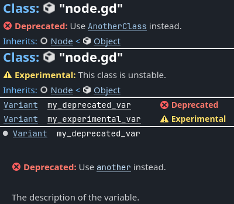

.. _doc_gdscript_documentation_comments:

GDScript documentation comments
===============================

In GDScript, comments can be used to document your code and add descriptions to the
members of a script. There are two differences between a normal comment and a documentation
comment. Firstly, a documentation comment should start with double hash symbols
``##``. Secondly, it must immediately precede a script member, or for script descriptions,
be placed at the top of the script. If an exported variable is documented,
its description is used as a tooltip in the editor. This documentation can be
generated as XML files by the editor.

Documenting a script
--------------------

Comments documenting a script must come before any member documentation. A
suggested format for script documentation can be divided into three parts.

- A brief description of the script.
- Detailed description.
- Tutorials and deprecated/experimental marks.

To separate these from each other, the documentation comments use special tags.
The tag must be at the beginning of a line (ignoring preceding white space)
and must have the format ``@``, followed by the keyword.

Tags
~~~~

+-------------------+--------------------------------------------------------+
| Brief description | No tag. Lives at the very beginning of                 |
|                   | the documentation section.                             |
+-------------------+--------------------------------------------------------+
| Description       | No tag. Use one blank line to separate the description |
|                   | from the brief.                                        |
+-------------------+--------------------------------------------------------+
| Tutorial          | | ``@tutorial: https://example.com``                   |
|                   | | ``@tutorial(The Title Here): https://example.com``   |
+-------------------+--------------------------------------------------------+
| Deprecated        | | ``@deprecated``                                      |
|                   | | ``@deprecated: Use [AnotherClass] instead.``         |
+-------------------+--------------------------------------------------------+
| Experimental      | | ``@experimental``                                    |
|                   | | ``@experimental: This class is unstable.``           |
+-------------------+--------------------------------------------------------+

For example:

::

    extends Node2D
    ## A brief description of the class's role and functionality.
    ##
    ## The description of the script, what it can do,
    ## and any further detail.
    ##
    ## @tutorial:             https://example.com/tutorial_1
    ## @tutorial(Tutorial 2): https://example.com/tutorial_2
    ## @experimental

.. warning::

    If there is any space in between the tag name and colon, for example
    ``@tutorial  :``, it won't be treated as a valid tag and will be ignored.

.. note::

    When the description spans multiple lines, the preceding and trailing white
    spaces will be stripped and joined with a single space. To preserve the line
    break use ``[br]``. See also `BBCode and class reference`_ below.

Documenting script members
--------------------------

Members that are applicable for documentation:

- Signal
- Enum
- Enum value
- Constant
- Variable
- Function
- Inner class

Documentation of a script member must immediately precede the member or its annotations
if it has any. The description can have more than one line but every line must start with
the double hash symbol ``##`` to be considered as part of the documentation.

Tags
~~~~

+--------------+--------------------------------------------------+
| Description  | No tag.                                          |
+--------------+--------------------------------------------------+
| Deprecated   | | ``@deprecated``                                |
|              | | ``@deprecated: Use [member another] instead.`` |
+--------------+--------------------------------------------------+
| Experimental | | ``@experimental``                              |
|              | | ``@experimental: This method is incomplete.``  |
+--------------+--------------------------------------------------+

For example:

::

    ## The description of the variable.
    ## @deprecated: Use [member other_var] instead.
    var my_var

Alternatively, you can use inline documentation comments:

::

    signal my_signal ## My signal.

    enum MyEnum { ## My enum.
        VALUE_A = 0, ## Value A.
        VALUE_B = 1, ## Value B.
    }

    const MY_CONST = 1 ## My constant.

    var my_var ## My variable.

    func my_func(): ## My func.
        pass

    class MyClass: ## My class.
        pass

The script documentation will update in the editor help window every time the script is updated.
If any member variable or function name starts with an underscore, it will be treated as private.
It will not appear in the documentation and will be ignored in the help window.

Complete script example
-----------------------

::

    extends Node2D
    ## A brief description of the class's role and functionality.
    ##
    ## The description of the script, what it can do,
    ## and any further detail.
    ##
    ## @tutorial:             https://example.com/tutorial_1
    ## @tutorial(Tutorial 2): https://example.com/tutorial_2
    ## @experimental

    ## The description of a signal.
    signal my_signal

    ## This is a description of the below enum.
    enum Direction {
        ## Direction up.
        UP = 0,
        ## Direction down.
        DOWN = 1,
        ## Direction left.
        LEFT = 2,
        ## Direction right.
        RIGHT = 3,
    }

    ## The description of a constant.
    const GRAVITY = 9.8

    ## The description of the variable v1.
    var v1

    ## This is a multiline description of the variable v2.[br]
    ## The type information below will be extracted for the documentation.
    var v2: int

    ## If the member has any annotation, the annotation should
    ## immediately precede it.
    @export
    var v3 := some_func()

    ## As the following function is documented, even though its name starts with
    ## an underscore, it will appear in the help window.
    func _fn(p1: int, p2: String) -> int:
        return 0

    # The below function isn't documented and its name starts with an underscore
    # so it will treated as private and will not be shown in the help window.
    func _internal() -> void:
        pass

    ## Documenting an inner class.
    ##
    ## The same rules apply here. The documentation must
    ## immediately precede the class definition.
    ##
    ## @tutorial: https://example.com/tutorial
    ## @experimental
    class Inner:

        ## Inner class variable v4.
        var v4

        ## Inner class function fn.
        func fn(): pass

``@deprecated`` and ``@experimental`` tags
------------------------------------------

You can mark a class or any of its members as deprecated or experimental.
This will add the corresponding indicator in the built-in documentation viewer.
Optionally, you can provide a short message explaining why the API is not recommended.
This can be especially useful for plugin and library creators.

- **Deprecated** marks a non-recommended API that is subject to removal or incompatible change
  in a future major release. Usually the API is kept for backwards compatibility.
- **Experimental** marks a new unstable API that may be changed or removed in the current
  major branch. Using this API is not recommended in production code.

.. note::

    While technically you can use both ``@deprecated`` and ``@experimental`` tags on the same
    class/member, this is not recommended as it is against common conventions.

.. _doc_gdscript_documentation_comments_bbcode_and_class_reference:

BBCode and class reference
--------------------------

Godot's class reference supports BBCode-like tags. They add nice formatting to the text which could also
be used in the documentation. See also :ref:`class reference bbcode <doc_class_reference_bbcode>`.
Note that this is slightly different from the ``RichTextLabel`` :ref:`BBCode <doc_bbcode_in_richtextlabel>`.

Whenever you link to a member of another class, you need to specify the class name.
For links to the same class, the class name is optional and can be omitted.

Here's the list of available tags:

+--------------------------------+----------------------------------------------+--------------------------------------------------------------+
| Tag and Description            | Example                                      | Result                                                       |
+================================+==============================================+==============================================================+
| | ``[Class]``                  | ``Move the [Sprite2D].``                     | Move the :ref:`class_Sprite2D`.                              |
| | Link to class                |                                              |                                                              |
+--------------------------------+----------------------------------------------+--------------------------------------------------------------+
| | ``[annotation Class.name]``  | ``See [annotation @GDScript.@rpc].``         | See :ref:`@GDScript.@rpc <class_@GDScript_annotation_@rpc>`. |
| | Link to annotation           |                                              |                                                              |
+--------------------------------+----------------------------------------------+--------------------------------------------------------------+
| | ``[constant Class.name]``    | ``See [constant Color.RED].``                | See :ref:`Color.RED <class_Color_constant_RED>`.             |
| | Link to constant             |                                              |                                                              |
+--------------------------------+----------------------------------------------+--------------------------------------------------------------+
| | ``[enum Class.name]``        | ``See [enum Mesh.ArrayType].``               | See :ref:`Mesh.ArrayType <enum_Mesh_ArrayType>`.             |
| | Link to enum                 |                                              |                                                              |
+--------------------------------+----------------------------------------------+--------------------------------------------------------------+
| | ``[member Class.name]``      | ``Get [member Node2D.scale].``               | Get :ref:`Node2D.scale <class_Node2D_property_scale>`.       |
| | Link to member (property)    |                                              |                                                              |
+--------------------------------+----------------------------------------------+--------------------------------------------------------------+
| | ``[method Class.name]``      | ``Call [method Node3D.hide].``               | Call :ref:`Node3D.hide() <class_Node3D_method_hide>`.        |
| | Link to method               |                                              |                                                              |
+--------------------------------+----------------------------------------------+--------------------------------------------------------------+
| | ``[constructor Class.name]`` | ``Use [constructor Color.Color].``           | Use  :ref:`Color.Color <class_Color_constructor_Color>`.     |
| | Link to built-in constructor |                                              |                                                              |
+--------------------------------+----------------------------------------------+--------------------------------------------------------------+
| | ``[operator Class.name]``    | ``Use [operator Color.operator *].``         | Use  :ref:`Color.operator * <class_Color_operator_mul_int>`. |
| | Link to built-in operator    |                                              |                                                              |
+--------------------------------+----------------------------------------------+--------------------------------------------------------------+
| | ``[signal Class.name]``      | ``Emit [signal Node.renamed].``              | Emit :ref:`Node.renamed <class_Node_signal_renamed>`.        |
| | Link to signal               |                                              |                                                              |
+--------------------------------+----------------------------------------------+--------------------------------------------------------------+
| | ``[theme_item Class.name]``  | ``See [theme_item Label.font].``             | See :ref:`Label.font <class_Label_theme_font_font>`.         |
| | Link to theme item           |                                              |                                                              |
+--------------------------------+----------------------------------------------+--------------------------------------------------------------+
| | ``[param name]``             | ``Takes [param size] for the size.``         | Takes ``size`` for the size.                                 |
| | Parameter name (as code)     |                                              |                                                              |
+--------------------------------+----------------------------------------------+--------------------------------------------------------------+
| | ``[br]``                     | | ``Line 1.[br]``                            | | Line 1.                                                    |
| | Line break                   | | ``Line 2.``                                | | Line 2.                                                    |
+--------------------------------+----------------------------------------------+--------------------------------------------------------------+
| | ``[lb]`` ``[rb]``            | ``[lb]b[rb]text[lb]/b[rb]``                  | [b]text[/b]                                                  |
| | ``[`` and ``]`` respectively |                                              |                                                              |
+--------------------------------+----------------------------------------------+--------------------------------------------------------------+
| | ``[b]`` ``[/b]``             | ``Do [b]not[/b] call this method.``          | Do **not** call this method.                                 |
| | Bold                         |                                              |                                                              |
+--------------------------------+----------------------------------------------+--------------------------------------------------------------+
| | ``[i]`` ``[/i]``             | ``Returns the [i]global[/i] position.``      | Returns the *global* position.                               |
| | Italic                       |                                              |                                                              |
+--------------------------------+----------------------------------------------+--------------------------------------------------------------+
| | ``[u]`` ``[/u]``             | ``[u]Always[/u] use this method.``           | .. raw:: html                                                |
| | Underline                    |                                              |                                                              |
|                                |                                              |     <u>Always</u> use this method.                           |
+--------------------------------+----------------------------------------------+--------------------------------------------------------------+
| | ``[s]`` ``[/s]``             | ``[s]Outdated information.[/s]``             | .. raw:: html                                                |
| | Strikethrough                |                                              |                                                              |
|                                |                                              |     <s>Outdated information.</s>                             |
+--------------------------------+----------------------------------------------+--------------------------------------------------------------+
| | ``[color]`` ``[/color]``     | ``[color=red]Error![/color]``                | .. raw:: html                                                |
| | Color                        |                                              |                                                              |
|                                |                                              |     Error!                   |
+--------------------------------+----------------------------------------------+--------------------------------------------------------------+
| | ``[font]`` ``[/font]``       | ``[font=res://mono.ttf]LICENSE[/font]``      | .. raw:: html                                                |
| | Font                         |                                              |                                                              |
|                                |                                              |     LICENSE      |
+--------------------------------+----------------------------------------------+--------------------------------------------------------------+
| | ``[img]`` ``[/img]``         | ``[img width=32]res://icon.svg[/img]``       | .. image:: img/icon.svg                                      |
| | Image                        |                                              |    :width: 32 px                                             |
+--------------------------------+----------------------------------------------+--------------------------------------------------------------+
| | ``[url]`` ``[/url]``         | | ``[url]https://example.com[/url]``         | | https://example.com                                        |
| | Hyperlink                    | | ``[url=https://example.com]Website[/url]`` | | `Website <https://example.com>`_                           |
+--------------------------------+----------------------------------------------+--------------------------------------------------------------+
| | ``[center]`` ``[/center]``   | ``[center]2 + 2 = 4[/center]``               | .. raw:: html                                                |
| | Horizontal centering         |                                              |                                                              |
|                                |                                              |     
2 + 2 = 4
                               |
+--------------------------------+----------------------------------------------+--------------------------------------------------------------+
| | ``[kbd]`` ``[/kbd]``         | ``Press [kbd]Ctrl + C[/kbd].``               | Press :kbd:`Ctrl + C`.                                       |
| | Keyboard/mouse shortcut      |                                              |                                                              |
+--------------------------------+----------------------------------------------+--------------------------------------------------------------+
| | ``[code]`` ``[/code]``       | ``Returns [code]true[/code].``               | Returns ``true``.                                            |
| | Inline code fragment         |                                              |                                                              |
+--------------------------------+----------------------------------------------+--------------------------------------------------------------+
| | ``[codeblock]``              | *See below.*                                 | *See below.*                                                 |
| | ``[/codeblock]``             |                                              |                                                              |
| | Multiline code block         |                                              |                                                              |
+--------------------------------+----------------------------------------------+--------------------------------------------------------------+

.. note::

    1. Currently only :ref:`class_@GDScript` has annotations.
    2. ``[kbd]`` disables BBCode until the parser encounters ``[/kbd]``.
    3. ``[code]`` disables BBCode until the parser encounters ``[/code]``.
    4. ``[codeblock]`` disables BBCode until the parser encounters ``[/codeblock]``.

.. warning::

    Use ``[codeblock]`` for pre-formatted code blocks. Inside ``[codeblock]``,
    always use **four spaces** for indentation (the parser will delete tabs).

::

    ## Do something for this plugin. Before using the method
    ## you first have to [method initialize] [MyPlugin].[br]
    ## [color=yellow]Warning:[/color] Always [method clean] after use.[br]
    ## Usage:
    ## [codeblock]
    ## func _ready():
    ##     the_plugin.initialize()
    ##     the_plugin.do_something()
    ##     the_plugin.clean()
    ## [/codeblock]
    func do_something():
        pass

By default, ``[codeblock]`` highlights GDScript syntax. You can change it using
the ``lang`` attribute. Currently supported options are:

- ``[codeblock lang=text]`` disables syntax highlighting;
- ``[codeblock lang=gdscript]`` highlights GDScript syntax;
- ``[codeblock lang=csharp]`` highlights C# syntax (only in .NET version).
