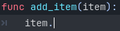
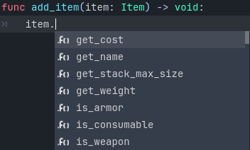

.. _doc_gdscript_static_typing:

Static typing in GDScript
=========================

In this guide, you will learn:

- how to use static typing in GDScript;
- that static types can help you avoid bugs;
- that static typing improves your experience with the editor.

Where and how you use this language feature is entirely up to you: you can use it
only in some sensitive GDScript files, use it everywhere, or don't use it at all.

Static types can be used on variables, constants, functions, parameters,
and return types.

A brief look at static typing
-----------------------------

With static typing, GDScript can detect more errors without even running the code.
Also type hints give you and your teammates more information as you're working,
as the arguments' types show up when you call a method. Static typing improves
editor autocompletion and :ref:`documentation <doc_gdscript_documentation_comments>`
of your scripts.

Imagine you're programming an inventory system. You code an ``Item`` class,
then an ``Inventory``. To add items to the inventory, the people who work with
your code should always pass an ``Item`` to the ``Inventory.add()`` method.
With types, you can enforce this::

    class_name Inventory

    func add(reference: Item, amount: int = 1):
        var item := find_item(reference)
        if not item:
            item = _instance_item_from_db(reference)
        item.amount += amount

Static types also give you better code completion options. Below, you can see
the difference between a dynamic and a static typed completion options.

You've probably encountered a lack of autocomplete suggestions after a dot:

This is due to dynamic code. Godot cannot know what value type you're passing
to the function. If you write the type explicitly however, you will get all
methods, properties, constants, etc. from the value:

.. tip::

    If you prefer static typing, we recommend enabling the
    **Text Editor > Completion > Add Type Hints** editor setting. Also consider
    enabling `some warnings <Warning system_>`_ that are disabled by default.

Also, typed GDScript improves performance by using optimized opcodes when operand/argument
types are known at compile time. More GDScript optimizations are planned in the future,
such as JIT/AOT compilation.

Overall, typed programming gives you a more structured experience. It
helps prevent errors and improves the self-documenting aspect of your
scripts. This is especially helpful when you're working in a team or on
a long-term project: studies have shown that developers spend most of
their time reading other people's code, or scripts they wrote in the
past and forgot about. The clearer and the more structured the code, the
faster it is to understand, the faster you can move forward.

How to use static typing
------------------------

To define the type of a variable, parameter, or constant, write a colon after the name,
followed by its type. E.g. ``var health: int``. This forces the variable's type
to always stay the same::

    var damage: float = 10.5
    const MOVE_SPEED: float = 50.0
    func sum(a: float = 0.0, b: float = 0.0) -> float:
        return a + b

Godot will try to infer types if you write a colon, but you omit the type::

    var damage := 10.5
    const MOVE_SPEED := 50.0
    func sum(a := 0.0, b := 0.0) -> float:
        return a + b

.. note::

    1. There is no difference between ``=`` and ``:=`` for constants.
    2. You don't need to write type hints for constants, as Godot sets it automatically
       from the assigned value. But you can still do so to make the intent of your code clearer.
       Also, this is useful for typed arrays (like ``const A: Array[int] = [1, 2, 3]``),
       since untyped arrays are used by default.

What can be a type hint
~~~~~~~~~~~~~~~~~~~~~~~

Here is a complete list of what can be used as a type hint:

1. ``Variant``. Any type. In most cases this is not much different from an untyped
   declaration, but increases readability. As a return type, forces the function
   to explicitly return some value.
2. *(Only return type)* ``void``. Indicates that the function does not return any value.
3. :ref:`Built-in types <doc_gdscript_builtin_types>`.
4. Native classes (``Object``, ``Node``, ``Area2D``, ``Camera2D``, etc.).
5. :ref:`Global classes <doc_gdscript_basics_class_name>`.
6. :ref:`Inner classes <doc_gdscript_basics_inner_classes>`.
7. Global, native and custom named enums. Note that an enum type is just an ``int``,
   there is no guarantee that the value belongs to the set of enum values.
8. Constants (including local ones) if they contain a preloaded class or enum.

You can use any class, including your custom classes, as types. There are two ways
to use them in scripts. The first method is to preload the script you want to use
as a type in a constant::

    const Rifle = preload("res://player/weapons/rifle.gd")
    var my_rifle: Rifle

The second method is to use the ``class_name`` keyword when you create.
For the example above, your ``rifle.gd`` would look like this::

    class_name Rifle
    extends Node2D

If you use ``class_name``, Godot registers the ``Rifle`` type globally in the editor,
and you can use it anywhere, without having to preload it into a constant::

    var my_rifle: Rifle

Specify the return type of a function with the arrow ``->``
~~~~~~~~~~~~~~~~~~~~~~~~~~~~~~~~~~~~~~~~~~~~~~~~~~~~~~~~~~~

To define the return type of a function, write a dash and a right angle bracket ``->``
after its declaration, followed by the return type::

    func _process(delta: float) -> void:
        pass

The type ``void`` means the function does not return anything. You can use any type,
as with variables::

    func hit(damage: float) -> bool:
        health_points -= damage
        return health_points <= 0

You can also use your own classes as return types::

    # Adds an item to the inventory and returns it.
    func add(reference: Item, amount: int) -> Item:
        var item: Item = find_item(reference)
        if not item:
            item = ItemDatabase.get_instance(reference)

        item.amount += amount
        return item

Covariance and contravariance
~~~~~~~~~~~~~~~~~~~~~~~~~~~~~

When inheriting base class methods, you should follow the `Liskov substitution
principle <https://en.wikipedia.org/wiki/Liskov_substitution_principle>`__.

**Covariance:** When you inherit a method, you can specify a return type that is
more specific (**subtype**) than the parent method.

**Contravariance:** When you inherit a method, you can specify a parameter type
that is less specific (**supertype**) than the parent method.

Example::

    class_name Parent

    func get_property(param: Label) -> Node:
        # ...

::

    class_name Child extends Parent

    # `Control` is a supertype of `Label`.
    # `Node2D` is a subtype of `Node`.
    func get_property(param: Control) -> Node2D:
        # ...

Specify the element type of an ``Array``
~~~~~~~~~~~~~~~~~~~~~~~~~~~~~~~~~~~~~~~~

To define the type of an ``Array``, enclose the type name in ``[]``.

An array's type applies to ``for`` loop variables, as well as some operators like
``[]``, ``[]=``, and ``+``. Array methods (such as ``push_back``) and other operators
(such as ``==``) are still untyped. Built-in types, native and custom classes,
and enums may be used as element types. Nested array types are not supported.

::

    var scores: Array[int] = [10, 20, 30]
    var vehicles: Array[Node] = [$Car, $Plane]
    var items: Array[Item] = [Item.new()]
    # var arrays: Array[Array] -- disallowed

    for score in scores:
        # score has type `int`

    # The following would be errors:
    scores += vehicles
    var s: String = scores[0]
    scores[0] = "lots"

Since Godot 4.2, you can also specify a type for the loop variable in a ``for`` loop.
For instance, you can write::

    var names = ["John", "Marta", "Samantha", "Jimmy"]
    for name: String in names:
        pass

The array will remain untyped, but the ``name`` variable within the ``for`` loop
will always be of ``String`` type.

Type casting
~~~~~~~~~~~~

Type casting is an important concept in typed languages.
Casting is the conversion of a value from one type to another.

Imagine an ``Enemy`` in your game, that ``extends Area2D``. You want it to collide
with the ``Player``, a ``CharacterBody2D`` with a script called ``PlayerController``
attached to it. You use the ``body_entered`` signal to detect the collision.
With typed code, the body you detect is going to be a generic ``PhysicsBody2D``,
and not your ``PlayerController`` on the ``_on_body_entered`` callback.

You can check if this ``PhysicsBody2D`` is your ``Player`` with the ``as`` keyword,
and using the colon ``:`` again to force the variable to use this type.
This forces the variable to stick to the ``PlayerController`` type::

    func _on_body_entered(body: PhysicsBody2D) -> void:
        var player := body as PlayerController
        if not player:
            return

        player.damage()

As we're dealing with a custom type, if the ``body`` doesn't extend
``PlayerController``, the ``player`` variable will be set to ``null``.
We can use this to check if the body is the player or not. We will also
get full autocompletion on the player variable thanks to that cast.

.. note::

    The ``as`` keyword silently casts the variable to ``null`` in case of a type
    mismatch at runtime, without an error/warning. While this may be convenient
    in some cases, it can also lead to bugs. Use the ``as`` keyword only if this
    behavior is intended. A safer alternative is to use the ``is`` keyword::

        if not (body is PlayerController):
            push_error("Bug: body is not PlayerController.")

        var player: PlayerController = body
        if not player:
            return

        player.damage()

    or ``assert()`` statement::

        assert(body is PlayerController, "Bug: body is not PlayerController.")

        var player: PlayerController = body
        if not player:
            return

        player.damage()

.. note::

    If you try to cast with a built-in type and it fails, Godot will throw an error.

.. _doc_gdscript_static_typing_safe_lines:

Safe lines
^^^^^^^^^^

You can also use casting to ensure safe lines. Safe lines are a tool to tell you
when ambiguous lines of code are type-safe. As you can mix and match typed
and dynamic code, at times, Godot doesn't have enough information to know if
an instruction will trigger an error or not at runtime.

This happens when you get a child node. Let's take a timer for example:
with dynamic code, you can get the node with ``$Timer``. GDScript supports
`duck-typing <https://stackoverflow.com/a/4205163/8125343>`__,
so even if your timer is of type ``Timer``, it is also a ``Node`` and
an ``Object``, two classes it extends. With dynamic GDScript, you also don't
care about the node's type as long as it has the methods you need to call.

You can use casting to tell Godot the type you expect when you get a node:
``($Timer as Timer)``, ``($Player as CharacterBody2D)``, etc.
Godot will ensure the type works and if so, the line number will turn
green at the left of the script editor.

.. figure:: img/typed_gdscript_safe_unsafe_line.webp
   :alt: Unsafe vs Safe Line

   Unsafe line (line 7) vs Safe Lines (line 6 and 8)

.. note::

    Safe lines do not always mean better or more reliable code. See the note above
    about the ``as`` keyword. For example::

        @onready var node_1 := $Node1 as Type1 # Safe line.
        @onready var node_2: Type2 = $Node2 # Unsafe line.

    Even though ``node_2`` declaration is marked as an unsafe line, it is more
    reliable than ``node_1`` declaration. Because if you change the node type
    in the scene and accidentally forget to change it in the script, the error
    will be detected immediately when the scene is loaded. Unlike ``node_1``,
    which will be silently cast to ``null`` and the error will be detected later.

.. note::

    You can turn off safe lines or change their color in the editor settings.

Typed or dynamic: stick to one style
------------------------------------

Typed GDScript and dynamic GDScript can coexist in the same project. But
it's recommended to stick to either style for consistency in your codebase,
and for your peers. It's easier for everyone to work together if you follow
the same guidelines, and faster to read and understand other people's code.

Typed code takes a little more writing, but you get the benefits we discussed
above. Here's an example of the same, empty script, in a dynamic style::

    extends Node

    func _ready():
        pass

    func _process(delta):
        pass

And with static typing::

    extends Node

    func _ready() -> void:
        pass

    func _process(delta: float) -> void:
        pass

As you can see, you can also use types with the engine's virtual methods.
Signal callbacks, like any methods, can also use types. Here's a ``body_entered``
signal in a dynamic style::

    func _on_area_2d_body_entered(body):
        pass

And the same callback, with type hints::

    func _on_area_entered(area: CollisionObject2D) -> void:
        pass

Warning system
--------------

.. note::

    Detailed documentation about the GDScript warning system has been moved to
    :ref:`doc_gdscript_warning_system`.

From version 3.1, Godot gives you warnings about your code as you write it:
the engine identifies sections of your code that may lead to issues at runtime,
but lets you decide whether or not you want to leave the code as it is.

We have a number of warnings aimed specifically at users of typed GDScript.
By default, these warnings are disabled, you can enable them in Project Settings
(**Debug > GDScript**, make sure **Advanced Settings** is enabled).

You can enable the ``UNTYPED_DECLARATION`` warning if you want to always use
static types. Additionally, you can enable the ``INFERRED_DECLARATION`` warning
if you prefer a more readable and reliable, but more verbose syntax.

``UNSAFE_*`` warnings make unsafe operations more noticeable, than unsafe lines.
Currently, ``UNSAFE_*`` warnings do not cover all cases that unsafe lines cover.

Common unsafe operations and their safe counterparts
----------------------------------------------------

``UNSAFE_PROPERTY_ACCESS`` and ``UNSAFE_METHOD_ACCESS`` warnings
~~~~~~~~~~~~~~~~~~~~~~~~~~~~~~~~~~~~~~~~~~~~~~~~~~~~~~~~~~~~~~~~

In this example, we aim to set a property and call a method on an object
that has a script attached with ``class_name MyScript`` and that ``extends
Node2D``. If we have a reference to the object as a ``Node2D`` (for instance,
as it was passed to us by the physics system), we can first check if the
property and method exist and then set and call them if they do::
    
    if "some_property" in node_2d:
        node_2d.some_property = 20  # Produces UNSAFE_PROPERTY_ACCESS warning.
    
    if node_2d.has_method("some_function"):
        node_2d.some_function()  # Produces UNSAFE_METHOD_ACCESS warning.

However, this code will produce ``UNSAFE_PROPERTY_ACCESS`` and
``UNSAFE_METHOD_ACCESS`` warnings as the property and method are not present
in the referenced type - in this case a ``Node2D``. To make these operations
safe, you can first check if the object is of type ``MyScript`` using the
``is`` keyword and then declare a variable with the type ``MyScript`` on
which you can set its properties and call its methods::
    
    if node_2d is MyScript:
        var my_script: MyScript = node_2d
        my_script.some_property = 20
        my_script.some_function()

Alternatively, you can declare a variable and use the ``as`` operator to try
to cast the object. You'll then want to check whether the cast was successful
by confirming that the variable was assigned::

    var my_script := node_2d as MyScript
    if my_script != null:
        my_script.some_property = 20
        my_script.some_function()

``UNSAFE_CAST`` warning
~~~~~~~~~~~~~~~~~~~~~~~

In this example, we would like the label connected to an object entering our
collision area to show the area's name. Once the object enters the collision
area, the physics system sends a signal with a ``Node2D`` object, and the most
straightforward (but not statically typed) solution to do what we want could
be achieved like this::
    
    func _on_body_entered(body: Node2D) -> void:
        body.label.text = name  # Produces UNSAFE_PROPERTY_ACCESS warning.

This piece of code produces an ``UNSAFE_PROPERTY_ACCESS`` warning because
``label`` is not defined in ``Node2D``. To solve this, we could first check if the
``label`` property exist and cast it to type ``Label`` before settings its text
property like so::

    func _on_body_entered(body: Node2D) -> void:
        if "label" in body:
            (body.label as Label).text = name  # Produces UNSAFE_CAST warning.

However, this produces an ``UNSAFE_CAST`` warning because ``body.label`` is of a
``Variant`` type. To safely get the property in the type you want, you can use the
``Object.get()`` method which returns the object as a ``Variant`` value or returns
``null`` if the property doesn't exist. You can then determine whether the
property contains an object of the right type using the ``is`` keyword, and
finally declare a statically typed variable with the object::

    func _on_body_entered(body: Node2D) -> void:
        var label_variant: Variant = body.get("label")
        if label_variant is Label:
            var label: Label = label_variant
            label.text = name

Cases where you can't specify types
-----------------------------------

To wrap up this introduction, let's mention cases where you can't use type hints.
This will trigger a **syntax error**.

1. You can't specify the type of individual elements in an array or a dictionary::

        var enemies: Array = [$Goblin: Enemy, $Zombie: Enemy]
        var character: Dictionary = {
            name: String = "Richard",
            money: int = 1000,
            inventory: Inventory = $Inventory,
        }

2. Nested types are not currently supported::

        var teams: Array[Array[Character]] = []

3. Typed dictionaries are not currently supported::

        var map: Dictionary[Vector2i, Item] = {}

Summary
-------

Typed GDScript is a powerful tool. It helps you write more structured code,
avoid common errors, and create scalable and reliable systems. Static types
improve GDScript performance and more optimizations are planned for the future.
