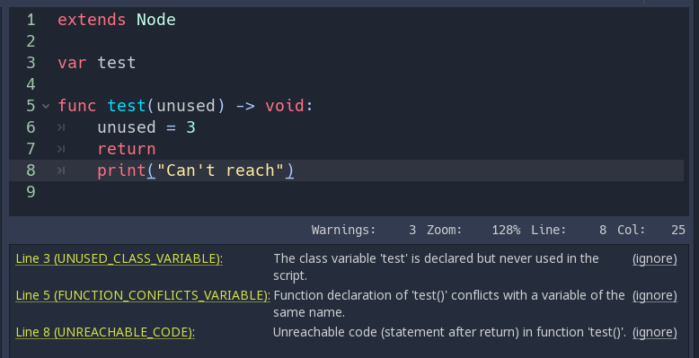

.. _doc_gdscript_warning_system:

GDScript warning system
=======================

The GDScript warning system complements :ref:`static typing <doc_gdscript_static_typing>`
(but it can work without static typing too). It's here to help you avoid
mistakes that are hard to spot during development, and that may lead
to runtime errors.

You can configure warnings in the Project Settings under the section
called **GDScript**:

.. figure:: img/typed_gdscript_warning_system_settings.webp
   :alt: Warning system project settings

   Warning system project settings

.. note::

   As shown in the image above, you must enable **Advanced Settings** in order to see the GDScript section.

You can find a list of warnings for the active GDScript file in the
script editor's status bar. The example below has 2 warnings:

   Warning system example

To ignore specific warnings in one file, insert an annotation of the
form ``@warning_ignore(warning_id)``, or click on the ignore link to the
left of the warning's entry. Godot will add an annotation above the
corresponding line and the code won't trigger the corresponding warning
anymore:

.. figure:: img/typed_gdscript_warning_system_ignore.png
   :alt: Warning system ignore example

   Warning system ignore example

If the list of warnings is not visible, make sure to click on the yellow
warning symbol on the bottom right of the editor pane.

To ignore all instances of a warning in one file, you can insert the annotation
below the scripts `extends` statement. You can also choose to ignore multiple warnings
by passing their ids as a comma separated list to the annotation, e.g.
``@warning_ignore(unused_variable, unreachable_code)``

Warnings won't prevent the game from running, but you can turn them into
errors if you'd like. This way your game won't compile unless you fix
all warnings. Head to the ``GDScript`` section of the Project Settings to
turn on this option. Here's the same file as the previous example with
warnings as errors turned on:

.. figure:: img/typed_gdscript_warning_system_errors.png
   :alt: Warnings as errors

   Warnings as errors
