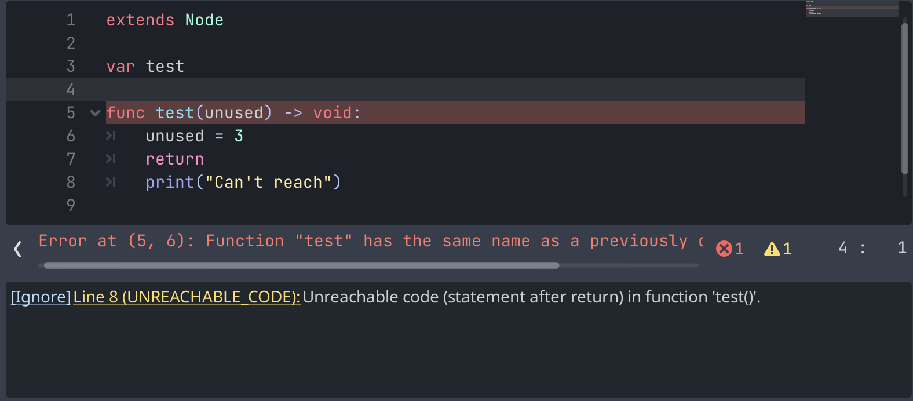
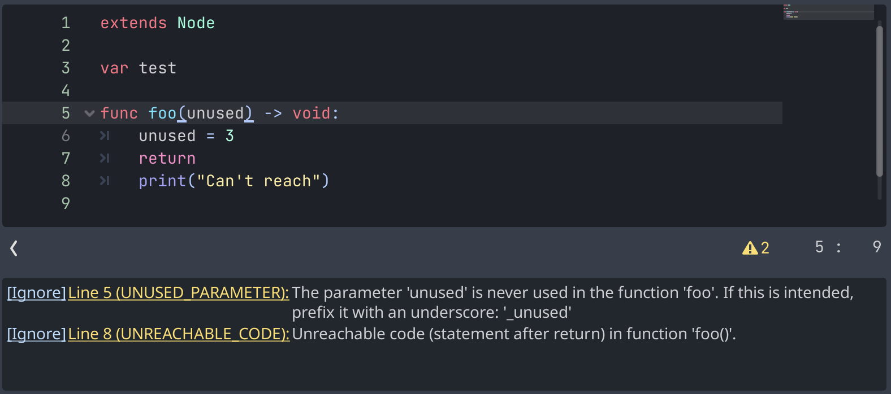
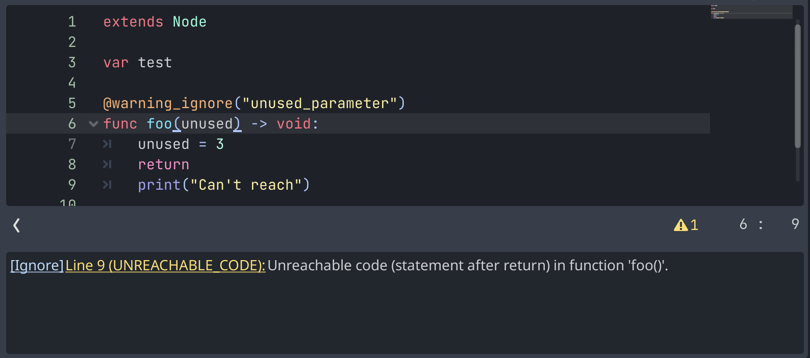

.. _doc_gdscript_warning_system:

GDScript warning system
=======================

The GDScript warning system complements :ref:`static typing <doc_gdscript_static_typing>`
(but it can work without static typing too). It's here to help you avoid
mistakes that are hard to spot during development, and that may lead
to runtime errors.

You can configure warnings in the Project Settings under the section
called **GDScript**:

.. figure:: img/typed_gdscript_warning_system_settings.webp
   :alt: Warning system project settings

   Warning system project settings

.. note::

   As shown in the image above, you must enable **Advanced Settings** in order to see the GDScript section.

You can find a list of warnings and errors for the active GDScript
file in the script editor's status bar. The example below has a
warning and an error:

   Warning system example (One error, one warning)

Sometimes, the presence of errors might prevent some warnings from
being displayed. See below how, upon fixing the error, there are now
two warnings:

   Warning system example (Two warnings)

To ignore specific warnings in one file, insert an annotation of the
form ``@warning_ignore(warning_id)``, or click on the ignore link to the
left of the warning's entry. Godot will add an annotation above the
corresponding line and the code won't trigger the corresponding warning
anymore:

   Warning system ignore example

If the list of warnings is not visible, make sure to click on the yellow
warning symbol on the bottom right of the editor pane.
