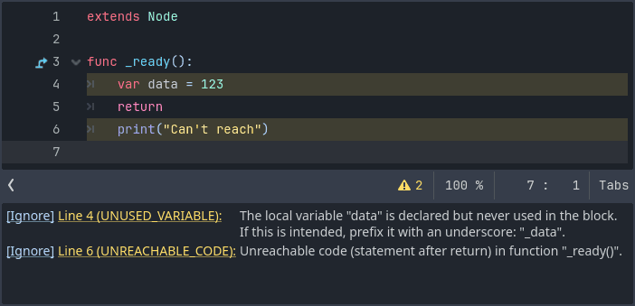

.. _doc_gdscript_warning_system:

GDScript warning system
=======================

The GDScript warning system complements :ref:`static typing <doc_gdscript_static_typing>`
(but it can work without static typing too). It's here to help you avoid
mistakes that are hard to spot during development, and that may lead
to runtime errors.

You can configure warnings in the Project Settings under the section
called **GDScript**:

.. image:: img/typed_gdscript_warning_system_settings.webp

.. note::
   You must enable **Advanced Settings** in order to see the
   GDScript section in the sidebar. You can also search for "GDScript" when
   Advanced Settings is off.

You can find a list of warnings for the active GDScript file in the
script editor's status bar. The example below has 2 warnings:

To ignore specific warnings in one file, insert an annotation of the
form ``@warning_ignore("warning-id")``, or click on the ignore link to the
left of the warning's description. Godot will add an annotation above the
corresponding line and the code won't trigger the corresponding warning
anymore:

.. image:: img/typed_gdscript_warning_system_ignore.webp

Warnings won't prevent the game from running, but you can turn them into
errors if you'd like. This way your game won't compile unless you fix
all warnings. Head to the ``GDScript`` section of the Project Settings to
turn on this option to the warning that you want. Here's the same file as
the previous example with the warning ``unused_variable`` as an error turned on:

.. image:: img/typed_gdscript_warning_system_errors.webp
