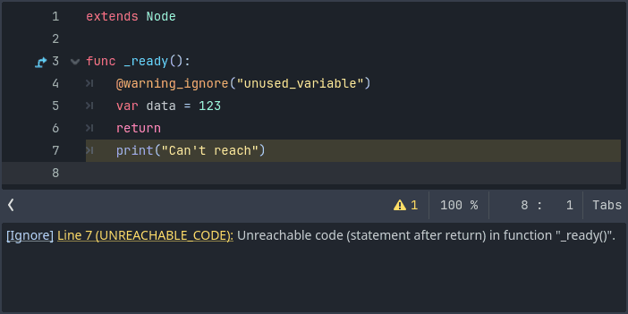
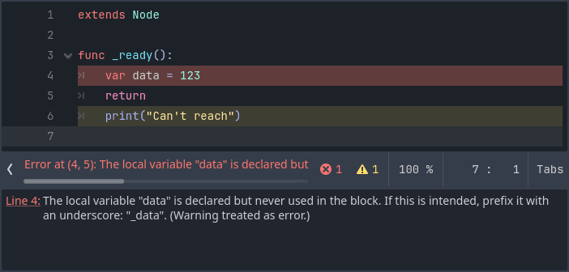

.. _doc_gdscript_warning_system:

GDScript warning system
=======================

The GDScript warning system complements :ref:`static typing <doc_gdscript_static_typing>`
(but it can work without static typing too). It's here to help you avoid
mistakes that are hard to spot during development, and that may lead
to runtime errors.

You can configure warnings in the Project Settings under the section
called **GDScript**:

.. figure:: img/typed_gdscript_warning_system_settings.webp
    :alt: Warning system project settings

    Warning system project settings

.. note::

    As shown in the image above, you must enable **Advanced Settings** in order to see the GDScript section.

You can find a list of warnings for the active GDScript file in the
script editor's status bar. The example below has 2 warnings:

.. figure:: img/typed_gdscript_warning_example.webp
    :alt: Warning system example

    Warning system example

To ignore specific warnings, insert the :ref:`@warning_ignore <class_@GDScript_annotation_@warning_ignore>`
annotation before the definition or statement that generates the warning::

    func test():
        return
        @warning_ignore("unreachable_code")
        print("Can't reach")

You can also click on the "Ignore" link near the warning description
and the editor will insert the annotation automatically:

    Warning system ignore example

.. warning::

    This part of GDScript currently has issues. Some warnings may not be ignored with an annotation,
    and the editor may insert an annotation where it is not allowed (within a multiline expression).

Warnings won't prevent the game from running, but you can turn certain warnings into
errors if you'd like. Head to the ``GDScript`` section of the Project Settings to
turn on this option. Here's the same file as the previous example with
the ``UNUSED_PARAMETER`` warning treated as an error:

    Warnings as errors
