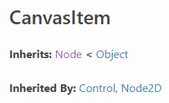
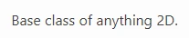
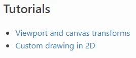
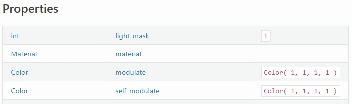
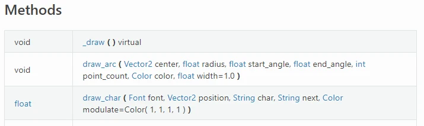
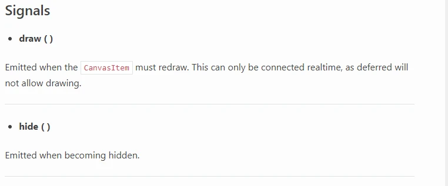
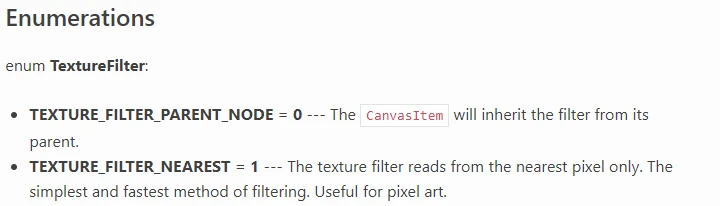
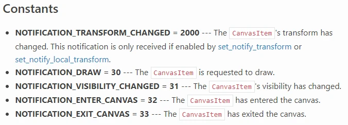
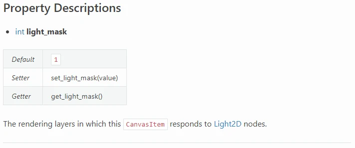
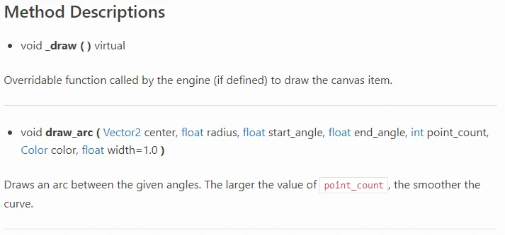

.. _doc_how_to_read_the_godot_api:

How to read the Godot API
=========================

On this page, you'll learn how to read the class reference for the Godot API.

The API, or Application Programming Interface, is an index of what Godot offers
users. It provides a brief summary of which classes exist, how they are
related to each other, what features they have, and how to use them.

Inheritance
-----------

At the top of each file, you will see the name of the class.

The "Inherits" section lists each class the current one inherits.
Here ``CanvasItem`` inherits ``Node`` and ``Node`` inherits ``Object``.

The "Inherited By" section lists each class which directly inherits the
current class. Here ``Control`` and ``Node2D`` both inherit ``CanvasItem``.

Brief Description
-----------------

Next a brief description of the class. This text appears in Godot Editor
popups for creating Nodes, Resources, and other types.

Description
-----------

.. image:: img/class_api_description.webp

Next a more detailed description the class, its features, and its use case(s).

Things you may find here:

1. Specifics of how the class works.

2. Code samples of common use cases.

3. Usage details which are shared between each of the class's methods.

4. Warnings about required dependencies or configuration.

5. Links to other related parts of the Godot API.

Tutorials
---------

The page then provides links to parts of the manual which mention or make use
of the current class.

Properties
----------

The Properties table lists the variables which belong to each instance of the
class, also known as the "properties."

The left column contains the data type of the property. The text is also a
link to that data type's Godot API page.

The center column contains the name of the property. The text is also a link
to that property's full description on the page. Use this name to get the
property's data or set a new value to it.

The right column contains the default value of the property. To initialize it
with a different value, you must set a different value via script or the
Inspector.

Methods
-------

The Methods table lists the functions which belong to each instance of the
class, also known as the "methods."

The left column contains the data type of the method's return value.

The right column contains the name, parameters, and qualifiers of the method.
The name is the text before the opening parenthesis. It is also a link to the
method's full description on the page. Use this name to call the method.

For each parameter, the page details its data type, name, and default value,
if any.

Possible qualifiers include...

- ``const``: the method does not change any data in the class instance.
- ``virtual``: the method does nothing but wait for a script to override it.
- ``vararg``: the method can accept an arbitrary number of arguments.

Signals
-------

The Signals list details the names and parameters of events which "signal" a
change in game state to other class instances.

Like the Methods table, any parameters will include their data type and name.

Each signal also has a detailed explanation of when the signal is emitted.

Enumerations
------------

The Enumerations list details the enumerable data types associated with the
current class.

For each enumeration, the page states its name and then lists its possible
values.

For each enumeration value, the page states its name, its integer value, and
an explanation of its use case(s) and/or affects.

Constants
---------

The Constants list details named integer constants in the current class.

For each constant, the page states its name, its integer value, and an
explanation of its use case(s) and/or affects.

``NOTIFICATION_*`` constants' descriptions will state which engine event
triggers the notification.

Property Descriptions
---------------------

The Property Descriptions list details everything about each property.

It restates the data type and name of the property.

Every property in the Godot API is bound to a pair of setter and getter
functions. Using either is equivalent. They are listed here.

Below that is a detailed summary of what the property's data represents, its
use case(s) and/or the affects of changing it. It may include code samples
and/or links to relevant parts of the Godot API.

.. note:: Knowing the setter and getter names is useful when one must bind a
          method name or :ref:`Callable<class_Callable>` to something.

Method Descriptions
-------------------

The Method Descriptions list details everything about each method.

It restates the method's return data type, parameter names/types/defaults, and
qualifiers.

Below that is a detailed summary of what the method does and its use case(s).
It may include code samples and/or links to relevant parts of the Godot API.
