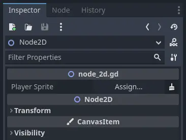
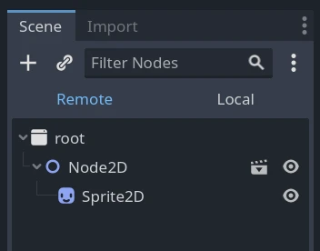

.. _doc_nodes_and_scene_instances:

Nodes and scene instances
=========================

This guide explains how to get nodes, create nodes, add them as a child, and
instantiate scenes from code.

Getting nodes
-------------

Lets say you have a scene tree like this, and you want to get a reference to the Sprite2D to access them in your script.

In the game development industry, especially in larger projects, maintainability is key. Relying on the ``Node.get_node(path)`` method can lead to brittle project structures, as it's tied to hard-coded node paths which can easily break with renaming or scene restructuring. Since Godot 4.0, it's recommended to reference your nodes by using the following in your code:

.. tabs::
 .. code-tab:: gdscript GDScript

    @export var player_sprite: Sprite2D

 .. code-tab:: csharp

    [Export] public Sprite2D player_sprite;

Once you've done this, simply drag and drop your node (Sprite2D in this example) onto the corresponding "Assign..." field in the Inspector:

Creating nodes
--------------

To create a node from code, call its ``new()`` method like for any other
class-based datatype.

You can store the newly created node's reference in a variable and call
``add_child()`` to add it as a child of the node to which you attached the
script.

.. tabs::
 .. code-tab:: gdscript GDScript

    var sprite2d

    func _ready():
        var sprite2d = Sprite2D.new() # Create a new Sprite2D.
        add_child(sprite2d) # Add it as a child of this node.

 .. code-tab:: csharp

    private Sprite2D _sprite2D;

    public override void _Ready()
    {
        base._Ready();

        _sprite2D = new Sprite2D(); // Create a new Sprite2D.
        AddChild(_sprite2D); // Add it as a child of this node.
    }

To delete a node and free it from memory, you can call its ``queue_free()``
method. Doing so queues the node for deletion at the end of the current frame
after it has finished processing. At that point, the engine removes the node from
the scene and frees the object in memory.

.. tabs::
 .. code-tab:: gdscript GDScript

    sprite2d.queue_free()

 .. code-tab:: csharp

    _sprite2D.QueueFree();

Before calling ``sprite2d.queue_free()``, the remote scene tree looks like this.

After the engine freed the node, the remote scene tree doesn't display the
sprite anymore.

.. image:: img/nodes_and_scene_instances_remote_tree_no_sprite.webp

You can alternatively call ``free()`` to immediately destroy the node. You
should do this with care as any reference to it will instantly become ``null``.
We recommend using ``queue_free()`` unless you know what you're doing.

When you free a node, it also frees all its children. Thanks to this, to delete
an entire branch of the scene tree, you only have to free the topmost parent
node.

Instancing scenes
-----------------

Scenes are templates from which you can create as many reproductions as you'd
like. This operation is called instancing, and doing it from code happens in two
steps:

1. Loading the scene from the local drive.
2. Creating an instance of the loaded :ref:`PackedScene <class_PackedScene>`
   resource.

.. tabs::
 .. code-tab:: gdscript GDScript

    var scene = load("res://my_scene.tscn")

 .. code-tab:: csharp

    var scene = GD.Load<PackedScene>("res://MyScene.tscn");

Preloading the scene can improve the user's experience as the load operation
happens when the compiler reads the script and not at runtime. This feature is
only available with GDScript.

.. tabs::
 .. code-tab:: gdscript GDScript

    var scene = preload("res://my_scene.tscn")

At that point, ``scene`` is a packed scene resource, not a node. To create the
actual node, you need to call :ref:`PackedScene.instantiate()
<class_PackedScene_method_instantiate>`. It returns a tree of nodes that you can use
as a child of your current node.

.. tabs::
 .. code-tab:: gdscript GDScript

    var instance = scene.instantiate()
    add_child(instance)

 .. code-tab:: csharp

    var instance = scene.Instantiate();
    AddChild(instance);

The advantage of this two-step process is you can keep a packed scene loaded and
create new instances on the fly. For example, to quickly instance several
enemies or bullets.
