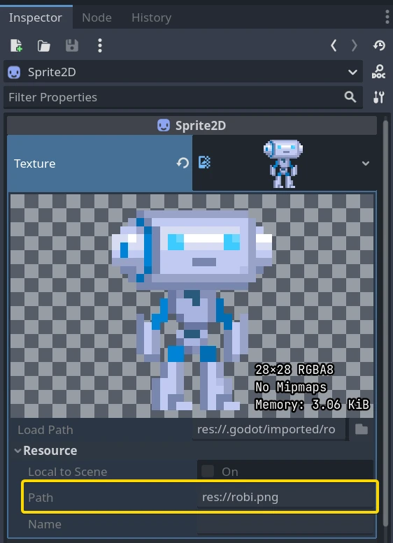

.. _doc_resources:

Resources
=========

Nodes and resources
-------------------

Up to this tutorial, we focused on the :ref:`Node <class_Node>`
class in Godot as that's the one you use to code behavior and
most of the engine's features rely on it. There is
another datatype that is just as important:
:ref:`Resource <class_Resource>`.

*Nodes* give you functionality: they draw sprites, 3D models, simulate physics,
arrange user interfaces, etc. **Resources** are **data containers**. They don't
do anything on their own: instead, nodes use the data contained in resources.

Anything Godot saves or loads from disk is a resource. Be it a scene (a ``.tscn``
or an ``.scn`` file), an image, a script... Here are some :ref:`Resource <class_Resource>` examples:

- :ref:`Texture <class_Texture>`
- :ref:`Script <class_Script>`
- :ref:`Mesh <class_Mesh>`
- :ref:`Animation <class_Animation>`
- :ref:`AudioStream <class_AudioStream>`
- :ref:`Font <class_Font>`
- :ref:`Translation <class_Translation>`

When the engine loads a resource from disk, **it only loads it once**. If a copy
of that resource is already in memory, trying to load the resource again will
return the same copy every time. As resources only contain data, there is no need
to duplicate them.

Every object, be it a Node or a Resource, can export properties. There are many
types of Properties, like String, integer, Vector2, etc., and any of these types
can become a resource. This means that both nodes and resources can contain
resources as properties:

.. image:: img/nodes_resources.webp

External vs built-in
--------------------

There are two ways to save resources. They can be:

1. **External** to a scene, saved on the disk as individual files.
2. **Built-in**, saved inside the ``.tscn`` or the ``.scn`` file they're attached to.

To be more specific, here's a :ref:`Texture2D <class_Texture2D>`
in a :ref:`Sprite2D <class_Sprite2D>` node:

.. image:: img/spriteprop.webp

Clicking the resource preview allows us to view the resource's properties.

The path property tells us where the resource comes from. In this case, it comes
from a PNG image called ``robi.png``. When the resource comes from a file like
this, it is an external resource. If you erase the path or this path is empty,
it becomes a built-in resource.

The switch between built-in and external resources happens when you save the
scene. In the example above, if you erase the path ``"res://robi.png"`` and
save, Godot will save the image inside the ``.tscn`` scene file.

.. note::

    Even if you save a built-in resource, when you instance a scene multiple
    times, the engine will only load one copy of it.

Loading resources from code
---------------------------

There are two ways to load resources from code. First, you can use the ``load()`` function anytime:

.. tabs::
 .. code-tab:: gdscript GDScript

    func _ready():
        # Godot loads the Resource when it reads this very line.
        var imported_resource = load("res://robi.png")
        $sprite.texture = imported_resource

 .. code-tab:: csharp

    public override void _Ready()
    {
        // Godot loads the Resource when it executes this line.
        var texture = GD.Load<Texture>("res://Robi.png");
        var sprite = GetNode<Sprite2D>("sprite");
        sprite.Texture = texture;
    }

You can also ``preload`` resources. Unlike ``load``, this function will read the
file from disk and load it at compile-time. As a result, you cannot call ``preload``
with a variable path: you need to use a constant string.

.. tabs::
 .. code-tab:: gdscript GDScript

    func _ready():
        # Godot loads the resource at compile-time
        var imported_resource = preload("res://robi.png")
        get_node("sprite").texture = imported_resource

 .. code-tab:: csharp

    // 'preload()' is unavailable in C Sharp.

Loading scenes
--------------

Scenes are also resources, but there is a catch. Scenes saved to disk are
resources of type :ref:`PackedScene <class_PackedScene>`. The
scene is packed inside a :ref:`Resource <class_Resource>`.

To get an instance of the scene, you have to use the
:ref:`PackedScene.instantiate() <class_PackedScene_method_instantiate>` method.

.. tabs::
 .. code-tab:: gdscript GDScript

    func _on_shoot():
            var bullet = preload("res://bullet.tscn").instantiate()
            add_child(bullet)

 .. code-tab:: csharp

    private PackedScene _bulletScene = GD.Load<PackedScene>("res://Bullet.tscn");

    private void OnShoot()
    {
        Node bullet = _bulletScene.Instantiate();
        AddChild(bullet);
    }

This method creates the nodes in the scene's hierarchy, configures them, and
returns the root node of the scene. You can then add it as a child of any other
node.

The approach has several advantages. As the :ref:`PackedScene.instantiate()
<class_PackedScene_method_instantiate>` function is fast, you can create new
enemies, bullets, effects, etc. without having to load them again from disk each
time. Remember that, as always, images, meshes, etc. are all shared between the
scene instances.

Freeing resources
-----------------

When a :ref:`Resource <class_Resource>` is no longer in use, it will automatically free itself.
Since, in most cases, Resources are contained in Nodes, when you free a node,
the engine frees all the resources it owns as well if no other node uses them.

Creating your own resources
---------------------------

Like any Object in Godot, users can also script Resources. Resource scripts
inherit the ability to freely translate between object properties and serialized
text or binary data (\*.tres, \*.res). They also inherit the reference-counting
memory management from the RefCounted type.

This comes with many distinct advantages over alternative data
structures, such as JSON, CSV, or custom TXT files. Users can only import these
assets as a :ref:`Dictionary <class_Dictionary>` (JSON) or as a
:ref:`FileAccess <class_FileAccess>` to parse. What sets Resources apart is their
inheritance of :ref:`Object <class_Object>`, :ref:`RefCounted <class_RefCounted>`,
and :ref:`Resource <class_Resource>` features:

- They can define constants, so constants from other data fields or objects are not needed.

- They can define methods, including setter/getter methods for properties. This allows for abstraction and encapsulation of the underlying data. If the Resource script's structure needs to change, the game using the Resource need not also change.

- They can define signals, so Resources can trigger responses to changes in the data they manage.

- They have defined properties, so users know 100% that their data will exist.

- Resource auto-serialization and deserialization is a built-in Godot Engine feature. Users do not need to implement custom logic to import/export a resource file's data.

- Resources can even serialize sub-Resources recursively, meaning users can design even more sophisticated data structures.

- Users can save Resources as version-control-friendly text files (\*.tres). Upon exporting a game, Godot serializes resource files as binary files (\*.res) for increased speed and compression.

- Godot Engine's Inspector renders and edits Resource files out-of-the-box. As such, users often do not need to implement custom logic to visualize or edit their data. To do so, double-click the resource file in the FileSystem dock or click the folder icon in the Inspector and open the file in the dialog.

- They can extend **other** resource types besides just the base Resource.

Godot makes it easy to create custom Resources in the Inspector.

1. Create a plain Resource object in the Inspector. This can even be a type that derives Resource, so long as your script is extending that type.
2. Set the ``script`` property in the Inspector to be your script.

The Inspector will now display your Resource script's custom properties. If one edits
those values and saves the resource, the Inspector serializes the custom properties
too! To save a resource from the Inspector, click the Inspector's tools menu (top right),
and select "Save" or "Save As...".

If the script's language supports :ref:`script classes <doc_gdscript_basics_class_name>`,
then it streamlines the process. Defining a name for your script alone will add it to
the Inspector's creation dialog. This will auto-add your script to the Resource
object you create.

Let's see some examples.
Create a :ref:`Resource <class_Resource>` and name it ``bot_stats``.
It should appear in your file tab with the full name ``bot_stats.tres``.
Without a script, it's useless, so let's add some data and logic!
Attach a script to it named ``bot_stats.gd`` (or just create a new script, and then drag it to it).

.. tabs::
  .. code-tab:: gdscript GDScript

    extends Resource

    @export var health: int
    @export var sub_resource: Resource
    @export var strings: PackedStringArray

    # Make sure that every parameter has a default value.
    # Otherwise, there will be problems with creating and editing
    # your resource via the inspector.
    func _init(p_health = 0, p_sub_resource = null, p_strings = []):
        health = p_health
        sub_resource = p_sub_resource
        strings = p_strings

  .. code-tab:: csharp

        // BotStats.cs
        using Godot;

        namespace ExampleProject
        {
            public partial class BotStats : Resource
            {
                [Export]
                public int Health { get; set; }

                [Export]
                public Resource SubResource { get; set; }

                [Export]
                public string[] Strings { get; set; }

                // Make sure you provide a parameterless constructor.
                // In C#, a parameterless constructor is different from a
                // constructor with all default values.
                // Without a parameterless constructor, Godot will have problems
                // creating and editing your resource via the inspector.
                public BotStats() : this(0, null, null) {}

                public BotStats(int health, Resource subResource, string[] strings)
                {
                    Health = health;
                    SubResource = subResource;
                    Strings = strings ?? System.Array.Empty<string>();
                }
            }
        }

Now, create a :ref:`CharacterBody3D <class_CharacterBody3D>`, name it ``Bot``, and add the following script to it:

.. tabs::
  .. code-tab:: gdscript GDScript

    extends CharacterBody3D

    @export var stats: Resource

    func _ready():
        # Uses an implicit, duck-typed interface for any 'health'-compatible resources.
        if stats:
            stats.health = 10
            print(stats.health)
            # Prints "10"

  .. code-tab:: csharp

        // Bot.cs
        using Godot;

        namespace ExampleProject
        {
            public partial class Bot : CharacterBody3D
            {
                [Export]
                public Resource Stats;

                public override void _Ready()
                {
                    if (Stats is BotStats botStats)
                    {
                        GD.Print(botStats.Health); // Prints '10'.
                    }
                }
            }
        }

Now, select the :ref:`CharacterBody3D <class_CharacterBody3D>` node which we named ``bot``, and drag&drop the ``bot_stats.tres`` resource onto the Inspector. It should print 10! Obviously, this setup can be used for more advanced features than this, but as long you really understand *how* it all worked, you should figure out everything else related to Resources.

.. note::

    Resource scripts are similar to Unity's ScriptableObjects. The Inspector
    provides built-in support for custom resources. If desired though, users
    can even design their own Control-based tool scripts and combine them
    with an :ref:`EditorPlugin <class_EditorPlugin>` to create custom
    visualizations and editors for their data.

    Unreal Engine's DataTables and CurveTables are also easy to recreate with
    Resource scripts. DataTables are a String mapped to a custom struct, similar
    to a Dictionary mapping a String to a secondary custom Resource script.

    .. tabs::
      .. code-tab:: gdscript GDScript

        # bot_stats_table.gd
        extends Resource

        const BotStats = preload("bot_stats.gd")

        var data = {
            "GodotBot": BotStats.new(10), # Creates instance with 10 health.
            "DifferentBot": BotStats.new(20) # A different one with 20 health.
        }

        func _init():
            print(data)
      .. code-tab:: csharp

        using Godot;

        public partial class BotStatsTable : Resource
        {
            private Godot.Dictionary<string, BotStats> _stats = new Godot.Dictionary<string, BotStats>();

            public BotStatsTable()
            {
                _stats["GodotBot"] = new BotStats(10); // Creates instance with 10 health.
                _stats["DifferentBot"] = new BotStats(20); // A different one with 20 health.
                GD.Print(_stats);
            }
        }

    Instead of inlining the Dictionary values, one could also, alternatively:

    1. Import a table of values from a spreadsheet and generate these key-value pairs.

    2. Design a visualization within the editor and create a plugin that adds it
       to the Inspector when you open these types of Resources.

    CurveTables are the same thing, except mapped to an Array of float values
    or a :ref:`Curve <class_Curve>`/:ref:`Curve2D <class_Curve2D>` resource object.

.. warning::

    Beware that resource files (\*.tres/\*.res) will store the path of the script
    they use in the file. When loaded, they will fetch and load this script as an
    extension of their type. This means that trying to assign a subclass, i.e. an
    inner class of a script (such as using the ``class`` keyword in GDScript) won't
    work. Godot will not serialize the custom properties on the script subclass properly.

    In the example below, Godot would load the ``Node`` script, see that it doesn't
    extend ``Resource``, and then determine that the script failed to load for the
    Resource object since the types are incompatible.

    .. tabs::
      .. code-tab:: gdscript GDScript

        extends Node

        class MyResource:
            extends Resource
            @export var value = 5

        func _ready():
            var my_res = MyResource.new()

            # This will NOT serialize the 'value' property.
            ResourceSaver.save(my_res, "res://my_res.tres")
      .. code-tab:: csharp

        using Godot;

        public partial class MyNode : Node
        {
            public partial class MyResource : Resource
            {
                [Export]
                public int Value { get; set; } = 5;
            }

            public override void _Ready()
            {
                var res = new MyResource();

                // This will NOT serialize the 'Value' property.
                ResourceSaver.Save(res, "res://MyRes.tres");
            }
        }
