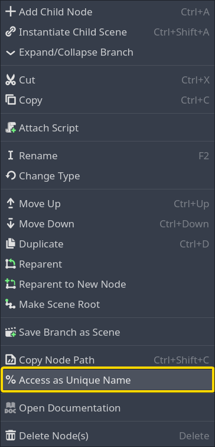
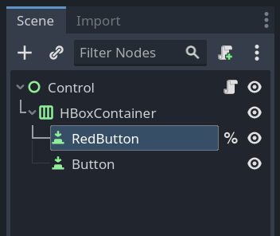
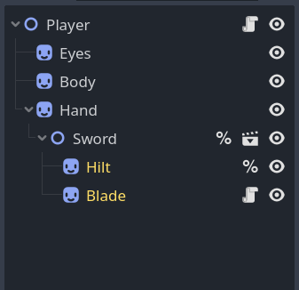

.. _doc_scene_unique_nodes:

Scene Unique Nodes
==================

Introduction
------------

There are times in a project when a node needs to be referenced from
a script. However, the node's position within the tree of its scene might change
over time as adjustments are made to the scene, such as moving a
button in a UI scene into a different panel.

In situations like this, a node can be turned into a scene
unique node to avoid having to update the script every time
the node's path is changed.

Creation and usage
------------------

In the Scene tree dock, right-click on a node and select
**Access as Scene Unique Name** in the context menu.

After checking this, the node will now have a percent symbol (**%**) next
to its name in the scene tree:

To use a unique node in a script, use the ``%`` symbol and the node's
name to create a path for ``get_node()``. For example:

.. tabs::

 .. code-tab:: gdscript GDScript

    get_node("%RedButton").text = "Hello"

 .. code-tab:: csharp

    GetNode<Button>("%RedButton").Text = "Hello";

Same-scene limitation
---------------------

A scene unique node can only be retrieved by a node inside the same scene.

If the same scene is instantiated twice, a node inside the first instance
calling ``get_node("%RedButton")`` will get the button in the first instance,
not the button in the second instance.

This limitation is perfect for a UI scene like a health bar, where each instance
of the health bar must not interact with other instances.

When a scene is instantiated inside another scene, the nodes in the outer scene
can't access scene unique nodes in the inner scene using the scene unique name.
Likewise, nodes in the inner scene can't access scene unique nodes in the outer
scene using the scene unique name.

To demonstrate this limitation, consider this example **Player** scene that
instances a **Sword** scene:

Here are the results of ``get_node()`` calls inside the **Player** script:

- ``get_node("%Eyes")`` returns the **Eyes** node.
- ``get_node("%Hilt")`` returns ``null``.

These are the results of ``get_node()`` calls inside the **Blade** script:

- ``get_node("%Eyes")`` returns ``null``.
- ``get_node("%Hilt")`` returns the **Hilt** node.

If a script has access to a node in another scene, it can call ``get_node()`` on
that node to get scene unique nodes from that node's scene. This also works in a
node path, which avoids multiple ``get_node()`` calls. Here are two ways to get
the **Hilt** node from the **Player** script using scene unique nodes:

- ``get_node("Hand/Sword").get_node("%Hilt")`` returns the **Hilt** node.
- ``get_node("Hand/Sword/%Hilt")`` also returns the **Hilt** node.

Scene unique names don't only work at the end of a node path. They can be used
in the middle to navigate from one node to another. For example, the Sword node
is marked as a scene unique node in the **Player** scene, so this is possible:

- ``get_node("%Sword/%Hilt")`` returns the **Hilt** node.

Alternatives
------------

Scene unique nodes are a useful tool to navigate a scene. However, there are
some situations where other techniques may be better.

A :ref:`Group <doc_groups>` allows locating a node from any other node, no
matter what scene the two nodes are located in. Scene unique nodes are usually
not suitable to find a **Player** node from an **Enemy** node, for example, but a group
with the **Player** node in it is a typical solution.

A :ref:`Singleton (AutoLoad) <doc_singletons_autoload>` is an always loaded node
that can be accessed directly by any node regardless of the scene. These are useful
when some data or functionality is shared globally.

:ref:`Node.find_child() <class_Node_method_find_child>` finds a node by name
without knowing its full path. This seems similar to a scene unique node, but
this method is able to find nodes in nested scenes, and doesn't require marking
the node in the scene editor in any way. However, this method is slow. Scene
unique nodes are cached by Godot and are fast to retrieve, but ``find_child()``
needs to search the tree while the game is running.
