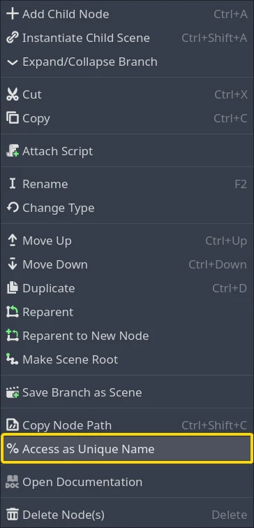
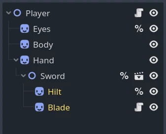

.. _doc_scene_unique_nodes:

Scene Unique Nodes
==================

Introduction
------------

Using ``get_node()`` to reference nodes from a script can sometimes be fragile.
If you move a button in a UI scene from one panel to another, the button's node
path changes, and if a script uses ``get_node()`` with a hard-coded node path,
the script will not be able to find the button anymore.

In situations like this, the node can be turned into a scene
unique node to avoid having to update the script every time
the node's path is changed.

Creation and usage
------------------

In the Scene tree dock, right-click on a node and select
**Access as Unique Name** in the context menu.

After selecting the option, the node will now have a percent symbol (**%**) next
to its name in the scene tree:

.. image:: img/percent.webp

You can now use the node in your script. For example, you can reference it with
a ``get_node()`` method call by typing the % symbol, followed by the node's
name:

.. tabs::

 .. code-tab:: gdscript GDScript

    get_node("%RedButton").text = "Hello"
    %RedButton.text = "Hello" # Shorter syntax

 .. code-tab:: csharp

    GetNode<Button>("%RedButton").Text = "Hello";

Same-scene limitation
---------------------

A scene unique node can only be retrieved by a node inside the same scene. To
demonstrate this limitation, consider this example **Player** scene that
instances a **Sword** scene:

Here are the results of ``get_node()`` calls inside the **Player** script:

- ``get_node("%Eyes")`` returns the **Eyes** node.
- ``get_node("%Hilt")`` returns ``null``.

These are the results of ``get_node()`` calls inside the **Sword** script:

- ``get_node("%Eyes")`` returns ``null``.
- ``get_node("%Hilt")`` returns the **Hilt** node.

If a script has access to a node in another scene, it can call ``get_node()`` on
that node to get scene unique nodes from that node's scene. This also works in a
node path, which avoids multiple ``get_node()`` calls. Here are two ways to get
the **Hilt** node from the **Player** script using scene unique nodes:

- ``get_node("Hand/Sword").get_node("%Hilt")`` returns the **Hilt** node.
- ``get_node("Hand/Sword/%Hilt")`` also returns the **Hilt** node.

Scene unique names don't only work at the end of a node path. They can be used
in the middle to navigate from one node to another. For example, the **Sword** node
is marked as a scene unique node in the **Player** scene, so this is possible:

- ``get_node("%Sword/%Hilt")`` returns the **Hilt** node.

Alternatives
------------

Scene unique nodes are a useful tool to navigate a scene. However, there are
some situations where other techniques may be better.

A :ref:`Group <doc_groups>` allows locating a node (or a group of many nodes)
from any other node, no matter what scene the two nodes are located in.

A :ref:`Singleton (Autoload) <doc_singletons_autoload>` is an always loaded node
that can be accessed directly by any node regardless of the scene. These are useful
when some data or functionality is shared globally.

:ref:`Node.find_child() <class_Node_method_find_child>` finds a node by name
without knowing its full path. This seems similar to a scene unique node, but
this method is able to find nodes in nested scenes, and doesn't require marking
the node in the scene editor in any way. However, this method is slow. Scene
unique nodes are cached by Godot and are fast to retrieve, but each time the
method is called, ``find_child()`` needs to check every descendant (every child,
grandchild, and so on).
