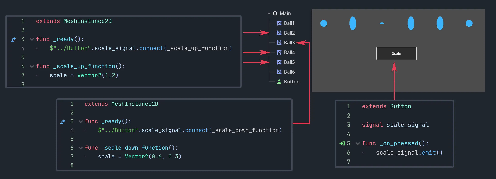
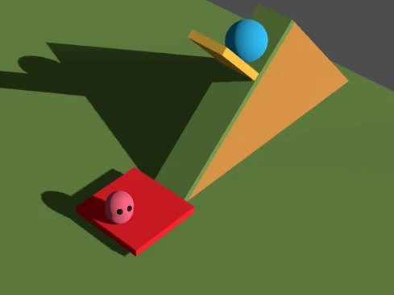

.. _doc_signals_concise_example:

Signals, concise example
========================

Signals are easy.

Make Signal (in sender):

.. tabs::
 .. code-tab:: gdscript GDScript

    signal SIGNALNAME

 .. code-tab:: csharp

     [Signal]
     public delegate void SignalNameEventHandler();

Emit Signal (in sender):

.. tabs::
 .. code-tab:: gdscript GDScript

    SIGNALNAME.emit(arg1, arg2, ...)

 .. code-tab:: csharp

     EmitSignal(SignalName.SignalName, arg1, arg2);

Connect Signal (in receivers):

.. tabs::
 .. code-tab:: gdscript GDScript

    sender.SIGNALNAME.connect(FUNCTIONNAME)

 .. code-tab:: csharp

    sender.SignalName += FunctionName;

Make functions (in receivers):

.. tabs::
 .. code-tab:: gdscript GDScript

    func FUNCTIONNAME(arg1, arg2, ...):

 .. code-tab:: csharp

    private void FunctionName(int arg1, int arg2)

Note that there can be multiple receivers receiving the same signal and each of them can have a different function for the same signal.

---------

Real-world simple example:

Goal: Rotate the **yellow gate** by sending a signal from the **red button**.

.. tabs::
 .. code-tab:: gdscript GDScript

    # red_button.gd
 
    extends Area3D
    signal red_trigger(degrees_sent : int, player_color_sent : Color)

    func _on_body_entered(body):
        if body == %Player:
            red_trigger.emit(90, Color.GOLD)

 .. code-tab:: csharp

    // RedButtonArea3D.cs

    using Godot;
    using System;

    public partial class RedButtonArea3D : Area3D
    {
        [Signal]
        public delegate void RedTriggerEventHandler(int degreesSent, Color playerColorSent);

        public override void _Ready()
        {
            BodyEntered += OnBodyEntered;
        }

        private void OnBodyEntered(Node body)
        {
            if (body == GetNode<CharacterBody3D>("%Player"))
            {
                EmitSignal(SignalName.RedTrigger, 90, Colors.Gold);
            }
        }
    }

---------

.. tabs::
 .. code-tab:: gdscript GDScript

    # yellow_gate.gd
 
    extends StaticBody3D

    func _ready():
        %RedButtonArea3D.red_trigger.connect(_on_red_trigger_press)

    func _on_red_trigger_press(degrees_received, player_color_received):
        rotation.x = -deg_to_rad(degrees_received)
        %"Player/Mesh".mesh.material.albedo_color = player_color_received

 .. code-tab:: csharp

    // YellowGate.cs

    using Godot;
    using System;

    public partial class YellowGate : StaticBody3D
    {
        public override void _Ready()
        {
            var redButtonArea = GetNode<RedButtonArea3D>("%RedButtonArea3D");
            redButtonArea.RedTrigger += OnRedTriggerPress;
        }

        private void OnRedTriggerPress(int degreesReceived, Color playerColorReceived)
        {
            Rotation = new Vector3(-Mathf.DegToRad(degreesReceived), Rotation.Y, Rotation.Z);
            var playerMesh = GetNode<MeshInstance3D>("%PlayerMesh");
            if (playerMesh.Mesh.SurfaceGetMaterial(0) is StandardMaterial3D material)
            {
                material.AlbedoColor = playerColorReceived;
            }
        }
    }

