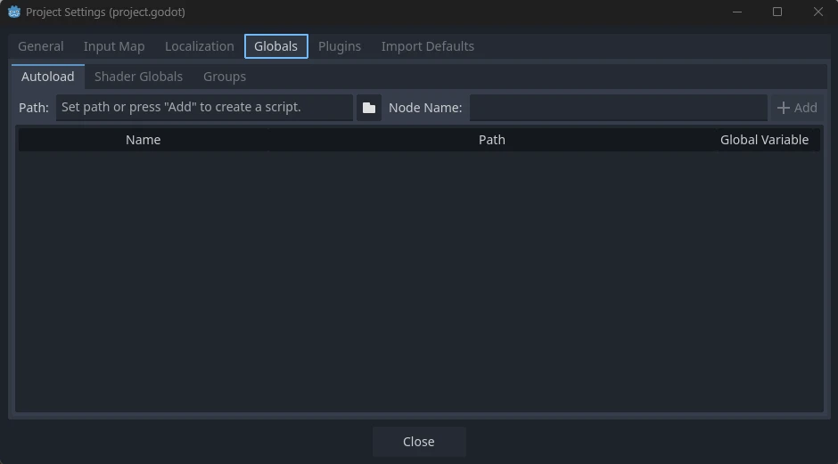
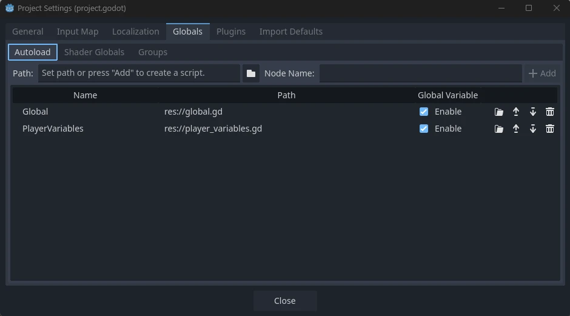
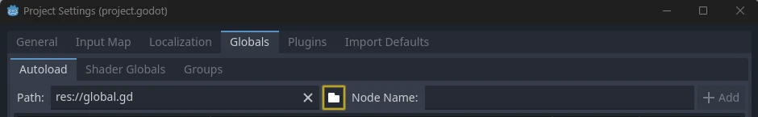

.. _doc_singletons_autoload:

Singletons (Autoload)
=====================

Introduction
------------

Godot's scene system, while powerful and flexible, has a drawback: there is no
method for storing information (e.g. a player's score or inventory) that is
needed by more than one scene.

It's possible to address this with some workarounds, but they come with their
own limitations:

-  You can use a "master" scene that loads and unloads other scenes as
   its children. However, this means you can no longer run those scenes
   individually and expect them to work correctly.
-  Information can be stored to disk in ``user://`` and then loaded by scenes
   that require it, but frequently saving and loading data is cumbersome and
   may be slow.

The `Singleton pattern <https://en.wikipedia.org/wiki/Singleton_pattern>`_ is
a useful tool for solving the common use case where you need to store
persistent information between scenes. In our case, it's possible to reuse the
same scene or class for multiple singletons as long as they have different
names.

Using this concept, you can create objects that:

- Are always loaded, no matter which scene is currently running.
- Can store global variables such as player information.
- Can handle switching scenes and between-scene transitions.
- *Act* like a singleton, since GDScript does not support global variables by design.

Autoloading nodes and scripts can give us these characteristics.

.. note::

    Godot won't make an Autoload a "true" singleton as per the singleton design
    pattern. It may still be instanced more than once by the user if desired.

.. tip::

    If you're creating an autoload as part of an editor plugin, consider
    :ref:`registering it automatically in the Project Settings <doc_making_plugins_autoload>`
    when the plugin is enabled.

Autoload
--------

You can create an Autoload to load a scene or a script that inherits from
:ref:`class_Node`.

.. note::

    When autoloading a script, a :ref:`class_Node` will be created and the script will be
    attached to it. This node will be added to the root viewport before any
    other scenes are loaded.

.. image:: img/singleton.webp

To autoload a scene or script, select **Project > Project Settings** from the
menu and switch to the **Autoload** tab.

Here you can add any number of scenes or scripts. Each entry in the list
requires a name, which is assigned as the node's ``name`` property. The order of
the entries as they are added to the global scene tree can be manipulated using
the up/down arrow keys. Like regular scenes, the engine will read these nodes
in top-to-bottom order.

If the **Enable** column is checked (which is the default), then the singleton can
be accessed directly in GDScript:

.. tabs::
 .. code-tab:: gdscript GDScript

   PlayerVariables.health -= 10

The **Enable** column has no effect in C# code. However, if the singleton is a
C# script, a similar effect can be achieved by including a static property
called ``Instance`` and assigning it in ``_Ready()``:

.. tabs::
 .. code-tab:: csharp

    public partial class PlayerVariables : Node
    {
        public static PlayerVariables Instance { get; private set; }

        public int Health { get; set; }

        public override void _Ready()
        {
            Instance = this;
        }
    }

This allows the singleton to be accessed from C# code without ``GetNode()`` and
without a typecast:

.. tabs::
 .. code-tab:: csharp

    PlayerVariables.Instance.Health -= 10;

Note that autoload objects (scripts and/or scenes) are accessed just like any
other node in the scene tree. In fact, if you look at the running scene tree,
you'll see the autoloaded nodes appear:

.. image:: img/autoload_runtime.webp

.. warning::

    Autoloads must **not** be removed using ``free()`` or ``queue_free()`` at
    runtime, or the engine will crash.

Custom scene switcher
---------------------

This tutorial will demonstrate building a scene switcher using autoloads.
For basic scene switching, you can use the
:ref:`SceneTree.change_scene_to_file() <class_SceneTree_method_change_scene_to_file>`
method (see :ref:`doc_scene_tree` for details). However, if you need more
complex behavior when changing scenes, this method provides more functionality.

To begin, download the template from here:
`singleton_autoload_starter.zip <https://github.com/godotengine/godot-docs-project-starters/releases/download/latest-4.x/singleton_autoload_starter.zip>`_
and open it in Godot.

The project contains two scenes: ``scene_1.tscn`` and ``scene_2.tscn``. Each
scene contains a label displaying the scene name and a button with its
``pressed()`` signal connected. When you run the project, it starts in
``scene_1.tscn``. However, pressing the button does nothing.

Creating the script
~~~~~~~~~~~~~~~~~~~~~

Open the **Script** window and create a new script called ``global.gd``.
Make sure it inherits from ``Node``:

.. image:: img/autoload_script.webp

The next step is to add this script to the autoLoad list. Open
**Project > Project Settings** from the menu, switch to the **Autoload** tab and
select the script by clicking the browse button or typing its path:
``res://global.gd``. Press **Add** to add it to the autoload list:

Now whenever we run any scene in the project, this script will always be loaded.

Returning to the script, it needs to fetch the current scene in the
`_ready()` function. Both the current scene (the one with the button) and
``global.gd`` are children of root, but autoloaded nodes are always first. This
means that the last child of root is always the loaded scene.

.. tabs::
 .. code-tab:: gdscript GDScript

    extends Node

    var current_scene = null

    func _ready():
        var root = get_tree().root
        current_scene = root.get_child(root.get_child_count() - 1)

 .. code-tab:: csharp

    using Godot;

    public partial class Global : Node
    {
        public Node CurrentScene { get; set; }

        public override void _Ready()
        {
            Viewport root = GetTree().Root;
            CurrentScene = root.GetChild(root.GetChildCount() - 1);
        }
    }

Now we need a function for changing the scene. This function needs to free the
current scene and replace it with the requested one.

.. tabs::
 .. code-tab:: gdscript GDScript

    func goto_scene(path):
        # This function will usually be called from a signal callback,
        # or some other function in the current scene.
        # Deleting the current scene at this point is
        # a bad idea, because it may still be executing code.
        # This will result in a crash or unexpected behavior.

        # The solution is to defer the load to a later time, when
        # we can be sure that no code from the current scene is running:

        call_deferred("_deferred_goto_scene", path)

    func _deferred_goto_scene(path):
        # It is now safe to remove the current scene.
        current_scene.free()

        # Load the new scene.
        var s = ResourceLoader.load(path)

        # Instance the new scene.
        current_scene = s.instantiate()

        # Add it to the active scene, as child of root.
        get_tree().root.add_child(current_scene)

        # Optionally, to make it compatible with the SceneTree.change_scene_to_file() API.
        get_tree().current_scene = current_scene

 .. code-tab:: csharp

    public void GotoScene(string path)
    {
        // This function will usually be called from a signal callback,
        // or some other function from the current scene.
        // Deleting the current scene at this point is
        // a bad idea, because it may still be executing code.
        // This will result in a crash or unexpected behavior.

        // The solution is to defer the load to a later time, when
        // we can be sure that no code from the current scene is running:

        CallDeferred(MethodName.DeferredGotoScene, path);
    }

    public void DeferredGotoScene(string path)
    {
        // It is now safe to remove the current scene.
        CurrentScene.Free();

        // Load a new scene.
        var nextScene = GD.Load<PackedScene>(path);

        // Instance the new scene.
        CurrentScene = nextScene.Instantiate();

        // Add it to the active scene, as child of root.
        GetTree().Root.AddChild(CurrentScene);

        // Optionally, to make it compatible with the SceneTree.change_scene_to_file() API.
        GetTree().CurrentScene = CurrentScene;
    }

Using :ref:`Object.call_deferred() <class_Object_method_call_deferred>`,
the second function will only run once all code from the current scene has
completed. Thus, the current scene will not be removed while it is
still being used (i.e. its code is still running).

Finally, we need to fill the empty callback functions in the two scenes:

.. tabs::
 .. code-tab:: gdscript GDScript

    # Add to 'scene_1.gd'.

    func _on_button_pressed():
        Global.goto_scene("res://scene_2.tscn")

 .. code-tab:: csharp

    // Add to 'Scene1.cs'.

    private void OnButtonPressed()
    {
        var global = GetNode<Global>("/root/Global");
        global.GotoScene("res://Scene2.tscn");
    }

and

.. tabs::
 .. code-tab:: gdscript GDScript

    # Add to 'scene_2.gd'.

    func _on_button_pressed():
        Global.goto_scene("res://scene_1.tscn")

 .. code-tab:: csharp

    // Add to 'Scene2.cs'.

    private void OnButtonPressed()
    {
        var global = GetNode<Global>("/root/Global");
        global.GotoScene("res://Scene1.tscn");
    }

Run the project and test that you can switch between scenes by pressing
the button.

.. note::

    When scenes are small, the transition is instantaneous. However, if your
    scenes are more complex, they may take a noticeable amount of time to appear.
    To learn how to handle this, see the next tutorial: :ref:`doc_background_loading`.

    Alternatively, if the loading time is relatively short (less than 3 seconds or so),
    you can display a "loading plaque" by showing some kind of 2D element just before
    changing the scene. You can then hide it just after the scene is changed. This can
    be used to indicate to the player that a scene is being loaded.
