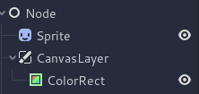
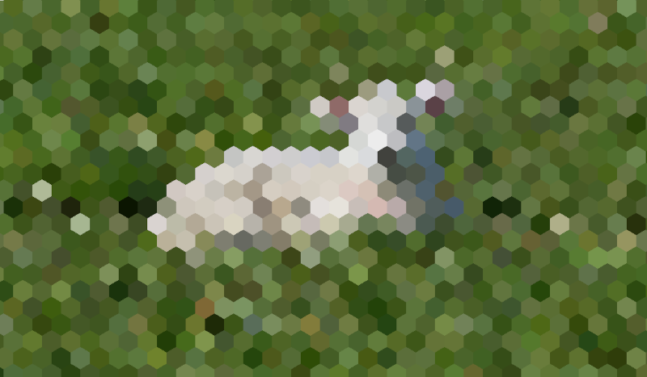
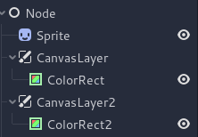

.. _doc_custom_postprocessing:

Custom post-processing
======================

Introduction
------------

Godot provides many post-processing effects out of the box, including Bloom,
DOF, and SSAO, which are described in :ref:`doc_environment_and_post_processing`.
However, advanced use cases may require custom effects. This article explains how
to write your own custom effects.

The easiest way to implement a custom post-processing shader is to use Godot's
built-in ability to read from the screen texture. If you're not familiar with
this, you should read the
:ref:`Screen Reading Shaders Tutorial <doc_screen-reading_shaders>` first.

Single pass post-processing
---------------------------

Post-processing effects are shaders applied to a frame after Godot has rendered
it. To apply a shader to a frame, create a :ref:`CanvasLayer
<class_CanvasLayer>`, and give it a :ref:`ColorRect <class_ColorRect>`. Assign a
new :ref:`ShaderMaterial <class_ShaderMaterial>` to the newly created
``ColorRect``, and set the ``ColorRect``'s layout to "Full Rect".

Your scene tree will look something like this:

.. note::

   Another more efficient method is to use a :ref:`BackBufferCopy
   <class_BackBufferCopy>` to copy a region of the screen to a buffer and to
   access it in a shader script through a ``sampler2D`` using
   ``hint_screen_texture``.

.. note::

    As of the time of writing, Godot does not support rendering to multiple
    buffers at the same time. Your post-processing shader will not have access
    to other render passes and buffers not exposed by Godot (such as depth or
    normal/roughness). You only have access to the rendered frame and buffers
    exposed by Godot as samplers.

For this demo, we will use this :ref:`Sprite <class_Sprite2D>` of a sheep.

Assign a new :ref:`Shader <class_Shader>` to the ``ColorRect``'s
``ShaderMaterial``. You can access the frame's texture and UV with a
``sampler2D`` using ``hint_screen_texture`` and the built in ``SCREEN_UV``
uniforms.

Copy the following code to your shader. The code below is a hex pixelization
shader by `arlez80 <https://bitbucket.org/arlez80/hex-mosaic/src/master/>`_,

.. code-block:: glsl

    shader_type canvas_item;

    uniform vec2 size = vec2(32.0, 28.0);
    // If you intend to read from mipmaps with `textureLod()` LOD values greater than `0.0`,
    // use `filter_nearest_mipmap` instead. This shader doesn't require it.
    uniform sampler2D screen_texture : hint_screen_texture, repeat_disable, filter_nearest;

    void fragment() {
            vec2 norm_size = size * SCREEN_PIXEL_SIZE;
            bool half = mod(SCREEN_UV.y / 2.0, norm_size.y) / norm_size.y < 0.5;
            vec2 uv = SCREEN_UV + vec2(norm_size.x * 0.5 * float(half), 0.0);
            vec2 center_uv = floor(uv / norm_size) * norm_size;
            vec2 norm_uv = mod(uv, norm_size) / norm_size;
            center_uv += mix(vec2(0.0, 0.0),
                             mix(mix(vec2(norm_size.x, -norm_size.y),
                                     vec2(0.0, -norm_size.y),
                                     float(norm_uv.x < 0.5)),
                                 mix(vec2(0.0, -norm_size.y),
                                     vec2(-norm_size.x, -norm_size.y),
                                     float(norm_uv.x < 0.5)),
                                 float(half)),
                             float(norm_uv.y < 0.3333333) * float(norm_uv.y / 0.3333333 < (abs(norm_uv.x - 0.5) * 2.0)));

            COLOR = textureLod(screen_texture, center_uv, 0.0);
    }

The sheep will look something like this:

Multi-pass post-processing
--------------------------

Some post-processing effects like blurs are resource intensive. You can make
them run a lot faster if you break them down in multiple passes. In a multipass
material, each pass takes the result from the previous pass as an input and
processes it.

To produce a multi-pass post-processing shader, you stack ``CanvasLayer`` and
``ColorRect`` nodes. In the example above, you use a ``CanvasLayer`` object to
render a shader using the frame on the layer below. Apart from the node
structure, the steps are the same as with the single-pass post-processing
shader.

Your scene tree will look something like this:

As an example, you could write a full screen Gaussian blur effect by attaching
the following pieces of code to each of the ``ColorRect`` nodes. The order in
which you apply the shaders depends on the position of the ``CanvasLayer`` in
the scene tree, higher means sooner. For this blur shader, the order does not
matter.

.. code-block:: glsl

    shader_type canvas_item;

    uniform sampler2D screen_texture : hint_screen_texture, repeat_disable, filter_nearest;

    // Blurs the screen in the X-direction.
    void fragment() {
        vec3 col = texture(screen_texture, SCREEN_UV).xyz * 0.16;
        col += texture(screen_texture, SCREEN_UV + vec2(SCREEN_PIXEL_SIZE.x, 0.0)).xyz * 0.15;
        col += texture(screen_texture, SCREEN_UV + vec2(-SCREEN_PIXEL_SIZE.x, 0.0)).xyz * 0.15;
        col += texture(screen_texture, SCREEN_UV + vec2(2.0 * SCREEN_PIXEL_SIZE.x, 0.0)).xyz * 0.12;
        col += texture(screen_texture, SCREEN_UV + vec2(2.0 * -SCREEN_PIXEL_SIZE.x, 0.0)).xyz * 0.12;
        col += texture(screen_texture, SCREEN_UV + vec2(3.0 * SCREEN_PIXEL_SIZE.x, 0.0)).xyz * 0.09;
        col += texture(screen_texture, SCREEN_UV + vec2(3.0 * -SCREEN_PIXEL_SIZE.x, 0.0)).xyz * 0.09;
        col += texture(screen_texture, SCREEN_UV + vec2(4.0 * SCREEN_PIXEL_SIZE.x, 0.0)).xyz * 0.05;
        col += texture(screen_texture, SCREEN_UV + vec2(4.0 * -SCREEN_PIXEL_SIZE.x, 0.0)).xyz * 0.05;
        COLOR.xyz = col;
    }

.. code-block:: glsl

    shader_type canvas_item;

    uniform sampler2D screen_texture : hint_screen_texture, repeat_disable, filter_nearest;

    // Blurs the screen in the Y-direction.
    void fragment() {
        vec3 col = texture(screen_texture, SCREEN_UV).xyz * 0.16;
        col += texture(screen_texture, SCREEN_UV + vec2(0.0, SCREEN_PIXEL_SIZE.y)).xyz * 0.15;
        col += texture(screen_texture, SCREEN_UV + vec2(0.0, -SCREEN_PIXEL_SIZE.y)).xyz * 0.15;
        col += texture(screen_texture, SCREEN_UV + vec2(0.0, 2.0 * SCREEN_PIXEL_SIZE.y)).xyz * 0.12;
        col += texture(screen_texture, SCREEN_UV + vec2(0.0, 2.0 * -SCREEN_PIXEL_SIZE.y)).xyz * 0.12;
        col += texture(screen_texture, SCREEN_UV + vec2(0.0, 3.0 * SCREEN_PIXEL_SIZE.y)).xyz * 0.09;
        col += texture(screen_texture, SCREEN_UV + vec2(0.0, 3.0 * -SCREEN_PIXEL_SIZE.y)).xyz * 0.09;
        col += texture(screen_texture, SCREEN_UV + vec2(0.0, 4.0 * SCREEN_PIXEL_SIZE.y)).xyz * 0.05;
        col += texture(screen_texture, SCREEN_UV + vec2(0.0, 4.0 * -SCREEN_PIXEL_SIZE.y)).xyz * 0.05;
        COLOR.xyz = col;
    }

Using the above code, you should end up with a full screen blur effect like
below.

