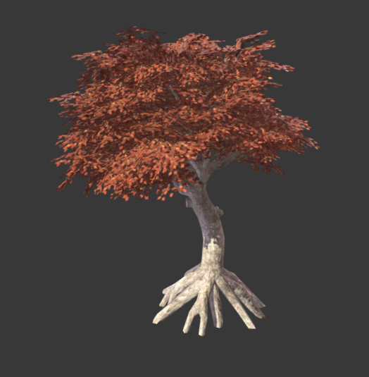
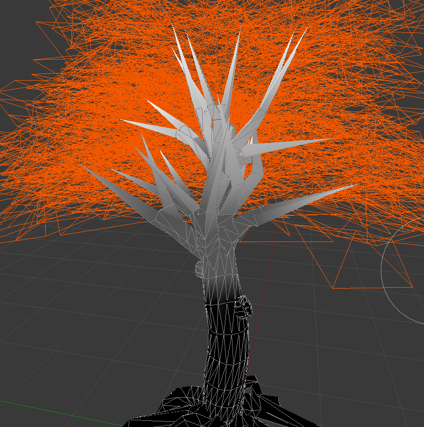
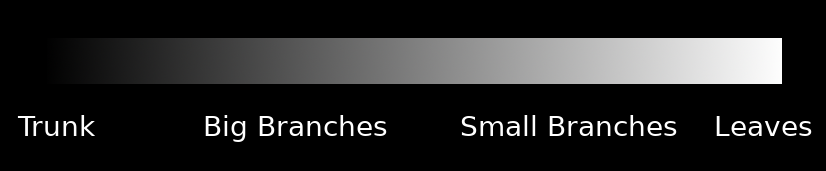

.. _doc_making_trees:

Making trees
============

This is a short tutorial on how to shade trees and other types of vegetation from scratch.

The aim is to not focus on the modeling techniques (there are plenty of tutorials about that),
but how to make them look good in Godot.

.. image:: img/tree_sway.gif

Start with a tree
-----------------

Let's take `this tree from SketchFab <https://sketchfab.com/3d-models/tree-ea5e6ed7f9d6445ba69589d503e8cebf>`__
as an example:

Paint with vertex colors
------------------------

We will open this model in `Blender <https://www.blender.org/>`__.
Other 3D modeling software will likely work for this, too.

.. The first thing you may want to do is to use the vertex colors to paint how much
.. the tree will sway when there is wind. Just use the vertex color painting tool of your favorite
.. 3D modeling program and paint something like this:

Each vertex in a mesh can store one color.

The idea is to paint .
The more intense the color, the more the vertex will deviate from its original position.
Inside Blender, select the :ui:`Vertex Paint` tool.

So start painting leaves a vibrant white, and the branches a bit gray.
You'll probably want to keep the trunk as is.
The wind can't be *that* strong, can it?

This is a bit exaggerated, but the idea is that color indicates how much sway
affects every part of the tree.

The following gradient represents this nicely:

Write a custom shader for the leaves
------------------------------------

Let's start by writing a few options:

.. code-block:: glsl

    shader_type spatial;
    render_mode cull_disabled, depth_prepass_alpha, world_vertex_coords;

First of all, since we're working in 3D, this will be a :ref:`spatial shader <doc_spatial_shader>`.
Here's why we need each of those render modes:

- ``cull_disabled`` allows both the front and back faces of leaves to be rendered.
  Without it, leaves will only be visible on one face.
- ``depth_prepass_alpha`` will generally reduce issues with depth and transparency,
  as well as allow the leaves cast shadows.
- ``world_vertex_coords`` shifts the vertex coordinates to be in world space.
  This way, the ``VERTEX`` built-in variable, which we'll need later, will be relative to the world,
  instead of being relative to each individual tree.
  It's not strict necessary, but it will allow the leaves of each tree to sway differently from another.

.. code-block:: glsl

    uniform sampler2D texture_albedo : source_color;
    uniform vec4 transmission : source_color;

Here, the texture is read, as well as a transmission color,
which is used to add some back-lighting to the leaves, simulating subsurface scattering.

.. code-block:: glsl

    uniform float sway_speed = 1.0;
    uniform float sway_strength = 0.05;
    uniform float sway_phase_len = 8.0;

    void vertex() {
        float strength = COLOR.r * sway_strength;
        VERTEX.x += sin(VERTEX.x * sway_phase_len * 1.123 + TIME * sway_speed) * strength;
        VERTEX.y += sin(VERTEX.y * sway_phase_len + TIME * sway_speed * 1.12412) * strength;
        VERTEX.z += sin(VERTEX.z * sway_phase_len * 0.9123 + TIME * sway_speed * 1.3123) * strength;
    }

This is the code that makes the tree sway. In summary, for each axis,
a sinewave is multiplied slightly differently by the time, so that the axes don't appear in sync.
Also notice that the strength is multiplied by the vertex color.

Finally, all that's left is the fragment function:

.. code-block:: glsl

    void fragment() {
        vec4 albedo_tex = texture(texture_albedo, UV);
        ALBEDO = albedo_tex.rgb;
        ALPHA = albedo_tex.a;
        METALLIC = 0.0;
        ROUGHNESS = 1.0;
        SSS_TRANSMITTANCE_COLOR = transmission.rgba;
    }

And this is pretty much it.

The trunk shader is similar, except it does not write to the alpha channel
(thus no alpha prepass is needed) and does not require transmission to work.
Both shaders could be improved by adding normal mapping, AO, and other maps.

Improving the shader
--------------------

There are many more resources on how to do this that you can read.
Now that you know the basics, a recommended read is the chapter
from `GPU Gems3 about how Crysis does this <https://developer.nvidia.com/gpugems/GPUGems3/gpugems3_ch16.html>`_
(focus mostly on the sway code, as many other techniques shown there are obsolete).

