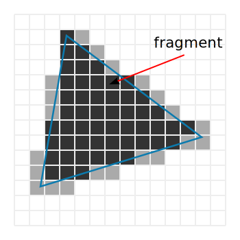

.. _doc_rendering_pipeline:

The rendering pipeline
======================

When you play a game, every 3D object in your scene — a
character, a terrain, a particle effect — appears on screen as a flat image.
To get there, the GPU works like an assembly line: raw data goes in (meshes,
textures, material parameters) and pixels come out. Each piece of data passes
through a fixed sequence of stages, one after another. That sequence is the
**rendering pipeline**.

Low-level graphics APIs — like Vulkan, OpenGL, Direct3D, or Metal — expose the pipeline
in full detail and require you to
configure every stage yourself. Godot abstracts all of this: you place
objects in a scene, assign materials, and the engine handles the rest.

Still, a high-level understanding of what happens inside the GPU helps you
in several ways:

- Abstractions are easier to work with when you understand what they
  abstract.
- Performance is easier to optimize when you understand where the GPU spends
  its time.
- Godot's rendering options — like spatial shader ``render_mode`` settings —
  map directly to pipeline stages. Knowing the pipeline makes those options
  intuitive.

What you see on screen
----------------------

A **frame** is a single game image displayed on screen. Games display many frames
per second (often 60 or more) to create the illusion of motion. Each frame is a complete
picture of the scene from the camera's point of view.

A **mesh** is a 3D surface made of triangles — it defines the shape of
objects on screen. Characters, trees, buildings, and terrain are all
meshes. Each triangle is defined by three **vertices**: points in 3D space.
Every vertex carries data called **attributes**:

- **Position** — the vertex's location in 3D space, stored as three
  coordinates (x, y, z).
- **Normal** — the direction the surface faces at that vertex, used for
  lighting. A surface facing a light source appears bright; a surface facing
  away appears dark.
- **UV** — a 2D coordinate that tells the GPU which point in a texture image
  corresponds to this vertex. The UVs of a triangle's three vertices
  determine how the texture stretches across its surface.

The CPU and the GPU
-------------------

Your computer uses two processors to produce each frame.

The **CPU** (Central Processing Unit) runs your game logic. In Godot, that means GDScript and C#
scripts, physics simulation, navigation, animation, and scene tree
management. Once the game state is up to date, the CPU prepares the
rendering work: it collects the visible meshes, their materials, their
positions, then sends all of it to the GPU.

The **GPU** (Graphics Processing Unit) contains thousands of small cores
designed to run the same operation on many vertices or pixels at once. It
receives that data and produces the frame.

The CPU and the GPU work in parallel. The CPU does not wait for the GPU to
finish drawing a frame before it prepares the next one. This overlap keeps
both processors busy and enables real-time performance.

Draw calls
~~~~~~~~~~

To produce each frame, the CPU sends commands to the GPU. Each command says:
"render these triangles, using this shader, these textures, and these
parameters (transforms, colors, etc.)." That command is a **draw call**.

Godot issues draw calls automatically. Every frame, the engine walks through
the visible objects in the scene and issues one draw call per material on
each object. A character with separate materials for skin, hair, and clothing
produces three draw calls. A typical 3D scene accumulates hundreds to
thousands of draw calls per frame.

Each draw call costs CPU time to prepare and submit, so the draw call count
is a key performance metric. You can see it in the Godot 3D editor (Perspective
> View
information).

.. note::

   Mesh data and textures are uploaded to GPU memory once, when the resource
   is loaded. Draw calls reference that data — they do not resend it. What
   the CPU sends each frame is the commands themselves and per-frame
   parameters like each object's current transform.

The pipeline stages
-------------------

Each draw call sends a set of triangles through a sequence of stages. Some
stages run code that you can write or customize — that code is called a
**shader**. Other stages are fixed operations performed by the hardware.

Here are the main stages:

1. **Vertex processing** — converts each vertex from its 3D position to a 2D
   screen position *(programmable: vertex shader)*
2. **Rasterization** — determines which pixels each triangle covers
   *(fixed hardware)*
3. **Fragment processing** — computes the color of each covered pixel
   *(programmable: fragment shader)*
4. **Output merging** — decides whether and how each pixel reaches the frame
   *(configurable)*

The rest of this page details each stage.

Vertex processing
~~~~~~~~~~~~~~~~~

The GPU runs the **vertex shader** once per vertex. A mesh with 300 vertices
triggers 300 vertex shader runs — all executed in parallel.

The vertex shader's main role is to convert each vertex's position from its
original 3D position to a final position on screen. This conversion goes
through several **coordinate spaces**:

- **Local space** — the mesh's own coordinate system, centered on its
  origin. A 5m tree modeled in a 3D tool is defined in local space: the base of
  the trunk might be at (0, 0, 0) and the top at (0, 5, 0), regardless of
  where the tree stands in the game world.
- **World space** — the shared coordinate system of the entire scene. When
  you move a :ref:`Node3D <class_Node3D>` in the editor, you change its
  world-space position. Three instances of the same tree mesh placed in a
  scene each have different world-space coordinates even though they share
  the same local-space geometry.
- **View space** (or camera space) — the coordinate system where the camera
  is at the origin. Every vertex position is measured from the camera: how
  far in front, how far to the side, how far up or down. The same tree
  placed 20 meters ahead of the camera has a view-space depth of 20,
  regardless of where the camera or the tree sit in world space.
- **Clip space** — the coordinate system that flattens the 3D scene into a
  2D image. The camera's viewing angle and distance limits define a visible
  volume; everything outside that volume is discarded. Clip space still has
  a depth component — the GPU uses it later for depth testing — but the
  perspective effect is already applied: distant vertices are pushed closer
  together. After this step, the GPU converts clip-space positions to
  **screen coordinates** (pixel positions on the display).

The vertex shader is a complete program that transforms each vertex from
local space all the way to clip space. It also forwards vertex attributes
(normals, UVs, colors) to later stages.

In Godot, the engine handles the full coordinate transformation
automatically. Rather than writing a standalone vertex shader program, you
write a ``vertex()`` function that can modify vertex data before the
transformation — for example, offsetting positions each frame to animate a
waving flag. See :ref:`doc_introduction_to_shaders` for how Godot's shader
system works.

Rasterization
~~~~~~~~~~~~~

After projection, the GPU has flat 2D triangles in screen coordinates. The
**rasterizer** checks which screen pixels each triangle covers. Every covered
pixel becomes a **fragment**.

.. note::

   A **fragment** is a key concept. It is a pixel-sized sample of a triangle,
   not yet a final pixel. A single screen pixel may receive multiple
   fragments from different overlapping triangles. Later stages determine
   how they are trimmed or combined to produce the final pixel.

Rasterization is a fixed hardware stage — you do not write code for it.

The rasterizer also performs **face culling**: triangles facing away from the
camera are skipped by default, since they represent the back side of a
surface. In Godot, you can disable this with the spatial shader's
``cull_disabled`` render mode.

The number of fragments the rasterizer produces directly drives the cost of
the next stage. The same triangle seen from far away might cover only a
handful of pixels and produce few fragments. Seen up close, it can fill a
large part of the screen and produce millions.

    The rasterizer checks which pixels each triangle covers. Each covered
    pixel becomes a fragment.

Interpolation
~~~~~~~~~~~~~

The fragment shader expects attribute values (UVs, normals, colors) for each
fragment, but those values are defined per vertex, not per pixel. The GPU **interpolates** them
automatically: it blends each vertex's values based on the fragment's
position within the triangle.

A fragment near one vertex gets values close to that vertex. A fragment at
the center gets a roughly equal blend of all three. This is why a texture
appears smooth across a triangle even though UV coordinates exist at the
corners only.

Fragment processing
~~~~~~~~~~~~~~~~~~~

The GPU runs the **fragment shader** once per fragment. It receives the
interpolated attributes and computes a color. This is where texture lookups,
lighting, and visual effects happen.

The GPU processes thousands of fragments in parallel — this is what makes
real-time rendering fast. Because of this parallelism, each fragment runs in
isolation, with no access to neighboring fragments.

In Godot, the ``fragment()`` shader function handles this stage. Godot also
runs a separate ``light()`` function per fragment and per light for lighting.

.. note::

   On the GPU, the vertex shader and the fragment shader are separate
   programs. To pass data from one to the other, you declare
   **varyings** — variables that the vertex shader writes and the fragment
   shader reads, with the GPU interpolating them in between. In Godot, the
   built-in varyings (``VERTEX``, ``NORMAL``, ``UV``, ``COLOR``) are passed
   automatically. You can also declare custom ones with the ``varying``
   keyword.

Because screens contain far more pixels than meshes have vertices, fragment
processing is usually the most expensive stage. A mesh with 500 vertices
might cover 100,000 pixels on screen — each one triggers a fragment shader
run.

Output merging
~~~~~~~~~~~~~~

After the fragment shader produces a color, the GPU decides whether that
fragment reaches the final frame. This happens through a series of tests,
and results are written into the **framebuffer**.

A framebuffer is like a grid the size of your screen, where each cell
corresponds to one pixel. Each cell stores several values:

- A **color** — the pixel's visible color on screen.
- A **depth** — how far the closest drawn fragment is from the camera.

The GPU uses these stored values to test each incoming fragment before
writing it.

**Depth testing.** When a new fragment arrives, the GPU compares its depth
against the depth already in the framebuffer. If something closer was already
drawn at that pixel, the new fragment is discarded. Otherwise, it replaces
the stored depth and color.

Depth testing lets opaque objects hide each other regardless of draw order.
In Godot, you can disable it with the spatial shader's
``depth_test_disabled`` render mode.

**Stencil testing.** The framebuffer can also store a **stencil** value per
pixel: an integer that shaders write to and test against. This enables
masking effects — for example, only drawing a scene inside a portal's
outline. In Godot, spatial shaders expose stencil operations through
dedicated render modes.

**Blending.** For opaque objects, the fragment's color replaces whatever
was in the framebuffer. Transparent objects work differently: their color
**blends** with the existing color, weighted by an alpha value.

Transparency requires the GPU to draw objects **back-to-front**. The depth
test cannot help here — a transparent surface does not fully hide what is
behind it, so depth testing would discard fragments that should still be
visible. This sorting requirement makes transparent objects more expensive
than opaque ones. In Godot, spatial shaders control blending with render
modes like ``blend_mix`` and ``blend_add``.

Once all draw calls for a frame are complete, the framebuffer holds the
finished image. The GPU sends it to the display, and the process starts over
for the next frame.

Key takeaways
-------------

- A **frame** is one complete game image. The CPU and GPU work in parallel to
  produce many frames per second.

- A **draw call** is a CPU command that tells the GPU to render a batch of
  triangles. Godot issues them automatically — roughly one per material per visible
  object.

- A **fragment** is a pixel-sized sample of a triangle — not yet a final
  pixel. One screen pixel is built from one or more fragments.

- **Vertex shaders** run per vertex. **Fragment shaders** run per covered
  pixel. Fragment shaders usually dominate rendering cost.

- The **depth buffer** lets opaque objects hide each other automatically.
  Transparent objects bypass this and need back-to-front sorting.

- Godot's ``vertex()`` and ``fragment()`` shader functions map to the vertex
  and fragment processing stages. Many spatial shader ``render_mode`` options
  — ``depth_test_disabled``, ``cull_disabled``, ``blend_add`` — configure
  specific pipeline stages described on this page.
