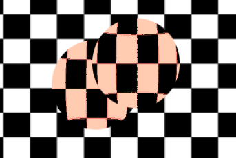
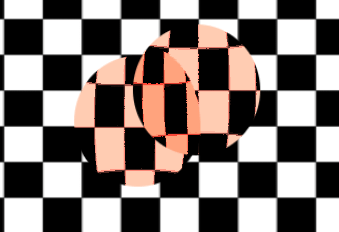

.. _doc_screen-reading_shaders:

Screen-reading shaders
======================

Introduction
~~~~~~~~~~~~

It is often desired to make a shader that reads from the same
screen to which it's writing. 3D APIs, such as OpenGL or DirectX, make this very
difficult because of internal hardware limitations. GPUs are extremely
parallel, so reading and writing causes all sorts of cache and coherency
problems. As a result, not even the most modern hardware supports this
properly.

The workaround is to make a copy of the screen, or a part of the screen,
to a back-buffer and then read from it while drawing. Godot provides a
few tools that make this process easy.

Screen texture
~~~~~~~~~~~~~~

Godot :ref:`doc_shading_language` has a special texture to access the already
rendered contents of the screen. It is used by specifying a hint when declaring
a ``sampler2D`` uniform: ``hint_screen_texture``. A special built-in varying
``SCREEN_UV`` can be used to obtain the UV relative to the screen for the current
fragment. As a result, this canvas_item fragment shader results in an invisible
object, because it only shows what lies behind:

.. code-block:: glsl

    shader_type canvas_item;

    uniform sampler2D screen_texture : hint_screen_texture, repeat_disable, filter_nearest;

    void fragment() {
        COLOR = textureLod(screen_texture, SCREEN_UV, 0.0);
    }

``textureLod`` is used here as we only want to read from the bottom mipmap. If
you want to read from a blurred version of the texture instead, you can increase
the third argument to ``textureLod`` and change the hint ``filter_nearest`` to
``filter_nearest_mipmap`` (or any other filter with mipmaps enabled). If using a
filter with mipmaps, Godot will automatically calculate the blurred texture for
you.

.. warning::

    If the filter mode is not changed to a filter mode that contains ``mipmap`` in its name,
    ``textureLod`` with a LOD parameter greater than ``0.0`` will have the same appearance
    as with the ``0.0`` LOD parameter.

Screen texture example
~~~~~~~~~~~~~~~~~~~~~~

The screen texture can be used for many things. There is a
special demo for *Screen Space Shaders*, that you can download to see
and learn. One example is a simple shader to adjust brightness, contrast
and saturation:

.. code-block:: glsl

    shader_type canvas_item;

    uniform sampler2D screen_texture : hint_screen_texture, repeat_disable, filter_nearest;

    uniform float brightness = 1.0;
    uniform float contrast = 1.0;
    uniform float saturation = 1.0;

    void fragment() {
        vec3 c = textureLod(screen_texture, SCREEN_UV, 0.0).rgb;

        c.rgb = mix(vec3(0.0), c.rgb, brightness);
        c.rgb = mix(vec3(0.5), c.rgb, contrast);
        c.rgb = mix(vec3(dot(vec3(1.0), c.rgb) * 0.33333), c.rgb, saturation);

        COLOR.rgb = c;
    }

Behind the scenes
~~~~~~~~~~~~~~~~~

While this seems magical, it's not. In 2D, when ``hint_screen_texture`` is first
found in a node that is about to be drawn, Godot does a full-screen copy to a
back-buffer. Subsequent nodes that use it in shaders will not have the screen
copied for them, because this ends up being inefficient. In 3D, the screen is
copied after the opaque geometry pass, but before the transparent geometry pass,
so transparent objects will not be captured in the screen texture.

As a result, in 2D, if shaders that use ``hint_screen_texture`` overlap, the
second one will not use the result of the first one, resulting in unexpected
visuals:

In the above image, the second sphere (top right) is using the same source for
the screen texture as the first one below, so the first one "disappears", or is
not visible.

In 2D, this can be corrected via the :ref:`BackBufferCopy <class_BackBufferCopy>`
node, which can be instantiated between both spheres. BackBufferCopy can work by
either specifying a screen region or the whole screen:

.. image:: img/texscreen_bbc.png

With correct back-buffer copying, the two spheres blend correctly:

.. warning::

    In 3D, materials that use ``hint_screen_texture`` are considered transparent themselves and
    will not appear in the resulting screen texture of other materials.
    If you plan to instance a scene that uses a material with ``hint_screen_texture``,
    you will need to use a BackBufferCopy node.

In 3D, there is less flexibility to solve this particular issue because the
screen texture is only captured once. Be careful when using the screen texture
in 3D as it won't capture transparent objects and may capture some opaque
objects that are in front of the object using the screen texture.

You can reproduce the back-buffer logic in 3D by creating a :ref:`Viewport <class_Viewport>`
with a camera in the same position as your object, and then use the
:ref:`Viewport's <class_Viewport>` texture instead of the screen texture.

Back-buffer logic
~~~~~~~~~~~~~~~~~

So, to make it clearer, here's how the backbuffer copying logic works in 2D in
Godot:

-  If a node uses ``hint_screen_texture``, the entire screen is copied to the
   back buffer before drawing that node. This only happens the first
   time; subsequent nodes do not trigger this.
-  If a BackBufferCopy node was processed before the situation in the point
   above (even if ``hint_screen_texture`` was not used), the behavior described
   in the point above does not happen. In other words, automatic copying of the
   entire screen only happens if ``hint_screen_texture`` is used in a node for
   the first time and no BackBufferCopy node (not disabled) was found before in
   tree-order.
-  BackBufferCopy can copy either the entire screen or a region. If set to only
   a region (not the whole screen) and your shader uses pixels not in the region
   copied, the result of that read is undefined (most likely garbage from
   previous frames). In other words, it's possible to use BackBufferCopy to copy
   back a region of the screen and then read the screen texture from a different
   region. Avoid this behavior!

Depth texture
~~~~~~~~~~~~~

For 3D shaders, it's also possible to access the screen depth buffer. For this,
the ``hint_depth_texture`` hint is used. This texture is not linear; it must be
converted using the inverse projection matrix.

The following code retrieves the 3D position below the pixel being drawn:

.. code-block:: glsl

    uniform sampler2D depth_texture : hint_depth_texture, repeat_disable, filter_nearest;

    void fragment() {
        float depth = textureLod(depth_texture, SCREEN_UV, 0.0).r;
        vec4 upos = INV_PROJECTION_MATRIX * vec4(SCREEN_UV * 2.0 - 1.0, depth, 1.0);
        vec3 pixel_position = upos.xyz / upos.w;
    }

Normal-roughness texture
~~~~~~~~~~~~~~~~~~~~~~~~

.. note::

    Normal-roughness texture is only supported in the Forward+ rendering method,
    not Mobile or Compatibility.

Similarly, the normal-roughness texture can be used to read the normals and
roughness of objects rendered in the depth prepass. The normal is stored in the
``.xyz`` channels (mapped to the 0-1 range) while the roughness is stored in the
``.w`` channel.

.. code-block:: glsl

    uniform sampler2D normal_roughness_texture : hint_normal_roughness_texture, repeat_disable, filter_nearest;

    void fragment() {
        float screen_roughness = texture(normal_roughness_texture, SCREEN_UV).w;
        vec3 screen_normal = texture(normal_roughness_texture, SCREEN_UV).xyz;
        screen_normal = screen_normal * 2.0 - 1.0;

Redefining screen textures
~~~~~~~~~~~~~~~~~~~~~~~~~~

The screen texture hints (``hint_screen_texture``, ``hint_depth_texture``, and
``hint_normal_roughness_texture``) can be used with multiple uniforms. For
example, you may want to read from the texture multiple times with a different
repeat flag or filter flag.

The following example shows a shader that reads the screen space normal with
linear filtering, but reads the screen space roughness using nearest neighbor
filtering.

.. code-block:: glsl

    uniform sampler2D normal_roughness_texture : hint_normal_roughness_texture, repeat_disable, filter_nearest;
    uniform sampler2D normal_roughness_texture2 : hint_normal_roughness_texture, repeat_enable, filter_linear;

    void fragment() {
        float screen_roughness = texture(normal_roughness_texture, SCREEN_UV).w;
        vec3 screen_normal = texture(normal_roughness_texture2, SCREEN_UV).xyz;
        screen_normal = screen_normal * 2.0 - 1.0;
