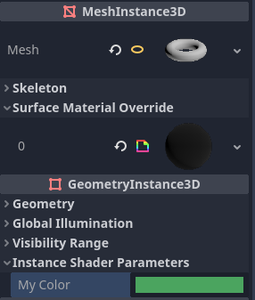

.. _doc_shading_language:

Shading language
================

Introduction
------------

Godot uses a shading language similar to GLSL ES 3.0. Most datatypes and
functions are supported, and the few remaining ones will likely be added over
time.

If you are already familiar with GLSL, the :ref:`Godot Shader Migration
Guide<doc_converting_glsl_to_godot_shaders>` is a resource that will help you
transition from regular GLSL to Godot's shading language.

Data types
----------

Most GLSL ES 3.0 datatypes are supported:

+----------------------+---------------------------------------------------------------------------------+
| Type                 | Description                                                                     |
+======================+=================================================================================+
| **void**             | Void datatype, useful only for functions that return nothing.                   |
+----------------------+---------------------------------------------------------------------------------+
| **bool**             | Boolean datatype, can only contain ``true`` or ``false``.                       |
+----------------------+---------------------------------------------------------------------------------+
| **bvec2**            | Two-component vector of booleans.                                               |
+----------------------+---------------------------------------------------------------------------------+
| **bvec3**            | Three-component vector of booleans.                                             |
+----------------------+---------------------------------------------------------------------------------+
| **bvec4**            | Four-component vector of booleans.                                              |
+----------------------+---------------------------------------------------------------------------------+
| **int**              | Signed scalar integer.                                                          |
+----------------------+---------------------------------------------------------------------------------+
| **ivec2**            | Two-component vector of signed integers.                                        |
+----------------------+---------------------------------------------------------------------------------+
| **ivec3**            | Three-component vector of signed integers.                                      |
+----------------------+---------------------------------------------------------------------------------+
| **ivec4**            | Four-component vector of signed integers.                                       |
+----------------------+---------------------------------------------------------------------------------+
| **uint**             | Unsigned scalar integer; can't contain negative numbers.                        |
+----------------------+---------------------------------------------------------------------------------+
| **uvec2**            | Two-component vector of unsigned integers.                                      |
+----------------------+---------------------------------------------------------------------------------+
| **uvec3**            | Three-component vector of unsigned integers.                                    |
+----------------------+---------------------------------------------------------------------------------+
| **uvec4**            | Four-component vector of unsigned integers.                                     |
+----------------------+---------------------------------------------------------------------------------+
| **float**            | Floating-point scalar.                                                          |
+----------------------+---------------------------------------------------------------------------------+
| **vec2**             | Two-component vector of floating-point values.                                  |
+----------------------+---------------------------------------------------------------------------------+
| **vec3**             | Three-component vector of floating-point values.                                |
+----------------------+---------------------------------------------------------------------------------+
| **vec4**             | Four-component vector of floating-point values.                                 |
+----------------------+---------------------------------------------------------------------------------+
| **mat2**             | 2x2 matrix, in column major order.                                              |
+----------------------+---------------------------------------------------------------------------------+
| **mat3**             | 3x3 matrix, in column major order.                                              |
+----------------------+---------------------------------------------------------------------------------+
| **mat4**             | 4x4 matrix, in column major order.                                              |
+----------------------+---------------------------------------------------------------------------------+
| **sampler2D**        | Sampler type for binding 2D textures, which are read as float.                  |
+----------------------+---------------------------------------------------------------------------------+
| **isampler2D**       | Sampler type for binding 2D textures, which are read as signed integer.         |
+----------------------+---------------------------------------------------------------------------------+
| **usampler2D**       | Sampler type for binding 2D textures, which are read as unsigned integer.       |
+----------------------+---------------------------------------------------------------------------------+
| **sampler2DArray**   | Sampler type for binding 2D texture arrays, which are read as float.            |
+----------------------+---------------------------------------------------------------------------------+
| **isampler2DArray**  | Sampler type for binding 2D texture arrays, which are read as signed integer.   |
+----------------------+---------------------------------------------------------------------------------+
| **usampler2DArray**  | Sampler type for binding 2D texture arrays, which are read as unsigned integer. |
+----------------------+---------------------------------------------------------------------------------+
| **sampler3D**        | Sampler type for binding 3D textures, which are read as float.                  |
+----------------------+---------------------------------------------------------------------------------+
| **isampler3D**       | Sampler type for binding 3D textures, which are read as signed integer.         |
+----------------------+---------------------------------------------------------------------------------+
| **usampler3D**       | Sampler type for binding 3D textures, which are read as unsigned integer.       |
+----------------------+---------------------------------------------------------------------------------+
| **samplerCube**      | Sampler type for binding Cubemaps, which are read as float.                     |
+----------------------+---------------------------------------------------------------------------------+
| **samplerCubeArray** | Sampler type for binding Cubemap arrays, which are read as float.               |
+----------------------+---------------------------------------------------------------------------------+

Casting
~~~~~~~

Just like GLSL ES 3.0, implicit casting between scalars and vectors of the same
size but different type is not allowed. Casting of types of different size is
also not allowed. Conversion must be done explicitly via constructors.

Example:

.. code-block:: glsl

    float a = 2; // invalid
    float a = 2.0; // valid
    float a = float(2); // valid

Default integer constants are signed, so casting is always needed to convert to
unsigned:

.. code-block:: glsl

    int a = 2; // valid
    uint a = 2; // invalid
    uint a = uint(2); // valid

Members
~~~~~~~

Individual scalar members of vector types are accessed via the "x", "y", "z" and
"w" members. Alternatively, using "r", "g", "b" and "a" also works and is
equivalent. Use whatever fits best for your needs.

For matrices, use the ``m[column][row]`` indexing syntax to access each scalar,
or ``m[idx]`` to access a vector by row index. For example, for accessing the y
position of an object in a mat4 you use ``m[3][1]``.

Constructing
~~~~~~~~~~~~

Construction of vector types must always pass:

.. code-block:: glsl

    // The required amount of scalars
    vec4 a = vec4(0.0, 1.0, 2.0, 3.0);
    // Complementary vectors and/or scalars
    vec4 a = vec4(vec2(0.0, 1.0), vec2(2.0, 3.0));
    vec4 a = vec4(vec3(0.0, 1.0, 2.0), 3.0);
    // A single scalar for the whole vector
    vec4 a = vec4(0.0);

Construction of matrix types requires vectors of the same dimension as the
matrix. You can also build a diagonal matrix using ``matx(float)`` syntax.
Accordingly, ``mat4(1.0)`` is an identity matrix.

.. code-block:: glsl

    mat2 m2 = mat2(vec2(1.0, 0.0), vec2(0.0, 1.0));
    mat3 m3 = mat3(vec3(1.0, 0.0, 0.0), vec3(0.0, 1.0, 0.0), vec3(0.0, 0.0, 1.0));
    mat4 identity = mat4(1.0);

Matrices can also be built from a matrix of another dimension. There are two
rules:

1. If a larger matrix is constructed from a smaller matrix, the additional rows
and columns are set to the values they would have in an identity matrix.
2. If a smaller matrix is constructed from a larger matrix, the top, left
submatrix of the larger matrix is used.

.. code-block:: glsl

	mat3 basis = mat3(MODEL_MATRIX);
	mat4 m4 = mat4(basis);
	mat2 m2 = mat2(m4);

Swizzling
~~~~~~~~~

It is possible to obtain any combination of components in any order, as long as
the result is another vector type (or scalar). This is easier shown than
explained:

.. code-block:: glsl

    vec4 a = vec4(0.0, 1.0, 2.0, 3.0);
    vec3 b = a.rgb; // Creates a vec3 with vec4 components.
    vec3 b = a.ggg; // Also valid; creates a vec3 and fills it with a single vec4 component.
    vec3 b = a.bgr; // "b" will be vec3(2.0, 1.0, 0.0).
    vec3 b = a.xyz; // Also rgba, xyzw are equivalent.
    vec3 b = a.stp; // And stpq (for texture coordinates).
    float c = b.w; // Invalid, because "w" is not present in vec3 b.
    vec3 c = b.xrt; // Invalid, mixing different styles is forbidden.
    b.rrr = a.rgb; // Invalid, assignment with duplication.
    b.bgr = a.rgb; // Valid assignment. "b"'s "blue" component will be "a"'s "red" and vice versa.

Precision
~~~~~~~~~

It is possible to add precision modifiers to datatypes; use them for uniforms,
variables, arguments and varyings:

.. code-block:: glsl

    lowp vec4 a = vec4(0.0, 1.0, 2.0, 3.0); // low precision, usually 8 bits per component mapped to 0-1
    mediump vec4 a = vec4(0.0, 1.0, 2.0, 3.0); // medium precision, usually 16 bits or half float
    highp vec4 a = vec4(0.0, 1.0, 2.0, 3.0); // high precision, uses full float or integer range (default)

Using lower precision for some operations can speed up the math involved (at the
cost of less precision). This is rarely needed in the vertex processor function
(where full precision is needed most of the time), but is often useful in the
fragment processor.

Some architectures (mainly mobile) can benefit significantly from this, but
there are downsides such as the additional overhead of conversion between
precisions. Refer to the documentation of the target architecture for further
information. In many cases, mobile drivers cause inconsistent or unexpected
behavior and it is best to avoid specifying precision unless necessary.

Arrays
------

Arrays are containers for multiple variables of a similar type.

Local arrays
~~~~~~~~~~~~

Local arrays are declared in functions. They can use all of the allowed
datatypes, except samplers. The array declaration follows a C-style syntax:
``[const] + [precision] + typename + identifier + [array size]``.

.. code-block:: glsl

    void fragment() {
        float arr[3];
    }

They can be initialized at the beginning like:

.. code-block:: glsl

    float float_arr[3] = float[3] (1.0, 0.5, 0.0); // first constructor

    int int_arr[3] = int[] (2, 1, 0); // second constructor

    vec2 vec2_arr[3] = { vec2(1.0, 1.0), vec2(0.5, 0.5), vec2(0.0, 0.0) }; // third constructor

    bool bool_arr[] = { true, true, false }; // fourth constructor - size is defined automatically from the element count

You can declare multiple arrays (even with different sizes) in one expression:

.. code-block:: glsl

    float a[3] = float[3] (1.0, 0.5, 0.0),
    b[2] = { 1.0, 0.5 },
    c[] = { 0.7 },
    d = 0.0,
    e[5];

To access an array element, use the indexing syntax:

.. code-block:: glsl

    float arr[3];

    arr[0] = 1.0; // setter

    COLOR.r = arr[0]; // getter

Arrays also have a built-in function ``.length()`` (not to be confused with the
built-in ``length()`` function). It doesn't accept any parameters and will
return the array's size.

.. code-block:: glsl

    float arr[] = { 0.0, 1.0, 0.5, -1.0 };
    for (int i = 0; i < arr.length(); i++) {
        // ...
    }

.. note::

    If you use an index either below 0 or greater than array size - the shader will
    crash and break rendering. To prevent this, use ``length()``, ``if``, or
    ``clamp()`` functions to ensure the index is between 0 and the array's
    length. Always carefully test and check your code. If you pass a constant
    expression or a number, the editor will check its bounds to prevent
    this crash.

Global arrays
~~~~~~~~~~~~~

You can declare arrays at global space like:

.. code-block:: glsl

    shader_type spatial;

    const lowp vec3 v[1] = lowp vec3[1] ( vec3(0, 0, 1) );

    void fragment() {
      ALBEDO = v[0];
    }

.. note::

    Global arrays have to be declared as global constants, otherwise they can be
    declared the same as local arrays.

Constants
---------

Use the ``const`` keyword before the variable declaration to make that variable
immutable, which means that it cannot be modified. All basic types, except
samplers can be declared as constants. Accessing and using a constant value is
slightly faster than using a uniform. Constants must be initialized at their
declaration.

.. code-block:: glsl

    const vec2 a = vec2(0.0, 1.0);
    vec2 b;

    a = b; // invalid
    b = a; // valid

Constants cannot be modified and additionally cannot have hints, but multiple of
them (if they have the same type) can be declared in a single expression e.g

.. code-block:: glsl

    const vec2 V1 = vec2(1, 1), V2 = vec2(2, 2);

Similar to variables, arrays can also be declared with ``const``.

.. code-block:: glsl

    const float arr[] = { 1.0, 0.5, 0.0 };

    arr[0] = 1.0; // invalid

    COLOR.r = arr[0]; // valid

Constants can be declared both globally (outside of any function) or locally
(inside a function). Global constants are useful when you want to have access to
a value throughout your shader that does not need to be modified. Like uniforms,
global constants are shared between all shader stages, but they are not
accessible outside of the shader.

.. code-block:: glsl

    shader_type spatial;

    const float PI = 3.14159265358979323846;

Constants of the ``float`` type must be initialized using ``.`` notation after the
decimal part or by using the scientific notation. The optional ``f`` post-suffix is
also supported.

.. code-block:: glsl

    float a = 1.0;
    float b = 1.0f; // same, using suffix for clarity
    float c = 1e-1; // gives 0.1 by using the scientific notation

Constants of the ``uint`` (unsigned int) type must have a ``u`` suffix to differentiate them from signed integers.
Alternatively, this can be done by using the ``uint(x)`` built-in conversion function.

.. code-block:: glsl

    uint a = 1u;
    uint b = uint(1);

Structs
-------

Structs are compound types which can be used for better abstraction of shader
code. You can declare them at the global scope like:

.. code-block:: glsl

    struct PointLight {
        vec3 position;
        vec3 color;
        float intensity;
    };

After declaration, you can instantiate and initialize them like:

.. code-block:: glsl

    void fragment()
    {
        PointLight light;
        light.position = vec3(0.0);
        light.color = vec3(1.0, 0.0, 0.0);
        light.intensity = 0.5;
    }

Or use struct constructor for same purpose:

.. code-block:: glsl

    PointLight light = PointLight(vec3(0.0), vec3(1.0, 0.0, 0.0), 0.5);

Structs may contain other struct or array, you can also instance them as global
constant:

.. code-block:: glsl

    shader_type spatial;

    ...

    struct Scene {
        PointLight lights[2];
    };

    const Scene scene = Scene(PointLight[2](PointLight(vec3(0.0, 0.0, 0.0), vec3(1.0, 0.0, 0.0), 1.0), PointLight(vec3(0.0, 0.0, 0.0), vec3(1.0, 0.0, 0.0), 1.0)));

    void fragment()
    {
        ALBEDO = scene.lights[0].color;
    }

You can also pass them to functions:

.. code-block:: glsl

    shader_type canvas_item;

    ...

    Scene construct_scene(PointLight light1, PointLight light2) {
        return Scene({light1, light2});
    }

    void fragment()
    {
        COLOR.rgb = construct_scene(PointLight(vec3(0.0, 0.0, 0.0), vec3(1.0, 0.0, 0.0), 1.0), PointLight(vec3(0.0, 0.0, 0.0), vec3(1.0, 0.0, 1.0), 1.0)).lights[0].color;
    }

Operators
---------

Godot shading language supports the same set of operators as GLSL ES 3.0. Below
is the list of them in precedence order:

+-------------+------------------------+------------------+
| Precedence  | Class                  | Operator         |
+-------------+------------------------+------------------+
| 1 (highest) | parenthetical grouping | **()**           |
+-------------+------------------------+------------------+
| 2           | unary                  | **+, -, !, ~**   |
+-------------+------------------------+------------------+
| 3           | multiplicative         | **/, \*, %**     |
+-------------+------------------------+------------------+
| 4           | additive               | **+, -**         |
+-------------+------------------------+------------------+
| 5           | bit-wise shift         | **<<, >>**       |
+-------------+------------------------+------------------+
| 6           | relational             | **<, >, <=, >=** |
+-------------+------------------------+------------------+
| 7           | equality               | **==, !=**       |
+-------------+------------------------+------------------+
| 8           | bit-wise AND           | **&**            |
+-------------+------------------------+------------------+
| 9           | bit-wise exclusive OR  | **^**            |
+-------------+------------------------+------------------+
| 10          | bit-wise inclusive OR  | **|**            |
+-------------+------------------------+------------------+
| 11          | logical AND            | **&&**           |
+-------------+------------------------+------------------+
| 12 (lowest) | logical inclusive OR   | **||**           |
+-------------+------------------------+------------------+

Flow control
------------

Godot Shading language supports the most common types of flow control:

.. code-block:: glsl

    // `if` and `else`.
    if (cond) {

    } else {

    }

    // Ternary operator.
    // This is an expression that behaves like `if`/`else` and returns the value.
    // If `cond` evaluates to `true`, `result` will be `9`.
    // Otherwise, `result` will be `5`.
    int result = cond ? 9 : 5;

    // `switch`.
    switch (i) { // `i` should be a signed integer expression.
        case -1:
            break;
        case 0:
            return; // `break` or `return` to avoid running the next `case`.
        case 1: // Fallthrough (no `break` or `return`): will run the next `case`.
        case 2:
            break;
        //...
        default: // Only run if no `case` above matches. Optional.
            break;
    }

    // `for` loop. Best used when the number of elements to iterate on
    // is known in advance.
    for (int i = 0; i < 10; i++) {

    }

    // `while` loop. Best used when the number of elements to iterate on
    // is not known in advance.
    while (cond) {

    }

    // `do while`. Like `while`, but always runs at least once even if `cond`
    // never evaluates to `true`.
    do {

    } while (cond);

Keep in mind that in modern GPUs, an infinite loop can exist and can freeze
your application (including editor). Godot can't protect you from this, so be
careful not to make this mistake!

Also, when comparing floating-point values against a number, make sure to
compare them against a *range* instead of an exact number.

A comparison like ``if (value == 0.3)`` may not evaluate to ``true``.
Floating-point math is often approximate and can defy expectations. It can also
behave differently depending on the hardware.

**Don't** do this.

.. code-block:: glsl

    float value = 0.1 + 0.2;

    // May not evaluate to `true`!
    if (value == 0.3) {
        // ...
    }

Instead, always perform a range comparison with an epsilon value. The larger the
floating-point number (and the less precise the floating-point number), the
larger the epsilon value should be.

.. code-block:: glsl

    const float EPSILON = 0.0001;
    if (value >= 0.3 - EPSILON && value <= 0.3 + EPSILON) {
        // ...
    }

See `floating-point-gui.de <https://floating-point-gui.de/>`__ for more
information.

Discarding
----------

Fragment and light functions can use the ``discard`` keyword. If used, the
fragment is discarded and nothing is written.

Beware that ``discard`` has a performance cost when used, as it will prevent the
depth prepass from being effective on any surfaces using the shader. Also, a
discarded pixel still needs to be rendered in the vertex shader, which means a
shader that uses ``discard`` on all of its pixels is still more expensive to
render compared to not rendering any object in the first place.

Functions
---------

It is possible to define functions in a Godot shader. They use the following
syntax:

.. code-block:: glsl

    ret_type func_name(args) {
        return ret_type; // if returning a value
    }

    // a more specific example:

    int sum2(int a, int b) {
        return a + b;
    }

You can only use functions that have been defined above (higher in the editor)
the function from which you are calling them. Redefining a function that has
already been defined above (or is a built-in function name) will cause an error.

Function arguments can have special qualifiers:

* **in**: Means the argument is only for reading (default).
* **out**: Means the argument is only for writing.
* **inout**: Means the argument is fully passed via reference.
* **const**: Means the argument is a constant and cannot be changed, may be
  combined with **in** qualifier.

Example below:

.. code-block:: glsl

    void sum2(int a, int b, inout int result) {
        result = a + b;
    }

.. note::

    Unlike GLSL, Godot's shader language does **not** support function
    overloading. This means that a function cannot be defined several times with
    different argument types or numbers of arguments. As a workaround, use
    different names for functions that accept a different number of arguments or
    arguments of different types.

Varyings
--------

To send data from the vertex to the fragment (or light) processor function, *varyings* are
used. They are set for every primitive vertex in the *vertex processor*, and the
value is interpolated for every pixel in the *fragment processor*.

.. code-block:: glsl

    shader_type spatial;

    varying vec3 some_color;

    void vertex() {
        some_color = NORMAL; // Make the normal the color.
    }

    void fragment() {
        ALBEDO = some_color;
    }

    void light() {
        DIFFUSE_LIGHT = some_color * 100; // optionally
    }

Varying can also be an array:

.. code-block:: glsl

    shader_type spatial;

    varying float var_arr[3];

    void vertex() {
        var_arr[0] = 1.0;
        var_arr[1] = 0.0;
    }

    void fragment() {
        ALBEDO = vec3(var_arr[0], var_arr[1], var_arr[2]); // red color
    }

It's also possible to send data from *fragment* to *light* processors using *varying* keyword. To do so you can assign it in the *fragment* and later use it in the *light* function.

.. code-block:: glsl

    shader_type spatial;

    varying vec3 some_light;

    void fragment() {
        some_light = ALBEDO * 100.0; // Make a shining light.
    }

    void light() {
        DIFFUSE_LIGHT = some_light;
    }

Note that varying may not be assigned in custom functions or a *light processor* function like:

.. code-block:: glsl

    shader_type spatial;

    varying float test;

    void foo() {
        test = 0.0; // Error.
    }

    void vertex() {
        test = 0.0;
    }

    void light() {
        test = 0.0; // Error too.
    }

This limitation was introduced to prevent incorrect usage before initialization.

Interpolation qualifiers
------------------------

Certain values are interpolated during the shading pipeline. You can modify how
these interpolations are done by using *interpolation qualifiers*.

.. code-block:: glsl

    shader_type spatial;

    varying flat vec3 our_color;

    void vertex() {
        our_color = COLOR.rgb;
    }

    void fragment() {
        ALBEDO = our_color;
    }

There are two possible interpolation qualifiers:

+-------------------+---------------------------------------------------------------------------------+
| Qualifier         | Description                                                                     |
+===================+=================================================================================+
| **flat**          | The value is not interpolated.                                                  |
+-------------------+---------------------------------------------------------------------------------+
| **smooth**        | The value is interpolated in a perspective-correct fashion. This is the default.|
+-------------------+---------------------------------------------------------------------------------+

Uniforms
--------

Passing values to shaders is possible. These are global to the whole shader and
are called *uniforms*. When a shader is later assigned to a material, the
uniforms will appear as editable parameters in it. Uniforms can't be written
from within the shader.

.. code-block:: glsl

    shader_type spatial;

    uniform float some_value;

    uniform vec3 colors[3];

You can set uniforms in the editor in the material. Or you can set them through
GDScript:

.. code-block:: gdscript

  material.set_shader_parameter("some_value", some_value)

  material.set_shader_parameter("colors", [Vector3(1, 0, 0), Vector3(0, 1, 0), Vector3(0, 0, 1)])

.. note:: The first argument to ``set_shader_parameter`` is the name of the uniform
          in the shader. It must match *exactly* to the name of the uniform in
          the shader or else it will not be recognized.

Any GLSL type except for *void* can be a uniform. Additionally, Godot provides
optional shader hints to make the compiler understand for what the uniform is
used, and how the editor should allow users to modify it.

.. code-block:: glsl

    shader_type spatial;

    uniform vec4 color : source_color;
    uniform float amount : hint_range(0, 1);
    uniform vec4 other_color : source_color = vec4(1.0); // Default values go after the hint.
    uniform sampler2D image : source_color;

It's important to understand that textures *that are supplied as color* require
hints for proper sRGB -> linear conversion (i.e. ``source_color``), as Godot's
3D engine renders in linear color space. If this is not done, the texture will
appear washed out.

.. note::

    The 2D renderer also renders in linear color space if the
    **Rendering > Viewport > HDR 2D** project setting is enabled, so
    ``source_color`` must also be used in ``canvas_item`` shaders. If 2D HDR is
    disabled, ``source_color`` will keep working correctly in ``canvas_item``
    shaders, so it's recommend to use it either way.

Full list of hints below:

+----------------------+--------------------------------------------------+-----------------------------------------------------------------------------+
| Type                 | Hint                                             | Description                                                                 |
+======================+==================================================+=============================================================================+
| **vec3, vec4**       | source_color                                     | Used as color.                                                              |
+----------------------+--------------------------------------------------+-----------------------------------------------------------------------------+
| **int, float**       | hint_range(min, max[, step])                     | Restricted to values in a range (with min/max/step).                        |
+----------------------+--------------------------------------------------+-----------------------------------------------------------------------------+
| **sampler2D**        | source_color                                     | Used as albedo color.                                                       |
+----------------------+--------------------------------------------------+-----------------------------------------------------------------------------+
| **sampler2D**        | hint_normal                                      | Used as normalmap.                                                          |
+----------------------+--------------------------------------------------+-----------------------------------------------------------------------------+
| **sampler2D**        | hint_default_white                               | As value or albedo color, default to opaque white.                          |
+----------------------+--------------------------------------------------+-----------------------------------------------------------------------------+
| **sampler2D**        | hint_default_black                               | As value or albedo color, default to opaque black.                          |
+----------------------+--------------------------------------------------+-----------------------------------------------------------------------------+
| **sampler2D**        | hint_default_transparent                         | As value or albedo color, default to transparent black.                     |
+----------------------+--------------------------------------------------+-----------------------------------------------------------------------------+
| **sampler2D**        | hint_anisotropy                                  | As flowmap, default to right.                                               |
+----------------------+--------------------------------------------------+-----------------------------------------------------------------------------+
| **sampler2D**        | hint_roughness[_r, _g, _b, _a, _normal, _gray]   | Used for roughness limiter on import (attempts reducing specular aliasing). |
|                      |                                                  | ``_normal`` is a normal map that guides the roughness limiter,              |
|                      |                                                  | with roughness increasing in areas that have high-frequency detail.         |
+----------------------+--------------------------------------------------+-----------------------------------------------------------------------------+
| **sampler2D**        | filter[_nearest, _linear][_mipmap][_anisotropic] | Enabled specified texture filtering.                                        |
+----------------------+--------------------------------------------------+-----------------------------------------------------------------------------+
| **sampler2D**        | repeat[_enable, _disable]                        | Enabled texture repeating.                                                  |
+----------------------+--------------------------------------------------+-----------------------------------------------------------------------------+
| **sampler2D**        | hint_screen_texture                              | Texture is the screen texture.                                              |
+----------------------+--------------------------------------------------+-----------------------------------------------------------------------------+
| **sampler2D**        | hint_depth_texture                               | Texture is the depth texture.                                               |
+----------------------+--------------------------------------------------+-----------------------------------------------------------------------------+
| **sampler2D**        | hint_normal_roughness_texture                    | Texture is the normal roughness texture (only supported in Forward+).       |
+----------------------+--------------------------------------------------+-----------------------------------------------------------------------------+

GDScript uses different variable types than GLSL does, so when passing variables
from GDScript to shaders, Godot converts the type automatically. Below is a
table of the corresponding types:

+----------------------+-------------------------+------------------------------------------------------------+
| GLSL type            | GDScript type           | Notes                                                      |
+======================+=========================+============================================================+
| **bool**             | **bool**                |                                                            |
+----------------------+-------------------------+------------------------------------------------------------+
| **bvec2**            | **int**                 | Bitwise packed int where bit 0 (LSB) corresponds to x.     |
|                      |                         |                                                            |
|                      |                         | For example, a bvec2 of (bx, by) could be created in       |
|                      |                         | the following way:                                         |
|                      |                         |                                                            |
|                      |                         | .. code-block:: gdscript                                   |
|                      |                         |                                                            |
|                      |                         |   bvec2_input: int = (int(bx)) | (int(by) << 1)            |
|                      |                         |                                                            |
+----------------------+-------------------------+------------------------------------------------------------+
| **bvec3**            | **int**                 | Bitwise packed int where bit 0 (LSB) corresponds to x.     |
+----------------------+-------------------------+------------------------------------------------------------+
| **bvec4**            | **int**                 | Bitwise packed int where bit 0 (LSB) corresponds to x.     |
+----------------------+-------------------------+------------------------------------------------------------+
| **int**              | **int**                 |                                                            |
+----------------------+-------------------------+------------------------------------------------------------+
| **ivec2**            | **Vector2i**            |                                                            |
+----------------------+-------------------------+------------------------------------------------------------+
| **ivec3**            | **Vector3i**            |                                                            |
+----------------------+-------------------------+------------------------------------------------------------+
| **ivec4**            | **Vector4i**            |                                                            |
+----------------------+-------------------------+------------------------------------------------------------+
| **uint**             | **int**                 |                                                            |
+----------------------+-------------------------+------------------------------------------------------------+
| **uvec2**            | **Vector2i**            |                                                            |
+----------------------+-------------------------+------------------------------------------------------------+
| **uvec3**            | **Vector3i**            |                                                            |
+----------------------+-------------------------+------------------------------------------------------------+
| **uvec4**            | **Vector4i**            |                                                            |
+----------------------+-------------------------+------------------------------------------------------------+
| **float**            | **float**               |                                                            |
+----------------------+-------------------------+------------------------------------------------------------+
| **vec2**             | **Vector2**             |                                                            |
+----------------------+-------------------------+------------------------------------------------------------+
| **vec3**             | **Vector3**, **Color**  | When Color is used, it will be interpreted as (r, g, b).   |
+----------------------+-------------------------+------------------------------------------------------------+
| **vec4**             | **Vector4**, **Color**, | When Color is used, it will be interpreted as (r, g, b, a).|
|                      | **Rect2**, **Plane**,   |                                                            |
|                      | **Quaternion**          | When Rect2 is used, it will be interpreted as              |
|                      |                         | (position.x, position.y, size.x, size.y).                  |
|                      |                         |                                                            |
|                      |                         | When Plane is used it will be interpreted as               |
|                      |                         | (normal.x, normal.y, normal.z, d).                         |
|                      |                         |                                                            |
|                      |                         |                                                            |
+----------------------+-------------------------+------------------------------------------------------------+
| **mat2**             | **Transform2D**         |                                                            |
|                      |                         |                                                            |
+----------------------+-------------------------+------------------------------------------------------------+
| **mat3**             | **Basis**               |                                                            |
+----------------------+-------------------------+------------------------------------------------------------+
| **mat4**             | **Projection**,         | When a Transform3D is used, the w Vector is set to the     |
| **mat4**             | **Transform3D**         | identity.                                                  |
+----------------------+-------------------------+------------------------------------------------------------+
| **sampler2D**        | **Texture2D**           |                                                            |
+----------------------+-------------------------+------------------------------------------------------------+
| **isampler2D**       | **Texture2D**           |                                                            |
+----------------------+-------------------------+------------------------------------------------------------+
| **usampler2D**       | **Texture2D**           |                                                            |
+----------------------+-------------------------+------------------------------------------------------------+
| **sampler2DArray**   | **Texture2DArray**      |                                                            |
+----------------------+-------------------------+------------------------------------------------------------+
| **isampler2DArray**  | **Texture2DArray**      |                                                            |
+----------------------+-------------------------+------------------------------------------------------------+
| **usampler2DArray**  | **Texture2DArray**      |                                                            |
+----------------------+-------------------------+------------------------------------------------------------+
| **sampler3D**        | **Texture3D**           |                                                            |
+----------------------+-------------------------+------------------------------------------------------------+
| **isampler3D**       | **Texture3D**           |                                                            |
+----------------------+-------------------------+------------------------------------------------------------+
| **usampler3D**       | **Texture3D**           |                                                            |
+----------------------+-------------------------+------------------------------------------------------------+
| **samplerCube**      | **Cubemap**             |                                                            |
+----------------------+-------------------------+------------------------------------------------------------+
| **samplerCubeArray** | **CubemapArray**        |                                                            |
+----------------------+-------------------------+------------------------------------------------------------+

.. note:: Be careful when setting shader uniforms from GDScript, no error will
          be thrown if the type does not match. Your shader will just exhibit
          undefined behavior.

Uniforms can also be assigned default values:

.. code-block:: glsl

    shader_type spatial;

    uniform vec4 some_vector = vec4(0.0);
    uniform vec4 some_color : source_color = vec4(1.0);

Note that when adding a default value and a hint, the default value goes after the hint.

If you need to make multiple uniforms to be grouped in the specific category of an inspector, you can use a `group_uniform` keyword like:

.. code-block:: glsl

    group_uniforms MyGroup;
    uniform sampler2D test;

You can close the group by using:

.. code-block:: glsl

    group_uniforms;

The syntax also supports subgroups (it's not mandatory to declare the base group before this):

.. code-block:: glsl

    group_uniforms MyGroup.MySubgroup;

Global uniforms
~~~~~~~~~~~~~~~

Sometimes, you want to modify a parameter in many different shaders at once.
With a regular uniform, this takes a lot of work as all these shaders need to be
tracked and the uniform needs to be set for each of them. Global uniforms allow
you to create and update uniforms that will be available in all shaders, in
every shader type (``canvas_item``, ``spatial``, ``particles``, ``sky`` and
``fog``).

Global uniforms are especially useful for environmental effects that affect many
objects in a scene, like having foliage bend when the player is nearby, or having
objects move with the wind.

To create a global uniform, open the **Project Settings** then go to the
**Shader Globals** tab. Specify a name for the uniform (case-sensitive) and a
type, then click **Add** in the top-right corner of the dialog. You can then
edit the value assigned to the uniform by clicking the value in the list of
uniforms:

   Adding a global uniform in the Shader Globals tab of the Project Settings

After creating a global uniform, you can use it in a shader as follows:

.. code-block:: glsl

    shader_type canvas_item;

    global uniform vec4 my_color;

    void fragment() {
        COLOR = my_color.rgb;
    }

Note that the global uniform *must* exist in the Project Settings at the time
the shader is saved, or compilation will fail. While you can assign a default
value using ``global uniform vec4 my_color = ...`` in the shader code, it will
be ignored as the global uniform must always be defined in the Project Settings
anyway.

To change the value of a global uniform at run-time, use the
:ref:`RenderingServer.global_shader_parameter_set <class_RenderingServer_method_global_shader_parameter_set>`
method in a script:

.. code-block:: gdscript

    RenderingServer.global_shader_parameter_set("my_color", Color(0.3, 0.6, 1.0))

Assigning global uniform values can be done as many times as desired without
impacting performance, as setting data doesn't require synchronization between
the CPU and GPU.

You can also add or remove global uniforms at run-time:

.. code-block:: gdscript

    RenderingServer.global_shader_parameter_add("my_color", RenderingServer.GLOBAL_VAR_TYPE_COLOR, Color(0.3, 0.6, 1.0))
    RenderingServer.global_shader_parameter_remove("my_color")

Adding or removing global uniforms at run-time has a performance cost, although
it's not as pronounced compared to getting global uniform values from a script
(see the warning below).

.. warning::

    While you *can* query the value of a global uniform at run-time in a script
    using ``RenderingServer.global_shader_parameter_get("uniform_name")``, this
    has a large performance penalty as the rendering thread needs to synchronize
    with the calling thread.

    Therefore, it's not recommended to read global shader uniform values
    continuously in a script. If you need to read values in a script after
    setting them, consider creating an :ref:`autoload <doc_singletons_autoload>`
    where you store the values you need to query at the same time you're setting
    them as global uniforms.

.. _doc_shading_language_per_instance_uniforms:

Per-instance uniforms
~~~~~~~~~~~~~~~~~~~~~

.. note::

    Per-instance uniforms are only available in ``spatial`` (3D) shaders.

Sometimes, you want to modify a parameter on each node using the material. As an
example, in a forest full of trees, when you want each tree to have a slightly
different color that is editable by hand. Without per-instance uniforms, this
requires creating a unique material for each tree (each with a slightly
different hue). This makes material management more complex, and also has a
performance overhead due to the scene requiring more unique material instances.
Vertex colors could also be used here, but they'd require creating unique copies
of the mesh for each different color, which also has a performance overhead.

Per-instance uniforms are set on each GeometryInstance3D, rather than on each
Material instance. Take this into account when working with meshes that have
multiple materials assigned to them, or MultiMesh setups.

.. code-block:: glsl

    shader_type spatial;

    // Provide a hint to edit as a color. Optionally, a default value can be provided.
    // If no default value is provided, the type's default is used (e.g. opaque black for colors).
    instance uniform vec4 my_color : source_color = vec4(1.0, 0.5, 0.0, 1.0);

    void fragment() {
        ALBEDO = my_color.rgb;
    }

After saving the shader, you can change the per-instance uniform's value using
the inspector:

   Setting a per-instance uniform's value in the GeometryInstance3D section of the inspector

Per-instance uniform values can also be set at run-time using
:ref:`set_instance_shader_parameter <class_GeometryInstance3D_method_set_instance_shader_parameter>`
method on a node that inherits from :ref:`class_GeometryInstance3D`:

.. code-block:: gdscript

    $MeshInstance3D.set_instance_shader_parameter("my_color", Color(0.3, 0.6, 1.0))

When using per-instance uniforms, there are some restrictions you should be aware of:

- **Per-instance uniforms do not support textures**, only regular scalar and
  vector types. As a workaround, you can pass a texture array as a regular
  uniform, then pass the index of the texture to be drawn using a per-instance
  uniform.
- There is a practical maximum limit of 16 instance uniforms per shader.
- If your mesh uses multiple materials, the parameters for the first mesh
  material found will "win" over the subsequent ones, unless they have the same
  name, index *and* type. In this case, all parameters are affected correctly.
- If you run into the above situation, you can avoid clashes by manually
  specifying the index (0-15) of the instance uniform by using the
  ``instance_index`` hint:

.. code-block:: glsl

    instance uniform vec4 my_color : source_color, instance_index(5);

Built-in variables
------------------

A large number of built-in variables are available, like ``UV``, ``COLOR`` and ``VERTEX``. What variables are available depends on the type of shader (``spatial``, ``canvas_item`` or ``particle``) and the function used (``vertex``, ``fragment`` or ``light``).
For a list of the built-in variables that are available, please see the corresponding pages:

- :ref:`Spatial shaders <doc_spatial_shader>`
- :ref:`Canvas item shaders <doc_canvas_item_shader>`
- :ref:`Particle shaders <doc_particle_shader>`
- :ref:`Sky shaders <doc_sky_shader>`
- :ref:`Fog shaders <doc_fog_shader>`

Built-in functions
------------------

A large number of built-in functions are supported, conforming to GLSL ES 3.0.
When vec_type (float), vec_int_type, vec_uint_type, vec_bool_type nomenclature
is used, it can be scalar or vector.

+-----------------------------------------------------------------------------+---------------------------------------------------------------------+
| Function                                                                    | Description / Return value                                          |
+=============================================================================+=====================================================================+
| vec_type **radians** (vec_type degrees)                                     | Convert degrees to radians.                                         |
+-----------------------------------------------------------------------------+---------------------------------------------------------------------+
| vec_type **degrees** (vec_type radians)                                     | Convert radians to degrees.                                         |
+-----------------------------------------------------------------------------+---------------------------------------------------------------------+
| vec_type **sin** (vec_type x)                                               | Sine.                                                               |
+-----------------------------------------------------------------------------+---------------------------------------------------------------------+
| vec_type **cos** (vec_type x)                                               | Cosine.                                                             |
+-----------------------------------------------------------------------------+---------------------------------------------------------------------+
| vec_type **tan** (vec_type x)                                               | Tangent.                                                            |
+-----------------------------------------------------------------------------+---------------------------------------------------------------------+
| vec_type **asin** (vec_type x)                                              | Arcsine.                                                            |
+-----------------------------------------------------------------------------+---------------------------------------------------------------------+
| vec_type **acos** (vec_type x)                                              | Arccosine.                                                          |
+-----------------------------------------------------------------------------+---------------------------------------------------------------------+
| vec_type **atan** (vec_type y_over_x)                                       | Arctangent.                                                         |
+-----------------------------------------------------------------------------+---------------------------------------------------------------------+
| vec_type **atan** (vec_type y, vec_type x)                                  | Arctangent.                                                         |
+-----------------------------------------------------------------------------+---------------------------------------------------------------------+
| vec_type **sinh** (vec_type x)                                              | Hyperbolic sine.                                                    |
+-----------------------------------------------------------------------------+---------------------------------------------------------------------+
| vec_type **cosh** (vec_type x)                                              | Hyperbolic cosine.                                                  |
+-----------------------------------------------------------------------------+---------------------------------------------------------------------+
| vec_type **tanh** (vec_type x)                                              | Hyperbolic tangent.                                                 |
+-----------------------------------------------------------------------------+---------------------------------------------------------------------+
| vec_type **asinh** (vec_type x)                                             | Inverse hyperbolic sine.                                            |
+-----------------------------------------------------------------------------+---------------------------------------------------------------------+
| vec_type **acosh** (vec_type x)                                             | Inverse hyperbolic cosine.                                          |
+-----------------------------------------------------------------------------+---------------------------------------------------------------------+
| vec_type **atanh** (vec_type x)                                             | Inverse hyperbolic tangent.                                         |
+-----------------------------------------------------------------------------+---------------------------------------------------------------------+
| vec_type **pow** (vec_type x, vec_type y)                                   | Power (undefined if ``x`` < 0 or if ``x`` == 0 and ``y`` <= 0).     |
+-----------------------------------------------------------------------------+---------------------------------------------------------------------+
| vec_type **exp** (vec_type x)                                               | Base-e exponential.                                                 |
+-----------------------------------------------------------------------------+---------------------------------------------------------------------+
| vec_type **exp2** (vec_type x)                                              | Base-2 exponential.                                                 |
+-----------------------------------------------------------------------------+---------------------------------------------------------------------+
| vec_type **log** (vec_type x)                                               | Natural logarithm.                                                  |
+-----------------------------------------------------------------------------+---------------------------------------------------------------------+
| vec_type **log2** (vec_type x)                                              | Base-2 logarithm.                                                   |
+-----------------------------------------------------------------------------+---------------------------------------------------------------------+
| vec_type **sqrt** (vec_type x)                                              | Square root.                                                        |
+-----------------------------------------------------------------------------+---------------------------------------------------------------------+
| vec_type **inversesqrt** (vec_type x)                                       | Inverse square root.                                                |
+-----------------------------------------------------------------------------+---------------------------------------------------------------------+
| vec_type **abs** (vec_type x)                                               | Absolute value (returns positive value if negative).                |
|                                                                             |                                                                     |
| ivec_type **abs** (ivec_type x)                                             |                                                                     |
+-----------------------------------------------------------------------------+---------------------------------------------------------------------+
| vec_type **sign** (vec_type x)                                              | Sign (returns ``1.0`` if positive, ``-1.0`` if negative,            |
|                                                                             | ``0.0`` if zero).                                                   |
| ivec_type **sign** (ivec_type x)                                            |                                                                     |
+-----------------------------------------------------------------------------+---------------------------------------------------------------------+
| vec_type **floor** (vec_type x)                                             | Round to the integer below.                                         |
+-----------------------------------------------------------------------------+---------------------------------------------------------------------+
| vec_type **round** (vec_type x)                                             | Round to the nearest integer.                                       |
+-----------------------------------------------------------------------------+---------------------------------------------------------------------+
| vec_type **roundEven** (vec_type x)                                         | Round to the nearest even integer.                                  |
+-----------------------------------------------------------------------------+---------------------------------------------------------------------+
| vec_type **trunc** (vec_type x)                                             | Truncation.                                                         |
+-----------------------------------------------------------------------------+---------------------------------------------------------------------+
| vec_type **ceil** (vec_type x)                                              | Round to the integer above.                                         |
+-----------------------------------------------------------------------------+---------------------------------------------------------------------+
| vec_type **fract** (vec_type x)                                             | Fractional (returns ``x - floor(x)``).                              |
+-----------------------------------------------------------------------------+---------------------------------------------------------------------+
| vec_type **mod** (vec_type x, vec_type y)                                   | Modulo (division remainder).                                        |
|                                                                             |                                                                     |
| vec_type **mod** (vec_type x, float y)                                      |                                                                     |
+-----------------------------------------------------------------------------+---------------------------------------------------------------------+
| vec_type **modf** (vec_type x, out vec_type i)                              | Fractional of ``x``, with ``i`` as integer part.                    |
+-----------------------------------------------------------------------------+---------------------------------------------------------------------+
| vec_type  **min** (vec_type a, vec_type b)                                  | Lowest value between ``a`` and ``b``.                               |
+-----------------------------------------------------------------------------+---------------------------------------------------------------------+
| vec_type  **max** (vec_type a, vec_type b)                                  | Highest value between ``a`` and ``b``.                              |
+-----------------------------------------------------------------------------+---------------------------------------------------------------------+
| vec_type **clamp** (vec_type x, vec_type min, vec_type max)                 | Clamp ``x`` between ``min`` and ``max`` (inclusive).                |
+-----------------------------------------------------------------------------+---------------------------------------------------------------------+
| float **mix** (float a, float b, float c)                                   | Linear interpolate between ``a`` and ``b`` by ``c``.                |
|                                                                             |                                                                     |
| vec_type **mix** (vec_type a, vec_type b, float c)                          |                                                                     |
|                                                                             |                                                                     |
| vec_type **mix** (vec_type a, vec_type b, bvec_type c)                      |                                                                     |
+-----------------------------------------------------------------------------+---------------------------------------------------------------------+
| vec_type **fma** (vec_type a, vec_type b, vec_type c)                       | Performs a fused multiply-add operation: ``(a * b + c)``            |
|                                                                             | (faster than doing it manually).                                    |
+-----------------------------------------------------------------------------+---------------------------------------------------------------------+
| vec_type **step** (vec_type a, vec_type b)                                  | ``b[i] < a[i] ? 0.0 : 1.0``.                                        |
+-----------------------------------------------------------------------------+---------------------------------------------------------------------+
| vec_type **step** (float a, vec_type b)                                     | ``b[i] < a ? 0.0 : 1.0``.                                           |
+-----------------------------------------------------------------------------+---------------------------------------------------------------------+
| vec_type **smoothstep** (vec_type a, vec_type b, vec_type c)                | Hermite interpolate between ``a`` and ``b`` by ``c``.               |
|                                                                             |                                                                     |
| vec_type **smoothstep** (float a, float b, vec_type c)                      |                                                                     |
+-----------------------------------------------------------------------------+---------------------------------------------------------------------+
| bvec_type **isnan** (vec_type x)                                            | Returns ``true`` if scalar or vector component is ``NaN``.          |
+-----------------------------------------------------------------------------+---------------------------------------------------------------------+
| bvec_type **isinf** (vec_type x)                                            | Returns ``true`` if scalar or vector component is ``INF``.          |
+-----------------------------------------------------------------------------+---------------------------------------------------------------------+
| ivec_type **floatBitsToInt** (vec_type x)                                   | Float->Int bit copying, no conversion.                              |
+-----------------------------------------------------------------------------+---------------------------------------------------------------------+
| uvec_type **floatBitsToUint** (vec_type x)                                  | Float->UInt bit copying, no conversion.                             |
+-----------------------------------------------------------------------------+---------------------------------------------------------------------+
| vec_type **intBitsToFloat** (ivec_type x)                                   | Int->Float bit copying, no conversion.                              |
+-----------------------------------------------------------------------------+---------------------------------------------------------------------+
| vec_type **uintBitsToFloat** (uvec_type x)                                  | UInt->Float bit copying, no conversion.                             |
+-----------------------------------------------------------------------------+---------------------------------------------------------------------+
| float **length** (vec_type x)                                               | Vector length.                                                      |
+-----------------------------------------------------------------------------+---------------------------------------------------------------------+
| float **distance** (vec_type a, vec_type b)                                 | Distance between vectors i.e ``length(a - b)``.                     |
+-----------------------------------------------------------------------------+---------------------------------------------------------------------+
| float **dot** (vec_type a, vec_type b)                                      | Dot product.                                                        |
+-----------------------------------------------------------------------------+---------------------------------------------------------------------+
| vec3 **cross** (vec3 a, vec3 b)                                             | Cross product.                                                      |
+-----------------------------------------------------------------------------+---------------------------------------------------------------------+
| vec_type **normalize** (vec_type x)                                         | Normalize to unit length.                                           |
+-----------------------------------------------------------------------------+---------------------------------------------------------------------+
| vec3 **reflect** (vec3 I, vec3 N)                                           | Reflect.                                                            |
+-----------------------------------------------------------------------------+---------------------------------------------------------------------+
| vec3 **refract** (vec3 I, vec3 N, float eta)                                | Refract.                                                            |
+-----------------------------------------------------------------------------+---------------------------------------------------------------------+
| vec_type **faceforward** (vec_type N, vec_type I, vec_type Nref)            | If ``dot(Nref, I)`` < 0, return ``N``, otherwise ``-N``.            |
+-----------------------------------------------------------------------------+---------------------------------------------------------------------+
| mat_type **matrixCompMult** (mat_type x, mat_type y)                        | Matrix component multiplication.                                    |
+-----------------------------------------------------------------------------+---------------------------------------------------------------------+
| mat_type **outerProduct** (vec_type column, vec_type row)                   | Matrix outer product.                                               |
+-----------------------------------------------------------------------------+---------------------------------------------------------------------+
| mat_type **transpose** (mat_type m)                                         | Transpose matrix.                                                   |
+-----------------------------------------------------------------------------+---------------------------------------------------------------------+
| float **determinant** (mat_type m)                                          | Matrix determinant.                                                 |
+-----------------------------------------------------------------------------+---------------------------------------------------------------------+
| mat_type **inverse** (mat_type m)                                           | Inverse matrix.                                                     |
+-----------------------------------------------------------------------------+---------------------------------------------------------------------+
| bvec_type **lessThan** (vec_type x, vec_type y)                             | Bool vector comparison on < int/uint/float vectors.                 |
+-----------------------------------------------------------------------------+---------------------------------------------------------------------+
| bvec_type **greaterThan** (vec_type x, vec_type y)                          | Bool vector comparison on > int/uint/float vectors.                 |
+-----------------------------------------------------------------------------+---------------------------------------------------------------------+
| bvec_type **lessThanEqual** (vec_type x, vec_type y)                        | Bool vector comparison on <= int/uint/float vectors.                |
+-----------------------------------------------------------------------------+---------------------------------------------------------------------+
| bvec_type **greaterThanEqual** (vec_type x, vec_type y)                     | Bool vector comparison on >= int/uint/float vectors.                |
+-----------------------------------------------------------------------------+---------------------------------------------------------------------+
| bvec_type **equal** (vec_type x, vec_type y)                                | Bool vector comparison on == int/uint/float vectors.                |
+-----------------------------------------------------------------------------+---------------------------------------------------------------------+
| bvec_type **notEqual** (vec_type x, vec_type y)                             | Bool vector comparison on != int/uint/float vectors.                |
+-----------------------------------------------------------------------------+---------------------------------------------------------------------+
| bool **any** (bvec_type x)                                                  | ``true`` if any component is ``true``, ``false`` otherwise.         |
+-----------------------------------------------------------------------------+---------------------------------------------------------------------+
| bool **all** (bvec_type x)                                                  | ``true`` if all components are ``true``, ``false`` otherwise.       |
+-----------------------------------------------------------------------------+---------------------------------------------------------------------+
| bvec_type **not** (bvec_type x)                                             | Invert boolean vector.                                              |
+-----------------------------------------------------------------------------+---------------------------------------------------------------------+
| ivec2 **textureSize** (gsampler2D s, int lod)                               | Get the size of a texture.                                          |
|                                                                             |                                                                     |
| ivec3 **textureSize** (gsampler2DArray s, int lod)                          | The LOD defines which mipmap level is used. An LOD value of ``0``   |
|                                                                             | will use the full resolution texture.                               |
| ivec3 **textureSize** (gsampler3D s, int lod)                               |                                                                     |
|                                                                             |                                                                     |
| ivec2 **textureSize** (samplerCube s, int lod)                              |                                                                     |
|                                                                             |                                                                     |
| ivec2 **textureSize** (samplerCubeArray s, int lod)                         |                                                                     |
+-----------------------------------------------------------------------------+---------------------------------------------------------------------+
| vec2 **textureQueryLod** (gsampler2D s, vec2 p)                             | Compute the level-of-detail that would be used to sample from a     |
|                                                                             | texture. The ``x`` component of the resulted value is the mipmap    |
| vec3 **textureQueryLod** (gsampler2DArray s, vec2 p)                        | array that would be accessed. The ``y`` component is computed       |
|                                                                             | level-of-detail relative to the base level (regardless of the       |
| vec2 **textureQueryLod** (gsampler3D s, vec3 p)                             | mipmap levels of the texture).                                      |
|                                                                             |                                                                     |
| vec2 **textureQueryLod** (samplerCube s, vec3 p)                            |                                                                     |
+-----------------------------------------------------------------------------+---------------------------------------------------------------------+
| int **textureQueryLevels** (gsampler2D s)                                   | Get the number of accessible mipmap levels of a texture.            |
|                                                                             |                                                                     |
| int **textureQueryLevels** (gsampler2DArray s)                              | If the texture is unassigned to a sampler, ``1`` is returned (Godot |
|                                                                             | always internally assigns a texture even to an empty sampler).      |
| int **textureQueryLevels** (gsampler3D s)                                   |                                                                     |
|                                                                             |                                                                     |
| int **textureQueryLevels** (samplerCube s)                                  |                                                                     |
+-----------------------------------------------------------------------------+---------------------------------------------------------------------+
| gvec4_type **texture** (gsampler2D s, vec2 p [, float bias])                | Perform a texture read.                                             |
|                                                                             |                                                                     |
| gvec4_type **texture** (gsampler2DArray s, vec3 p [, float bias])           |                                                                     |
|                                                                             |                                                                     |
| gvec4_type **texture** (gsampler3D s, vec3 p [, float bias])                |                                                                     |
|                                                                             |                                                                     |
| vec4 **texture** (samplerCube s, vec3 p [, float bias])                     |                                                                     |
|                                                                             |                                                                     |
| vec4 **texture** (samplerCubeArray s, vec4 p [, float bias])                |                                                                     |
+-----------------------------------------------------------------------------+---------------------------------------------------------------------+
| gvec4_type **textureProj** (gsampler2D s, vec3 p [, float bias])            | Perform a texture read with projection.                             |
|                                                                             |                                                                     |
| gvec4_type **textureProj** (gsampler2D s, vec4 p [, float bias])            |                                                                     |
|                                                                             |                                                                     |
| gvec4_type **textureProj** (gsampler3D s, vec4 p [, float bias])            |                                                                     |
+-----------------------------------------------------------------------------+---------------------------------------------------------------------+
| gvec4_type **textureLod** (gsampler2D s, vec2 p, float lod)                 | Perform a texture read at custom mipmap.                            |
|                                                                             |                                                                     |
| gvec4_type **textureLod** (gsampler2DArray s, vec3 p, float lod)            | The LOD defines which mipmap level is used. An LOD value of ``0.0`` |
|                                                                             | will use the full resolution texture. If the texture lacks mipmaps, |
| gvec4_type **textureLod** (gsampler3D s, vec3 p, float lod)                 | all LOD values will act like ``0.0``.                               |
|                                                                             |                                                                     |
| vec4 **textureLod** (samplerCube s, vec3 p, float lod)                      |                                                                     |
|                                                                             |                                                                     |
| vec4 **textureLod** (samplerCubeArray s, vec4 p, float lod)                 |                                                                     |
+-----------------------------------------------------------------------------+---------------------------------------------------------------------+
| gvec4_type **textureProjLod** (gsampler2D s, vec3 p, float lod)             | Performs a texture read with projection/LOD.                        |
|                                                                             |                                                                     |
| gvec4_type **textureProjLod** (gsampler2D s, vec4 p, float lod)             | The LOD defines which mipmap level is used. An LOD value of ``0.0`` |
|                                                                             | will use the full resolution texture. If the texture lacks mipmaps, |
| gvec4_type **textureProjLod** (gsampler3D s, vec4 p, float lod)             | all LOD values will act like ``0.0``.                               |
+-----------------------------------------------------------------------------+---------------------------------------------------------------------+
| gvec4_type **textureGrad** (gsampler2D s, vec2 p, vec2 dPdx,                | Performs a texture read with explicit gradients.                    |
| vec2 dPdy)                                                                  |                                                                     |
|                                                                             |                                                                     |
| gvec4_type **textureGrad** (gsampler2DArray s, vec3 p, vec2 dPdx,           |                                                                     |
| vec2 dPdy)                                                                  |                                                                     |
|                                                                             |                                                                     |
| gvec4_type **textureGrad** (gsampler3D s, vec3 p, vec2 dPdx,                |                                                                     |
| vec2 dPdy)                                                                  |                                                                     |
|                                                                             |                                                                     |
| vec4 **textureGrad** (samplerCube s, vec3 p, vec3 dPdx, vec3 dPdy)          |                                                                     |
|                                                                             |                                                                     |
| vec4 **textureGrad** (samplerCubeArray s, vec3 p, vec3 dPdx,                |                                                                     |
| vec3 dPdy)                                                                  |                                                                     |
+-----------------------------------------------------------------------------+---------------------------------------------------------------------+
| gvec4_type **textureProjGrad** (gsampler2D s, vec3 p, vec2 dPdx, vec2 dPdy) | Performs a texture read with projection/LOD and with explicit       |
|                                                                             | gradients.                                                          |
| gvec4_type **textureProjGrad** (gsampler2D s, vec4 p, vec2 dPdx, vec2 dPdy) |                                                                     |
|                                                                             |                                                                     |
| gvec4_type **textureProjGrad** (gsampler3D s, vec4 p, vec3 dPdx, vec3 dPdy) |                                                                     |
+-----------------------------------------------------------------------------+---------------------------------------------------------------------+
| gvec4_type **texelFetch** (gsampler2D s, ivec2 p, int lod)                  | Fetches a single texel using integer coordinates.                   |
|                                                                             |                                                                     |
| gvec4_type **texelFetch** (gsampler2DArray s, ivec3 p, int lod)             | The LOD defines which mipmap level is used. An LOD value of ``0``   |
|                                                                             | will use the full resolution texture.                               |
| gvec4_type **texelFetch** (gsampler3D s, ivec3 p, int lod)                  |                                                                     |
+-----------------------------------------------------------------------------+---------------------------------------------------------------------+
| gvec4_type **textureGather** (gsampler2D s, vec2 p [, int comps])           | Gathers four texels from a texture.                                 |
|                                                                             | Use ``comps`` within range of 0..3 to                               |
| gvec4_type **textureGather** (gsampler2DArray s, vec3 p [, int comps])      | define which component (x, y, z, w) is returned.                    |
|                                                                             | If ``comps`` is not provided: 0 (or x-component) is used.           |
| vec4 **textureGather** (samplerCube s, vec3 p [, int comps])                |                                                                     |
+-----------------------------------------------------------------------------+---------------------------------------------------------------------+
| vec_type **dFdx** (vec_type p)                                              | Derivative in ``x`` using local differencing.                       |
|                                                                             | Internally, can use either ``dFdxCoarse`` or ``dFdxFine``, but the  |
|                                                                             | decision for which to use is made by the GPU driver.                |
+-----------------------------------------------------------------------------+---------------------------------------------------------------------+
| vec_type **dFdxCoarse** (vec_type p)                                        | Calculates derivative with respect to ``x`` window coordinate using |
|                                                                             | local differencing based on the value of ``p`` for the current      |
|                                                                             | fragment neighbour(s), and will possibly, but not necessarily,      |
|                                                                             | include the value for the current fragment.                         |
|                                                                             | This function is not available on ``gl_compatibility`` profile.     |
+-----------------------------------------------------------------------------+---------------------------------------------------------------------+
| vec_type **dFdxFine** (vec_type p)                                          | Calculates derivative with respect to ``x`` window coordinate using |
|                                                                             | local differencing based on the value of ``p`` for the current      |
|                                                                             | fragment and its immediate neighbour(s).                            |
|                                                                             | This function is not available on ``gl_compatibility`` profile.     |
+-----------------------------------------------------------------------------+---------------------------------------------------------------------+
| vec_type **dFdy** (vec_type p)                                              | Derivative in ``y`` using local differencing.                       |
|                                                                             | Internally, can use either ``dFdyCoarse`` or ``dFdyFine``, but the  |
|                                                                             | decision for which to use is made by the GPU driver.                |
+-----------------------------------------------------------------------------+---------------------------------------------------------------------+
| vec_type **dFdyCoarse** (vec_type p)                                        | Calculates derivative with respect to ``y`` window coordinate using |
|                                                                             | local differencing based on the value of ``p`` for the current      |
|                                                                             | fragment neighbour(s), and will possibly, but not necessarily,      |
|                                                                             | include the value for the current fragment.                         |
|                                                                             | This function is not available on ``gl_compatibility`` profile.     |
+-----------------------------------------------------------------------------+---------------------------------------------------------------------+
| vec_type **dFdyFine** (vec_type p)                                          | Calculates derivative with respect to ``y`` window coordinate using |
|                                                                             | local differencing based on the value of ``p`` for the current      |
|                                                                             | fragment and its immediate neighbour(s).                            |
|                                                                             | This function is not available on ``gl_compatibility`` profile.     |
+-----------------------------------------------------------------------------+---------------------------------------------------------------------+
| vec_type **fwidth** (vec_type p)                                            | Sum of absolute derivative in ``x`` and ``y``.                      |
|                                                                             | This is the equivalent of using ``abs(dFdx(p)) + abs(dFdy(p))``.    |
+-----------------------------------------------------------------------------+---------------------------------------------------------------------+
| vec_type **fwidthCoarse** (vec_type p)                                      | Sum of absolute derivative in ``x`` and ``y``.                      |
|                                                                             | This is the equivalent of using                                     |
|                                                                             | ``abs(dFdxCoarse(p)) + abs(dFdyCoarse(p))``.                        |
|                                                                             | This function is not available on ``gl_compatibility`` profile.     |
+-----------------------------------------------------------------------------+---------------------------------------------------------------------+
| vec_type **fwidthFine** (vec_type p)                                        | Sum of absolute derivative in ``x`` and ``y``.                      |
|                                                                             | This is the equivalent of using                                     |
|                                                                             | ``abs(dFdxFine(p)) + abs(dFdyFine(p))``.                            |
|                                                                             | This function is not available on ``gl_compatibility`` profile.     |
+-----------------------------------------------------------------------------+---------------------------------------------------------------------+
| uint **packHalf2x16** (vec2 v)                                              | Convert two 32-bit floating-point numbers into 16-bit               |
|                                                                             | and pack them into a 32-bit unsigned integer and vice-versa.        |
| vec2 **unpackHalf2x16** (uint v)                                            |                                                                     |
+-----------------------------------------------------------------------------+---------------------------------------------------------------------+
| uint **packUnorm2x16** (vec2 v)                                             | Convert two 32-bit floating-point numbers (clamped                  |
|                                                                             | within 0..1 range) into 16-bit and pack them                        |
| vec2 **unpackUnorm2x16** (uint v)                                           | into a 32-bit unsigned integer and vice-versa.                      |
+-----------------------------------------------------------------------------+---------------------------------------------------------------------+
| uint **packSnorm2x16** (vec2 v)                                             | Convert two 32-bit floating-point numbers (clamped                  |
|                                                                             | within -1..1 range) into 16-bit and pack them                       |
| vec2 **unpackSnorm2x16** (uint v)                                           | into a 32-bit unsigned integer and vice-versa.                      |
+-----------------------------------------------------------------------------+---------------------------------------------------------------------+
| uint **packUnorm4x8** (vec4 v)                                              | Convert four 32-bit floating-point numbers (clamped                 |
|                                                                             | within 0..1 range) into 8-bit and pack them                         |
| vec4 **unpackUnorm4x8** (uint v)                                            | into a 32-bit unsigned integer and vice-versa.                      |
+-----------------------------------------------------------------------------+---------------------------------------------------------------------+
| uint **packSnorm4x8** (vec4 v)                                              | Convert four 32-bit floating-point numbers (clamped                 |
|                                                                             | within -1..1 range) into 8-bit and pack them                        |
| vec4 **unpackSnorm4x8** (uint v)                                            | into a 32-bit unsigned integer and vice-versa.                      |
+-----------------------------------------------------------------------------+---------------------------------------------------------------------+
| ivec_type **bitfieldExtract** (ivec_type value, int offset, int bits)       | Extracts a range of bits from an integer.                           |
|                                                                             |                                                                     |
| uvec_type **bitfieldExtract** (uvec_type value, int offset, int bits)       |                                                                     |
+-----------------------------------------------------------------------------+---------------------------------------------------------------------+
| ivec_type **bitfieldInsert** (ivec_type base, ivec_type insert,             | Insert a range of bits into an integer.                             |
| int offset, int bits)                                                       |                                                                     |
|                                                                             |                                                                     |
| uvec_type **bitfieldInsert** (uvec_type base, uvec_type insert,             |                                                                     |
| int offset, int bits)                                                       |                                                                     |
+-----------------------------------------------------------------------------+---------------------------------------------------------------------+
| ivec_type **bitfieldReverse** (ivec_type value)                             | Reverse the order of bits in an integer.                            |
|                                                                             |                                                                     |
| uvec_type **bitfieldReverse** (uvec_type value)                             |                                                                     |
+-----------------------------------------------------------------------------+---------------------------------------------------------------------+
| ivec_type **bitCount** (ivec_type value)                                    | Counts the number of 1 bits in an integer.                          |
|                                                                             |                                                                     |
| uvec_type **bitCount** (uvec_type value)                                    |                                                                     |
+-----------------------------------------------------------------------------+---------------------------------------------------------------------+
| ivec_type **findLSB** (ivec_type value)                                     | Find the index of the least significant bit set to 1 in an integer. |
|                                                                             |                                                                     |
| uvec_type **findLSB** (uvec_type value)                                     |                                                                     |
+-----------------------------------------------------------------------------+---------------------------------------------------------------------+
| ivec_type **findMSB** (ivec_type value)                                     | Find the index of the most significant bit set to 1 in an integer.  |
|                                                                             |                                                                     |
| uvec_type **findMSB** (uvec_type value)                                     |                                                                     |
+-----------------------------------------------------------------------------+---------------------------------------------------------------------+
| void **imulExtended** (ivec_type x, ivec_type y, out ivec_type msb,         | Multiplies two 32-bit numbers and produce a 64-bit result.          |
| out ivec_type lsb)                                                          | ``x`` - the first number.                                           |
|                                                                             | ``y`` - the second number.                                          |
| void **umulExtended** (uvec_type x, uvec_type y, out uvec_type msb,         | ``msb`` - will contain the most significant bits.                   |
| out uvec_type lsb)                                                          | ``lsb`` - will contain the least significant bits.                  |
+-----------------------------------------------------------------------------+---------------------------------------------------------------------+
| uvec_type **uaddCarry** (uvec_type x, uvec_type y, out uvec_type carry)     | Adds two unsigned integers and generates carry.                     |
+-----------------------------------------------------------------------------+---------------------------------------------------------------------+
| uvec_type **usubBorrow** (uvec_type x, uvec_type y, out uvec_type borrow)   | Subtracts two unsigned integers and generates borrow.               |
+-----------------------------------------------------------------------------+---------------------------------------------------------------------+
| vec_type **ldexp** (vec_type x, out ivec_type exp)                          | Assemble a floating-point number from a value and exponent.         |
|                                                                             |                                                                     |
|                                                                             | If this product is too large to be represented in the               |
|                                                                             | floating-point type the result is undefined.                        |
+-----------------------------------------------------------------------------+---------------------------------------------------------------------+
| vec_type **frexp** (vec_type x, out ivec_type exp)                          | Splits a floating-point number(``x``) into significand              |
|                                                                             | (in the range of [0.5, 1.0]) and an integral exponent.              |
|                                                                             |                                                                     |
|                                                                             | For ``x`` equals zero the significand and exponent are both zero.   |
|                                                                             | For ``x`` of infinity or NaN, the results are undefined.            |
+-----------------------------------------------------------------------------+---------------------------------------------------------------------+
