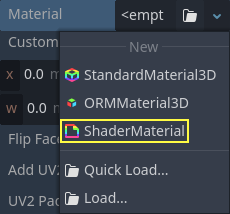
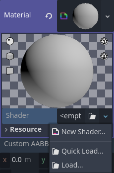
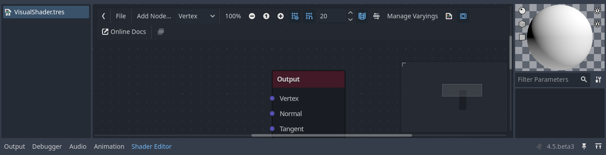
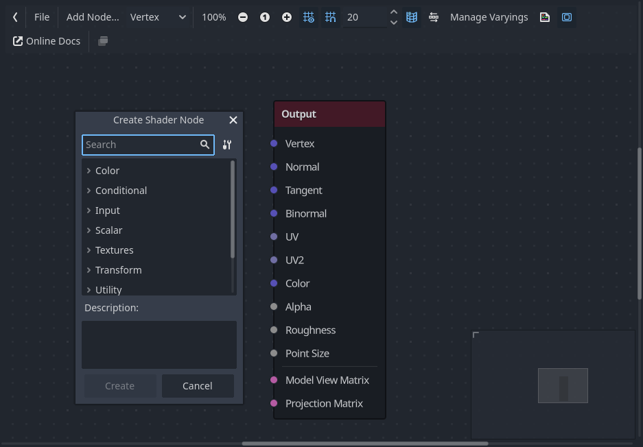
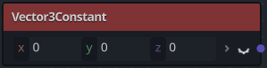
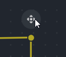

.. _doc_visual_shaders:

Using VisualShaders
===================

VisualShaders are the visual alternative for creating shaders.

As shaders are inherently linked to visuals, the graph-based approach with
previews of textures, materials, etc. offers a lot of additional convenience
compared to purely script-based shaders. On the other hand, VisualShaders do not
expose all features of the shader script and using both in parallel might be
necessary for specific effects.

.. note::

    If you are not familiar with shaders, start by reading
    :ref:`doc_introduction_to_shaders`.

Creating a VisualShader
-----------------------

VisualShaders can be created in any :ref:`class_ShaderMaterial`. To begin using
VisualShaders, create a new ``ShaderMaterial`` in an object of your choice.

Then assign a :ref:`class_Shader` resource to the ``Shader`` property.

Click on the new ``Shader`` resource and the Create Shader dialog will
open automatically. Change the Type option to :ref:`class_VisualShader`
in the dropdown, then give it a name.

Click on the visual shader you just created to open the Shader Editor.
The layout of the Shader Editor comprises four parts, a file list on
the left, the upper toolbar, the graph itself, and a material preview
on the right that can be toggled off

From left to right in the toolbar:

- The arrow can be used to toggle the files panel's visibility.
- The ``File`` button opens a dropdown menu for saving, loading, and creating
  files.
- The ``Add Node`` button displays a popup menu to let you add nodes to the
  shader graph.
- The drop-down menu is the shader type: Vertex, Fragment and Light. Like for
  script shaders, it defines what built-in nodes will be available.
- The following buttons and number input control the zooming level, grid
  snapping and distance between grid lines (in pixels).
- The toggle controls if the graph minimap in the bottom right of the editor
  is visible or not.
- The automatically arrange selected nodes button will try to organize any
  nodes you have selected as efficiently and cleanly as possible.
- The Manage Varyings button opens a dropdown that lets you add or remove a
  varying.
- The show generated code button shows shader code corresponding to your graph.
- The toggle turns the material preview on or off.
- The ``Online Docs`` button opens this documentation page in your web browser.
- The last button allows you to put the shader editor in its own window,
  separate from the rest of the editor.

.. note::

    Although VisualShaders do not require coding, they share the same logic with
    script shaders. It is advised to learn the basics of both to have a good
    understanding of the shading pipeline.

    The visual shader graph is converted to a script shader behind the scene,
    and you can see this code by pressing the last button in the toolbar. This
    can be convenient to understand what a given node does and how to reproduce
    it in scripts.

Using the Visual Shader Editor
------------------------------

By default, every new ``VisualShader`` will have an output node. Every node
connection ends at one of the output node's sockets. A node is the basic unit to
create your shader. To add a new node, click on the ``Add Node`` button on the
upper left corner or right click on any empty location in the graph, and a menu
will pop up.

This popup has the following properties:

- If you right-click on the graph, this menu will be called at the cursor
  position and the created node, in that case, will also be placed under that
  position; otherwise, it will be created at the graph's center.
- It can be resized horizontally and vertically allowing more content to be
  shown. Size transform and tree content position are saved between the calls,
  so if you suddenly closed the popup you can easily restore its previous state.
- The ``Expand All`` and ``Collapse All`` options in the drop-down option menu
  can be used to easily list the available nodes.
- You can also drag and drop nodes from the popup onto the graph.

While the popup has nodes sorted in categories, it can seem overwhelming at
first. Try to add some of the nodes, plug them in the output socket and observe
what happens.

When connecting any ``scalar`` output to a ``vector`` input, all components of
the vector will take the value of the scalar.

When connecting any ``vector`` output to a ``scalar`` input, the value of the
scalar will be the average of the vector's components.

Visual Shader node interface
------------------------------

Visual shader nodes have input and output ports. The input ports are located on the left side of the node, and output ports are located on the right side of the node.

These ports are colored to differentiate type of port:

.. list-table:: Port types
   :widths: auto
   :header-rows: 1

   * - Type
     - Color
     - Description
     - Example
   * - Scalar
     - Gray
     - Scalar is a single value.
     - |scalar|
   * - Vector
     - Purple
     - Vector is a set of values.
     - |vector|
   * - Boolean
     - Green
     - On or off, true or false.
     - |boolean|
   * - Transform
     - Pink
     - A matrix, usually used to transform vertices.
     - |transform|
   * - Sampler
     - Orange
     - A texture sampler. It can be used to sample textures.
     - |sampler|

All of the types are used in the calculations of vertices, fragments, and lights in the shader. For example: matrix multiplication, 
vector addition, or scalar division.

There are other types but these are the main ones.

Visual Shader nodes
-------------------

Below are some special nodes that are worth knowing about. The list is not
exhaustive and might be expanded with more nodes and examples.

Expression node
~~~~~~~~~~~~~~~

The ``Expression`` node allows you to write Godot Shading Language (GLSL-like)
expressions inside your visual shaders. The node has buttons to add any amount
of required input and output ports and can be resized. You can also set up the
name and type of each port. The expression you have entered will apply
immediately to the material (once the focus leaves the expression text box). Any
parsing or compilation errors will be printed to the Output tab. The outputs are
initialized to their zero value by default. The node is located under the
Special tab and can be used in all shader modes.

The possibilities of this node are almost limitless – you can write complex
procedures, and use all the power of text-based shaders, such as loops, the
``discard`` keyword, extended types, etc. For example:

.. image:: img/vs_expression2.png

Reroute node
~~~~~~~~~~~~

The ``Reroute`` node is used purely for organizational purposes. In a complicated
shader with many nodes you may find that the paths between nodes can make
things hard to read. Reroute, as its name suggests, allows you to adjust the path
between nodes to make things easier to read. You can even have multiple reroute
nodes for a single path, which can be used to make right angles.

To move a reroute node move your mouse cursor above it, and grab the handle that
appears.

Fresnel node
~~~~~~~~~~~~

The ``Fresnel`` node is designed to accept normal and view vectors and produces
a scalar which is the saturated dot product between them. Additionally, you can
setup the inversion and the power of equation. The ``Fresnel`` node is great for
adding a rim-like lighting effect to objects.

Boolean node
~~~~~~~~~~~~

The ``Boolean`` node can be converted to ``Scalar`` or ``Vector`` to represent
``0`` or ``1`` and ``(0, 0, 0)`` or ``(1, 1, 1)`` respectively. This property
can be used to enable or disable some effect parts with one click.

.. image:: img/vs_boolean.gif

If node
~~~~~~~

The ``If`` node allows you to setup a vector which will be returned the result
of the comparison between ``a`` and ``b``. There are three vectors which can be
returned: ``a == b`` (in that case the tolerance parameter is provided as a
comparison threshold – by default it is equal to the minimal value, i.e.
``0.00001``), ``a > b`` and ``a < b``.

.. image:: img/vs_if.png

Switch node
~~~~~~~~~~~

The ``Switch`` node returns a vector if the boolean condition is ``true`` or
``false``. ``Boolean`` was introduced above. If you want to convert a vector
to a true boolean, all components of the vector should be non-zero.

Mesh Emitter
~~~~~~~~~~~~

The ``Mesh Emitter`` node is used for emitting particles from mesh vertices. This is
only available for shaders that are in ``Particles`` mode.

Keep in mind that not all 3D objects are mesh files. a glTF file can't be dragged
and dropped into the graph. However, you can create an inherited scene from it,
save the mesh in that scene as its own file, and use that.

You can also drag and drop obj files into the graph editor to add the node
for that specific mesh, other mesh files will not work for this.
