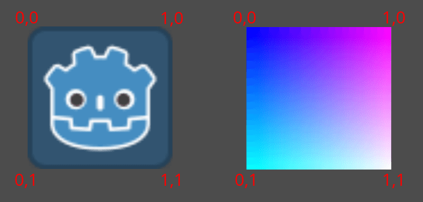
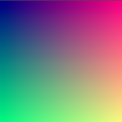

.. _doc_your_first_canvasitem_shader:

Your first 2D shader
====================

Introduction
------------

Shaders are special programs that execute on the GPU and are used for rendering
graphics. All modern rendering is done with shaders. For a more detailed
description of what shaders are please see :ref:`What are shaders
<doc_introduction_to_shaders>`.

This tutorial will focus on the practical aspects of writing shader programs by
walking you through the process of writing a shader with both vertex and
fragment functions. This tutorial targets absolute beginners to shaders.

.. note:: If you have experience writing shaders and are just looking for an
          overview of how shaders work in Godot, see the :ref:`Shading Reference
          <toc-shading-reference>`.

Setup
-----

:ref:`CanvasItem shaders <doc_canvas_item_shader>` are used to draw all 2D
objects in Godot, while :ref:`Spatial <doc_spatial_shader>` shaders are used
to draw all 3D objects.

In order to use a shader it must be attached inside a :ref:`Material
<class_Material>` which must be attached to an object. Materials are a type of
:ref:`Resource <doc_resources>`. To draw multiple objects with the same
material, the material must be attached to each object.

All objects derived from a :ref:`CanvasItem <class_CanvasItem>` have a material
property. This includes all :ref:`GUI elements <class_Control>`, :ref:`Sprite2Ds
<class_Sprite2D>`, :ref:`TileMaps <class_Tilemap>`, :ref:`MeshInstance2Ds
<class_MeshInstance2D>` etc. They also have an option to inherit their parent's
material. This can be useful if you have a large number of nodes that you want
to use the same material.

To begin, create a Sprite2D node. :ref:`You can use any CanvasItem <doc_custom_drawing_in_2d>`,
so long as it is drawing to the canvas, so for this tutorial we will use a Sprite2D,
as it is the easiest CanvasItem to start drawing with.

In the Inspector, click beside "Texture" where it says "[empty]" and select
"Load", then select "icon.svg". For new projects, this is the Godot icon. You
should now see the icon in the viewport.

Next, look down in the Inspector, under the CanvasItem section, click beside
"Material" and select "New ShaderMaterial". This creates a new Material
resource. Click on the sphere that appears. Godot currently doesn't know whether
you are writing a CanvasItem Shader or a Spatial Shader and it previews the
output of spatial shaders. So what you are seeing is the output of the default
Spatial Shader.

Click beside "Shader" and select "New Shader". Finally, click on the shader
you just created and the shader editor will open. You are now ready to begin writing
your first shader.

Your first CanvasItem shader
----------------------------

In Godot, all shaders start with a line specifying what type of shader they are.
It uses the following format:

.. code-block:: glsl

  shader_type canvas_item;

Because we are writing a CanvasItem shader, we specify ``canvas_item`` in the
first line. All our code will go beneath this declaration.

This line tells the engine which built-in variables and functionality to supply
you with.

In Godot you can override three functions to control how the shader operates;
``vertex``, ``fragment``, and ``light``. This tutorial will walk you through
writing a shader with both vertex and fragment functions. Light functions are
significantly more complex than vertex and fragment functions and so will not be
covered here.

Your first fragment function
----------------------------

The fragment function runs for every pixel in a Sprite2D and determines what color
that pixel should be.

They are restricted to the pixels covered by the Sprite2D, that means you cannot
use one to, for example, create an outline around a Sprite2D.

The most basic fragment function does nothing except assign a single color to
every pixel.

We do so by writing a ``vec4`` to the built-in variable ``COLOR``. ``vec4`` is
shorthand for constructing a vector with 4 numbers. For more information about
vectors see the :ref:`Vector math tutorial <doc_vector_math>`. ``COLOR`` is both
an input variable to the fragment function and the final output from it.

.. code-block:: glsl

  void fragment(){
    COLOR = vec4(0.4, 0.6, 0.9, 1.0);
  }

Congratulations! You're done. You have successfully written your first shader in
Godot.

Now let's make things more complex.

There are many inputs to the fragment function that you can use for calculating
``COLOR``. ``UV`` is one of them. UV coordinates are specified in your Sprite2D
(without you knowing it!) and they tell the shader where to read from textures
for each part of the mesh.

In the fragment function you can only read from ``UV``, but you can use it in
other functions or to assign values to ``COLOR`` directly.

``UV`` varies between 0-1 from left-right and from top-bottom.

.. code-block:: glsl

  void fragment() {
    COLOR = vec4(UV, 0.5, 1.0);
  }

Using ``TEXTURE`` built-in
^^^^^^^^^^^^^^^^^^^^^^^^^^

The default fragment function reads from the set Sprite2D texture and displays it.

When you want to adjust a color in a Sprite2D you can adjust the color
from the texture manually like in the code below.

.. code-block:: glsl

  void fragment(){
    // This shader will result in a blue-tinted icon
    COLOR.b = 1.0;
  }

Certain nodes, like Sprite2Ds, have a dedicated texture variable that can be accessed
in the shader using ``TEXTURE``. If you want to use the Sprite2D texture to combine
with other colors, you can use the ``UV`` with the ``texture`` function to access
this variable. Use them to redraw the Sprite2D with the texture.

.. code-block:: glsl

  void fragment(){
    COLOR = texture(TEXTURE, UV); // Read from texture again.
    COLOR.b = 1.0; //set blue channel to 1.0
  }

Uniform input
^^^^^^^^^^^^^

Uniform input is used to pass data into a shader that will be the same across
the entire shader.

You can use uniforms by defining them at the top of your shader like so:

.. code-block:: glsl

  uniform float size;

For more information about usage see the :ref:`Shading Language doc
<doc_shading_language>`.

Add a uniform to change the amount of blue in our Sprite2D.

.. code-block:: glsl

  uniform float blue = 1.0; // you can assign a default value to uniforms

  void fragment(){
    COLOR = texture(TEXTURE, UV); // Read from texture
    COLOR.b = blue;
  }

Now you can change the amount of blue in the Sprite2D from the editor. Look back
at the Inspector under where you created your shader. You should see a section
called "Shader Param". Unfold that section and you will see the uniform you just
declared. If you change the value in the editor, it will overwrite the default
value you provided in the shader.

Interacting with shaders from code
^^^^^^^^^^^^^^^^^^^^^^^^^^^^^^^^^^

You can change uniforms from code using the function ``set_shader_parameter()``
which is called on the node's material resource. With a Sprite2D node, the
following code can be used to set the ``blue`` uniform.

::

  var blue_value = 1.0
  material.set_shader_parameter("blue", blue_value)

Note that the name of the uniform is a string. The string must match exactly
with how it is written in the shader, including spelling and case.

Your first vertex function
--------------------------

Now that we have a fragment function, let's write a vertex function.

Use the vertex function to calculate where on the screen each vertex should end
up.

The most important variable in the vertex function is ``VERTEX``. Initially, it
specifies the vertex coordinates in your model, but you also write to it to
determine where to actually draw those vertices. ``VERTEX`` is a ``vec2`` that
is initially presented in local-space (i.e. not relative to the camera,
viewport, or parent nodes).

You can offset the vertices by directly adding to ``VERTEX``.

.. code-block:: glsl

  void vertex() {
    VERTEX += vec2(10.0, 0.0);
  }

Combined with the ``TIME`` built-in variable, this can be used for basic
animation.

.. code-block:: glsl

  void vertex() {
    // Animate Sprite2D moving in big circle around its location
    VERTEX += vec2(cos(TIME)*100.0, sin(TIME)*100.0);
  }

Conclusion
----------

At their core, shaders do what you have seen so far, they compute ``VERTEX`` and
``COLOR``. It is up to you to dream up more complex mathematical strategies for
assigning values to those variables.

For inspiration, take a look at some of the more advanced shader tutorials, and
look at other sites like `Shadertoy
<https://www.shadertoy.com/results?query=&sort=popular&from=10&num=4>`_ and `The
Book of Shaders <https://thebookofshaders.com>`_.
