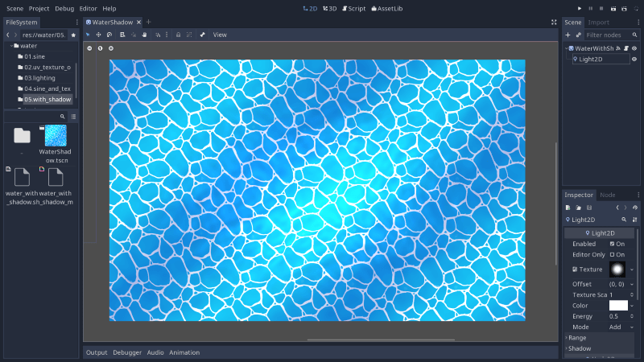
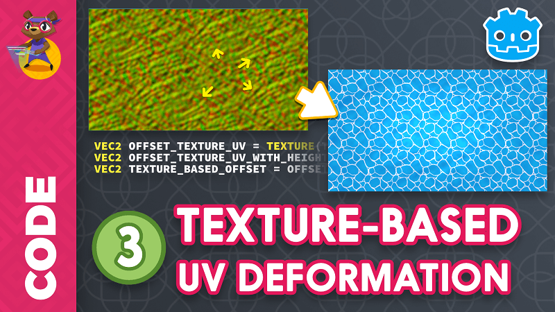

.. _doc_intro_to_shaders_water_workshop:

Intro to shaders: 2D and 3D water
=================================

In this hands-on video series, you will create your first water shaders in 2D
and in 3D. If you're new to shaders, you should start 2D, because you need
some basic understanding of the shading language, vertex and fragment shaders,
to build upon. 3D adds quite a bit of complexity when it comes to writing shader
programs, as you will see in the third video.

Watch the tutorials
-------------------

You can watch the `full playlist on YouTube <https://www.youtube.com/watch?v=xoyk_A0RSpI&list=PLhqJJNjsQ7KHqNMYmTwtsYTeTrqrRP_fP>`__. Here are the individual videos:

-  `Intro to Shader Programming <https://www.youtube.com/watch?v=xoyk_A0RSpI>`__
-  `Animated Water and UV
   Coordinates <https://www.youtube.com/watch?v=U91nqeUe1qQ>`__
-  `Water in 3D <https://www.youtube.com/watch?v=vm9Sdvhq6ho>`__
-  `Texture-based
   Deformation <https://www.youtube.com/watch?v=Pg79tztNZeA>`__
-  `Merging the Two Waves
   Together <https://www.youtube.com/watch?v=aC5Yzx7tS74>`__
-  `Functions in
   ShaderScript <https://www.youtube.com/watch?v=1eNWPbfph1E>`__
-  `Water Shadow and
   Masking <https://www.youtube.com/watch?v=Xqv7C9mVhak>`__

Download the source code
------------------------

Download the intro to shaders project here to follow along:
:download:`2d_water_shader.zip <files/2d_water_shader.zip>`.

It comes with a `start` folder to follow along with the 2D tutorials, and an `end`
folder that contains the final code.

You will find the 3D water project on `this GitHub repository
<https://github.com/BastiaanOlij/shader_tutorial>`_. We didn't include
it here, as it is a little heavy.
