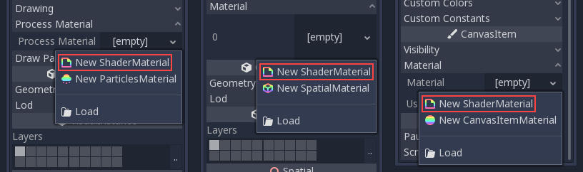
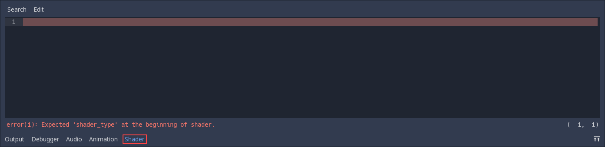
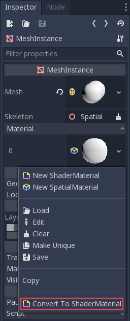

.. _doc_shader_materials:

Shader materials
================

Introduction
------------

For the most common cases, Godot provides ready to use materials for
most types of shaders, such as SpatialMaterial, CanvasItemMaterial and
ParticlesMaterial (@TODO link to tutorials/classes). They are flexible implementations that cover most
use cases. 

Shader materials allow writing a custom shader directly, for maximum flexibility.
Examples of this are:

-  Create procedural textures.
-  Create complex texture blendings.
-  Create animated materials, or materials that change with time.
-  Create refractive effects or other advanced effects.
-  Create special lighting shaders for more exotic materials.
-  Animate vertices, like tree leaves or grass.
-  Create custom particle code, that responds to baked animations or force fields.
-  And much more!

Traditionally, most engines will ask you to learn GLSL, HLSL or CG,
which are pretty complex for the skillset of most artists. Godot uses a
simplified version of a shader language that will detect errors as you
type, so you can see your edited shaders in real-time. Additionally, it
is possible to edit shaders using a visual, node-based graph editor.

Creating a ShaderMaterial
-------------------------

Create a new ShaderMaterial in some object of your choice. Go to the
"Material" property and create a ShaderMaterial.

Edit the newly created shader, and the shader editor will open:

Converting to ShaderMaterial
----------------------------

It is possible to convert from SpatialMaterial, CanvasItemMaterial and
ParticlesMaterial to ShaderMaterial. To do this go to the material properties
and enable the convert option.

