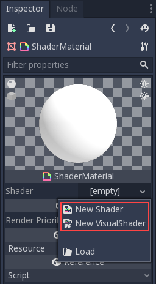
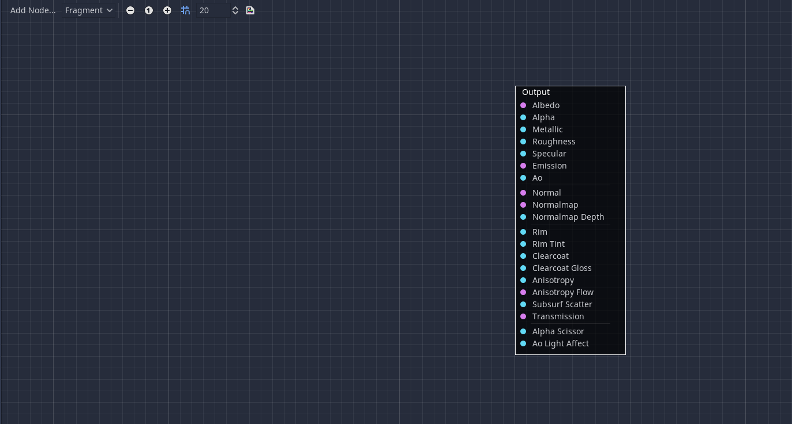
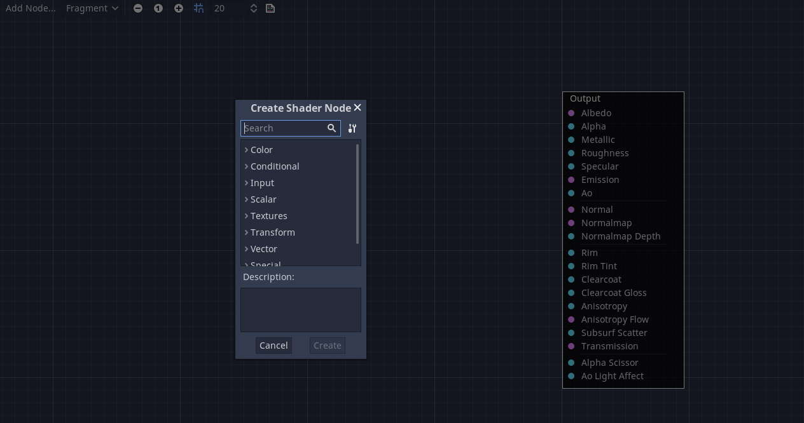
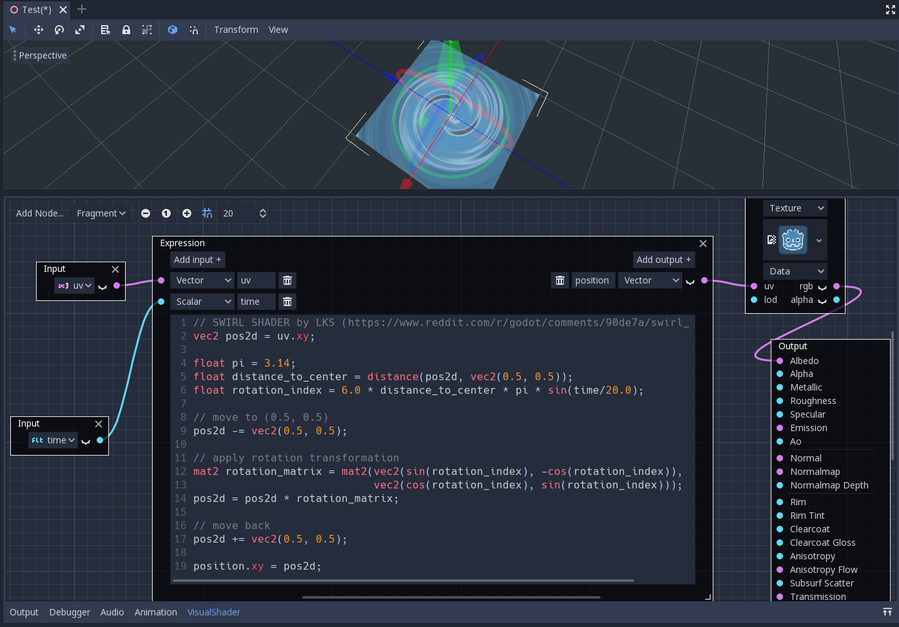
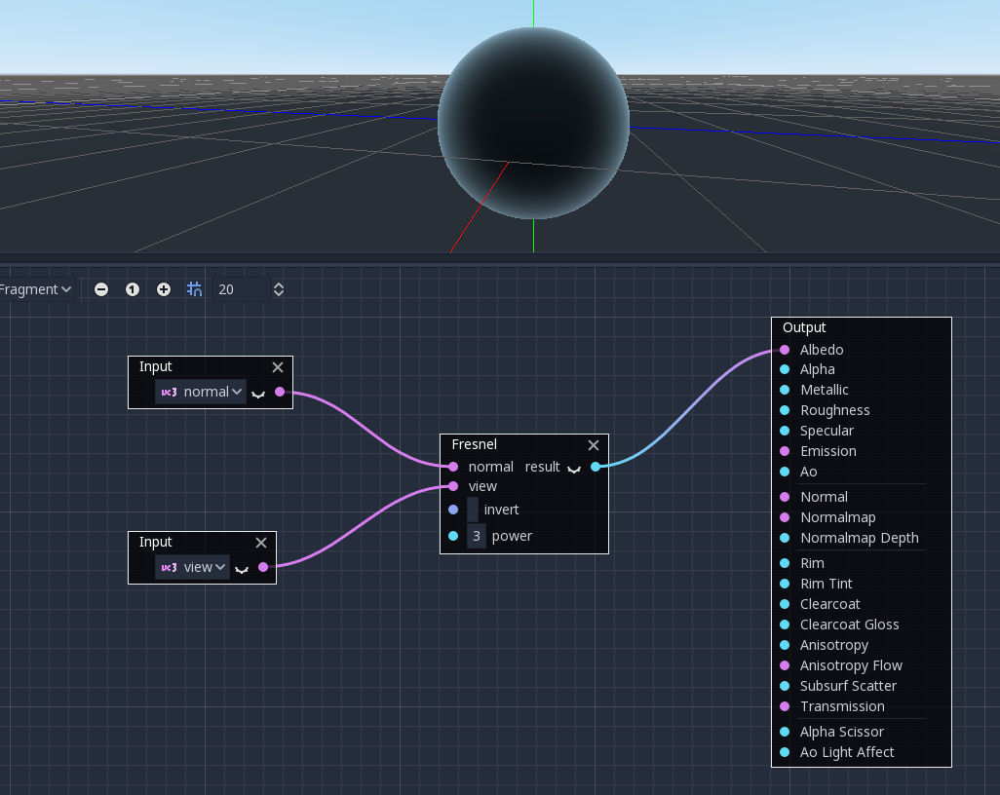
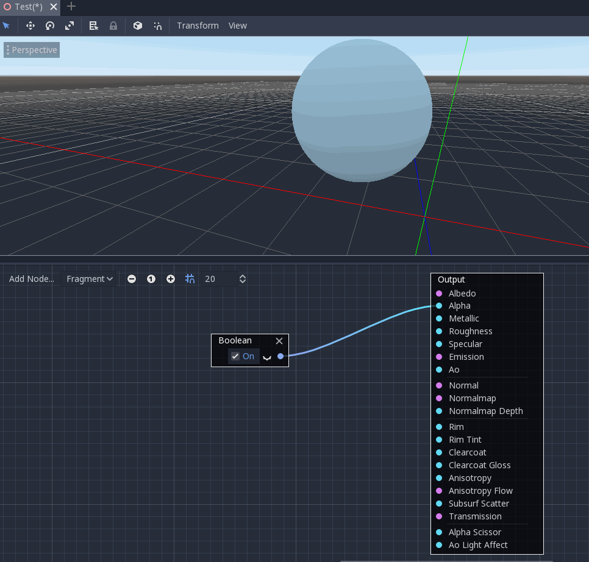
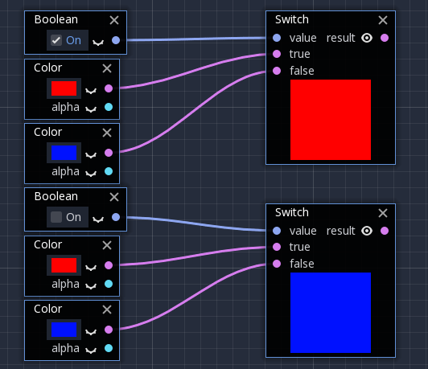
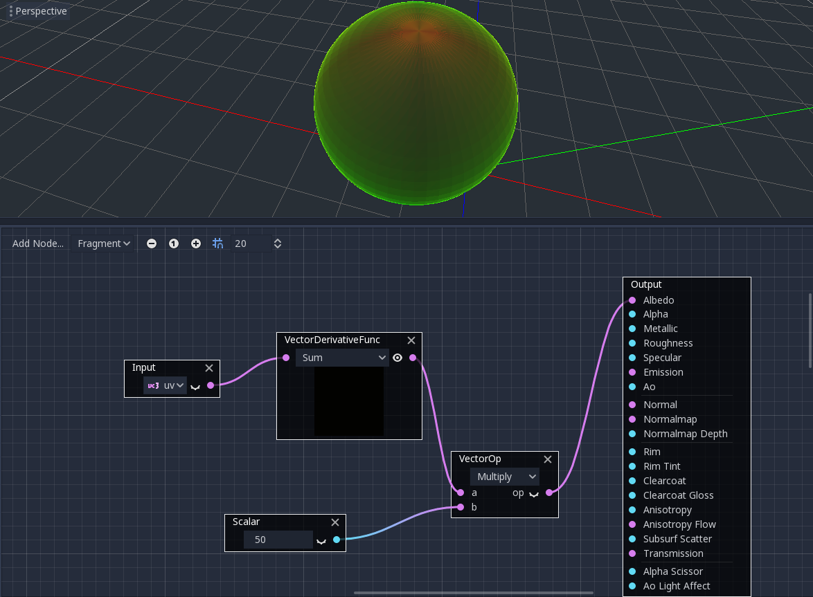

.. _doc_visual_shader:

Visual Shader
=============

Introduction
------------

VisualScript is an alternative for users that cannot code, Similarly, Visual Shader is the visual alternative for creating shaders.

.. note::
    
   If you do not understand what shader is , go read :ref:`doc_what_are_shaders`
   
Creating a VisualShader
-----------------------

Create a new ``ShaderMaterial`` in some object of your choice.

.. image:: img/shader_material_create.png

Create a new ``VisualShader`` inside the ``ShaderMaterial`` and the visual shader editor will open automatically.

The layout of the visual shader editor can be divided into two parts the upper bar and the graph.

From left to right of the upper bar, the ``Add Node`` button allows you to add more nodes to the shader graph, to the right, is the shader mode : ``vertex``, ``fragment`` and ``light``. Then, it is the zooming level and the snapping and grid options. The last icon can show the resulting shader code that the graph creates.

Using the Visual Shader Editor
------------------------------

By default, every new ``VisualShader`` will have an output node. The node connection usually ends at one of the output socket. A node is the basic unit to create your shader. To add a new node, click on the ``Add Node`` button on the upper left corner or right click on any empty space inside the Visual Shader Editor, a menu will pop up.

This popup has the following properties:

- If you right-click on the graph, this menu will be called at the cursor position and the created node, in that case, will also be placed under that position; otherwise, it will be created at the graph's center.
- It can be resized horizontally and vertically allowing more content to be shown. Size transform and tree content position are saved between the calls, so if you suddenly closed the popup you can easily restore its previous state.
- The ``Expand All`` and ``Collapse All`` options in the drop-down option menu can be used to easily list the available nodes.

When connecting any ``scalar`` output to ``vector`` input, all the 3 components of the vector will be the value of the scalar.

When connecting any ``vector`` output to ``scalar`` input, the value of the scalar will be the dot product between the original vector and a Vector3(0.33,0.33,0.33).

The popup has categorized the nodes, it is overwhelming to understand or use most of them, try to pick some of them, plug it into the output socket and observe what happens.

.. note::
    
   Although ``VisualShader`` does not require coding, it shares the same logic with normal shaders, you can learn and convert shaders to visual shaders after understanding the logic behind the shader.

Below are some special nodes that are worth knowing.

Expression node
+++++++++++++++

The ``Expression`` node allows you to write Godot Shading Language (GLSL-like) expressions inside your visual shaders! The node has buttons to add any amount of required input and output ports and can be resized. You can also set up the name and type of each port. The expression you have entered will apply immediately (after focus leaves out the expression text box) to the material, any parsing or compilation errors will be printed to the Output tab. The outputs are initialized to their zero value by default. The new node is located under the Special tab and can be used in all shader modes.

.. image:: img/vs_expression.gif

The possibilities of this node are almost limitless – you can write complex procedures, and use all the power of Godot (text-based) shaders, such as loops, discard keyword, extended types, etc. For example:

Fresnel node
++++++++++++

The ``Fresnel`` node is designed to accept normal and view vectors and produces a scalar which is the saturated dot product between them. Additionally you can setup the inversion and the power of equation

Boolean node
++++++++++++

The ``Boolean`` node can be converted to Scalar or Vector to represent 0 or 1 and (0, 0, 0) or (1, 1, 1) respectively. This property can be used to enable or disable some effect parts by one click.

If node
+++++++

The ``If`` node allows you to setup a vector which will be returned after performing comparison between a and b. There are three vectors which can be returned: a == b (in that case the tolerance parameter is provided as a comparison threshold – by default it is equal to the minimal value, e.g. 0.00001), a > b and a < b.

.. image:: img/vs_if.png

Switch node
+++++++++++

The ``Switch`` node returns a vector if the boolean condition is true or false. ``Boolean`` was introduced above. If you convert a vector to a true boolean, all components of the vector should be above zero.

Derivative nodes
++++++++++++++++

These nodes are ``Fragment`` specific, and cannot be used in the Vertex mode context. They are put under the Special category tab and divided into ``ScalarDerivativeFunc`` and ``VectorDerivativeFunc``.

