.. _doc_your_first_spatial_shader:

Your first Spatial shader
============================

You have decided to start writing your own custom Spatial shader. Maybe you saw a cool trick
online that was done with shaders, or you have found that the
:ref:`SpatialMaterial <class_SpatialMaterial>` isn't quite meeting your needs. Either way,
you have decided to write your own and now you need figure out where to start.

This tutorial will explain how to write a Spatial shader and will cover more topics than the
:ref:`CanvasItem <doc_your_first_canvasitem_shader>` tutorial.

Spatial shaders have more built-in functionality than CanvasItem shaders. The expectation with
spatial shaders is that Godot has already provided the functionality for common use cases and all
the user needs to do in the shader is set the proper parameters. This is especially true for a
PBR (physically based rendering) workflow.

This is a two-part tutorial. In this first part we are going to go through how to make a simple terrain
using vertex displacement from a heightmap in the vertex function. In the :ref:`second part <doc_your_second_spatial_shader>`
we are going to take the concepts from this tutorial and walk through how to set up custom materials
in a fragment shader by writing an ocean water shader.

.. note:: This tutorial assumes some basic shader knowledge such as types (``vec2``, ``float``,
          ``sampler2D``), and functions. If you are uncomfortable with these concepts it is
          best to get a gentle introduction from `The Book of Shaders
          <https://thebookofshaders.com>`_ before completing this tutorial.

Where to assign my material
---------------------------

In 3D, objects are drawn using :ref:`Meshes <class_Mesh>`. Meshes are a resource type that store geometry
(the shape of your object) and materials (the color and how the object reacts to light) in units called
"surfaces". A Mesh can have multiple surfaces, or just one. Typically, you would
import a mesh from another program (e.g. Blender). But Godot also has a few :ref:`PrimitiveMeshes <class_primitivemesh>`
that allow you to add basic geometry to a scene without importing Meshes.

There are multiple node types that you can use to draw a mesh. The main one is :ref:`MeshInstance <class_meshinstance>`,
but you can also use :ref:`Particles <class_particles>`, :ref:`MultiMeshes <class_MultiMesh>` (with a
:ref:`MultiMeshInstance <class_multimeshinstance>`), or others.

Typically, a material is associated with a given surface in a mesh, but some nodes, like MeshInstance, allow
you to override the material for a specific surface, or for all surfaces.

If you set a material on the surface or mesh itself, then all MeshInstances that share that mesh will share that material.
However, if you want to reuse the same mesh across multiple mesh instances, but have different materials for each
instance then you should set the material on the Meshinstance.

For this tutorial we will set our material on the mesh itself rather than taking advantage of the MeshInstance's
ability to override materials.

Setting up
----------

Add a new :ref:`MeshInstance <class_meshinstance>` node to your scene.

In the inspector tab beside "Mesh" click "[empty]" and select "New PlaneMesh".
Then click on the image of a plane that appears.

This adds a :ref:`PlaneMesh <class_planemesh>` to our scene.

Then, in the viewport, click in the upper left corner on the button that says "Perspective".
A menu will appear. In the middle of the menu are options for how to display the scene.
Select 'Display Wireframe'.

This will allow you to see the triangles making up the plane.

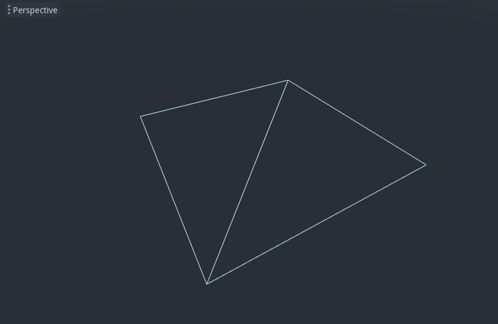

Now set ``Subdivide Width`` and ``Subdivide Depth`` to ``32``.

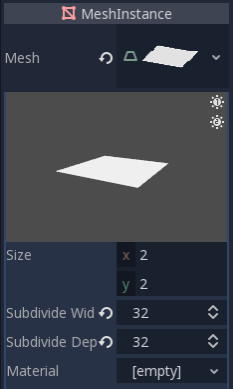

You can see that there are now many more triangles in the :ref:`Mesh<class_MeshInstance>`. This will give
us more vertices to work with and thus allow us to add more detail.

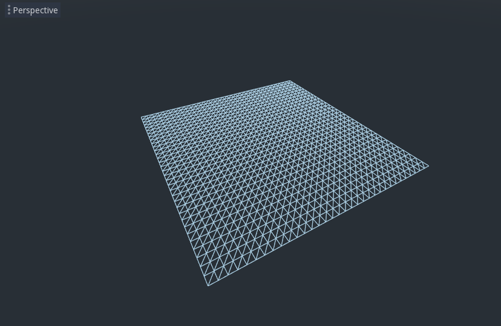

:ref:`PrimitiveMeshes <class_primitivemesh>`, like PlaneMesh, only have one surface, so instead of
an array of materials there is only one. Click beside "Material" where it says "[empty]" and
select "New ShaderMaterial". Then click the sphere that appears.

Now click beside "Shader" where it says "[empty]" and select "New Shader".

The shader editor should now pop up and you are ready to begin writing your first Spatial shader!

Shader magic
------------

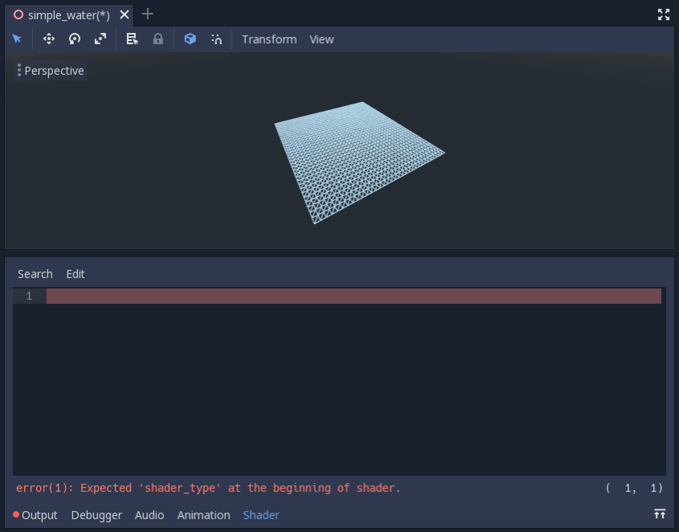

Notice how there is already error? This is because the shader editor reloads shaders on
the fly. The first thing Godot shaders need is a declaration of what type of shader they are.
We set the variable ``shader_type`` to ``spatial`` because this is a spatial shader.

.. code-block:: glsl

  shader_type spatial;

Next we will define the ``vertex()`` function. The ``vertex()`` function determines where
the vertices of your :ref:`Mesh<class_MeshInstance>` appear in the final scene. We will be
using it to offset the height of each vertex and make our flat plane appear like a little terrain.

We define the vertex shader like so:

.. code-block:: glsl

  void vertex() {

  }

With nothing in the ``vertex()`` function, Godot will use its default vertex shader. We can easily
start to make changes by adding a single line:

.. code-block:: glsl

  void vertex() {
    VERTEX.y += cos(VERTEX.x) * sin(VERTEX.z);
  }

Adding this line, you should get an image like the one below.

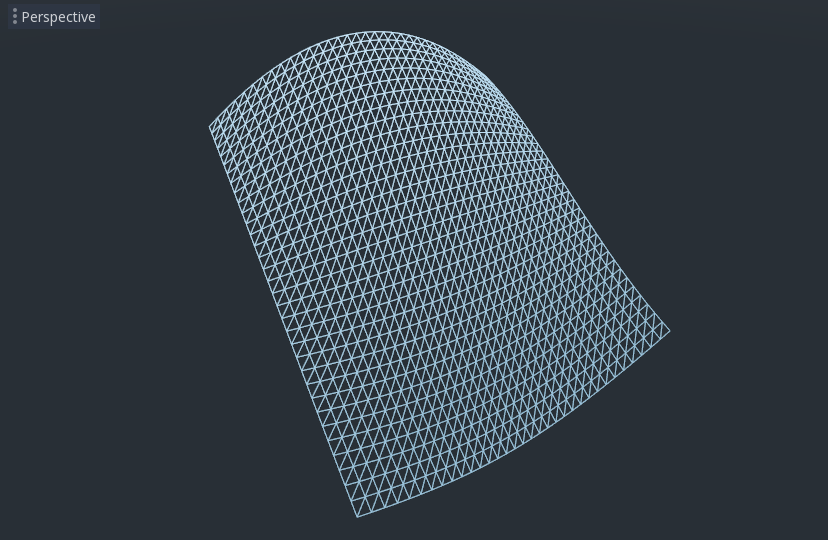

Okay, let's unpack this. The ``y`` value of the ``VERTEX`` is being increased. And we are passing
the ``x`` and ``z`` components of the ``VERTEX`` as arguments to ``cos`` and ``sin``; that gives us
a wave-like appearance across the ``x`` and ``z`` axes.

What we want to achieve is the look of little hills; after all. ``cos`` and ``sin`` already look kind of like
hills. We do so by scaling the inputs to the ``cos`` and ``sin`` functions.

.. code-block:: glsl

  void vertex() {
    VERTEX.y += cos(VERTEX.x * 4.0) * sin(VERTEX.z * 4.0);
  }

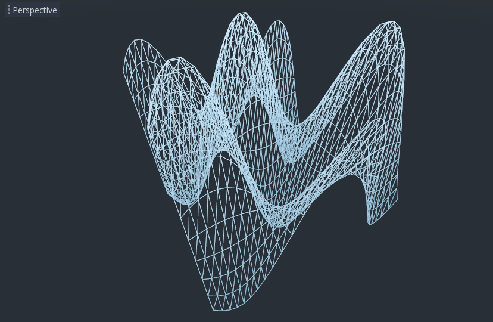

This looks better, but it is still too spiky and repetitive, let's make it a little more interesting.

Noise heightmap
---------------

Noise is a very popular tool for faking the look of terrain. Think of it as similar to the cosine function
where you have repeating hills except, with noise, each hill has a different height.

Godot provides the :ref:`NoiseTexture <class_noisetexture>` resource for generating a noise texture
that can be accessed from a shader.

To access a texture in a shader add the following code near the top of your shader, outside the
``vertex()`` function.

.. code-block:: glsl

  uniform sampler2D noise;

This will allow you to send a noise texture to the shader. Now look in the inspecter under your material.
You should see a section called "Shader Params". If you open it up, you'll see a section called "noise".

Click beside it where it says "[empty]" and select "New NoiseTexture". Then in your NoiseTexture click beside
where it says "Noise" and select "New OpenSimplexNoise".

:ref:`OpenSimplexNoise <class_opensimplexnoise>` is used by the NoiseTexture to generate a heightmap.

Once you set it up and should look like this.

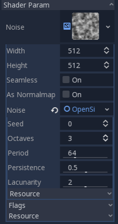

Now, access the noise texture using the ``texture()`` function. ``texture()`` takes a texture as the first
argument and a ``vec2`` for the position on the texture as the second argument. We use the ``x`` and ``z``
channels of ``VERTEX`` to determine where on the texture to look up. ``texture()`` returns a ``vec4`` of the
``r, g, b, a`` channels at the position. Since the noise texture is grayscale, all of the values are the same,
so we can use any one of the channels as the height. In this case we'll use the ``r``, or ``x`` channel.

.. code-block:: glsl

  float height = texture(noise, VERTEX.xz / 2.0 ).x; //divide by the size of the PlaneMesh
  VERTEX.y += height;

Note: ``xyzw`` is the same as ``rgba`` in GLSL, so instead of ``texture().x`` above, we could use ``texture().r``.
See the `OpenGL documentation <https://www.khronos.org/opengl/wiki/Data_Type_(GLSL)#Vectors>`_ for more details.

Using this code you can see the texture creates random looking hills.

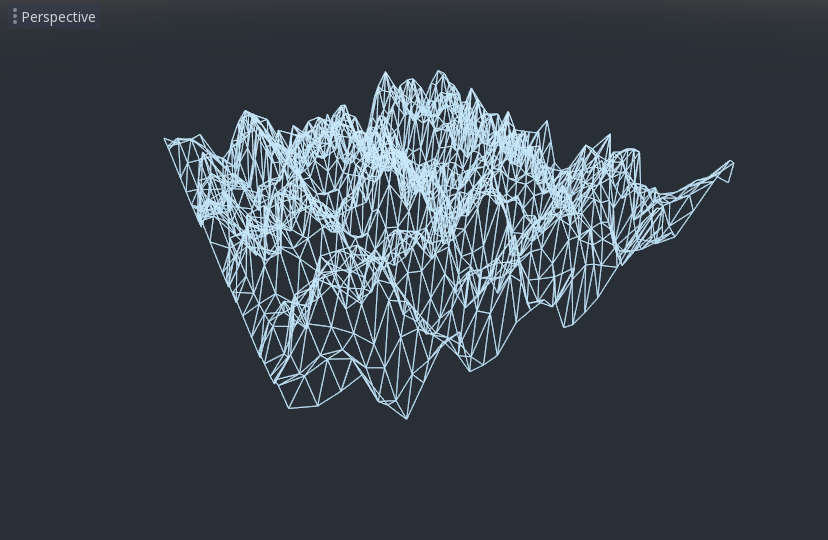

Right now it is too spiky, we want to soften the hills a bit. To do that, we will use a uniform.
You already used a uniform above to pass in the noise texture, now let's learn how they work.

Uniforms
--------

Uniform variables allow you to pass data from the game into the shader. They are
very useful for controlling shader effects. Uniforms can be almost any
datatype that can be used in the shader. To use a uniform, you declare it in
your :ref:`Shader<class_Shader>` using the keyword ``uniform``.

Let's make a uniform that changes the height of the terrain.

.. code-block:: glsl

  uniform float height_scale = 0.5;

Godot lets you initialize a uniform with a value; here, ``height_scale`` is set to
``0.5``. You can set uniforms from GDScript by calling the function ``set_shader_param()``
on the material corresponding to the shader. The value passed from GDScript takes
precedence over the value used to initialize it in the shader.

::

  # called from the MeshInstance
  mesh.material.set_shader_param("height_scale", 0.5)

.. note:: Changing uniforms in Spatial-based nodes is different from CanvasItem-based nodes. Here,
          we set the material inside the PlaneMesh resource. In other mesh resources you may
          need to first access the material by calling ``surface_get_material()``. While in
          the MeshInstance you would access the material using ``get_surface_material()`` or
          ``material_override``.

Remember that the string passed into ``set_shader_param()`` must match the name
of the uniform variable in the :ref:`Shader<class_Shader>`. You can use the uniform variable anywhere
inside your :ref:`Shader<class_Shader>`. Here, we will use it to set the height value instead
of arbitrarily multiplying by ``0.5``.

.. code-block:: glsl

  VERTEX.y += height * height_scale;

Now it looks  much better.

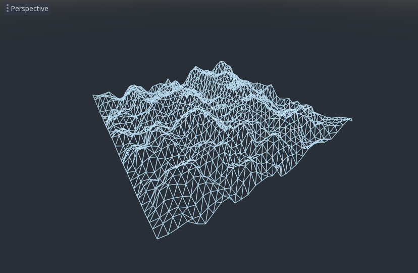

Using uniforms, we can even change the value every frame to animate the height of the terrain.
Combined with :ref:`Tweens <class_Tween>`, this can be especially useful for simple animations.

Interacting with light
----------------------

First, turn wireframe off. To do so, click in the upper-left of the Viewport again, where it says
"Perspective", and select "Display Normal".

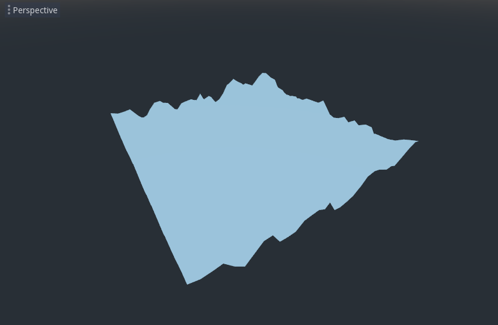

Note how the mesh color goes flat. This is because the lighting on it is flat. Let's add a light!

First, we will add an :ref:`OmniLight<class_OmniLight>` to the scene.

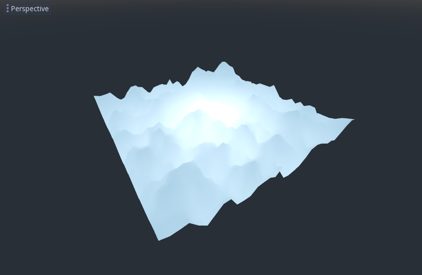

You can see the light affecting the terrain, but it looks odd. The problem is the light
is affecting the terrain as if it were a flat plane. This is because the light shader uses
the normals from the :ref:`Mesh <class_mesh>` to calculate light.

The normals are stored in the Mesh, but we are changing the shape of the Mesh in the
shader, so the normals are no longer correct. To fix this, we can recalculate the normals
in the shader or use a normal texture that corresponds to our noise. Godot makes both easy for us.

You can calculate the new normal manually in the vertex function and then just set ``NORMAL``.
With ``NORMAL`` set, Godot will do all the difficult lighting calculations for us. We will cover
this method in the next part of this tutorial, for now we will read normals from a texture.

Instead we will rely on the NoiseTexture again to calculate normals for us. We do that by passing in
a second noise texture.

.. code-block:: glsl

  uniform sampler2D normalmap;

Set this second uniform texture to another NoiseTexture with another OpenSimplexNoise. But this time, check
off "As Normalmap".

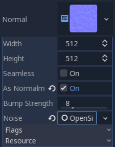

Now, because this is a normalmap and not a per-vertex normal, we are going to assign it in the ``fragment()``
function. The ``fragment()`` function will be explained in more detail in the next part of this tutorial.

.. code-block:: glsl

  void fragment() {
  }

When we have normals that correspond to a specific vertex we set ``NORMAL``, but if you have a normalmap
that comes from a texture, set the normal using ``NORMALMAP``. This way Godot will handle the wrapping the
texture around the mesh automatically.

Lastly, in order to ensure that we are reading from the same places on the noise texture and the normalmap
texture, we are going to pass the ``VERTEX.xz`` position from the ``vertex()`` function to the ``fragment()``
function. We do that with varyings.

Above the ``vertex()`` define a ``vec2`` called ``vertex_position``. And inside the ``vertex()`` function
assign ``VERTEX.xz`` to ``vertex_position``.

.. code-block:: glsl

  varying vec2 vertex_position;

  void vertex() {
    ...
    vertex_position = VERTEX.xz / 2.0;
  }

And now we can access ``vertex_position`` from the ``fragment()`` function.

.. code-block:: glsl

  void fragment() {
    NORMALMAP = texture(normalmap, vertex_position).xyz;
  }

With the normals in place the light now reacts to the height of the mesh dynamically.

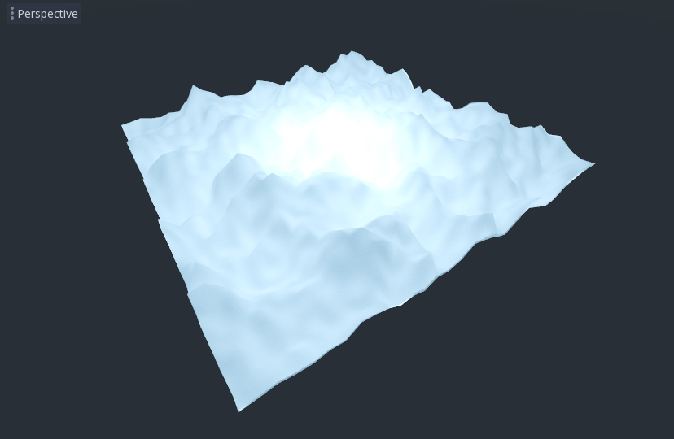

We can even drag the light around and the lighting will update automatically.

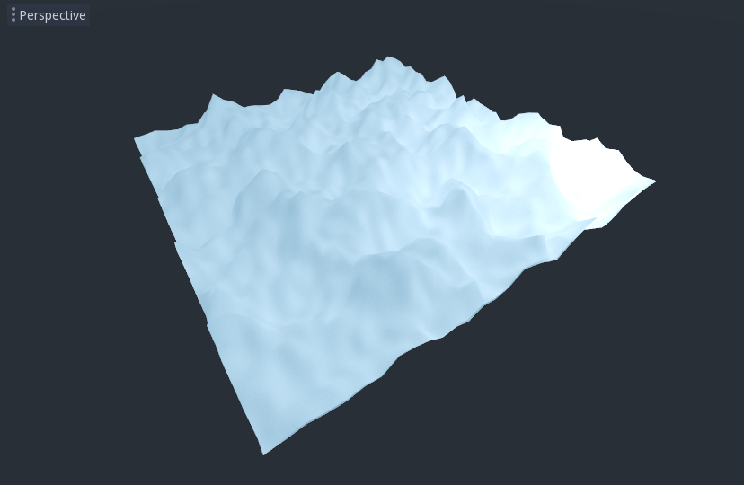

Here is the full code for this tutorial. You can see it is not very long as Godot handles
most of the difficult stuff for you.

.. code-block:: glsl

  shader_type spatial;

  uniform float height_scale = 0.5;
  uniform sampler2D noise;
  uniform sampler2D normalmap;

  varying vec2 vertex_position;

  void vertex() {
    vertex_position = VERTEX.xz / 2.0;
    float height = texture(noise, vertex_position).x * height_scale;
    VERTEX.y += height * height_scale;
  }

  void fragment() {
    NORMALMAP = texture(normalmap, vertex_position).xyz;
  }

That is everything for this part. Hopefully, you now understand the basics of vertex
shaders in Godot. In the next part of this tutorial we will write a fragment function
to accompany this vertex function and we will cover a more advanced technique to turn
this terrain into an ocean of moving waves.
