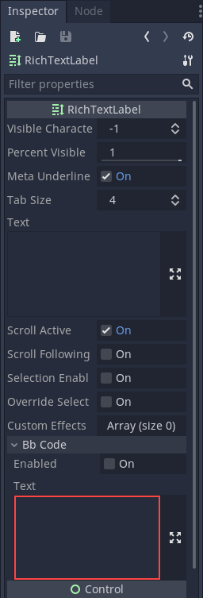
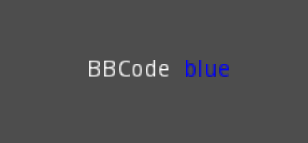
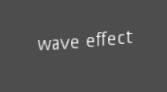
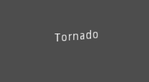
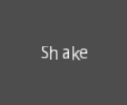
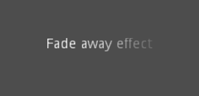
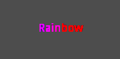

.. _doc_bbcode_in_richtextlabel:

BBCode in RichTextLabel
=======================

Introduction
------------

:ref:`class_Label` nodes are great for displaying basic text, but they have limitations.
If you want to change the color of the text, or its alignment, you can only do that to
the entire label. You can't make a part of the text have another color, or have a part
of the text centered. To get around these limitations you would use a :ref:`class_RichTextLabel`.

:ref:`class_RichTextLabel` allows for complex formatting of text using a markup syntax or
the built-in API. It uses BBCodes for the markup syntax, a system of tags that designate
formatting rules for a part of the text. You may be familiar with them if you ever used
forums (also known as `bulletin boards`, hence the "BB" in "BBCode").

Note that the BBCode tags can also be used, to some extent, in the XML source of
the class reference. For more information, see :ref:`doc_class_reference_writing_guidelines`.

Using BBCode
------------

By default :ref:`class_RichTextLabel` functions exactly the same as the normal label. It
has the :ref:`property_text <class_RichTextLabel_property_text>` property, which you can
edit to have uniformly formatted text. To be able to use BBCodes and rich text formatting
you need to turn on the BBCode mode by setting :ref:`bbcode_enabled <class_RichTextLabel_property_bbcode_enabled>`.
After that you can edit the :ref:`bbcode_text <class_RichTextLabel_property_bbcode_text>`
property using available tags. Both properties are located in the "Bb Code" section of
the Inspector.

For example, ``BBCode [color=blue]blue[/color]`` would render the word "blue" with
a blue color.

Most BBCodes consist of 3 parts: the opening tag, the content and the closing tag. The
opening tag delimits the start of the formatted part, and can also carry some
configuration options. Some opening tags, like the ``color`` one shown above, also require
a value to work. The closing tag delimits the end of the formatted part. In some cases
both the closing tag and the content can be omitted.

.. code-block:: none

  [tag]content[/tag]
  [tag=value]content[/tag]
  [tag options]content[/tag]
  [tag][/tag]
  [tag]

.. note::

    In the Inspector you may notice that after writing in the "BBCode Text" property the
    regular "Text" property now has the same text but without BBCodes. Take care not to
    edit the regular "Text" property! You will lose the BBCode markup if you do. All changes
    to the text must be done using the "BBCode Text".

Reference
---------

.. list-table::
  :class: wrap-normal
  :width: 100%
  :widths: 60 40

  * - Tag
    - Example

  * - | **b**
      | Makes ``{text}`` use the bold (or bold italics) font of ``RichTextLabel``.

    - ``[b]{text}[/b]``

  * - | **i**
      | Makes ``{text}`` use the italics (or bold italics) font of ``RichTextLabel``.

    - ``[i]{text}[/i]``

  * - | **u**
      | Makes ``{text}`` underlined.

    - ``[u]{text}[/u]``

  * - | **s**
      | Makes ``{text}`` strikethrough.

    - ``[s]{text}[/s]``

  * - | **code**
      | Makes ``{text}`` use the mono font of ``RichTextLabel``.

    - ``[code]{text}[/code]``

  * - | **p**
      | Adds new paragraph with ``{text}``. Supports configuration options,
        see :ref:`doc_bbcode_in_richtextlabel_paragraph_options`.

    - | ``[p]{text}[/p]``
      | ``[p {options}]{text}[/p]``

  * - | **center**
      | Makes ``{text}`` horizontally centered.
      | Same as ``[p align=center]``.

    - ``[center]{text}[/center]``

  * - | **left**
      | Makes ``{text}`` horizontally right-aligned.
      | Same as ``[p align=left]``.

    - ``[left]{text}[/left]``

  * - | **right**
      | Makes ``{text}`` horizontally right-aligned.
      | Same as ``[p align=right]``.

    - ``[right]{text}[/right]``

  * - | **fill**
      | Makes ``{text}`` fill the the full width of ``RichTextLabel``.
      | Same as ``[p align=fill]``.

    - ``[fill]{text}[/fill]``

  * - | **indent**
      | Indents ``{text}`` once.

    - ``[indent]{text}[/indent]``

  * - | **url**
      | Creates a hyperlink (underlined and clickable text). Can contain optional
        ``{text}`` or display ``{link}`` as is.
      | **Must be handled with the "meta_clicked" signal to have an effect,** see :ref:`doc_bbcode_in_richtextlabel_handling_url_tag_clicks`.

    - | ``[url]{link}[/url]``
      | ``[url={link}]{text}[/url]``

  * - | **img**
      | Inserts an image from the ``{path}`` (can be any valid image resource).
      | If ``{width}`` is provided, the image will try to fit that width maintaining
        the aspect ratio.
      | If both ``{width}`` and ``{height}`` are provided, the image will be scaled
        to that size.
      | If ``{valign}`` configuration is provided, the image will try to align to the
        surrounding text, see :ref:`doc_bbcode_in_richtextlabel_image_alignment`.
      | Supports configuration options, see :ref:`doc_bbcode_in_richtextlabel_image_options`.

    - | ``[img]{path}[/img]``
      | ``[img={width}]{path}[/img]``
      | ``[img={width}x{height}]{path}[/img]``
      | ``[img={valign}]{path}[/img]``
      | ``[img {options}]{path}[/img]``

  * - | **font**
      | Makes ``{text}`` use a font resource from the ``{path}``.
      | Supports configuration options, see :ref:`doc_bbcode_in_richtextlabel_font_options`.

    - | ``[font={path}]{text}[/font]``
      | ``[font {options}]{text}[/font]``

  * - | **font_size**
      | Use custom font size for ``{text}``.

    - ``[font_size={size}]{text}[/font_size]``

  * - | **opentype_features**
      | Enables custom OpenType font features for ``{text}``. Features must be provided as
        a comma-separated ``{list}``.

    - | ``[opentype_features={list}]``
      | ``{text}``
      | ``[/opentype_features]``

  * - | **color**
      | Changes the color of ``{text}``. Color must be provided by a common name (see
        :ref:`doc_bbcode_in_richtextlabel_named_colors`) or using the HEX format (e.g.
        ``#ff00ff``, see :ref:`doc_bbcode_in_richtextlabel_hex_colors`).

    - ``[color={code/name}]{text}[/color]``

  * - | **bgcolor**
      | Draws the color behind ``{text}``. Accepts same values as the ``color`` tag.

    - ``[bgcolor={code/name}]{text}[/bgcolor]``

  * - | **fgcolor**
      | Draws the color in front of ``{text}``. Accepts same values as the ``color`` tag.

    - ``[fgcolor={code/name}]{text}[/fgcolor]``

  * - | **outline_size**
      | Use custom font outline size for ``{text}``.

    - | ``[outline_size={size}]``
      | ``{text}``
      | ``[/outline_size]``

  * - | **outline_color**
      | Use custom outline color for ``{text}``. Accepts same values as the ``color`` tag.

    - | ``[outline_color={code/name}]``
      | ``{text}``
      | ``[/outline_color]``

  * - | **table**
      | Creates a table with the ``{number}`` of columns. Use the ``cell`` tag to define
        table cells.

    - ``[table={number}]{cells}[/table]``

  * - | **cell**
      | Adds a cell with ``{text}`` to the table.
      | If ``{ratio}`` is provided, the cell will try to expand to that value proportionally
        to other cells and their ratio values.
      | Supports configuration options, see :ref:`doc_bbcode_in_richtextlabel_cell_options`.

    - | ``[cell]{text}[/cell]``
      | ``[cell={ratio}]{text}[/cell]``
      | ``[cell {options}]{text}[/cell]``

  * - | **ul**
      | Adds an unordered list. List ``{items}`` must be provided by putting one item per
        line of text.

    - ``[ul]{items}[/ul]``

  * - | **ol**
      | Adds an ordered (numbered) list of the given ``{type}`` (see :ref:`doc_bbcode_in_richtextlabel_list_types`).
        List ``{items}`` must be provided by putting one item per line of text.

    - ``[ol type={type}]{items}[/ol]``

  * - | **lb**, **rb**
      | Adds ``[`` and ``]`` respectively. Allows escaping BBCode markup.

    - | ``[lb]b[rb]text[lb]/b[rb]`` will display as ``[b]text[/b]``.

  * - | Several Unicode control character can be added using their own tags.

    - | ``[lrm]``, ``[rlm]``, ``[lre]``, ``[rle]``, ``[lro]``, ``[rlo]``,
        ``[pdf]``, ``[alm]``, ``[lri]``, ``[rli]``, ``[fsi]``, ``[pdi]``,
        ``[zwj]``, ``[zwnj]``, ``[wj]``

.. note::

    Tags for bold (``[b]``), italics (``[i]``), and monospaced (``[code]``)
    formatting only work if the appropriate custom fonts are set up for
    the ``RichTextLabel`` node first.

    There are no BBCode tags to control vertical centering of text yet.

    Options can be skipped for all tags.

.. _doc_bbcode_in_richtextlabel_paragraph_options:

Paragraph options
~~~~~~~~~~~~~~~~~

- **align**

  +-----------+--------------------------------------------+
  | `Values`  | ``left``, ``center``, ``right``, ``fill``  |
  +-----------+--------------------------------------------+
  | `Default` | ``left``                                   |
  +-----------+--------------------------------------------+

  Text horizontal alignment.

- **bidi_override**, **st**

  +-----------+---------------------------------------------------------------------------+
  | `Values`  | ``default``, ``uri``, ``file``, ``email``, ``list``, ``none``, ``custom`` |
  +-----------+---------------------------------------------------------------------------+
  | `Default` | ``default``                                                               |
  +-----------+---------------------------------------------------------------------------+

  Structured text override.

- **direction**, **dir**

  +-----------+--------------------------------------------+
  | `Values`  | ``ltr``, ``rtl``, ``auto``                 |
  +-----------+--------------------------------------------+
  | `Default` | Inherit                                    |
  +-----------+--------------------------------------------+

  Base BiDi direction.

- **language**, **lang**

  +-----------+--------------------------------------------+
  | `Values`  | ISO language codes. See :ref:`doc_locales` |
  +-----------+--------------------------------------------+
  | `Default` | Inherit                                    |
  +-----------+--------------------------------------------+

  Locale override.

.. _doc_bbcode_in_richtextlabel_handling_url_tag_clicks:

Handling ``[url]`` tag clicks
~~~~~~~~~~~~~~~~~~~~~~~~~~~~~

By default, ``[url]`` tags do nothing when clicked. This is to allow flexible use
of ``[url]`` tags rather than limiting them to opening URLs in a web browser.

To handle clicked ``[url]`` tags, connect the ``RichTextLabel`` node's
:ref:`meta_clicked <class_RichTextLabel_signal_meta_clicked>` signal to a script function.

For example, the following method can be connected to ``meta_clicked`` to open
clicked URLs using the user's default web browser::

    # This assumes RichTextLabel's `meta_clicked` signal was connected to
    # the function below using the signal connection dialog.
    func _richtextlabel_on_meta_clicked(meta):
        # `meta` is not guaranteed to be a String, so convert it to a String
        # to avoid script errors at run-time.
        OS.shell_open(str(meta))

For more advanced use cases, it's also possible to store JSON in an ``[url]``
tag's option and parse it in the function that handles the ``meta_clicked`` signal.
For example:

.. code-block:: none

  [url={"example": "value"}]JSON[/url]

.. _doc_bbcode_in_richtextlabel_image_options:

Image options
~~~~~~~~~~~~~

- **color**

  +-----------+--------------------------------------------+
  | `Values`  | Color name or color in HEX format          |
  +-----------+--------------------------------------------+
  | `Default` | Inherit                                    |
  +-----------+--------------------------------------------+

  Color tint of the image (modulation).

- **height**

  +-----------+--------------------------------------------+
  | `Values`  | Number in pixels                           |
  +-----------+--------------------------------------------+
  | `Default` | Inherit                                    |
  +-----------+--------------------------------------------+

  Target height of the image.

- **width**

  +-----------+--------------------------------------------+
  | `Values`  | Number in pixels                           |
  +-----------+--------------------------------------------+
  | `Default` | Inherit                                    |
  +-----------+--------------------------------------------+

  Target width of the image.

.. _doc_bbcode_in_richtextlabel_image_alignment:

Image vertical alignment
~~~~~~~~~~~~~~~~~~~~~~~~

When a vertical alignment value is provided with the ``[img]`` tag the image
will try to align itself against the surrounding text. Alignment is performed
using a vertical point of the image and a vertical point of the text. There are
3 possible points on the image (``top``, ``center``, and ``bottom``) and 4
possible points on the text (``top``, ``center``, ``baseline``, and ``bottom``),
which can be used in any combination.

To specify both points, use their full or short names as a value of the image tag:

.. code-block:: none

    [img=top,bottom]
    [img=center,center]

You can also specify just one value (``top``, ``center``, or ``bottom``) to make
use of a corresponding preset (``top-top``, ``center-center``, and ``bottom-bottom``
respectively).

Short names for the values are ``t`` (``top``), ``c`` (``center``), ``l`` (``baseline``),
and ``b`` (``bottom``).

.. _doc_bbcode_in_richtextlabel_font_options:

Font options
~~~~~~~~~~~~

- **name**, **n**

  +-----------+--------------------------------------------+
  | `Values`  | A valid Font resource path.                |
  +-----------+--------------------------------------------+
  | `Default` | Inherit                                    |
  +-----------+--------------------------------------------+

  Font resource path.

- **size**, **s**

  +-----------+--------------------------------------------+
  | `Values`  | Number in pixels.                          |
  +-----------+--------------------------------------------+
  | `Default` | Inherit                                    |
  +-----------+--------------------------------------------+

  Custom font size.

.. _doc_bbcode_in_richtextlabel_named_colors:

Named colors
~~~~~~~~~~~~

For tags that allow specifying a color by name you can use names of the constants from
the built-in :ref:`class_Color` class. Named classes can be specified in a number of
styles using different casings: ``DARK_RED``, ``DarkRed``, and ``darkred`` will give
the same exact result.

.. _doc_bbcode_in_richtextlabel_hex_colors:

Hexadecimal color codes
~~~~~~~~~~~~~~~~~~~~~~~

For opaque RGB colors, any valid 6-digit hexadecimal code is supported, e.g.
``[color=#ffffff]white[/color]``. Shorthand RGB color codes such as ``#6f2``
(equivalent to ``#66ff22``) are also supported.

For transparent RGB colors, any RGBA 8-digit hexadecimal code can be used,
e.g. ``[color=#ffffff88]translucent white[/color]``. Note that the alpha channel
is the **last** component of the color code, not the first one. Short RGBA
color codes such as ``#6f28`` (equivalent to ``#66ff2288``) are supported as well.

.. _doc_bbcode_in_richtextlabel_cell_options:

Cell options
~~~~~~~~~~~~

- **expand**

  +-----------+--------------------------------------------+
  | `Values`  | Integer number                             |
  +-----------+--------------------------------------------+
  | `Default` | 1                                          |
  +-----------+--------------------------------------------+

  Cell expansion ration, which cell will try to expand to proportionally to other
  cells and their expansion ratios.

- **border**

  +-----------+--------------------------------------------+
  | `Values`  | Color name or color in HEX format          |
  +-----------+--------------------------------------------+
  | `Default` | Inherit                                    |
  +-----------+--------------------------------------------+

  Cell border color.

- **bg**

  +-----------+--------------------------------------------+
  | `Values`  | Color name or color in HEX format          |
  +-----------+--------------------------------------------+
  | `Default` | Inherit                                    |
  +-----------+--------------------------------------------+

  Cell background color. For alternating odd/even row backgrounds
  you can use ``bg=odd_color,even_color``.

.. _doc_bbcode_in_richtextlabel_list_types:

Ordered list types
~~~~~~~~~~~~~~~~~~

Ordered lists can be used to automatically mark items with numbers
or letters in ascending order. This tag supports the following
type options:

- ``1`` - Numbers, using language specific numbering system if possible.
- ``a``, ``A`` - Lower and upper case Latin letters.
- ``i``, ``I`` - Lower and upper case Roman numerals.

Animation effects
-----------------

BBCode can also be used to create different text animation effects. Five customizable
effects are provided out of the box, and you can easily create your own.

Wave
~~~~

Wave makes the text go up and down. Its tag format is ``[wave amp=50 freq=2][/wave]``.
``amp`` controls how high and low the effect goes, and ``freq`` controls how fast the
text goes up and down.

Tornado
~~~~~~~

Tornao makes the text move around in a circle. Its tag format is
``[tornado radius=5 freq=2][/tornado]``.
``radius`` is the radius of the circle that controls the offset, ``freq`` is how
fast the text moves in a circle.

Shake
~~~~~

Shake makes the text shake. Its tag format is ``[shake rate=5 level=10][/shake]``.
``rate`` controls how fast the text shakes, ``level`` controls how far the text is
offset from the origin.

Fade
~~~~

Fade creates a fade effect over the text that is not animated. Its tag format is
``[fade start=4 length=14][/fade]``.
``start`` controls the starting position of the falloff relative to where the fade
command is inserted, ``length`` controls over how many characters should the fade
out take place.

Rainbow
~~~~~~~

Rainbow gives the text a rainbow color that changes over time. Its tag format is
``[rainbow freq=0.2 sat=10 val=20][/rainbow]``.
``freq`` is the number of full rainbow cycles per second, ``sat`` is the saturation
of the rainbow, ``val`` is the value of the rainbow.

Custom BBCode tags and text effects
-----------------------------------

You can extend the :ref:`class_RichTextEffect` resource type to create your own custom
BBCode tags. Create a new script file that extends the :ref:`class_RichTextEffect` resource type
and give the script a ``class_name`` so that the effect can be selected in the inspector.
Add the ``@tool`` annotation to your GDScript file if you wish to have these custom effects
run within the editor itself. The RichTextLabel does not need to have a script attached,
nor does it need to be running in ``tool`` mode. The new effect can be registered in
the Inspector by adding it to the **Custom Effects** array, or in code with the
:ref:`install_effect() <class_RichTextLabel_method_install_effect>` method.

.. warning::

    If the custom effect is not registered within the RichTextLabel's
    **Custom Effects** property, no effect will be visible and the original
    tag will be left as-is.

There is only one function that you need to extend: ``_process_custom_fx(char_fx)``.
Optionally, you can also provide a custom BBCode identifier simply by adding a member
name ``bbcode``. The code will check the ``bbcode`` property automatically or will
use the name of the file to determine what the BBCode tag should be.

``_process_custom_fx``
~~~~~~~~~~~~~~~~~~~~~~

This is where the logic of each effect takes place and is called once per glyph
during the draw phase of text rendering. This passes in a :ref:`class_CharFXTransform`
object, which holds a few variables to control how the associated glyph is rendered:

- ``identity`` specifies which custom effect is being processed. You should use that for
  code flow control.
- ``outline`` is ``true`` if effect is called for drawing text outline.
- ``range`` tells you how far into a given custom effect block you are in as an
  index.
- ``elapsed_time`` is the total amount of time the text effect has been running.
- ``visible`` will tell you whether the glyph is visible or not and will also allow you
  to hide a given portion of text.
- ``offset`` is an offset position relative to where the given glyph should render under
  normal circumstances.
- ``color`` is the color of a given glyph.
- ``glyph_index`` and ``font`` is glyph being drawn and font data resource used to draw it.
- Finally, ``env`` is a :ref:`class_Dictionary` of parameters assigned to a given custom
  effect. You can use :ref:`get() <class_Dictionary_method_get>` with an optional default value
  to retrieve each parameter, if specified by the user. For example ``[custom_fx spread=0.5
  color=#FFFF00]test[/custom_fx]`` would have a float ``spread`` and Color ``color``
  parameters in its ` `env`` Dictionary. See below for more usage examples.

The last thing to note about this function is that it is necessary to return a boolean
``true`` value to verify that the effect processed correctly. This way, if there's a problem
with rendering a given glyph, it will back out of rendering custom effects entirely until
the user fixes whatever error cropped up in their custom effect logic.

Here are some examples of custom effects:

Ghost
~~~~~

::

    @tool
    extends RichTextEffect
    class_name RichTextGhost

    # Syntax: [ghost freq=5.0 span=10.0][/ghost]

    # Define the tag name.
    var bbcode = "ghost"

    func _process_custom_fx(char_fx):
        # Get parameters, or use the provided default value if missing.
        var speed = char_fx.env.get("freq", 5.0)
        var span = char_fx.env.get("span", 10.0)

        var alpha = sin(char_fx.elapsed_time * speed + (char_fx.range.x / span)) * 0.5 + 0.5
        char_fx.color.a = alpha
        return true

Pulse
~~~~~

::

    @tool
    extends RichTextEffect
    class_name RichTextPulse

    # Syntax: [pulse color=#00FFAA height=0.0 freq=2.0][/pulse]

    # Define the tag name.
    var bbcode = "pulse"

    func _process_custom_fx(char_fx):
        # Get parameters, or use the provided default value if missing.
        var color = char_fx.env.get("color", char_fx.color)
        var height = char_fx.env.get("height", 0.0)
        var freq = char_fx.env.get("freq", 2.0)

        var sined_time = (sin(char_fx.elapsed_time * freq) + 1.0) / 2.0
        var y_off = sined_time * height
        color.a = 1.0
        char_fx.color = char_fx.color.lerp(color, sined_time)
        char_fx.offset = Vector2(0, -1) * y_off
        return true

Matrix
~~~~~~

::

    @tool
    extends RichTextEffect
    class_name RichTextMatrix

    # Syntax: [matrix clean=2.0 dirty=1.0 span=50][/matrix]

    # Define the tag name.
    var bbcode = "matrix"

    # Gets TextServer for retrieving font information.
    func get_text_server():
        return TextServerManager.get_primary_interface()

    func _process_custom_fx(char_fx):
        # Get parameters, or use the provided default value if missing.
        var clear_time = char_fx.env.get("clean", 2.0)
        var dirty_time = char_fx.env.get("dirty", 1.0)
        var text_span = char_fx.env.get("span", 50)

        var value = char_fx.glyph_index

        var matrix_time = fmod(char_fx.elapsed_time + (char_fx.range.x / float(text_span)), \
                               clear_time + dirty_time)

        matrix_time = 0.0 if matrix_time < clear_time else \
                      (matrix_time - clear_time) / dirty_time

        if matrix_time > 0.0:
            value = int(1 * matrix_time * (126 - 65))
            value %= (126 - 65)
            value += 65
        char_fx.glyph_index = get_text_server().font_get_glyph_index(char_fx.font, 1, value, 0)
        return true

This will add a few new BBCode commands, which can be used like so:

.. code-block:: none

    [center][ghost]This is a custom [matrix]effect[/matrix][/ghost] made in
    [pulse freq=5.0 height=2.0][pulse color=#00FFAA freq=2.0]GDScript[/pulse][/pulse].[/center]
