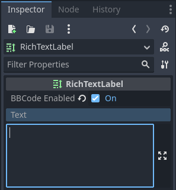
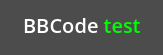
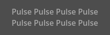
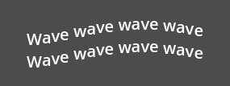
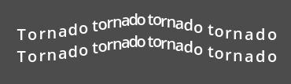
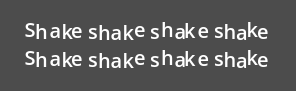
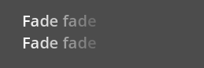
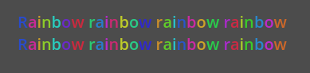
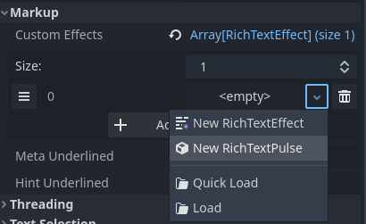

.. _doc_bbcode_in_richtextlabel:

BBCode in RichTextLabel
=======================

Introduction
------------

:ref:`class_Label` nodes are great for displaying basic text, but they have limitations.
If you want to change the color of the text, or its alignment, you can only do that to
the entire label. You can't make a part of the text have another color, or have a part
of the text centered. To get around these limitations, you would use a :ref:`class_RichTextLabel`.

:ref:`class_RichTextLabel` allows for complex formatting of text using a markup syntax or
the built-in API. It uses BBCodes for the markup syntax, a system of tags that designate
formatting rules for a part of the text. You may be familiar with them if you ever used
forums (also known as `bulletin boards`, hence the "BB" in "BBCode").

Unlike Label, RichTextLabel also comes with its own vertical scrollbar. This
scrollbar is automatically displayed if the text does not fit within the
control's size. The scrollbar can be disabled by unchecking the
**Scroll Active** property in the RichTextLabel inspector.

Note that the BBCode tags can also be used to some extent in the XML source of
the class reference. For more information, see :ref:`doc_class_reference_primer`.

.. seealso::

    You can see how BBCode in RichTextLabel works in action using the
    `Rich Text Label with BBCode demo project <https://github.com/godotengine/godot-demo-projects/tree/master/gui/rich_text_bbcode>`__.

Using BBCode
------------

By default, :ref:`class_RichTextLabel` functions like a normal :ref:`class_Label`.
It has the :ref:`property_text <class_RichTextLabel_property_text>` property, which you can
edit to have uniformly formatted text. To be able to use BBCode for rich text formatting,
you need to turn on the BBCode mode by setting :ref:`bbcode_enabled <class_RichTextLabel_property_bbcode_enabled>`.
After that, you can edit the :ref:`text <class_RichTextLabel_property_text>`
property using available tags. Both properties are located at the top of the inspector
after selecting a RichTextLabel node.

For example, ``BBCode [color=green]test[/color]`` would render the word "test" with
a green color.

Most BBCodes consist of 3 parts: the opening tag, the content and the closing
tag. The opening tag delimits the start of the formatted part, and can also
carry some configuration options. Some opening tags, like the ``color`` one
shown above, also require a value to work. Other opening tags may accept
multiple options (separated by spaces within the opening tag). The closing tag
delimits the end of the formatted part. In some cases, both the closing tag and
the content can be omitted.

Unlike BBCode in HTML, leading/trailing whitespace is not removed by a
RichTextLabel upon display. Duplicate spaces are also displayed as-is in the
final output. This means that when displaying a code block in a RichTextLabel,
you don't need to use a preformatted text tag.

.. code-block:: none

  [tag]content[/tag]
  [tag=value]content[/tag]
  [tag option1=value1 option2=value2]content[/tag]
  [tag][/tag]
  [tag]

.. note::

    RichTextLabel doesn't support entangled BBCode tags. For example, instead of
    using:

    ::

        [b]bold[i]bold italic[/b]italic[/i]

    Use:

    ::

        [b]bold[i]bold italic[/i][/b][i]italic[/i]

.. _doc_bbcode_in_richtextlabel_handling_user_input_safely:

Handling user input safely
--------------------------

In a scenario where users may freely input text (such as chat in a multiplayer
game), you should make sure users cannot use arbitrary BBCode tags that will be
parsed by RichTextLabel. This is to avoid inappropriate use of formatting, which
can be problematic if ``[url]`` tags are handled by your RichTextLabel (as players
may be able to create clickable links to phishing sites or similar).

Using RichTextLabel's ``[lb]`` and/or ``[rb]`` tags, we can replace the opening and/or
closing brackets of any BBCode tag in a message with those escaped tags. This
prevents users from using BBCode that will be parsed as tags – instead, the
BBCode will be displayed as text.

.. figure:: img/bbcode_in_richtextlabel_escaping_user_input.webp
   :align: center
   :alt: Example of unescaped user input resulting in BBCode injection (2nd line) and escaped user input (3rd line)

   Example of unescaped user input resulting in BBCode injection (2nd line) and escaped user input (3rd line)

The above image was created using the following script:

::

    extends RichTextLabel

    func _ready():
        append_chat_line("Player 1", "Hello world!")
        append_chat_line("Player 2", "Hello [color=red]BBCode injection[/color] (no escaping)!")
        append_chat_line_escaped("Player 2", "Hello [color=red]BBCode injection[/color] (with escaping)!")

    # Returns escaped BBCode that won't be parsed by RichTextLabel as tags.
    func escape_bbcode(bbcode_text):
        # We only need to replace opening brackets to prevent tags from being parsed.
        return bbcode_text.replace("[", "[lb]")

    # Appends the user's message as-is, without escaping. This is dangerous!
    func append_chat_line(username, message):
        append_text("%s: [color=green]%s[/color]\n" % [username, message])

    # Appends the user's message with escaping.
    # Remember to escape both the player name and message contents.
    func append_chat_line_escaped(username, message):
        append_text("%s: [color=green]%s[/color]\n" % [escape_bbcode(username), escape_bbcode(message)])

Stripping BBCode tags
---------------------

For certain use cases, it can be desired to remove BBCode tags from the string.
This is useful when displaying the RichTextLabel's text in another Control that
does not support BBCode (such as a tooltip):

.. code::

    extends RichTextLabel

    func _ready():
        var regex = RegEx.new()
        regex.compile("\\[.*?\\]")
        var text_without_tags = regex.sub(text, "", true)
        # `text_without_tags` contains the text with all BBCode tags removed.

.. note::

    Removing BBCode tags entirely isn't advised for user input, as it can
    modify the displayed text without users understanding why part of their
    message was removed.
    :ref:`Escaping user input <doc_bbcode_in_richtextlabel_handling_user_input_safely>`
    should be preferred instead.

Performance
-----------

In most cases, you can use BBCode directly as-is since text formatting is rarely
a heavy task. However, with particularly large RichTextLabels (such as console
logs spanning thousands of lines), you may encounter stuttering during gameplay
when the RichTextLabel's text is updated.

There are several ways to alleviate this:

- Use the ``append_text()`` function instead of appending to the ``text``
  property. This function will only parse BBCode for the added text, rather than
  parsing BBCode from the entire ``text`` property.
- Use ``push_[tag]()`` and ``pop()`` functions to add tags to RichTextLabel instead of
  using BBCode.
- Enable the **Threading > Threaded** property in RichTextLabel. This won't
  speed up processing, but it will prevent the main thread from blocking, which
  avoids stuttering during gameplay. Only enable threading if it's actually
  needed in your project, as threading has some overhead.

.. _doc_bbcode_in_richtextlabel_use_functions:

Using push_[tag]() and pop() functions instead of BBCode
--------------------------------------------------------

If you don't want to use BBCode for performance reasons, you can use functions
provided by RichTextLabel to create formatting tags without writing BBCode in
the text.

Every BBCode tag (including effects) has a ``push_[tag]()`` function (where
``[tag]`` is the tag's name). There are also a few convenience functions
available, such as ``push_bold_italics()`` that combines both ``push_bold()``
and ``push_italics()`` into a single tag. See the
:ref:`RichTextLabel class reference <class_RichTextLabel>` for a complete list of
``push_[tag]()`` functions.

The ``pop()`` function is used to end *any* tag. Since BBCode is a tag *stack*,
using ``pop()`` will close the most recently started tags first.

The following script will result in the same visual output as using
``BBCode [color=green]test [i]example[/i][/color]``:

::

    extends RichTextLabel

    func _ready():
        append_text("BBCode ")  # Trailing space separates words from each other.
        push_color(Color.GREEN)
        append_text("test ")  # Trailing space separates words from each other.
        push_italics()
        append_text("example")
        pop()  # Ends the tag opened by `push_italics()`.
        pop()  # Ends the tag opened by `push_color()`.

.. warning::

    Do **not** set the ``text`` property directly when using formatting functions.
    Appending to the ``text`` property will erase all modifications made to the
    RichTextLabel using the ``append_text()``, ``push_[tag]()`` and ``pop()``
    functions.

Reference
---------

.. list-table::
  :class: wrap-normal
  :width: 100%
  :widths: 60 40

  * - Tag
    - Example

  * - | **b**
      | Makes ``{text}`` use the bold (or bold italics) font of ``RichTextLabel``.

    - ``[b]{text}[/b]``

  * - | **i**
      | Makes ``{text}`` use the italics (or bold italics) font of ``RichTextLabel``.

    - ``[i]{text}[/i]``

  * - | **u**
      | Makes ``{text}`` underlined.

    - ``[u]{text}[/u]``

  * - | **s**
      | Makes ``{text}`` strikethrough.

    - ``[s]{text}[/s]``

  * - | **code**
      | Makes ``{text}`` use the mono font of ``RichTextLabel``.

    - ``[code]{text}[/code]``

  * - | **p**
      | Adds new paragraph with ``{text}``. Supports configuration options,
        see :ref:`doc_bbcode_in_richtextlabel_paragraph_options`.

    - | ``[p]{text}[/p]``
      | ``[p {options}]{text}[/p]``

  * - | **center**
      | Makes ``{text}`` horizontally centered.
      | Same as ``[p align=center]``.

    - ``[center]{text}[/center]``

  * - | **left**
      | Makes ``{text}`` horizontally left-aligned.
      | Same as ``[p align=left]``.

    - ``[left]{text}[/left]``

  * - | **right**
      | Makes ``{text}`` horizontally right-aligned.
      | Same as ``[p align=right]``.

    - ``[right]{text}[/right]``

  * - | **fill**
      | Makes ``{text}`` fill the full width of ``RichTextLabel``.
      | Same as ``[p align=fill]``.

    - ``[fill]{text}[/fill]``

  * - | **indent**
      | Indents ``{text}`` once.
        The indentation width is the same as with ``[ul]`` or ``[ol]``, but without a bullet point.

    - ``[indent]{text}[/indent]``

  * - | **url**
      | Creates a hyperlink (underlined and clickable text). Can contain optional
        ``{text}`` or display ``{link}`` as is.
      | **Must be handled with the "meta_clicked" signal to have an effect,** see :ref:`doc_bbcode_in_richtextlabel_handling_url_tag_clicks`.

    - | ``[url]{link}[/url]``
      | ``[url={link}]{text}[/url]``

  * - | **hint**
      | Creates a tooltip hint that is displayed when hovering the text with the mouse.
        Tooltip text should not be quoted (quotes will appear as-is in the tooltip otherwise).
    - | ``[hint={tooltip text displayed on hover}]{text}[/hint]``

  * - | **img**
      | Inserts an image from the ``{path}`` (can be any valid :ref:`class_Texture2D` resource).
      | If ``{width}`` is provided, the image will try to fit that width maintaining
        the aspect ratio.
      | If both ``{width}`` and ``{height}`` are provided, the image will be scaled
        to that size.
      | If ``{valign}`` configuration is provided, the image will try to align to the
        surrounding text, see :ref:`doc_bbcode_in_richtextlabel_image_alignment`.
      | Supports configuration options, see :ref:`doc_bbcode_in_richtextlabel_image_options`.

    - | ``[img]{path}[/img]``
      | ``[img={width}]{path}[/img]``
      | ``[img={width}x{height}]{path}[/img]``
      | ``[img={valign}]{path}[/img]``
      | ``[img {options}]{path}[/img]``

  * - | **font**
      | Makes ``{text}`` use a font resource from the ``{path}``.
      | Supports configuration options, see :ref:`doc_bbcode_in_richtextlabel_font_options`.

    - | ``[font={path}]{text}[/font]``
      | ``[font {options}]{text}[/font]``

  * - | **font_size**
      | Use custom font size for ``{text}``.

    - ``[font_size={size}]{text}[/font_size]``

  * - | **dropcap**
      | Use a different font size and color for ``{text}``, while making the tag's contents
        span multiple lines if it's large enough.
      | A `drop cap <https://www.computerhope.com/jargon/d/dropcap.htm>`__ is typically one
        uppercase character, but ``[dropcap]`` supports containing multiple characters.
        ``margins`` values are comma-separated and can be positive, zero or negative.
        Negative top and bottom margins are particularly useful to allow the rest of
        the paragraph to display below the dropcap.

    - ``[dropcap font_size={size} color={color} margins={left},{top},{right},{bottom}]{text}[/dropcap]``

  * - | **opentype_features**
      | Enables custom OpenType font features for ``{text}``. Features must be provided as
        a comma-separated ``{list}``.

    - | ``[opentype_features={list}]``
      | ``{text}``
      | ``[/opentype_features]``

  * - | **lang**
      | Overrides the language for ``{text}`` that is set by the **BiDi > Language** property
        in :ref:`class_RichTextLabel`. ``{code}`` must be an ISO :ref:`language code <doc_locales>`.
        This can be used to enforce the use of a specific script for a language without
        starting a new paragraph. Some font files may contain script-specific substitutes,
        in which case they will be used.

    - ``[lang={code}]{text}[/lang]``

  * - | **color**
      | Changes the color of ``{text}``. Color must be provided by a common name (see
        :ref:`doc_bbcode_in_richtextlabel_named_colors`) or using the HEX format (e.g.
        ``#ff00ff``, see :ref:`doc_bbcode_in_richtextlabel_hex_colors`).

    - ``[color={code/name}]{text}[/color]``

  * - | **bgcolor**
      | Draws the color behind ``{text}``. This can be used to highlight text.
        Accepts same values as the ``color`` tag.

    - ``[bgcolor={code/name}]{text}[/bgcolor]``

  * - | **fgcolor**
      | Draws the color in front of ``{text}``. This can be used to "redact" text by using
        an opaque foreground color. Accepts same values as the ``color`` tag.

    - ``[fgcolor={code/name}]{text}[/fgcolor]``

  * - | **outline_size**
      | Use custom font outline size for ``{text}``.

    - | ``[outline_size={size}]``
      | ``{text}``
      | ``[/outline_size]``

  * - | **outline_color**
      | Use custom outline color for ``{text}``. Accepts same values as the ``color`` tag.

    - | ``[outline_color={code/name}]``
      | ``{text}``
      | ``[/outline_color]``

  * - | **table**
      | Creates a table with the ``{number}`` of columns. Use the ``cell`` tag to define
        table cells.

    - ``[table={number}]{cells}[/table]``

  * - | **cell**
      | Adds a cell with ``{text}`` to the table.
      | If ``{ratio}`` is provided, the cell will try to expand to that value proportionally
        to other cells and their ratio values.
      | Supports configuration options, see :ref:`doc_bbcode_in_richtextlabel_cell_options`.

    - | ``[cell]{text}[/cell]``
      | ``[cell={ratio}]{text}[/cell]``
      | ``[cell {options}]{text}[/cell]``

  * - | **ul**
      | Adds an unordered list. List ``{items}`` must be provided by putting one item per
        line of text.
      | The bullet point can be customized using the ``{bullet}`` parameter,
        see :ref:`doc_bbcode_in_richtextlabel_unordered_list_bullet`.

    - | ``[ul]{items}[/ul]``
      | ``[ul bullet={bullet}]{items}[/ul]``

  * - | **ol**
      | Adds an ordered (numbered) list of the given ``{type}`` (see :ref:`doc_bbcode_in_richtextlabel_list_types`).
        List ``{items}`` must be provided by putting one item per line of text.

    - ``[ol type={type}]{items}[/ol]``

  * - | **lb**, **rb**
      | Adds ``[`` and ``]`` respectively. Allows escaping BBCode markup.
      | These are self-closing tags, which means you do not need to close them
        (and there is no ``[/lb]`` or ``[/rb]`` closing tag).

    - | ``[lb]b[rb]text[lb]/b[rb]`` will display as ``[b]text[/b]``.

  * - | Several Unicode control characters can be added using their own self-closing tags.
      | This can result in easier maintenance compared to pasting those
      | control characters directly in the text.

    - | ``[lrm]`` (left-to-right mark), ``[rlm]`` (right-to-left mark), ``[lre]`` (left-to-right embedding),
      | ``[rle]`` (right-to-left embedding), ``[lro]`` (left-to-right override), ``[rlo]`` (right-to-left override),
      | ``[pdf]`` (pop directional formatting), ``[alm]`` (Arabic letter mark), ``[lri]`` (left-to-right isolate),
      | ``[rli]`` (right-to-left isolate), ``[fsi]`` (first strong isolate), ``[pdi]`` (pop directional isolate),
      | ``[zwj]`` (zero-width joiner), ``[zwnj]`` (zero-width non-joiner), ``[wj]`` (word joiner),
      | ``[shy]`` (soft hyphen)

.. note::

    Tags for bold (``[b]``) and italics (``[i]``) formatting work best if the
    appropriate custom fonts are set up in the RichTextLabelNode's theme
    overrides. If no custom bold or italic fonts are defined,
    `faux bold and italic fonts <https://fonts.google.com/knowledge/glossary/faux_fake_pseudo_synthesized>`__
    will be generated by Godot. These fonts rarely look good in comparison to hand-made bold/italic font variants.

    The monospaced (``[code]``) tag **only** works if a custom font is set up in
    the RichTextLabel node's theme overrides. Otherwise, monospaced text will use the regular font.

    There are no BBCode tags to control vertical centering of text yet.

    Options can be skipped for all tags.

.. _doc_bbcode_in_richtextlabel_paragraph_options:

Paragraph options
~~~~~~~~~~~~~~~~~

- **align**

  +-----------+--------------------------------------------+
  | `Values`  | ``left``, ``center``, ``right``, ``fill``  |
  +-----------+--------------------------------------------+
  | `Default` | ``left``                                   |
  +-----------+--------------------------------------------+

  Text horizontal alignment.

- **bidi_override**, **st**

  +-----------+---------------------------------------------------------------------------+
  | `Values`  | ``default``, ``uri``, ``file``, ``email``, ``list``, ``none``, ``custom`` |
  +-----------+---------------------------------------------------------------------------+
  | `Default` | ``default``                                                               |
  +-----------+---------------------------------------------------------------------------+

  Structured text override.

- **direction**, **dir**

  +-----------+--------------------------------------------+
  | `Values`  | ``ltr``, ``rtl``, ``auto``                 |
  +-----------+--------------------------------------------+
  | `Default` | Inherit                                    |
  +-----------+--------------------------------------------+

  Base BiDi direction.

- **language**, **lang**

  +-----------+--------------------------------------------+
  | `Values`  | ISO language codes. See :ref:`doc_locales` |
  +-----------+--------------------------------------------+
  | `Default` | Inherit                                    |
  +-----------+--------------------------------------------+

  Locale override. Some font files may contain script-specific substitutes, in which case they will be used.

- **tab_stops**

  +-----------+----------------------------------------------------+
  | `Values`  | List of floating-point numbers, e.g. ``10.0,30.0`` |
  +-----------+----------------------------------------------------+
  | `Default` | Width of the space character in the font           |
  +-----------+----------------------------------------------------+

  Overrides the horizontal offsets for each tab character. When the end of the
  list is reached, the tab stops will loop over. For example, if you set
  ``tab_stops`` to ``10.0,30.0``, the first tab will be at ``10`` pixels, the
  second tab will be at ``10 + 30 = 40`` pixels, and the third tab will be at
  ``10 + 30 + 10 = 50`` pixels from the origin of the RichTextLabel.

.. _doc_bbcode_in_richtextlabel_handling_url_tag_clicks:

Handling ``[url]`` tag clicks
~~~~~~~~~~~~~~~~~~~~~~~~~~~~~

By default, ``[url]`` tags do nothing when clicked. This is to allow flexible use
of ``[url]`` tags rather than limiting them to opening URLs in a web browser.

To handle clicked ``[url]`` tags, connect the ``RichTextLabel`` node's
:ref:`meta_clicked <class_RichTextLabel_signal_meta_clicked>` signal to a script function.

For example, the following method can be connected to ``meta_clicked`` to open
clicked URLs using the user's default web browser::

    # This assumes RichTextLabel's `meta_clicked` signal was connected to
    # the function below using the signal connection dialog.
    func _richtextlabel_on_meta_clicked(meta):
        # `meta` is not guaranteed to be a String, so convert it to a String
        # to avoid script errors at run-time.
        OS.shell_open(str(meta))

For more advanced use cases, it's also possible to store JSON in an ``[url]``
tag's option and parse it in the function that handles the ``meta_clicked`` signal.
For example:

.. code-block:: none

  [url={"example": "value"}]JSON[/url]

.. _doc_bbcode_in_richtextlabel_image_options:

Image options
~~~~~~~~~~~~~

- **color**

  +-----------+--------------------------------------------+
  | `Values`  | Color name or color in HEX format          |
  +-----------+--------------------------------------------+
  | `Default` | Inherit                                    |
  +-----------+--------------------------------------------+

  Color tint of the image (modulation).

- **height**

  +-----------+--------------------------------------------+
  | `Values`  | Number in pixels                           |
  +-----------+--------------------------------------------+
  | `Default` | Inherit                                    |
  +-----------+--------------------------------------------+

  Target height of the image.

- **width**

  +-----------+--------------------------------------------+
  | `Values`  | Number in pixels                           |
  +-----------+--------------------------------------------+
  | `Default` | Inherit                                    |
  +-----------+--------------------------------------------+

  Target width of the image.

- **region**

  +-----------+--------------------------------------------+
  | `Values`  | x,y,width,height in pixels                 |
  +-----------+--------------------------------------------+
  | `Default` | Inherit                                    |
  +-----------+--------------------------------------------+

  Region rect of the image. This can be used to display a single image from a spritesheet.

.. _doc_bbcode_in_richtextlabel_image_alignment:

Image vertical alignment
~~~~~~~~~~~~~~~~~~~~~~~~

When a vertical alignment value is provided with the ``[img]`` tag the image
will try to align itself against the surrounding text. Alignment is performed
using a vertical point of the image and a vertical point of the text. There are
3 possible points on the image (``top``, ``center``, and ``bottom``) and 4
possible points on the text (``top``, ``center``, ``baseline``, and ``bottom``),
which can be used in any combination.

To specify both points, use their full or short names as a value of the image tag:

.. code-block:: none

    [img=top,bottom]
    [img=center,center]

You can also specify just one value (``top``, ``center``, or ``bottom``) to make
use of a corresponding preset (``top-top``, ``center-center``, and ``bottom-bottom``
respectively).

Short names for the values are ``t`` (``top``), ``c`` (``center``), ``l`` (``baseline``),
and ``b`` (``bottom``).

.. _doc_bbcode_in_richtextlabel_font_options:

Font options
~~~~~~~~~~~~

- **name**, **n**

  +-----------+--------------------------------------------+
  | `Values`  | A valid Font resource path.                |
  +-----------+--------------------------------------------+
  | `Default` | Inherit                                    |
  +-----------+--------------------------------------------+

  Font resource path.

- **size**, **s**

  +-----------+--------------------------------------------+
  | `Values`  | Number in pixels.                          |
  +-----------+--------------------------------------------+
  | `Default` | Inherit                                    |
  +-----------+--------------------------------------------+

  Custom font size.

.. _doc_bbcode_in_richtextlabel_named_colors:

Named colors
~~~~~~~~~~~~

For tags that allow specifying a color by name you can use names of the constants from
the built-in :ref:`class_Color` class. Named classes can be specified in a number of
styles using different casings: ``DARK_RED``, ``DarkRed``, and ``darkred`` will give
the same exact result.

.. _doc_bbcode_in_richtextlabel_hex_colors:

Hexadecimal color codes
~~~~~~~~~~~~~~~~~~~~~~~

For opaque RGB colors, any valid 6-digit hexadecimal code is supported, e.g.
``[color=#ffffff]white[/color]``. Shorthand RGB color codes such as ``#6f2``
(equivalent to ``#66ff22``) are also supported.

For transparent RGB colors, any RGBA 8-digit hexadecimal code can be used,
e.g. ``[color=#ffffff88]translucent white[/color]``. Note that the alpha channel
is the **last** component of the color code, not the first one. Short RGBA
color codes such as ``#6f28`` (equivalent to ``#66ff2288``) are supported as well.

.. _doc_bbcode_in_richtextlabel_cell_options:

Cell options
~~~~~~~~~~~~

- **expand**

  +-----------+--------------------------------------------+
  | `Values`  | Integer number                             |
  +-----------+--------------------------------------------+
  | `Default` | 1                                          |
  +-----------+--------------------------------------------+

  Cell expansion ratio. This defines which cells will try to expand to
  proportionally to other cells and their expansion ratios.

- **border**

  +-----------+--------------------------------------------+
  | `Values`  | Color name or color in HEX format          |
  +-----------+--------------------------------------------+
  | `Default` | Inherit                                    |
  +-----------+--------------------------------------------+

  Cell border color.

- **bg**

  +-----------+--------------------------------------------+
  | `Values`  | Color name or color in HEX format          |
  +-----------+--------------------------------------------+
  | `Default` | Inherit                                    |
  +-----------+--------------------------------------------+

  Cell background color. For alternating odd/even row backgrounds,
  you can use ``bg=odd_color,even_color``.

.. _doc_bbcode_in_richtextlabel_unordered_list_bullet:

Unordered list bullet
~~~~~~~~~~~~~~~~~~~~~

By default, the ``[ul]`` tag uses the ``U+2022`` "Bullet" Unicode glyph as the
bullet character. This behavior is similar to web browsers. The bullet character
can be customized using ``[ul bullet={bullet}]``. If provided, this ``{bullet}``
parameter must be a *single* character with no enclosing quotes (for example,
``[bullet=*]``). Additional characters are ignored. The bullet character's
width does not affect the list's formatting.

See `Bullet (typography) on Wikipedia <https://en.wikipedia.org/wiki/Bullet_(typography)>`__
for a list of common bullet characters that you can paste directly in the ``bullet`` parameter.

.. _doc_bbcode_in_richtextlabel_list_types:

Ordered list types
~~~~~~~~~~~~~~~~~~

Ordered lists can be used to automatically mark items with numbers
or letters in ascending order. This tag supports the following
type options:

- ``1`` - Numbers, using language specific numbering system if possible.
- ``a``, ``A`` - Lower and upper case Latin letters.
- ``i``, ``I`` - Lower and upper case Roman numerals.

Text effects
------------

BBCode can also be used to create different text effects that can optionally be
animated. Five customizable effects are provided out of the box, and you can
easily create your own. By default, animated effects will pause
:ref:`when the SceneTree is paused <doc_pausing_games>`. You can change this
behavior by adjusting the RichTextLabel's **Process > Mode** property.

All examples below mention the default values for options in the listed tag format.

.. note::

    Text effects that move characters' position may result in characters being
    clipped by the RichTextLabel node bounds.

    You can resolve this by disabling **Control > Layout > Clip Contents** in
    the inspector after selecting the RichTextLabel node, or ensuring there is
    enough margin added around the text by using line breaks above and below the
    line using the effect.

Pulse
~~~~~

Pulse creates an animated pulsing effect that multiplies each character's
opacity and color. It can be used to bring attention to specific text. Its tag
format is ``[pulse freq=1.0 color=#ffffff40 ease=-2.0]{text}[/pulse]``.

``freq`` controls the frequency of the half-pulsing cycle (higher is faster). A
full pulsing cycle takes ``2 * (1.0 / freq)`` seconds. ``color`` is the target
color multiplier for blinking. The default mostly fades out text, but not
entirely. ``ease`` is the easing function exponent to use. Negative values
provide in-out easing, which is why the default is ``-2.0``.

Wave
~~~~

Wave makes the text go up and down. Its tag format is
``[wave amp=50.0 freq=5.0 connected=1]{text}[/wave]``.

``amp`` controls how high and low the effect goes, and ``freq`` controls how
fast the text goes up and down. A ``freq`` value of ``0`` will result in no
visible waves, and negative ``freq`` values won't display any waves either. If
``connected`` is ``1`` (default), glyphs with ligatures will be moved together.
If ``connected`` is ``0``, each glyph is moved individually even if they are
joined by ligatures. This can work around certain rendering issues with font
ligatures.

Tornado
~~~~~~~

Tornado makes the text move around in a circle. Its tag format is
``[tornado radius=10.0 freq=1.0 connected=1]{text}[/tornado]``.

``radius`` is the radius of the circle that controls the offset, ``freq`` is how
fast the text moves in a circle. A ``freq`` value of ``0`` will pause the
animation, while negative ``freq`` will play the animation backwards. If
``connected`` is ``1`` (default), glyphs with ligatures will be moved together.
If ``connected`` is ``0``, each glyph is moved individually even if they are
joined by ligatures. This can work around certain rendering issues with font
ligatures.

Shake
~~~~~

Shake makes the text shake. Its tag format is
``[shake rate=20.0 level=5 connected=1]{text}[/shake]``.

``rate`` controls how fast the text shakes, ``level`` controls how far the text
is offset from the origin. If ``connected`` is ``1`` (default), glyphs with
ligatures will be moved together. If ``connected`` is ``0``, each glyph is moved
individually even if they are joined by ligatures. This can work around certain
rendering issues with font ligatures.

Fade
~~~~

Fade creates a static fade effect that multiplies each character's opacity.
Its tag format is ``[fade start=4 length=14]{text}[/fade]``.

``start`` controls the starting position of the falloff relative to where the fade
command is inserted, ``length`` controls over how many characters should the fade
out take place.

Rainbow
~~~~~~~

Rainbow gives the text a rainbow color that changes over time. Its tag format is
``[rainbow freq=1.0 sat=0.8 val=0.8]{text}[/rainbow]``.

``freq`` is the number of full rainbow cycles per second, ``sat`` is the
saturation of the rainbow, ``val`` is the value of the rainbow. A ``freq`` value
of ``0`` will pause the animation, while negative ``freq`` will play the
animation backwards.

Font outlines are *not* affected by the rainbow effect (they keep their original color).
Existing font colors are overridden by the rainbow effect. However, CanvasItem's
**Modulate** and **Self Modulate** properties will affect how the rainbow effect
looks, as modulation multiplies its final colors.

Custom BBCode tags and text effects
-----------------------------------

You can extend the :ref:`class_RichTextEffect` resource type to create your own custom
BBCode tags. Create a new script file that extends the :ref:`class_RichTextEffect` resource type
and give the script a ``class_name`` so that the effect can be selected in the inspector.
Add the ``@tool`` annotation to your GDScript file if you wish to have these custom effects
run within the editor itself. The RichTextLabel does not need to have a script attached,
nor does it need to be running in ``tool`` mode. The new effect can be registered in
the Inspector by adding it to the **Markup > Custom Effects** array, or in code with the
:ref:`install_effect() <class_RichTextLabel_method_install_effect>` method:

   Selecting a custom RichTextEffect after saving a script that extends RichTextEffect with a ``class_name``

.. warning::

    If the custom effect is not registered within the RichTextLabel's
    **Markup > Custom Effects** property, no effect will be visible and the original
    tag will be left as-is.

There is only one function that you need to extend: ``_process_custom_fx(char_fx)``.
Optionally, you can also provide a custom BBCode identifier simply by adding a member
name ``bbcode``. The code will check the ``bbcode`` property automatically or will
use the name of the file to determine what the BBCode tag should be.

``_process_custom_fx``
~~~~~~~~~~~~~~~~~~~~~~

This is where the logic of each effect takes place and is called once per glyph
during the draw phase of text rendering. This passes in a :ref:`class_CharFXTransform`
object, which holds a few variables to control how the associated glyph is rendered:

- ``identity`` specifies which custom effect is being processed. You should use that for
  code flow control.
- ``outline`` is ``true`` if effect is called for drawing text outline.
- ``range`` tells you how far into a given custom effect block you are in as an
  index.
- ``elapsed_time`` is the total amount of time the text effect has been running.
- ``visible`` will tell you whether the glyph is visible or not and will also allow you
  to hide a given portion of text.
- ``offset`` is an offset position relative to where the given glyph should render under
  normal circumstances.
- ``color`` is the color of a given glyph.
- ``glyph_index`` and ``font`` is glyph being drawn and font data resource used to draw it.
- Finally, ``env`` is a :ref:`class_Dictionary` of parameters assigned to a given custom
  effect. You can use :ref:`get() <class_Dictionary_method_get>` with an optional default value
  to retrieve each parameter, if specified by the user. For example ``[custom_fx spread=0.5
  color=#FFFF00]test[/custom_fx]`` would have a float ``spread`` and Color ``color``
  parameters in its ``env`` Dictionary. See below for more usage examples.

The last thing to note about this function is that it is necessary to return a boolean
``true`` value to verify that the effect processed correctly. This way, if there's a problem
with rendering a given glyph, it will back out of rendering custom effects entirely until
the user fixes whatever error cropped up in their custom effect logic.

Here are some examples of custom effects:

Ghost
~~~~~

::

    @tool
    extends RichTextEffect
    class_name RichTextGhost

    # Syntax: [ghost freq=5.0 span=10.0][/ghost]

    # Define the tag name.
    var bbcode = "ghost"

    func _process_custom_fx(char_fx):
        # Get parameters, or use the provided default value if missing.
        var speed = char_fx.env.get("freq", 5.0)
        var span = char_fx.env.get("span", 10.0)

        var alpha = sin(char_fx.elapsed_time * speed + (char_fx.range.x / span)) * 0.5 + 0.5
        char_fx.color.a = alpha
        return true

Matrix
~~~~~~

::

    @tool
    extends RichTextEffect
    class_name RichTextMatrix

    # Syntax: [matrix clean=2.0 dirty=1.0 span=50][/matrix]

    # Define the tag name.
    var bbcode = "matrix"

    # Gets TextServer for retrieving font information.
    func get_text_server():
        return TextServerManager.get_primary_interface()

    func _process_custom_fx(char_fx):
        # Get parameters, or use the provided default value if missing.
        var clear_time = char_fx.env.get("clean", 2.0)
        var dirty_time = char_fx.env.get("dirty", 1.0)
        var text_span = char_fx.env.get("span", 50)

        var value = char_fx.glyph_index

        var matrix_time = fmod(char_fx.elapsed_time + (char_fx.range.x / float(text_span)), \
                               clear_time + dirty_time)

        matrix_time = 0.0 if matrix_time < clear_time else \
                      (matrix_time - clear_time) / dirty_time

        if matrix_time > 0.0:
            value = int(1 * matrix_time * (126 - 65))
            value %= (126 - 65)
            value += 65
        char_fx.glyph_index = get_text_server().font_get_glyph_index(char_fx.font, 1, value, 0)
        return true

This will add a few new BBCode commands, which can be used like so:

.. code-block:: none

    [center][ghost]This is a custom [matrix]effect[/matrix][/ghost] made in
    [pulse freq=5.0 height=2.0][pulse color=#00FFAA freq=2.0]GDScript[/pulse][/pulse].[/center]
