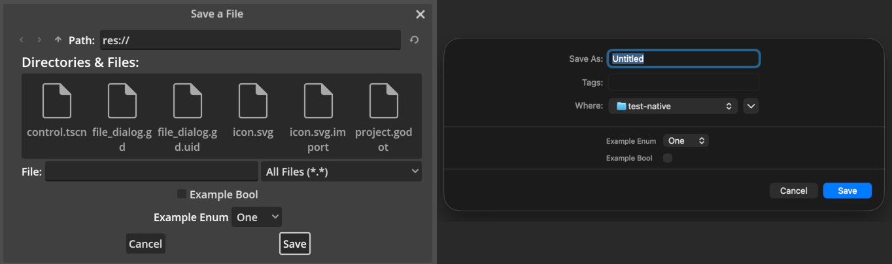
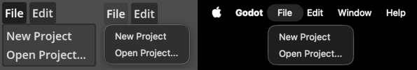
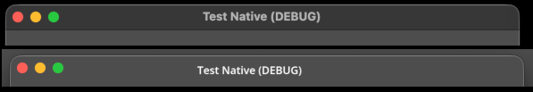
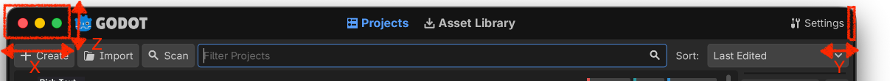

.. _doc_creating_applications:

Creating applications
=====================

Godot features an extensive built-in UI system, and its small distribution
size can make it a suitable alternative to frameworks like Electron or Qt.

This page provides guidelines for creating non-game applications with Godot,
as well as instructions on performing common tasks to improve desktop integration.

.. note::

    Godot is a game engine first and foremost. This means that creating
    applications with Godot is a byproduct of its feature set, and not its
    primary focus of development.

.. seealso::

    Check out `Material Maker <https://github.com/RodZill4/material-maker>`__ and
    `Pixelorama <https://github.com/Orama-Interactive/Pixelorama>`__ for examples of
    open source applications made with Godot.

Performing common tasks
-----------------------

Spawning multiple windows
^^^^^^^^^^^^^^^^^^^^^^^^^

*This is only supported on Windows, macOS, and Linux (X11/XWayland only,
not in native Wayland mode).*

Additional windows can be created using the :ref:`class_Window` node.
Windows can be moved, resized, minimized, and closed independently
from the main application window.

However, if you close the main window, all other windows will also be closed
since closing the main window ends the process. You can avoid this by
minimizing the main window, setting its :ref:`unfocusable <class_Window_property_unfocusable>`
property to ``true`` (to hide it from the taskbar and task switcher),
then creating additional Window nodes immediately on startup. Remember
to provide an alternative means of exiting the application in this case,
such as a :ref:`tray icon <doc_creating_applications_tray_icon>`.

Constraining the window size
^^^^^^^^^^^^^^^^^^^^^^^^^^^^

Most applications can only render correctly starting from a certain minimum
window size. For more specific use cases, it may also be desired to force
a maximum window size.

Size limits can be enforced using the :ref:`min_size <class_Window_property_min_size>`
and :ref:`max_size <class_Window_property_max_size>` properties on a Window node.
Remember to multiply these size limits according to the application's scale factor
(see :ref:`doc_creating_applications_scaling_to_hidpi_displays` for details).

.. tip::

    As a reminder, you can retrieve the root Window node to set properties
    on it using :ref:`get_window() <class_Node_method_get_window>` on any Node.

Using native file dialogs
^^^^^^^^^^^^^^^^^^^^^^^^^

*This is only supported on Windows, macOS, Linux, and Android.*

By default, Godot uses its own :ref:`class_FileDialog` implementation for file dialogs.
However, you can use the operating system's native file dialogs instead. This is
generally preferred by users, as native file dialogs better integrate with the
desktop environment and provide a more familiar experience.

You can opt into native file dialogs by
enabling the :ref:`use_native_dialog <class_FileDialog_property_use_native_dialog>`
property on the FileDialog node. This must be done on each FileDialog node
used in the project, as there is no project setting to control this behavior
globally.

   Comparison between standard FileDialog (left) and native file dialog (right) on macOS

.. note::

    See the :ref:`property description <class_FileDialog_property_use_native_dialog>`
    for details on platform support.

    Additionally, on macOS, native file dialogs are not supported when game embedding
    is enabled in the editor. To test this functionality when running the project,
    make sure you disable game embedding by switching to the :menu:`Game` screen,
    clicking the 3 vertical dots and unchecking :menu:`Embed Game on Next Play`.

.. _doc_creating_applications_tray_icon:

Creating an icon in the system tray
^^^^^^^^^^^^^^^^^^^^^^^^^^^^^^^^^^^

*This is only supported on Windows and macOS.*

You can create one or more icons in the system tray (also known as the
notification area) using a :ref:`class_StatusIndicator` node.
In addition to a tooltip, this node can have a :ref:`class_PopupMenu` node assigned,
so that a dropdown can be shown when clicking the icon.

StatusIndicator also has a :ref:`pressed <class_StatusIndicator_signal_pressed>`
signal that is emitted when the icon is clicked. Use this to perform an action
without making a dropdown show up, or perform different actions depending on
which mouse button was pressed.

After creating a tray icon, you may also want to implement "minimize on close"
behavior. This means that when the user attempts to close the application using
the window manager X button, it will minimize to the tray instead. To do so,
attach this script to an :ref:`Autoload <doc_singletons_autoload>`
*scene* with a StatusIndicator as the root node:

::

    extends StatusIndicator

    # Disable this behavior when running from the editor with game embedding,
    # as it doesn't cooperate well.
    var tray_icon_supported = (
            DisplayServer.has_feature(DisplayServer.FEATURE_STATUS_INDICATOR)
            and not Engine.is_embedded_in_editor()
        )

    func _ready():
        visible = false

        if tray_icon_supported:
            get_tree().auto_accept_quit = false
            get_window().focus_entered.connect(
                    func():
                        # Hide the tray icon when the window gains focus,
                        # which means it was restored from its minimized state.
                        visible = false
                )
            pressed.connect(
                    func(_mouse_button, _position):
                        # Restore the application when the tray icon is clicked.
                        get_window().mode = Window.MODE_WINDOWED
                )

    func _notification(what):
        if not tray_icon_supported:
            return

        match what:
            NOTIFICATION_WM_CLOSE_REQUEST:
                get_window().mode = Window.MODE_MINIMIZED
                # Show the tray icon.
                visible = true

See :ref:`doc_handling_quit_requests` for details on overriding the behavior
when the user tries to close the application. This is important to handle
when the user has unsaved changes to avoid data loss.

.. note::

    When multiple StatusIndicator nodes are present, their order in the
    system tray is determined by the order in which they are added
    to the scene tree.

Using the global menu
^^^^^^^^^^^^^^^^^^^^^

*This is only supported on macOS.*

On macOS, applications can use the system's global menu bar instead of displaying
a menu bar inside the application window. This is also referred to as a *native menu*
in Godot.

   Comparison between standard MenuBar (left), MenuBar with native popups (middle), and native menu (right) on macOS

Godot supports creating menus through the :ref:`class_MenuBar` node, which displays
its :ref:`class_PopupMenu` children as menus. You can enable the global menu
support on a given MenuBar node by enabling its
:ref:`prefer_global_menu <class_MenuBar_property_prefer_global_menu>` property
in the inspector. On macOS, this will cause the MenuBar node to disappear and take
no space, with its menus being displayed in the system's global menu bar instead.
If this property is disabled, the MenuBar node will display its menus inside the
application window as usual, but native popups are still used when supported by
the operating system.

.. note::

    The app menu (with the project name in bold), as well as the :menu:`Window` and
    :menu:`Help` menus are always present on macOS. You should not add these
    to the global menu manually.

    In Godot 4.6 and later, you can add new items within these menus by
    changing the :ref:`system_menu_id <class_PopupMenu_property_system_menu_id>`
    property on the PopupMenu node. You can choose between **Application Menu**
    (the first menu with the application name in bold), **Window Menu**,
    **Help Menu** and **Dock** (shown when right-clicking the icon in the Dock).
    Standard menu items that are already present in those menus will be preserved:

    .. figure:: img/creating_applications_native_menu_window.webp
       :align: center
       :alt: Custom options added to the system Window menu on macOS

       Custom options added to the system Window menu on macOS

A project can have multiple MenuBar nodes. If multiple MenuBar nodes have the
**Prefer Global Menu** property enabled, the menu options will be added at the
index defined by the **Start Index** property when the MenuBar node is added to the
scene tree. This allows putting context-specific menus at the end of the menu bar,
so that the first menu options stay in place when the additional menu bar is
added or removed.

For more advanced use cases, you can also use the :ref:`class_NativeMenu` singleton
directly without using the MenuBar node.

.. note::

    Global menu integration is not supported when game embedding
    is enabled in the editor. To test this functionality when running the project,
    make sure you disable game embedding by switching to the :menu:`Game` screen,
    clicking the 3 vertical dots and unchecking :menu:`Embed Game on Next Play`.

Using client-side decorations
^^^^^^^^^^^^^^^^^^^^^^^^^^^^^

*This is only supported on macOS.*

Many modern applications use *client-side decorations* (CSD) instead of relying
on the operating system's window manager to draw the title bar and window borders
(server-side decorations). This allows for a more customizable appearance and
better integration with the application's UI.

Godot currently only supports client-side decorations on macOS. This can be used
by enabling the
:ref:`display/window/size/extend_to_title <class_ProjectSettings_property_display/window/size/extend_to_title>`
project setting.

   Comparison between standard window decorations (top) and client-side decorations (bottom) on macOS

After enabling client-side decorations, the window border will no longer display,
and minimize/maximize/close buttons will show as an overlay to the application.
You need to make sure the application provides enough of a margin at the top for
the buttons to display comfortably, while also displaying the window title using
a Label node or similar.

To conditionally adapt your UI according to whether client-side decorations
are enabled, use :ref:`DisplayServer.has_feature <class_DisplayServer_method_has_feature>`
and also check the current value of
:ref:`Window.extend_to_title <class_Window_property_extend_to_title>`
(which is what the project setting changes):

::

    func _ready():
        if DisplayServer.has_feature(FEATURE_EXTEND_TO_TITLE) and get_window().extend_to_title:
            # Adjust UI for client-side decorations (a MarginContainer node
            # can be useful here). Also set the window title to be displayed
            # according to the native window title.
            $WindowTitle.visible = true
            $WindowTitle.text = get_window().title
            if OS.is_debug_build():
                $WindowTitle.text += " (DEBUG)"

To correctly position the window title, consider using
:ref:`DisplayServer.window_get_safe_title_margins() <class_DisplayServer_method_window_get_safe_title_margins>`
which returns a Vector3 where ``x`` is the left margin, ``y`` is the right
margin (will increase when the system uses right-to-left typesetting),
and ``z`` is the height. Additionally, you can call
:ref:`DisplayServer.window_set_window_buttons_offset() <class_DisplayServer_method_window_set_window_buttons_offset>`
to adjust the position of the close/minimize/maximize buttons (usually to
vertically center them).

    Safe title margins when using client-side decorations on macOS

.. note::

    On macOS, client-side decorations are not supported when game embedding
    is enabled in the editor. To test this functionality when running the project,
    make sure you disable game embedding by switching to the :menu:`Game` screen,
    clicking the 3 vertical dots and unchecking :menu:`Embed Game on Next Play`.

Sending desktop notifications
^^^^^^^^^^^^^^^^^^^^^^^^^^^^^

Godot currently does not have native support for sending desktop notifications.

However, on macOS and Linux, you can use the ``osascript`` and ``notify-send``
command line utilities respectively to send desktop notifications:

::

    func send_notification(title, message):
        var app_name = ProjectSettings.get_setting("application/config/name")
        if app_name.is_empty():
            app_name = "Unnamed Project"

        if OS.has_feature("macos") and not OS.is_sandboxed():
            # Note that this will not work if the project is exported in sandbox mode
            # (e.g. for the Mac App Store).
            OS.execute("osascript", [
                    "-e",
                    'display notification \\"%s\\" with title \\"%s\\" subtitle \\"%s\\"' % [
                        message,
                        app_name,
                        title,
                    ]
                ])
        elif OS.has_feature("linuxbsd"):
            OS.execute("notify-send", ["--app-name", app_name, title, message])

    func _ready():
        send_notification("Success", "Operation completed successfully.")

Unfortunately, there is no equivalent that's available out of the box on
Windows.

Remembering window position and size across sessions
^^^^^^^^^^^^^^^^^^^^^^^^^^^^^^^^^^^^^^^^^^^^^^^^^^^^

Godot doesn't have built-in support for remembering window position
and size across sessions, but it can be manually implemented using a script.
A basic example that supports multi-monitor setups would be an
:ref:`Autoload <doc_singletons_autoload>` with this script:

::

    extends Node

    # Use a dedicated configuration file for the window state.
    # This way, the application's other configuration files are left
    # untouched and can be put in version control without unnecessary diffs
    # being produced.
    const CONFIG_WINDOW_PATH = "user://window.ini"

    var config_file = ConfigFile.new()

    func _enter_tree():
        config_file.load(CONFIG_WINDOW_PATH)

        # Do not restore previous window state if running from the editor
        # with game embedding enabled.
        if not Engine.is_embedded_in_editor():
            var window_screen = config_file.get_value("main", "screen", -1)
            if window_screen is int:
                get_window().current_screen = window_screen

            var window_mode = config_file.get_value("main", "mode", -1)
            if window_mode is Window.Mode:
                get_window().mode = window_mode

            var window_position = config_file.get_value("main", "position", -1)
            if window_position is Vector2i:
                get_window().position = window_position

            var window_size = config_file.get_value("main", "size", -1)
            if window_size is Vector2i:
                get_window().size = window_size

    func _exit_tree():
        # Save the current window state when the application is quit normally.
        # In a real world scenario, it's recommended to also save this information
        # regularly (e.g. with a Timer node), so that the window state can be
        # restored after a crash or when terminated externally.
        config_file.set_value("main", "screen", get_window().current_screen)
        config_file.set_value("main", "mode", get_window().mode)
        config_file.set_value("main", "position", get_window().position)
        config_file.set_value("main", "size", get_window().size)
        config_file.save(CONFIG_WINDOW_PATH)

.. note::

    The above example only tracks the main window's position.
    In applications that spawn multiple windows, you will need
    to save and load each window position's and size separately.

Hiding the window during the splash screen
^^^^^^^^^^^^^^^^^^^^^^^^^^^^^^^^^^^^^^^^^^

For some applications, it may be preferred to hide the splash screen
to draw a custom splash screen with a progress bar instead (or even
no splash screen at all, if the application boots quickly).

Godot lacks native support for hiding the window during the splash screen,
but you can achieve this by using a very small transparent window in the
project settings, then resizing the window and disabling transparency once
the main scene is loaded.

To do so, project settings should be configured as follows:

- :ref:`application/boot_splash/bg_color <class_ProjectSettings_property_application/boot_splash/bg_color>`
  set to a transparent black color (RGBA: 0, 0, 0, 0).
- :ref:`application/boot_splash/show_image <class_ProjectSettings_property_application/boot_splash/show_image>`
  disabled.
- :ref:`display/window/size/borderless <class_ProjectSettings_property_display/window/size/borderless>`
  enabled.
- :ref:`display/window/size/no_focus <class_ProjectSettings_property_display/window/size/no_focus>`
  enabled.
- :ref:`display/window/size/window_width_override <class_ProjectSettings_property_display/window/size/window_width_override>`
  set to ``1``.
- :ref:`display/window/size/window_height_override <class_ProjectSettings_property_display/window/size/window_height_override>`
  set to ``1``.
- :ref:`display/window/per_pixel_transparency/allowed <class_ProjectSettings_property_display/window/per_pixel_transparency/allowed>`
  enabled.
- :ref:`display/window/size/transparent <class_ProjectSettings_property_display/window/size/transparent>`
  enabled.
- :ref:`rendering/viewport/transparent_background <class_ProjectSettings_property_rendering/viewport/transparent_background>`
  enabled.

This script can be used as an :ref:`Autoload <doc_singletons_autoload>`
to restore original settings once the splash screen is done displaying:

::

    extends Node

    func _enter_tree():
        # Wait a frame to be rendered before restoring the window properties.
        # Otherwise, properties will be restored too early and the window border
        # will show up around a transparent window.
        await get_tree().process_frame

        get_viewport().transparent_bg = false
        get_window().transparent = false
        get_window().borderless = false
        get_window().size = Vector2i(1152, 648)

Displaying the application as an overlay
^^^^^^^^^^^^^^^^^^^^^^^^^^^^^^^^^^^^^^^^

It is possible to display the application window as an overlay that stays
on top of other windows. This can be useful for applications like
widgets or system monitors.

To do so, enable **all** the following project settings:

- :ref:`display/window/size/borderless <class_ProjectSettings_property_display/window/size/borderless>`
- :ref:`display/window/per_pixel_transparency/allowed <class_ProjectSettings_property_display/window/per_pixel_transparency/allowed>`
- :ref:`display/window/size/transparent <class_ProjectSettings_property_display/window/size/transparent>`
- :ref:`rendering/viewport/transparent_background <class_ProjectSettings_property_rendering/viewport/transparent_background>`
- :ref:`display/window/size/always_on_top <class_ProjectSettings_property_display/window/size/always_on_top>`
- :ref:`display/window/size/no_focus <class_ProjectSettings_property_display/window/size/no_focus>`

  - This prevents the overlay from receiving keyboard input,
    and also hides from the taskbar and task switcher. Mouse input
    can still be received by the overlay (see below).

Remember to poosition and resize the window using scripts,
as a borderless window can generally not be moved by the user.

To allow mouse input to pass through to the background application,
set the :ref:`mouse_passthrough <class_Window_property_mouse_passthrough>`
property to ``true`` on the Window that is being drawn as an overlay.
You can also define a polygon in
:ref:`mouse_passthrough_polygon <class_Window_property_mouse_passthrough_polygon>`,
so that certain areas can still intercept mouse input on the overlay.

Additionally, you may want to set the
:ref:`exclude_from_capture <class_Window_property_exclude_from_capture>`
property to ``true`` to prevent the overlay from appearing in screenshots or recordings.
This hint is implemented on Windows and macOS only, and it is on a best-effort
basis, so it should not be used as an absolute security measure or DRM.

.. note::

    Displaying as an overlay is not supported when game embedding
    is enabled in the editor. To test this functionality
    when running the project, make sure you disable game embedding by
    switching to the :menu:`Game` screen, clicking the 3 vertical dots
    and unchecking :menu:`Embed Game on Next Play`.

    Additionally, keep in mind overlays cannot be shown on top
    of another application if the application in question uses
    exclusive fullscreen. Borderless fullscreen must be used
    instead for overlays to be visible.

    There are also `known issues <https://github.com/godotengine/godot/issues/76167>`__
    with transparent window display on Windows with hybrid GPU setups
    (such as NVIDIA Optimus). Switching renderers may
    help resolve the issue.

    On Linux with X11, transparency will not work if the user
    has disabled compositing in the window manager settings.

.. _doc_creating_applications_scaling_to_hidpi_displays:

Scaling to hiDPI displays
^^^^^^^^^^^^^^^^^^^^^^^^^

Modern displays vary a lot in terms of pixel density, which means
a different scaling factor is often needed to ensure UI elements
are readable. The scaling factor can also be provided as a manual
adjustment for the user, so that the application remains comfortable
to use.

Godot's multiple resolutions support is well-suited
to scaling applications when configured correctly. Follow the
instructions in the
:ref:`non-game application section of the Multiple resolutions documentation <doc_multiple_resolutions_non_game_application>`.

.. note::

    Godot currently only supports reading the screen scale factor
    from the OS settings on macOS, Android, and Linux (Wayland only).
    On Linux (X11) and Windows, you will need to provide a manual
    scaling option for the user to adjust the UI scale as needed.

Screen reader integration
^^^^^^^^^^^^^^^^^^^^^^^^^

Screen readers allow visually impaired people to use an application
by reading out the UI elements and providing navigation controls.
Braille displays are another approach that also rely on accessibility
information to function properly.

Godot automatically enables screen reader support if a screen reader
is detected as running. This can be configured in the Project Settings
using :ref:`accessibility/general/accessibility_support <class_ProjectSettings_property_accessibility/general/accessibility_support>`
to disable it in situations where it is not desired. It can also be
forcibly enabled, which is useful when using accessibility debugging
tools that are not recognized as screen readers by Godot.

Godot uses the `AccessKit <https://accesskit.dev/>`__ library
for screen reader integration.

.. tip::

    Since screen reader support uses the screen reader application itself
    to play audio (rather than the Godot project), it will work
    even if the audio driver is set to ``Dummy`` in the project settings
    as described below.

It's strongly recommended to test your application with popular screen
readers on your target platforms to ensure a good user experience for
visually impaired users. Examples include
`NVDA <https://www.nvaccess.org/download/>`__ on Windows,
`VoiceOver <https://www.apple.com/accessibility/features/?vision>`__
on macOS, and `Orca <https://help.gnome.org/orca/>`__ on Linux.

To get screen reader support to a good level of usability, significant
amounts of work are required. You need to define accessibility labels
using the :ref:`Control.accessibility_name <class_Control_property_accessibility_name>`
and :ref:`Control.accessibility_description <class_Control_property_accessibility_description>`
properties, and ensure the UI flows in a logical order when read by a screen reader.

.. seealso::

    See also :ref:`doc_text_to_speech` for text-to-speech functionality
    that is separate from screen readers.

Recommended project settings
----------------------------

Desktop integration
^^^^^^^^^^^^^^^^^^^

To allow the application to better integrate with the desktop environment,
you can set these project settings as follows:

- Enable :ref:`application/config/use_custom_user_dir <class_ProjectSettings_property_application/config/use_custom_user_dir>`
  and set :ref:`application/config/custom_user_dir_name <class_ProjectSettings_property_application/config/custom_user_dir_name>`
  to a suitable name for your application. This ensures user settings and
  files are stored in a dedicated folder instead of the
  :ref:`default Godot folder <doc_data_paths_accessing_persistent_user_data>`.
  By convention, it's a good idea to use normal case on Windows
  (e.g. ``Application Name``) and kebab-case (e.g. ``application-name``)
  on macOS and Linux.

- Configure native icons that match the operating system's design guidelines
  using :ref:`application/config/windows_native_icon <class_ProjectSettings_property_application/config/windows_native_icon>`
  (in ICO format) and
  :ref:`application/config/macos_native_icon <class_ProjectSettings_property_application/config/macos_native_icon>`
  (in ICNS format). By default, Godot will automatically generate native icons
  based on the project icon, but this is not always optimal.

  - On Windows, using a manually designed ICO file allows you to use different
    icons for different resolutions. This can be used to create a special design
    at lower resolutions for better readability.

  - macOS has `app icon guidelines <https://developer.apple.com/design/human-interface-guidelines/app-icons/>`__
    that differ significantly from other platforms.
    Using a tailored native icon design ensures the application better fits in
    its desktop environment.

- Disable
  :ref:`display/window/subwindows/embed_subwindows <class_ProjectSettings_property_display/window/subwindows/embed_subwindows>`,
  so that additional windows use the operating system theming and are
  seen as native operating system windows.

Performance
^^^^^^^^^^^

Here are some project settings you can use to reduce CPU, GPU, and memory utilization:

- Use the Compatibility renderer if you don't need features that are exclusive
  to Forward+ or Mobile. The Compatibility renderer has lower hardware requirements
  and generally launches faster, which makes it a better option for applications.
  Creating new windows is also faster with this renderer.

- Enable :ref:`application/run/low_processor_mode <class_ProjectSettings_property_application/run/low_processor_mode>`
  to decrease CPU and GPU usage. This makes the project only render a frame
  if something on screen has changed.

  - Note that in certain cases, the project
    has to redraw continuously (e.g. if an animation or shader using ``TIME``
    is visible). This will result in significant power draw if done for
    a long time, which leads to reduced battery life and increased fan noise.
    To troubleshoot situations where the project redraws continuously,
    you can enable :menu:`Debug > Debug Canvas Item Redraws` at the top of
    the editor, then run the project. Areas that are redrawn will be highlighted
    in red for a second. The highlighting color and duration can be adjusted
    using the :ref:`debug/canvas_items/debug_redraw_time <class_ProjectSettings_property_debug/canvas_items/debug_redraw_time>`
    and :ref:`debug/canvas_items/debug_redraw_color <class_ProjectSettings_property_debug/canvas_items/debug_redraw_color>`
    project settings.

  - The maximum framerate at which the application can draw is determined by
    :ref:`application/run/low_processor_mode_sleep_usec <class_ProjectSettings_property_application/run/low_processor_mode_sleep_usec>`.
    This value is expressed in microseconds per frame, so the maximum FPS
    can be obtained using the formula ``1000000.0 / sleep_usec``. By default,
    this is set to ``6900``, which corresponds to a maximum of approximately
    145 FPS. You can increase this value to further reduce CPU and GPU usage,
    at the cost of a less smooth experience.

- Disable :ref:`display/window/energy_saving/keep_screen_on <class_ProjectSettings_property_display/window/energy_saving/keep_screen_on>`,
  so that the screen can turn off according to the operating system's power
  settings when the application is idle. This behavior is normally not desired
  in a game (e.g. when watching cutscenes), but in applications, we want the
  screen to turn off to save power when the user is not actively using the application.

- Set :ref:`audio/driver/driver <class_ProjectSettings_property_audio/driver/driver>` to ``Dummy`` *(case-sensitive)*
  if your application does not require audio output or input. This prevents the audio
  server from starting, which saves some CPU and memory resources. This also
  prevents the application from showing up in the list of applications playing
  audio in the operating system's audio mixer. On macOS, this also ensures the
  application does not prevent the device from sleeping.

- Set :ref:`physics/2d/physics_engine <class_ProjectSettings_property_physics/2d/physics_engine>`
  and :ref:`physics/3d/physics_engine <class_ProjectSettings_property_physics/3d/physics_engine>` to
  ``Dummy`` if your application does not require physics simulation (including
  object picking). This prevents the physics servers from starting,
  which saves CPU and memory resources. This also allows the
  :ref:`engine compilation configuration editor <doc_engine_compilation_configuration_editor>`
  to automatically detect the fact that the project doesn't use physics.

- Consider setting :ref:`display/window/vsync/vsync_mode <class_ProjectSettings_property_display/window/vsync/vsync_mode>`
  to **Disabled** to reduce input lag. This is particularly helpful in
  latency-sensitive projects such as drawing applications.
  This may increase power usage and cause screen tearing, so it's recommended
  to provide an option for the user to toggle V-Sync as needed.

Check out `Material Maker <https://github.com/RodZill4/material-maker>`__ and
`Pixelorama <https://github.com/Orama-Interactive/Pixelorama>`__ for examples of
open source applications made with Godot.

Mobile
^^^^^^

When designing an application for mobile platforms, there are several settings
you can enable to improve usability:

**Android:**

- Enable :ref:`input_devices/pointing/android/enable_long_press_as_right_click <class_ProjectSettings_property_input_devices/pointing/android/enable_long_press_as_right_click>`
  to allow users to perform right-click actions using a long press gesture.

- Enable :ref:`input_devices/pointing/android/enable_pan_and_scale_gestures <class_ProjectSettings_property_input_devices/pointing/android/enable_pan_and_scale_gestures>`
  to allow users to pan and zoom using touch gestures. This will emulate
  :ref:`class_InputEventPanGesture` and :ref:`class_InputEventMagnifyGesture`
  events, which can be handled in your project's code and are normally
  emitted by laptop trackpads.

- Disable :menu:`Screen > Immersive Mode` in the Android export preset
  to show the system status and navigation bars while the application is active.
  Additionally, enable :menu:`Screen > Edge to Edge` to make status bars and
  navigation icons translucent and draw on top of the application. If you do so,
  make sure your application leaves enough space available for the status bar
  and navigation icons. You can use
  :ref:`DisplayServer.get_display_safe_area <class_DisplayServer_method_get_display_safe_area>`
  and :ref:`DisplayServer.get_display_cutouts <class_DisplayServer_method_get_display_cutouts>`
  to query the area in which your application can safely draw.

**iOS:**

- Disable :ref:`display/window/ios/hide_home_indicator <class_ProjectSettings_property_display/window/ios/hide_home_indicator>`
  to show the home indicator on top of the application.

- Disable :ref:`display/window/ios/hide_status_bar <class_ProjectSettings_property_display/window/ios/hide_status_bar>`
  to keep the status bar visible when the application is active.

- Disable :ref:`display/window/ios/suppress_ui_gesture <class_ProjectSettings_property_display/window/ios/suppress_ui_gesture>`
  to allow UI gestures to work immediately, without requiring them
  to be done twice.

Adding unit tests
-----------------

In an application, there is often more value in having
a `unit testing <https://en.wikipedia.org/wiki/Unit_testing>`__
setup compared to a game. This can be used to catch regressions
in an automated manner, which tends to be easier to do in an
application scenario where logic can be cleanly separated.

GDScript does not feature an integrated unit testing framework,
but several plugins for unit testing maintained by the community exist:

- `Gut <https://github.com/bitwes/Gut>`__
- `GdUnit4 <https://github.com/godot-gdunit-labs/gdUnit4>`__ (also supports C#)

With C# and GDExtension (C++, Rust, etc.), you can use standard testing frameworks
such as NUnit or `doctest <https://github.com/doctest/doctest>`__.

Optimizing distribution size
----------------------------

Since non-game applications generally avoid using large parts of the engine,
such as audio or 3D functionality, you can compile an optimized export template
to reduce its file size. This will also improve startup times,
especially on the web platform where binary size is directly linked to
initialization speeds.

The size reduction is often significant (relative to the project's size),
since applications contain fewer large assets compared to games.
See :ref:`doc_optimizing_for_size` for more information on how to do this.

Creating installers
-------------------

While games are typically installed through launchers such as Steam or downloaded
as a ZIP, applications are often distributed as installers for better desktop
integration. The installer can perform actions like adding shortcuts to the
Start Menu or desktop, setting up file associations, and more. Installers
can also be run automatically through the command line, which makes them
more desirable for corporate environments.

Godot does not have built-in support for creating installers for exported projects.
However, it is still possible to create your own installers using third-party tools.

Here is a non-exhaustive list of tools that can be used to create installers:

- **Windows:** `Inno Setup <https://jrsoftware.org/isinfo.php>`__,
  `NSIS <https://nsis.sourceforge.io/Main_Page>`__

  - If you have a code signing certificate, remember to sign *both*
    the installer and project executable. To do so,
    :ref:`sign the exported project executable <doc_exporting_for_windows_code_signing>`,
    create the installer containing the exported project, then manually
    sign the installer that you just created.

- **macOS:** `create-dmg <https://github.com/create-dmg/create-dmg>`__

- **Linux:** `Flatpak <https://docs.flatpak.org/en/latest/first-build.html>`__

  - There is a `Godot BaseApp <https://github.com/flathub/org.godotengine.Godot.BaseApp>`__
    that can be used as a base for creating Flatpak packages for Godot projects.
    See `the Pixelorama Flatpak <https://github.com/flathub/com.orama_interactive.Pixelorama>`__
    for an example Flatpak that makes use of this BaseApp.

Resources
---------

These pages cover tasks commonly performed in non-game applications:

- :ref:`doc_runtime_loading_and_saving`
- :ref:`doc_http_request_class`
- :ref:`class_ConfigFile` (used to save user preferences)
