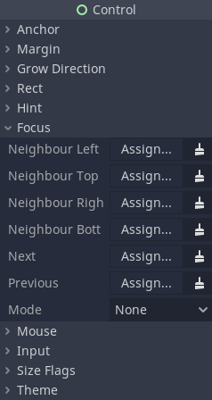

.. _doc_gui_navigation:

Keyboard/Controller Navigation and Focus
========================================

It is a common requirement for a user interface to have full keyboard
and controller support for navigation and interaction. There are two main
reasons why this is beneficial for projects: improved accessibility (not everyone
can use mouse or touch controls for interactions), and getting your project
ready for :ref:`consoles <doc_consoles>` (or just for people who prefer
to game with a controller on PC).

Navigating between UI elements with keyboard or controller is done by
changing which node is actively selected. This is also called changing UI focus.
Every :ref:`Control <class_Control>` node in Godot is capable of having focus.
By default, some control nodes have the ability to automatically grab focus
reacting to built-in UI actions such as ``ui_up``, ``ui_down``, ``ui_focus_next``, etc.
These actions can be seen in the project settings in the input map and can be modified.

.. warning::

    Because these actions are used for focus they should not be used for any
    gameplay code.

Node settings
-------------

In addition to the built-in logic, you can define what is known as focus neighbors
for each individual control node. This allows to finely tune the path the UI focus
takes across the user interface of your project. The settings for individual
nodes can be found in the Inspector dock, under the "Focus" category of the
"Control" section.

Neighbor options are used to define nodes for 4-directional navigation, such
as using arrow keys or a D-pad on a controller. For example, the bottom neighbor
will be used when navigating down with the down arrow or by pushing down on
the D-pad. The "Next" and "Previous" options are used with the focus shift button,
such as :kbd:`Tab` on desktop operating systems.

.. note::
    A node can lose focus if it becomes hidden.

The mode setting defines how a node can be focused. **All** means a node can
be focused by clicking on it with the mouse, or selecting it with a keyboard
or controller. **Click** means it can only be focused on by clicking on it.
Finally, **None** means it can't be focused at all. Different control nodes have
different default settings for this based on how they are typically used, for
example, :ref:`Label <class_Label>` nodes are set to "None" by default,
while :ref:`buttons <class_Button>` are set to "All".

Make sure to properly configure your scenes for focus and navigation. If a node has
no focus neighbor configured, the engine will try to guess the next control automatically.
This may result in unintended behavior, especially in a complex user interface that doesn't
have well-defined vertical or horizontal navigation flow.

Necessary code
--------------

For keyboard and controller navigation to work correctly, any node must be focused on
using code when the scene starts. Without doing this, pressing buttons or keys won't
do anything. Here is a basic example of setting initial focus with code:

.. tabs::
 .. code-tab:: gdscript GDScript

    func _ready():
        $StartButton.grab_focus()

 .. code-tab:: csharp

    public override void _Ready()
    {
        GetNode<Button>("StartButton").GrabFocus();
    }

Now when the scene starts the "Start Button" node will be focused, and the keyboard
or a controller can be used to navigate between it and other UI elements.
