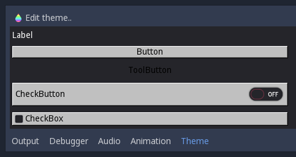
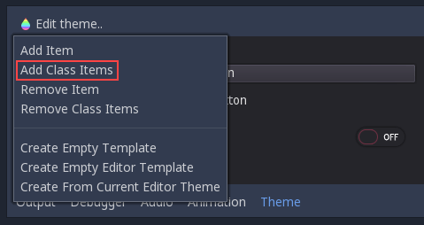
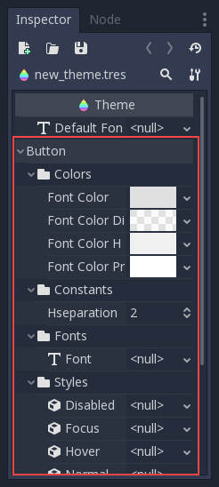
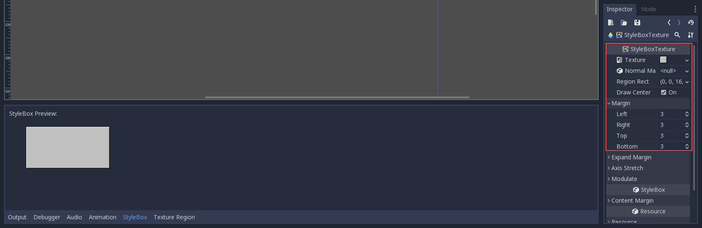
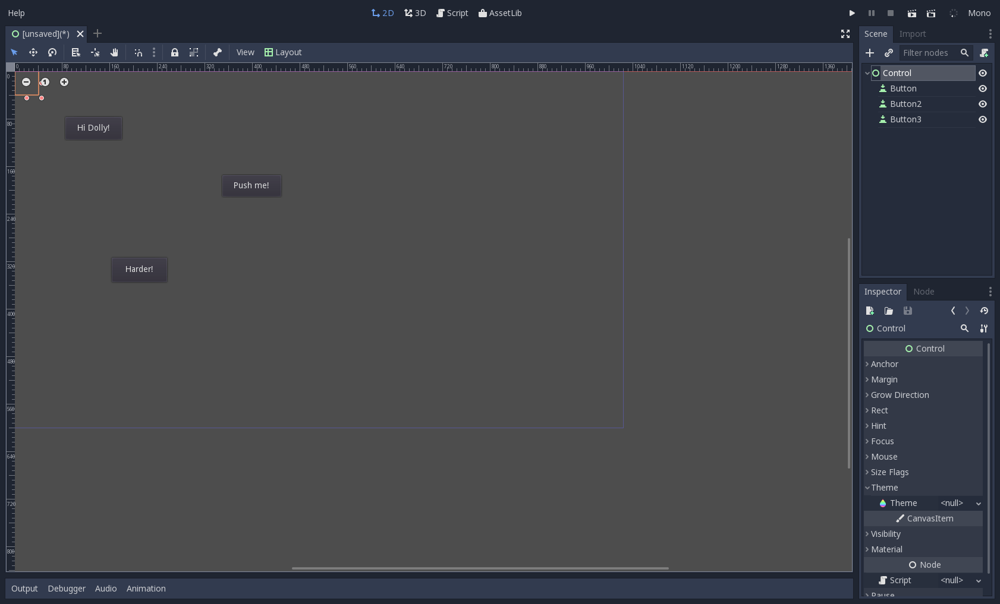
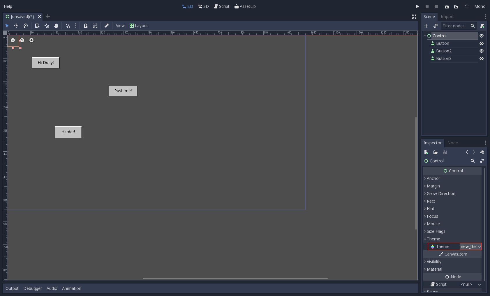

.. _doc_gui_skinning:

GUI skinning
============

Oh, beautiful GUI!
------------------

This tutorial is about advanced skinning of a user interface. Most
games generally don't need this, as they end up just relying on
:ref:`Label <class_Label>`, :ref:`TextureRect <class_TextureRect>`,
:ref:`TextureButton <class_TextureButton>` and
:ref:`TextureProgress <class_TextureProgress>`.

However, many types of games often need complex user interfaces, like
MMOs, traditional RPGs, Simulators, Strategy, etc. These kinds of
interface are also common in some games that include editors to create
content, or interfaces for network connectivity.

Godot's user interface uses these kinds of control with the default theme,
but they can be skinned to resemble pretty much any kind of user
interface.

Theme
-----

The GUI is skinned through the :ref:`Theme <class_Theme>`
resource. Theme contains all the information required to change the
entire visual styling of all controls. Theme options are named, so it's
not obvious which name changes what (especially from code), but several
tools are provided. The ultimate place to look at what each theme option
is for each control, which will always be more up to date than any
documentation, is the file `scene/resources/default_theme/default_theme.cpp
<https://github.com/godotengine/godot/blob/master/scene/resources/default_theme/default_theme.cpp>`__.
The rest of this document will explain the different tools used to
customize the theme.

A Theme can be applied to any control in the scene. As a result, all
children and grand-children controls will use that same theme, too
(unless another theme is specified further down the tree). If a value is
not found in a theme, it will be searched in themes higher up in the
hierarchy, towards the root. If nothing was found, the default theme is
used. This system allows for flexible overriding of themes in complex
user interfaces.

.. attention::
   
   Don't use the custom theme option in the Project Settings, as there
   are known bugs with theme propagation. Instead, apply your theme to the
   root Control node's Theme property. It will propagate to instanced scenes
   automatically. To get correct theming in the editor for instanced scenes,
   you can apply the theme resource to the instanced scene's root node as well.

Theme options
-------------

Each kind of option in a theme can be:

-  **An integer constant**: A single numerical constant. Generally used
   to define spacing between components or alignment.
-  **A Color**: A single color, with or without transparency. Colors are
   usually applied to fonts and icons.
-  **A Texture**: A single image. Textures are not often used, but when
   they are, they represent handles to pick or icons in a complex control
   (such as a file dialog).
-  **A Font**: Every control that uses text can be assigned the fonts
   used to draw strings.
-  **A StyleBox**: Stylebox is a resource that defines how to draw a
   panel in varying sizes (more information on them later).

Every option is associated with:

-  A name (the name of the option)
-  A Control (the name of the control)

An example usage:

.. tabs::
 .. code-tab:: gdscript GDScript

    var theme = Theme.new()
    theme.set_color("font_color", "Label", Color.red)

    var label = Label.new()
    label.theme = theme

 .. code-tab:: csharp

    var theme = new Theme();
    theme.SetColor("fontColor", "Label", new Color(1.0f, 0.0f, 0.0f));

    var label = new Label();
    label.Theme = theme;

In the example above, a new theme is created. The "font_color" option
is changed and then applied to a label. Therefore, the label's text (and all
children and grandchildren labels) will be red.

It is possible to override those options without using the theme
directly, and only for a specific control, by using the override API in
:ref:`Control.add_color_override() <class_Control_method_add_color_override>`:

.. tabs::
 .. code-tab:: gdscript GDScript

    var label = Label.new()
    label.add_color_override("font_color", Color.red)

 .. code-tab:: csharp

    var label = new Label();
    label.AddColorOverride("fontColor", new Color(1.0f, 0.0f, 0.0f));

In the inline help of Godot (in the Script tab), you can check which theme options
are overridable, or check the :ref:`Control <class_Control>` class reference.

Customizing a control
---------------------

If only a few controls need to be skinned, it is often not necessary to
create a new theme. Controls offer their theme options as special kinds
of properties. If checked, overriding will take place:

.. image:: img/themecheck.png

As can be seen in the image above, theme options have little check boxes.
If checked, they can be used to override the value of the theme just for
that control.

Creating a theme
----------------

The simplest way to create a theme is to edit a theme resource. Create a
Theme from the resource menu; the editor will appear immediately.
After that, save it (for example, with the name mytheme.theme):

This will create an empty theme that can later be loaded and assigned to
controls.

Example: theming a button
--------------------------

Download these assets (:download:`skin_assets.zip <files/skin_assets.zip>`)
and add them to your project. Open the theme editor, click on "Edit Theme"
and select "Add Class Items":

A menu will appear prompting the type of control to create. Select
"Button":

.. image:: img/themeci2.png

Immediately, all button theme options will appear in the property
editor, where they can be edited:

From ``Styles``, open the "Normal" drop-down menu next to where it probably
says "null" and create a "New StyleBoxTexture", then
edit it. A texture stylebox contains a texture and the size of the margins
that will not stretch when the texture is stretched.
This is called nine-patch or "3x3" stretching:

Repeat the steps and add the other assets. There is no hover or disabled
image in the example files, so use the same stylebox as in normal. Set
the supplied font as the button font and change the font color to black.
Soon, your button will look different and retro:

Save this theme to the .theme file. Go to the 2D editor and create a few
buttons:

Now, go to the root node of the scene and locate the "theme" property,
replace it with the theme that was just created. It should look like this:

Congratulations! You have created a reusable GUI Theme!
