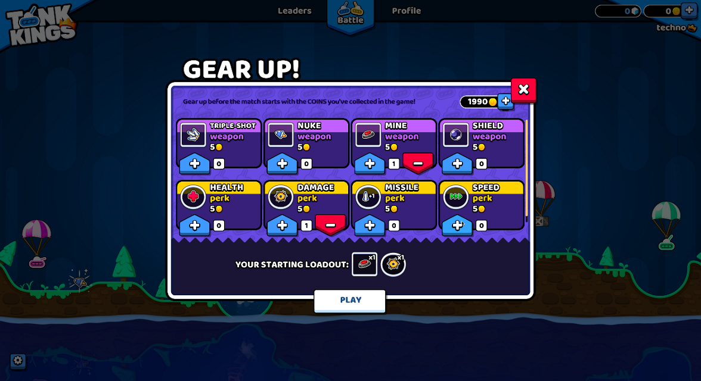

.. _doc_gui_skinning:

Introduction to GUI skinning
============================

It is essential for a game to provide clear, informative, and yet visually
pleasing user interface to its players. While :ref:`Control <class_Control>`
nodes come with a decently functional look out of the box, there is always
room for uniqueness and case-specific tuning. For this purpose Godot engine
includes a system for GUI skinning (or theming), which allows you to customize
the look of every control in your user interface, including your custom controls.

Here is an example of this system in action — a game with the GUI that is
radically different from the default UI theme of the engine:

   A "Gear Up!" screen in Tank Kings, courtesy of Winterpixel Games

Beyond achieving a unique look for your game, this system also enables developers
to provide customization options to the end users, including accessibility settings.
UI themes are applied in a cascading manner (i.e. they propagate from parent
controls to their children), which means that font settings or adjustments for
colorblind users can be applied in a single place and affect the entire UI tree.
Of course this system can also be used for gameplay purposes: your hero-based game
can change its style for the selected player character, or you can give different
flavors to the sides in your team-based project.

Basics of themes
----------------

The skinning system is driven by the :ref:`Theme <class_Theme>` resource. Every
Godot project has an inherent default theme that contains the settings used by
the built-in control nodes. This is what gives the controls their distinct look
out of the box. A theme only describes the configuration, however, and it is still
the job of each individual control to use that configuration in the way it requires
to display itself. This is important to remember when implementing
:ref:`your own custom controls <doc_custom_gui_controls>`.

.. note::
   Even the Godot editor itself relies on the default theme. But it doesn't look the
   same as a Godot project, because it applies its own heavily customized theme on top
   of the default one. In principle, this works exactly like it would in your game
   as explained :ref:`below <doc_gui_theme_in_project>`.

Theme items
~~~~~~~~~~~

The configuration that is stored in a theme consists of theme items. Each item has
a unique name and must be one of the following data types:

-  **Color**

   A :ref:`color <class_Color>` value, which is often used for fonts
   and backgrounds. Colors can also be used for modulation of controls
   and icons.

-  **Constant**

   An integer value, which can be used either for numeric properties of
   controls (such as the item separation in a :ref:`BoxContainer <class_BoxContainer>`),
   or for boolean flags (such as the drawing of relationship lines in a :ref:`Tree <class_Tree>`).

-  **Font**

   A :ref:`font <class_Font>` resource, which is used by controls that
   display text. Fonts contain most text rendering settings, except for
   its size and color. On top of that, alignment and text direction are
   controlled by individual controls.

-  **Font size**

   An integer value, which is used alongside a font to determine the
   size at which the text should be displayed.

-  **Icon**

   A :ref:`texture <class_Texture2D>` resource, which is normally used
   to display an icon (on a :ref:`Button <class_Button>`, for example).

-  **StyleBox**

   A :ref:`StyleBox <class_StyleBox>` resource, a collection of configuration
   options which define the way a UI panel should be displayed. This is
   not limited to the :ref:`Panel <class_Panel>` control, as styleboxes
   are used by many controls for their backgrounds and overlays.

Theme types
~~~~~~~~~~~

To help with the organization of its items each theme is separated into types,
and each item must belong to a single type. In other words, each theme item
is defined by its name, its data type and its theme type. This combination
must be unique within the theme. For example, there cannot be two color items named
``font_color`` in a type called ``Label``, but there can be another ``font_color``
item in a type ``LineEdit``.

The default Godot theme comes with multiple theme types already defined,
one for every built-in control node that uses UI skinning. The example above
contains actual theme items present in the default theme. You can refer to the
**Theme Properties** section in the class reference for each control to see
which items are available to it and its child classes.

.. note::
   Child classes can use theme items defined for their parent class (``Button``
   and its derivatives being a good example of that). In fact, every control can
   use every theme item of any theme type, if it needs to (but for the clarity and
   predictability we try to avoid that in the engine).

   It is important to remember that for child classes that process is automated.
   Whenever a built-in control requests a theme item from the theme it can omit
   the theme type, and its class name will be used instead. On top of that,
   the class names of its parent classes will also be used in turn. This allows
   changes to the parent class, such as ``Button``, to affect all derived
   classes without the need to customize every one of them.

You can also define your own theme types, and additionally customize both built-in
controls and your own controls. Because built-in controls have no knowledge of
your custom theme types, you must utilize scripts to access those items. All control
nodes have several methods that allow to fetch theme items from the theme that
is applied to them. Those methods accept the theme type as one of the arguments.

.. tabs::
 .. code-tab:: gdscript

   var accent_color = get_theme_color("accent_color", "MyType")
   label.add_color_override("font_color", accent_color)

 .. code-tab:: csharp

   Color accentColor = GetThemeColor("accent_color", "MyType");
   label.AddColorOverride("font_color", accentColor);

To give more customization opportunities types can also be linked together as
type variations. This is another use-case for custom theme types. For example,
a theme can contain a type ``Header`` which can be marked as a variation of
the base ``Label`` type. An individual ``Label`` control can then be set to
use the ``Header`` variation for its type, and every time a theme item is
requested from a theme this variation will be used before any other type. This
allows to store various presets of theme items for the same class of the
control node in the single ``Theme`` resource.

.. warning::
   Only variations available from the default theme or defined in the custom
   project theme are shown in the Inspector dock as options. You can still
   input manually the name of a variation that is defined outside of those
   two places, but it is recommended to keep all variations to the project theme.

You can learn more about creating and using theme type variations in a
:ref:`dedicated article <doc_gui_theme_type_variations>`.

Customizing a control
---------------------

Each control node can be customized directly without the use of themes. This
is called local overrides. Every theme property from the control's class
reference can be overridden directly on the control itself, using either
the Inspector dock, or scripts. This allows to make granular changes to a
particular part of the UI, while not affecting anything else in the project,
including this control's children.

.. figure:: img/themecheck.png
   :align: center

Local overrides are less useful for the visual flair of your user interface,
especially if you aim for consistency. However, for layout nodes these are
essential. Nodes such as :ref:`BoxContainer <class_BoxContainer>` and
:ref:`GridContainer <class_GridContainer>` use theme constants for defining
separation between their children, and :ref:`MarginContainer <class_MarginContainer>`
stores its customizable margins in its theme items.

Whenever a control has a local theme item override, this is the value that
it uses. Values provided by the theme are ignored.

.. _doc_gui_theme_in_project:

Customizing a project
---------------------

Out of the box each project adopts the default project theme provided by Godot. The
default theme itself is constant and cannot be changed, but its items can be overridden
with a custom theme. Custom themes can be applied in two ways: as a project setting,
and as a node property throughout the tree of control nodes.

There are two project settings that can be adjusted to affect your entire project:
:ref:`gui/theme/custom<class_ProjectSettings_property_gui/theme/custom>` allows you to
set a custom project-wide theme, and :ref:`gui/theme/custom_font<class_ProjectSettings_property_gui/theme/custom_font>`
does the same to the default fallback font. When a theme item is requested by a control
node the custom project theme, if present, is checked first. Only if it doesn't have
the item the default theme is checked.

This allows you to configure the default look of every Godot control with a single
theme resource, but you can go more granular than that. Every control node also has
a :ref:`theme <class_Control_property_theme>` property, which allows you to set a
custom theme for the branch of nodes starting with that control. This means that the
control and all of its children, and their children in turn, would first check that
custom theme resource before falling back on the project and the default themes.

.. note::
   Instead of changing the project setting you can set the custom theme resource to the
   root-most control node of your entire UI branch to almost the same effect. While in the
   running project it will behave as expected, individual scenes will still display
   using the default theme when previewing or running them directly. To fix that you
   can set the same theme resource to the root control of each individual scene.

For example, you can have a certain style for buttons in your project theme, but want
a different look for buttons inside of a popup dialog. You can set a custom theme
resource to the root control of your popup and define a different style for buttons
within that resource. As long as the chain of control nodes between the root of
the popup and the buttons is uninterrupted, those buttons will use the styles defined
in the theme resource that is closest to them. All other controls will still be styled
using the project-wide theme and the default theme styles.

To sum it up, for an arbitrary control its theme item lookup would look something
like this:

#. Check for local overrides of the same data type and name.
#. Using control's type variation, class name and parent class names:

   a. Check every control starting from itself and see if it has a theme property set;
   b. If it does, check that theme for the matching item of the same name, data and theme type;
   c. If there is no custom theme or it doesn't have the item, move to the parent control;
   d. Repeat steps a-c. until the root of the tree is reached, or a non-control node is reached.

#. Using control's type variation, class name and parent class names check the project-wide theme, if it's present.
#. Using control's type variation, class name and parent class names check the default theme.

Even if the item doesn't exist in any theme, a corresponding default value for that
data type will be returned.

Beyond controls
---------------

Naturally, themes are an ideal type of resource for storing configuration for
something visual. While the support for theming is built into control nodes,
other nodes can use them as well, just like any other resource.

An example of using themes for something beyond controls can be a modulation
of sprites for the same units on different teams in a strategy game. A theme
resource can define a collection of colors, and sprites (with a help from scripts)
can use those colors to draw the texture. The main benefit being that you
could make different themes using the same theme items for red, blue, and
green teams, and swap them with a single resource change.
