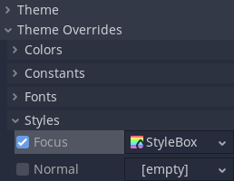
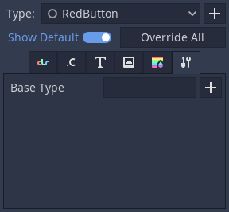

.. _doc_gui_theme_type_variations:

Theme type variations
=====================

When designing a user interface there may be times when a :ref:`Control <class_Control>` node
needs to have a different look than what is normally defined by a :ref:`Theme <class_Theme>`.
Every control node has theme property overrides, which allow you to redefine the styling for
each individual UI element.

This approach quickly becomes hard to manage, if you need to share the same custom look
between several controls. Imagine that you use gray, blue, and red variants of :ref:`Button <class_Button>`
throughout your project. Setting it up every time you add a new button element to your interface
is a tedious task.

To help with the organization and to better utilize the :ref:`power of themes <doc_gui_skinning>`
you can use theme type variations. These work like normal theme types, but instead
of being self-sufficient and standalone they extend another, base type.

Following the previous example, your theme can have some styles, colors, and fonts
defined for the ``Button`` type, customizing the looks of every button element in your UI.
To then have a gray, red, or blue button you would create a new type, e.g. ``GrayButton``, and
mark it as a variation of the base ``Button`` type.

Type variations can replace some aspects of the base type, but keep others.
They can also define properties that the base style hasn't defined. For example,
your ``GrayButton`` can override the ``normal`` style from the base ``Button``
and add ``font_color`` that ``Button`` has never defined. The control will use
a combination of both types giving priority to the type variation.

.. note::
   The way controls resolve what theme items they use from each type and each
   theme is better described in the :ref:`Customizing a project <doc_gui_theme_in_project>`
   section of the "Introduction to GUI skinning" article.

Creating a type variation
-------------------------

To create a type variation open the theme editor, then click the plus icon
next to the **Type** dropdown on the right side of the editor. Type in what
you want to name your theme type variation in the text box, then click **Add Type**.

Below the **Type** dropdown are the property tabs. Switch to the tab with a wrench
and screwdriver icon.

Click on the plus icon next to the **Base Type** field. You can select the base type
there, which would typically be the name of a control node class (e.g., ``Button``, ``Label``, etc).
Type variations can also chain and extend other type variations. This works in the
same way control nodes inherit styling of their base class. For example, ``CheckButton``
inherits styles from ``Button`` because corresponding node types extend each other.

After you select the base type, you should now be able to see its properties on the other
tabs in the theme editor. You can edit them as usual.

Using a type variation
----------------------

Now that a type variation has been created you can apply it to your nodes.
In the inspector dock, under the **Theme** property of a control node,
you can find the **Theme Type Variation** property. It is empty by default,
which means that only the base type has an effect on this node.

You can either select a type variation from a dropdown list, or input its name
manually. Variations appear on the list only if the type variation belongs to
the project-wide theme, which you can configure in the project settings. For
any other case you have to input the name of the variation manually. Click on
the pencil icon to the right. Then type in the name of the type variation and click the
check mark icon or press enter. If a type variation with that name exists it
will now be used by the node.
