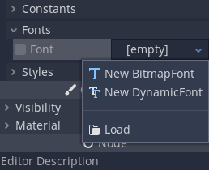
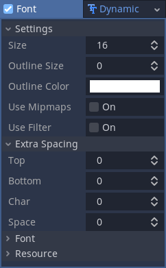

.. _doc_gui_using_fonts:

Using Fonts
===========

Godot allows you to set specific fonts for different UI nodes.

There are three different places where you can setup font usage.
The first is the theme editor. Choose the node you want to set the
font for and select the font tab. The second is in the inspector
for control nodes under **Theme Overrides > Fonts**. And lastly in
the inspector settings for themes under **Default Font**.

Regardless of where you are creating the font the process is
the same. Click on the font setting you want to add a font to
and a dropdown will appear with two choices: **New Bitmap Font**
and **New Dynamic Font**.

Bitmap fonts (``.fnt``) are a format created by `BMFont <http://www.angelcode.com/products/bmfont/>`__
(many BMFont compatible programs exist, like `BMGlyph <http://www.bmglyph.com/>`__).
If you are using a ``.fnt`` file do not select **New Bitmap Font**.
Instead, drag the file from the file system panel to the
font slot. Selecting the font after adding it to the font slot
gives you three settings that can be changed: **height**, **ascent**
and **distance field**. Distance field fonts were never reimplemented
for Godot 3 and do not work in that version.

Dynamic Font supports the following formats:
- TrueType (``.ttf``)
- OpenType (``.otf``)
- Web Open Font Format 1 (``.woff``)
- Web Open Font Format 2 (``.woff2``, since Godot 4.0)

If you are using one of these select **New Dynamic Font**.
Click on it to open its settings in the inspector. From here
open the **Font** settings and add your font file to the Font
Data slot. The dynamic font resource is now using the font
you selected.

There are several options you can adjust. **Extra Spacing** options
control the spacing of characters. **Settings** control the general
settings of the font.

In addition, the font data has antialiasing and hinting settings you
can see if you click on it. If you want to adjust either of these
you need to make the font data resource unique, then save it to a
``.tres`` file. Adjusting the font file will not work because ``.ttf``/
``.otf``/``.woff``/``.woff2`` files can't contain metadata about antialiasing
or hinting.

If you want to use the same font again but with different settings,
such as a larger size or an outline, create another dynamic font
resource using the same font file, and make the adjustments that you
want.
