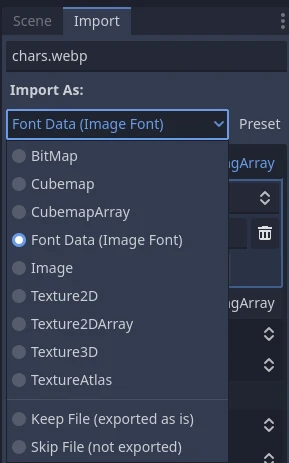
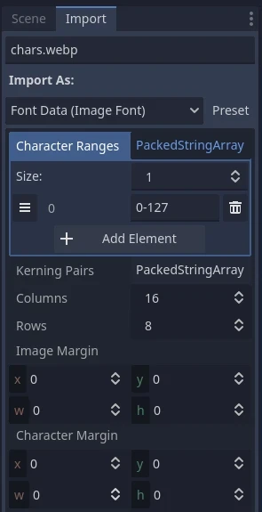

.. _doc_gui_using_fonts:

Using Fonts
===========

Godot allows you to set specific fonts for different UI nodes.

There are three different places where you can setup font usage.
The first is the theme editor. Choose the node you want to set the
font for and select the font tab. The second is in the inspector
for control nodes under **Theme Overrides > Fonts**. Lastly, in
the inspector settings for themes under **Default Font**.

If no font override is specified anywhere,
`Open Sans <https://fonts.google.com/specimen/Open+Sans>`__ SemiBold
is used as the default project font.

.. note::

    Since Godot 4.0, font sizes are no longer defined in the font itself but are
    instead defined in the node that uses the font. This is done in the
    **Theme Overrides > Font Sizes** section of the inspector.

    This allows changing the font size without having to duplicate the font
    resource for every different font size.

There are 2 kinds of font files: *dynamic* (TTF/OTF/WOFF/WOFF2 formats) and
*bitmap* (BMFont ``.fnt`` format or monospaced image). Dynamic fonts are the
most commonly used option, as they can be resized and still look crisp at higher
sizes. Thanks to their vector-based nature, they can also contain a lot more
glyphs while keeping a reasonable file size compared to bitmap fonts. Dynamic
fonts also support some advanced features that bitmap fonts cannot support, such
as *ligatures* (several characters transforming into a single different design).

.. tip::

    You can find freely licensed font files on websites such as `Google Fonts
    <https://fonts.google.com/>`__ and `Font Library
    <https://fontlibrary.org/>`__.

    Fonts are covered by copyright. Double-check the license of a font before
    using it, as not all fonts allow commercial use without purchasing a license.

.. seealso::

    You can see how fonts work in action using the
    `BiDI and Font Features demo project <https://github.com/godotengine/godot-demo-projects/tree/master/gui/bidi_and_font_features>`__.

Dynamic fonts
-------------

Godot supports the following dynamic font formats:

- TrueType Font or Collection (``.ttf``, ``.ttc``)
- OpenType Font or Collection (``.otf``, ``.otc``)
- Web Open Font Format 1 (``.woff``)
- Web Open Font Format 2 (``.woff2``, since Godot 3.5)

While ``.woff`` and especially ``.woff2`` tend to result in smaller file sizes,
there is no universally "better" font format. In most situations, it's
recommended to use the font format that was shipped on the font developer's
website.

Bitmap fonts
------------

Godot supports the BMFont (``.fnt``) bitmap font format. This is a format created
by the `BMFont <https://www.angelcode.com/products/bmfont/>`__ program. Many
BMFont-compatible programs also exist, like `BMGlyph <https://www.bmglyph.com/>`__ or web-based `fontcutter <https://github.com/fabienbk/fontcutter>`__.

Alternatively, you can import any image to be used as a bitmap font.
To do so, select the image in the FileSystem dock, go to the
Import dock, change its import type to **Font Data (Image Font)** then
click **Reimport**:

   Changing import type to **Font Data (Image Font)**

The font's character set layout can be in any order, but orders that match
standard Unicode are recommended as they'll require far less configuration to
import. For example, the bitmap font below contains
`ASCII <https://en.wikipedia.org/wiki/ASCII>`__ characters and follows standard ASCII ordering:

.. figure:: img/using_fonts_monospace_bitmap_font_example.webp
   :align: center
   :alt: Bitmap font example

   Credit: `LibreQuake <https://github.com/MissLav/LibreQuake/blob/master/lq1/gfx-wad/CONCHARS.png>`__
   (scaled and cropped to exclude extended range)

The following import options can be used to import the above font image
successfully:

   Import options to use for the above example font

The **Character Ranges** option is an array that maps each position on the image
(in tile coordinates, not pixels). The font atlas is traversed from left to
right and top to bottom. Characters can be specified with decimal numbers
(``127``), hexadecimal numbers (``0x007f``) or between *single* quotes
(``'~'``). Ranges can be specified with a hyphen between characters.

For instance, ``0-127`` (or ``0x0000-0x007f``) denotes the full ASCII range.
As another example, ``' '-'~'`` is equivalent to ``32-127`` and denotes the range
of *printable* (visible) ASCII characters.

Make sure the **Character Ranges** option doesn't exceed the number of
**Columns** × **Rows** defined. Otherwise, the font will fail to import.

If your font image contains margins not used for font glyphs (such as
attribution information), try adjusting **Image Margin**. This is a margin
applied only once around the whole image.

If your font image contains guides (in the form of lines between glyphs) or
if spacing between characters appears incorrect, try adjusting **Character
Margin**. This margin is applied for every imported glyph.

If you need finer control over character spacing than
what the **Character Margin** options provide, you have more options.

For one, **Character Ranges** supports 3 additional arguments after the
specified range of characters.
These additional arguments control their positioning and spacing.
They represent space advance, X axis offset, and Y axis offset in that order.
They will change the space advance and offset of each character
by the amount of pixels written. Space advance is most useful if, for example,
your lowercase letters are thinner than your uppercase letters.

.. figure:: img/using_fonts_bitmap_font_advance_offsets_diagram.webp
   :align: center
   :alt: Diagram showing the advance and offset values being used in character ranges.

   Do note that the offsets can cause your text to be cropped off the edge of your label boundaries.

Secondly, you can also set up **Kerning Pairs** for individual characters.
Specify your kerning pair by typing two sets of characters separated by a space,
then followed by another space, a number to specify how many extra/less pixels to
space those two sets of characters when placed next to each other.

If needed, your kerning pair characters can be specified by Unicode character code
by entering ``\uXXXX`` where XXXX is the hexadecimal value of the Unicode character.

Loading a font file
-------------------

To load a font file (dynamic or bitmap), use the resource dropdown's
**Quick Load** or **Load** option next to a font property, then navigate to the
font file in question:

.. figure:: img/using_fonts_load_font.webp
   :align: center

   Loading a font file

You can also drag-and-drop a font file from the FileSystem dock to the inspector
property that accepts a Font resource.

.. warning::

   In Godot 4.0 and later, texture filter and repeat properties are defined in
   the location where the texture is used, rather than on the texture itself.
   This also applies to fonts (both dynamic fonts and bitmap fonts).

   Fonts that have a pixel art appearance should have bilinear filtering disabled
   by changing the **Rendering > Textures > Canvas Textures > Default Texture Filter**
   project setting to **Nearest**.

   The font size must also be an integer multiple of the design size (which
   varies on a per-font basis), and the Control node using the font must be
   scaled by an integer multiple as well. Otherwise, the font may look blurry.
   Font sizes in Godot are specified in pixels (px), not points (pt). Keep this
   in mind when comparing font sizes across different software.

   The texture filter mode can also be set on individual nodes that inherit from CanvasItem
   by setting :ref:`CanvasItem.texture_filter <class_CanvasItem_property_texture_filter>`.

Font outlines and shadows
-------------------------

Font outlines and shadows can be used to improve readability when the background
color isn't known in advance. For instance, this is the case for HUD elements
that are drawn over a 2D/3D scene.

Font outlines are available in most nodes that derive from Control, in addition
to :ref:`class_Label3D`.

To enable outline for a font on a given node, configure the theme overrides
**Font Outline Color** and **Outline Size** in the inspector. The result should
look like this:

.. figure:: img/using_fonts_outline_example.webp
   :align: center
   :alt: Font outline example

   Font outline example

.. note::

   If using a font with MSDF rendering, its **MSDF Pixel Range** import option
   be set to at least *twice* the value of the outline size for outline
   rendering to look correct. Otherwise, the outline may appear to be cut off
   earlier than intended.

Support for font shadows is more limited: they are only available in
:ref:`class_Label` and :ref:`class_RichTextLabel`. Additionally, font shadows
always have a hard edge (but you can reduce their opacity to make them look more
subtle). To enable font shadows on a given node, configure the **Font Shadow
Color**, **Shadow Offset X**, and **Shadow Offset Y** theme overrides in a Label
or RichTextLabel node accordingly:

.. figure:: img/using_fonts_shadow.webp
   :align: center
   :alt: Configuring font shadow in a Label node

   Configuring font shadow in a Label node

The result should look like this:

.. figure:: img/using_fonts_shadow_example.webp
   :align: center
   :alt: Font shadow example

   Font shadow example

.. tip::

    You can create local overrides to font display in Label nodes by creating a
    :ref:`class_LabelSettings` resource that you reuse across Label nodes. This
    resource takes priority over :ref:`theme properties <doc_gui_skinning>`.

Advanced font features
----------------------

.. _doc_using_fonts_antialiasing:

Antialiasing
~~~~~~~~~~~~

You can adjust how the font should be smoothed out when rendering by adjusting
*antialiasing* and *hinting*. These are different properties, with different use
cases.

Antialiasing controls how glyph edges should be smoothed out when rasterizing
the font. The default antialiasing method (**Grayscale**) works well on every
display technology. However, at small sizes, grayscale antialiasing may result
in fonts looking blurry.

The antialiasing sharpness can be improved by using LCD subpixel optimization,
which exploits the subpixel patterns of most LCD displays by offsetting the font
antialiasing on a per-channel basis (red/green/blue). The downside is that this
can introduce "fringing" on edges, especially on display technologies that don't
use standard RGB subpixels (such as OLED displays).

In most games, it's recommended to stick to the default **Grayscale**
antialiasing. For non-game applications, LCD subpixel optimization is worth
exploring.

.. figure:: img/using_fonts_antialiasing_comparison.webp
   :align: center
   :alt: Font antialiasing comparison

   From top to bottom: Disabled, Grayscale, LCD Subpixel (RGB)

.. note::

    Antialiasing cannot be changed on :ref:`MSDF-rendered fonts <doc_using_fonts_msdf>`
    – these are always rendered with grayscale antialiasing.

.. _doc_using_fonts_hinting:

Hinting
~~~~~~~

Hinting controls how aggressively glyph edges should be snapped to pixels when
rasterizing the font. **None** results in the smoothest appearance, which can
make the font look blurry at small sizes. **Light** (default) is sharper by
snapping glyph edges to pixels on the Y axis only, while **Full** is even sharper
by snapping glyph edges to pixels on both X and Y axes. Depending on personal
preference, you may prefer using one hinting mode over the other.

.. figure:: img/using_fonts_hinting_comparison.webp
   :align: center
   :alt: Font hinting comparison

   From top to bottom: None, Light, Full hinting

.. note::

    If changing the hinting mode has no visible effect after clicking
    **Reimport**, it's usually because the font doesn't include hinting
    instructions. This can be resolved by looking for a version of the font file
    that includes hinting instructions, or enabling **Force Autohinter** in the
    Import dock. This will use `FreeType <https://freetype.org/>`__'s autohinter
    to automatically add hinting instructions to the imported font.

.. _doc_using_fonts_subpixel_positioning:

Subpixel positioning
~~~~~~~~~~~~~~~~~~~~

Subpixel positioning can be adjusted. This is a `FreeType <https://freetype.org/>`__
feature that allows glyphs to be rendered more closely to their intended form.
The default setting of **Auto** automatically enables subpixel positioning at
small sizes, but disables it at large font sizes to improve rasterization
performance.

You can force the subpixel positioning mode to **Disabled**, **One half of a
pixel** or **One quarter of a pixel**. **One quarter of a pixel** provides the
best quality, at the cost of longer rasterization times.

Changing antialiasing, hinting and subpixel positioning has the most visible
effect at smaller font sizes.

.. warning::

   Fonts that have a pixel art appearance should have their subpixel positioning
   mode set to **Disabled**. Otherwise, the font may appear to have uneven pixel
   sizes.

   This step is not required for bitmap fonts, as subpixel positioning is only
   relevant for dynamic fonts (which are usually made of vector elements).

.. _doc_using_fonts_mipmaps:

Mipmaps
~~~~~~~

By default, fonts do not have mipmaps generated to reduce memory usage and speed
up rasterization. However, this can cause downscaled fonts to become grainy. This
can be especially noticeable with :ref:`doc_3d_text` that doesn't have **Fixed
Size** enabled. This can also occur when displaying text with a traditional rasterized
(non-:ref:`MSDF <doc_using_fonts_msdf>`) font in a Control node that has its scale
lower than ``(1, 1)``.

After selecting a font in the FileSystem dock, you can enable the **Mipmaps** in
the Import dock to improve downscaled font rendering appearance.

Mipmaps can be enabled on MSDF fonts as well. This can improve font rendering
quality a little at smaller-than-default sizes, but MSDF fonts are already
resistant to graininess out of the box.

.. _doc_using_fonts_msdf:

MSDF font rendering
~~~~~~~~~~~~~~~~~~~

Multi-channel signed distance field (MSDF) font rendering allows rendering fonts
at any size, without having to re-rasterize them when their size changes.

MSDF font rendering has 2 upsides over traditional font rasterization, which
Godot uses by default:

- The font will always look crisp, even at huge sizes.
- There is less stuttering when rendering characters *at large font sizes* for
  the first time, as there is no rasterization performed.

The downsides of MSDF font rendering are:

- Higher baseline cost for font rendering. This is usually not noticeable on
  desktop platforms, but it can have an impact on low-end mobile devices.
- Fonts at small sizes will not look as clear as rasterized fonts, due to the
  lack of hinting.
- Rendering new glyphs for the first time *at small font sizes* may be more
  expensive compared to traditional rasterized fonts.
  :ref:`doc_using_fonts_font_prerendering` can be used to alleviate this.
- LCD subpixel optimization cannot be enabled for MSDF fonts.
- Fonts with self-intersecting outlines will not render correctly in MSDF mode.
  If you notice rendering issues on fonts downloaded from websites such as
  `Google Fonts <https://fonts.google.com>`__, try downloading the font from the
  font author's official website instead.

.. figure:: img/using_fonts_rasterized_vs_msdf_comparison.webp
   :align: center
   :alt: Comparison of font rasterization methods

   Comparison of font rasterization methods.
   From top to bottom: rasterized without oversampling, rasterized with oversampling, MSDF

To enable MSDF rendering for a given font, select it in the FileSystem dock, go
to the Import dock, enable **Multichannel Signed Distance Field**, then click
**Reimport**:

.. figure:: img/using_fonts_msdf_import_options.webp
   :align: center
   :alt: Enabling MSDF in the font's import options

   Enabling MSDF in the font's import options

.. _doc_using_fonts_emoji:

Using emoji
~~~~~~~~~~~

Godot has limited support for emoji fonts:

- CBDT/CBLC (embedded PNGs) and SVG emoji fonts are supported.
- COLR/CPAL emoji fonts (custom vector format) are **not** supported.
- EMJC bitmap image compression (used by iOS' system emoji font) is **not** supported.
  This means that to support emoji on iOS, you must use a custom font that
  uses SVG or PNG bitmap compression instead.

For Godot to be able to display emoji, the font used (or one of its
:ref:`fallbacks <doc_using_fonts_font_fallbacks>`) needs to include them.
Otherwise, emoji won't be displayed and placeholder "tofu" characters will
appear instead:

.. figure:: img/using_fonts_emoji_placeholder_characters.webp
   :align: center
   :alt: Default appearance when trying to use emoji in a label

   Default appearance when trying to use emoji in a label

After adding a font to display emoji such as
`Noto Color Emoji <https://fonts.google.com/noto/specimen/Noto+Color+Emoji>`__,
you get the expected result:

.. figure:: img/using_fonts_emoji_correct_characters.webp
   :align: center
   :alt: Correct appearance after adding an emoji font to the label

   Correct appearance after adding an emoji font to the label

To use a regular font alongside emoji, it's recommended to specify a
:ref:`fallback font <doc_using_fonts_font_fallbacks>` that points to the
emoji font in the regular font's advanced import options. If you wish to use
the default project font while displaying emoji, leave the **Base Font**
property in FontVariation empty while adding a font fallback pointing to the
emoji font:

.. tip::

    Emoji fonts are quite large in size, so you may want to :ref:`load a system
    font <doc_using_fonts_system_fonts>` to provide emoji glyphs rather than
    bundling it with your project. This allows providing full emoji support in
    your project without increasing the size of its exported PCK. The downside
    is that emoji will look different depending on the platform, and loading
    system fonts is not supported on all platforms.

    It's possible to use a system font as a fallback font too.

Using icon fonts
~~~~~~~~~~~~~~~~

Tools like `Fontello <https://fontello.com/>`__ can be used to generate font
files containing vectors imported from SVG files. This can be used to render
custom vector elements as part of your text, or to create extruded 3D icons
with :ref:`doc_3d_text` and TextMesh.

.. note::

    Fontello currently does not support creating multicolored fonts (which Godot
    can render). As of November 2022, support for multicolored fonts in icon
    font generation tools remains scarce.

Depending on your use cases, this may lead to better results compared to using
the ``img`` tag in :ref:`RichTextLabel <doc_bbcode_in_richtextlabel>`. Unlike
bitmap images (including SVGs which are rasterized on import by Godot),
true vector data can be resized to any size without losing quality.

After downloading the generated font file, load it in your Godot project then
specify it as a custom font for a Label, RichTextLabel or Label3D node. Switch
over to the Fontello web interface, then copy the character by selecting it then
pressing :kbd:`Ctrl + C` (:kbd:`Cmd + C` on macOS). Paste the character in the
**Text** property of your Label node. The character will appear as a placeholder
glyph in the inspector, but it should appear correctly in the 2D/3D viewport.

To use an icon font alongside a traditional font in the same Control, you can
specify the icon font as a :ref:`fallback <doc_using_fonts_font_fallbacks>`.
This works because icon fonts use the Unicode *private use area*, which is
reserved for use by custom fonts and doesn't contain standard glyphs by design.

.. note::

    Several modern icon fonts such as `Font Awesome 6 <https://fontawesome.com/download>`__
    have a desktop variant that uses *ligatures* to specify icons. This allows you to
    specify icons by entering their name directly in the **Text** property of any
    node that can display fonts. Once the icon's name is fully entered as text
    (such as ``house``), it will be replaced by the icon.

    While easier to use, this approach cannot be used with font fallbacks as the main
    font's characters will take priority over the fallback font's ligatures.

.. _doc_using_fonts_font_fallbacks:

Font fallbacks
~~~~~~~~~~~~~~

Godot supports defining one or more fallbacks when the main font lacks a glyph
to be displayed. There are 2 main use cases for defining font fallbacks:

- Use a font that only supports Latin character sets, but use another font to
  be able to display text another character set such as Cyrillic.
- Use a font to render text, and another font to render emoji or icons.

Open the Advanced Import Settings dialog by double-clicking the font file in the
FileSystem dock. You can also select the font in the FileSystem dock, go to the
Import dock then choose **Advanced…** at the bottom:

.. figure:: img/using_fonts_advanced_import_settings.webp
   :align: center

   Import dock

In the dialog that appears, look for **Fallbacks** section
on the sidebar on the right, click the **Array[Font] (size 0)** text to expand
the property, then click **Add Element**:

.. figure:: img/using_fonts_font_fallbacks_add.webp
   :align: center

   Adding font fallback

Click the dropdown arrow on the new element, then choose a font file using the
**Quick Load** or **Load** options:

.. figure:: img/using_fonts_font_fallbacks_load.webp
   :align: center

   Loading font fallback

It is possible to add fallback fonts while using the default project font. To do
so, leave the **Base Font** property empty while adding one or more font
fallbacks.

.. note::

    Font fallbacks can also be defined on a local basis similar to
    :ref:`doc_using_fonts_opentype_font_features`, but this is not covered here
    for brevity reasons.

.. _doc_using_fonts_variable_fonts:

Variable fonts
~~~~~~~~~~~~~~

Godot has full support for `variable fonts <https://variablefonts.io/>`__, which
allow you to use a single font file to represent various font weights and styles
(regular, bold, italic, …). This must be supported by the font file you're using.

To use a variable font, create a :ref:`class_FontVariation` resource in the
location where you intend to use the font, then load a font file within the
FontVariation resource:

.. figure:: img/using_fonts_font_variation_create.webp
   :align: center

   Creating a FontVariation resource

.. figure:: img/using_fonts_font_variation_load.webp
   :align: center

   Loading a font file into the FontVariation resource

Scroll down to the FontVariation's **Variation** section, then click the
**Variation Coordinates** text to expand the list of axes that can be adjusted:

.. figure:: img/using_fonts_font_variation_variable_font.webp
   :align: center

   List of variation axes

The set of axes you can adjust depends on the font loaded. Some variable fonts
only support one axis of adjustment (typically *weight* or *slant*), while
others may support multiple axes of adjustment.

For example, here's the `Inter V <https://rsms.me/inter/>`__ font with a
*weight* of ``900`` and a *slant* of ``-10``:

.. figure:: img/using_fonts_font_variation_variable_font_example.webp
   :align: center

   Variable font example (Inter V)

.. tip::

    While variable font axis names and scales aren't standardized,
    some common conventions are usually followed by font designers.
    The *weight* axis is standardized in OpenType to work as follows:

    +------------+--------------------------------+
    | Axis value | Effective font weight          |
    +============+================================+
    | ``100``    | Thin (Hairline)                |
    +------------+--------------------------------+
    | ``200``    | Extra Light (Ultra Light)      |
    +------------+--------------------------------+
    | ``300``    | Light                          |
    +------------+--------------------------------+
    | ``400``    | **Regular (Normal)**           |
    +------------+--------------------------------+
    | ``500``    | Medium                         |
    +------------+--------------------------------+
    | ``600``    | Semi-Bold (Demi-Bold)          |
    +------------+--------------------------------+
    | ``700``    | **Bold**                       |
    +------------+--------------------------------+
    | ``800``    | Extra Bold (Ultra Bold)        |
    +------------+--------------------------------+
    | ``900``    | Black (Heavy)                  |
    +------------+--------------------------------+
    | ``950``    | Extra Black (Ultra Black)      |
    +------------+--------------------------------+

You can save the FontVariation to a ``.tres`` resource file to reuse it in other
places:

.. figure:: img/using_fonts_font_variation_save_to_file.webp
   :align: center

   Saving FontVariation to an external resource file

Faux bold and italic
~~~~~~~~~~~~~~~~~~~~

When writing text in bold or italic, using font variants specifically designed
for this looks better. Spacing between glyphs will be more consistent when using
a bold font, and certain glyphs' shapes may change entirely in italic variants
(compare "a" and *"a"*).

However, real bold and italic fonts require shipping more font files, which
increases distribution size. A single :ref:`variable font <doc_using_fonts_variable_fonts>`
file can also be used, but this file will be larger than a single non-variable font.
While file size is usually not an issue for desktop projects, it can be a concern
for mobile/web projects that strive to keep distribution size as low as possible.

To allow bold and italic fonts to be displayed without having to ship additional
fonts (or use a variable font that is larger in size), Godot supports *faux*
bold and italic.

.. figure:: img/using_fonts_faux_bold_italic_vs_real_bold_italic.webp
   :align: center
   :alt: Faux bold/italic (top), real bold/italic (bottom). Normal font used: Open Sans SemiBold

   Faux bold/italic (top), real bold/italic (bottom). Normal font used: Open Sans SemiBold

Faux bold and italic is automatically used in :ref:`class_RichTextLabel`'s bold
and italic tags if no custom fonts are provided for bold and/or italic.

To use faux bold, create a FontVariation resource in a property where a Font
resource is expected. Set **Variation > Embolden** to a positive value to make a
font bolder, or to a negative value to make it less bold. Recommended values are
between ``0.5`` and ``1.2`` depending on the font.

Faux italic is created by skewing the text, which is done by modifying the
per-character transform. This is also provided in FontVariation using the
**Variation > Transform** property. Setting the ``yx`` component of the
character transform to a positive value will italicize the text. Recommended
values are between ``0.2`` and ``0.4`` depending on the font.

Adjusting font spacing
~~~~~~~~~~~~~~~~~~~~~~

For stylistic purposes or for better readability, you may want to adjust how a
font is presented in Godot.

Create a FontVariation resource in a property where a Font resource is expected.
There are 4 properties available in the **Variation > Extra Spacing** section,
which accept positive and negative values:

- **Glyph:** Additional spacing between every glyph.
- **Space:** Additional spacing between words.
- **Top:** Additional spacing above glyphs. This is used for multiline text,
  but also to calculate the minimum size of controls such as :ref:`class_Label`
  and :ref:`class_Button`.
- **Bottom:** Additional spacing below glyphs. This is used for multiline text,
  but also to calculate the minimum size of controls such as :ref:`class_Label`
  and :ref:`class_Button`.

The **Variation > Transform** property can also be adjusted to stretch
characters horizontally or vertically. This is specifically done by adjusting
the ``xx`` (horizontal scale) and ``yy`` (vertical scale) components. Remember
to adjust glyph spacing to account for any changes, as glyph transform doesn't
affect how much space each glyph takes in the text. Non-uniform scaling of this
kind should be used sparingly, as fonts are generally not designed to be
displayed with stretching.

.. _doc_using_fonts_opentype_font_features:

OpenType font features
~~~~~~~~~~~~~~~~~~~~~~

Godot supports enabling OpenType font features, which are a standardized way to
define alternate characters that can be toggled without having to swap font
files entirely. Despite being named OpenType font features, these are also
supported in TrueType (``.ttf``) and WOFF/WOFF2 font files.

Support for OpenType features highly depends on the font used. Some fonts don't
support any OpenType features, while other fonts can support dozens of
toggleable features.

There are 2 ways to use OpenType font features:

**Globally on a font file**

Open the Advanced Import Settings dialog by double-clicking the font file in the
FileSystem dock. You can also select the font in the FileSystem dock, go to the
Import dock then choose **Advanced…** at the bottom:

.. figure:: img/using_fonts_advanced_import_settings.webp
   :align: center

   Import dock

In the dialog that appears, look for the **Metadata Overrides > OpenType
Features** section on the sidebar on the right, click the
**Features (0 of N set)** text to expand the property, then click
**Add Feature**:

.. figure:: img/using_fonts_advanced_import_settings_opentype_features.webp
   :align: center

   OpenType feature overrides in Advanced Import Settings

**In a specific font usage (FontVariation)**

To use a font feature, create a FontVariation resource like you would do for a
:ref:`variable font <doc_using_fonts_variable_fonts>`, then load a font file
within the FontVariation resource:

.. figure:: img/using_fonts_font_variation_create.webp
   :align: center

   Creating a FontVariation resource

.. figure:: img/using_fonts_font_variation_load.webp
   :align: center

   Loading a font file into a FontVariation resource

Scroll down to the FontVariation's **OpenType Features** section, click the
**Features (0 of N set)** text to expand the property, then click **Add Feature**
and select the desired feature in the dropdown:

.. figure:: img/using_fonts_font_variation_opentype_features.webp
   :align: center

   Specifying OpenType features in a FontVariation resource

For example, here's the `Inter <https://rsms.me/inter/>`__ font without the
*Slashed Zero* feature (top), then with the *Slashed Zero* OpenType feature enabled
(bottom):

.. figure:: img/using_fonts_font_variation_slashed_zero.webp
   :align: center

   OpenType feature comparison (Inter)

You can disable ligatures and/or kerning for a specific font by adding OpenType
features, then unchecking them in the inspector:

.. figure:: img/using_fonts_font_variation_disable_ligatures.webp
   :align: center

   Disabling ligatures and kerning for a font

.. _doc_using_fonts_system_fonts:

System fonts
~~~~~~~~~~~~

.. warning::

    Loading system fonts is only supported on Windows, macOS, Linux, Android and iOS.

    However, loading system fonts on Android is unreliable as there is no
    official API for doing so. Godot has to rely on parsing system configuration
    files, which can be modified by third-party Android vendors. This may result
    in non-functional system font loading.

System fonts are a different type of resource compared to imported fonts. They
are never actually imported into the project, but are loaded at runtime. This
has 2 benefits:

- The fonts are not included within the exported PCK file, leading to a smaller
  file size for the exported project.
- Since fonts are not included with the exported project, this avoids licensing
  issues that would occur if proprietary system fonts were distributed alongside
  the project.

The engine automatically uses system fonts as fallback fonts, which makes it
possible to display CJK characters and emoji without having to load a custom
font. There are some restrictions that apply though, as mentioned in the
:ref:`Using emoji <doc_using_fonts_emoji>` section.

Create a :ref:`class_SystemFont` resource in the location where you desire to
use the system font:

.. figure:: img/using_fonts_system_font_create.webp
   :align: center

   Creating a SystemFont resource

.. figure:: img/using_fonts_system_font_specify.webp
   :align: center

   Specifying a font name to use in a SystemFont resource

You can either specify one or more font names explicitly (such as ``Arial``), or
specify the name of a font *alias* that maps to a "standard" default font for
the system:

.. Android font information sourced from <https://android.googlesource.com/platform/frameworks/base/+/master/data/fonts/fonts.xml>

+----------------+-----------------+----------------+-------------------------+-------------------------+
| Font alias     | Windows         | macOS/iOS      | Linux                   | Android                 |
+================+=================+================+=========================+=========================+
| ``sans-serif`` | Arial           | Helvetica      | *Handled by fontconfig* | Roboto / Noto Sans      |
+----------------+-----------------+----------------+-------------------------+-------------------------+
| ``serif``      | Times New Roman | Times          | *Handled by fontconfig* | Noto Serif              |
+----------------+-----------------+----------------+-------------------------+-------------------------+
| ``monospace``  | Courier New     | Courier        | *Handled by fontconfig* | Droid Sans Mono         |
+----------------+-----------------+----------------+-------------------------+-------------------------+
| ``cursive``    | Comic Sans MS   | Apple Chancery | *Handled by fontconfig* | Dancing Script          |
+----------------+-----------------+----------------+-------------------------+-------------------------+
| ``fantasy``    | Gabriola        | Papyrus        | *Handled by fontconfig* | Droid Sans Mono         |
+----------------+-----------------+----------------+-------------------------+-------------------------+

On Android, Roboto is used for Latin/Cyrillic text and Noto Sans is used for
other languages' glyphs such as CJK. On third-party Android distributions, the
exact font selection may differ.

If specifying more than one font, the first font that is found on the system
will be used (from top to bottom). Font names and aliases are case-insensitive
on all platforms.

Like for font variations, you can save the SystemFont arrangement to a resource
file to reuse it in other places.

Remember that different system fonts have different metrics, which means that
text that can fit within a rectangle on one platform may not be doing so on
another platform. Always reserve some additional space during development so
that labels can extend further if needed.

.. note::

    Unlike Windows and macOS/iOS, the set of default fonts shipped on Linux
    depends on the distribution. This means that on different Linux
    distributions, different fonts may be displayed for a given system font name
    or alias.

It is also possible to load fonts at runtime even if they aren't installed on the system.
See :ref:`Runtime loading and saving <doc_runtime_file_loading_and_saving_fonts>`
for details.

.. _doc_using_fonts_font_prerendering:

Font prerendering
~~~~~~~~~~~~~~~~~

When using traditional rasterized fonts, Godot caches glyphs on a per-font and
per-size basis. This reduces stuttering, but it can still occur the first time a
glyph is displayed when running the project. This can be especially noticeable
at higher font sizes or on mobile devices.

When using MSDF fonts, they only need to be rasterized once to a special signed
distance field texture. This means caching can be done purely on a per-font
basis, without taking the font size into consideration. However, the initial
rendering of MSDF fonts is slower compared to a traditional rasterized font at a
medium size.

To avoid stuttering issues related to font rendering, it is possible to
*prerender* certain glyphs. This can be done for all glyphs you intend to use
(for optimal results), or only for common glyphs that are most likely to appear
during gameplay (to reduce file size). Glyphs that aren't pre-rendered will be
rasterized on-the-fly as usual.

.. note::

    In both cases (traditional and MSDF), font rasterization is done on the CPU.
    This means that the GPU performance doesn't affect how long it takes for fonts
    to be rasterized.

Open the Advanced Import Settings dialog by double-clicking the font file in the
FileSystem dock. You can also select the font in the FileSystem dock, go to the
Import dock then choose **Advanced…** at the bottom:

.. figure:: img/using_fonts_advanced_import_settings.webp
   :align: center

   Import dock

Move to the **Pre-render Configurations** tab of the Advanced Import Settings dialog,
then add a configuration by clicking the "plus" symbol:

.. figure:: img/using_fonts_advanced_import_settings_prerender_new_configuration.webp
   :align: center
   :alt: Adding a new prerendering configuration in the Advanced Import Settings dialog

   Adding a new prerendering configuration in the Advanced Import Settings dialog

After adding a configuration, make sure it is selected by clicking its name
once. You can also rename the configuration by double-clicking it.

There are 2 ways to add glyphs to be prerendered to a given configuration. It is
possible to use both approaches in a cumulative manner:

**Using text from translations**

For most projects, this approach is the most convenient to use, as it
automatically sources text from your language translations. The downside is that
it can only be used if your project supports
:ref:`internationalization <doc_internationalizing_games>`. Otherwise, stick to
the "Using custom text" approach described below.

After adding translations to the Project Settings, use the
**Glyphs from the Translations** tab to check translations by double-clicking them,
then click **Shape All Strings in the Translations and Add Glyphs** at the bottom:

.. figure:: img/using_fonts_advanced_import_settings_prerender_translation.webp
   :align: center
   :alt: Enabling prerendering in the Advanced Import Settings dialog with the Glyphs from the Translations tab

   Enabling prerendering in the Advanced Import Settings dialog with the **Glyphs from the Translations** tab

.. note::

    The list of prerendered glyphs is not automatically updated when
    translations are updated, so you need to repeat this process if your
    translations have changed significantly.

**Using custom text**

While it requires manually specifying text that will appear in the game, this is
the most efficient approach for games which don't feature user text input. This
approach is worth exploring for mobile games to reduce the file size of the
distributed app.

To use existing text as a baseline for prerendering, go to the **Glyphs from the
Text** sub-tab of the Advanced Import Settings dialog, enter text in the window
on the right, then click **Shape Text and Add Glyphs** at the bottom of the
dialog:

.. figure:: img/using_fonts_advanced_import_settings_prerender_text.webp
   :align: center
   :alt: Enabling prerendering in the Advanced Import Settings dialog, Glyphs from the Text tab

   Enabling prerendering in the Advanced Import Settings dialog with the **Glyphs from the Text** tab

.. tip::

    If your project supports :ref:`internationalization <doc_internationalizing_games>`,
    you can paste the contents of your CSV or PO files in the above box to quickly
    prerender all possible characters that may be rendered during gameplay
    (excluding user-provided or non-translatable strings).

**By enabling character sets**

The second method requires less configuration and fewer updates if your game's
text changes, and is more suited to text-heavy games or multiplayer games with
chat. On the other hand, it may cause glyphs that never show up in the game to
be prerendered, which is less efficient in terms of file size.

To use existing text as a baseline for prerendering, go to the **Glyphs from the
Character Map** sub-tab of the Advanced Import Settings dialog, then
*double-click* character sets to be enabled on the right:

.. figure:: img/using_fonts_advanced_import_settings_prerender_character_map.webp
   :align: center
   :alt: Enabling prerendering in the Advanced Import Settings dialog, Glyphs from the Character Map tab

   Enabling prerendering in the Advanced Import Settings dialog with the **Glyphs from the Character Map** tab

To ensure full prerendering, the character sets you need to enable depend on
which languages are supported in your game. For English, only **Basic Latin**
needs to be enabled. Enabling **Latin-1 Supplement** as well allows fully
covering many more languages, such as French, German and Spanish. For Russian,
**Cyrillic** needs to be enabled, and so on.

Default project font properties
~~~~~~~~~~~~~~~~~~~~~~~~~~~~~~~

In the **GUI > Theme** section of the advanced Project Settings, you can choose
how the default font should be rendered:

- **Default Font Antialiasing:** Controls the
  :ref:`antialiasing <doc_using_fonts_antialiasing>` method used
  for the default project font.
- **Default Font Hinting:** Controls the
  :ref:`hinting <doc_using_fonts_hinting>` method used for
  the default project font.
- **Default Font Subpixel Positioning:** Controls the
  :ref:`subpixel positioning <doc_using_fonts_subpixel_positioning>`
  method for the default project font.
- **Default Font Multichannel Signed Distance Field:** If ``true``, makes the
  default project font use :ref:`MSDF font rendering <doc_using_fonts_msdf>` instead
  of traditional rasterization.
- **Default Font Generate Mipmaps:** If ``true``, enables
  :ref:`mipmap <doc_using_fonts_mipmaps>` generation and
  usage for the default project font.

.. note::

    These project settings *only* affect the default project font (the one that
    is hardcoded in the engine binary).

    Custom fonts' properties are governed by their respective import options
    instead. You can use the **Import Defaults** section of the Project Settings
    dialog to override default import options for custom fonts.
