.. _doc_gui_using_theme_editor:

Using the theme editor
======================

This article explains how to create and manage UI themes using the Godot
editor and its theme editor tool. We recommend getting familiar with the
basics behind GUI skinning/theming by reading :ref:`doc_gui_skinning` before starting.

The theme editor is a bottom panel tool that activates automatically, when
a :ref:`Theme <class_Theme>` resource is selected for editing. It contains
the necessary UI for adding, removing, and adjusting theme types and theme
items. It features a preview section for testing your changes live, as well
as a window dialog for doing bulk operations of the theme items.

Creating a theme
----------------

Like any other resources, themes can be created directly in the file system dock
by right-clicking and selecting **New Resource...**, then selecting **Theme**
and clicking **Create**. This is especially useful for creating project-wide
themes.

Themes also can be created from any control node. Select a control node in the scene
hierarchy, then in the inspector go to the ``theme`` property. From there you can
select **New Theme**.

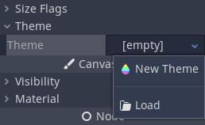

This will create an empty theme and open up the theme editor. Keep in mind that
resources created this way are bundled with the scene by default. Use the context
menu to save the new theme to a file instead.

While the theme editor provides the tools to manage theme types and items, themes also
include the default, fallback font that you can edit only using the Inspector dock.
Same applies to the contents of complex resource types, such as :ref:`StyleBoxes <class_StyleBox>`
and icons — they open for editing in the Inspector.

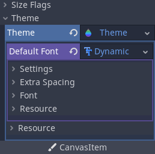

Theme editor overview
---------------------

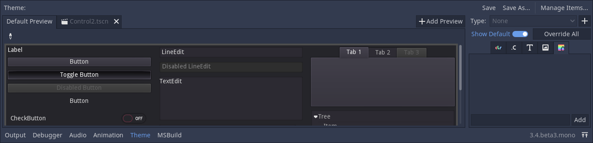

The theme editor has two main parts. The main theme editor, located at the bottom of
the Godot editor, aims to provide users with tools to quickly create, edit, and delete
theme items and types. It gives visual tools for picking and changing controls, abstracting
the underlying theme concepts. The **Manage Theme Items** dialog, on the other hand,
tries to address the needs of those who want to change themes manually. It's also
useful for creating a new editor theme.

Theme previews
~~~~~~~~~~~~~~

The left-hand side of the main editor has a set of preview tabs. The **Default Preview**
tab is visible out of the box and contains most of the frequently used controls in various
states. Previews are interactive, so intermediate states (e.g. hover) can be previewed as well.

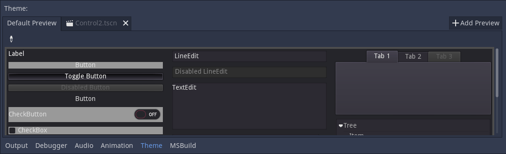

Additional tabs can be created from arbitrary scenes in your project. The scene
must have a control node as its root to function as a preview. To add a new tab
click the **Add Preview** button and select the saved scene from your file system.

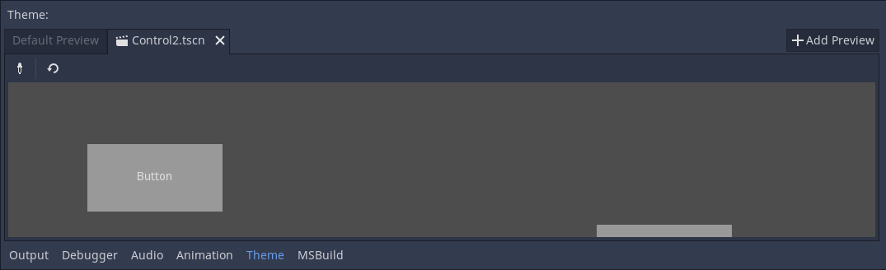

If you make changes to the scene, they will not be reflected in the preview
automatically. To update the preview click the reload button on the toolbar.

Previews can also be used to quickly select the theme type to edit. Select the
picker tool from the toolbar and hover over the preview area to highlight control
nodes. Highlighted control nodes display their class name, or type variation if available.
Clicking on the highlighted control opens it for editing on the right-hand side.

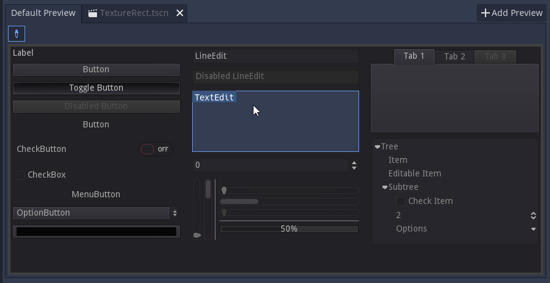

Theme types and items
~~~~~~~~~~~~~~~~~~~~~

The right-hand side of the theme editor provides a list of theme types available
in the edited theme resource, and the contents of the selected type. The list of
type's items is divided into several tabs, corresponding to each data type available
in the theme (colors, constants, styles, etc.). If the **Show Default** option is
enabled, then for each built-in type its default theme values are displayed, greyed
out. If the option is disabled, only the items available in the edited theme itself
are displayed.

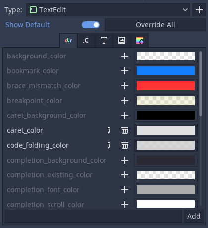

Individual items from the default theme can be added to the current theme by
clicking on the **Override** button next to the item. You can also override all
the default items of the selected theme type by clicking on the **Override All**
button. Overridden properties can then be removed with the **Remove Item** button.
Properties can also be renamed using the **Rename Item** button, and completely
custom properties can be added to the list using the text field below it.

Overridden theme items can be edited directly in the right-hand panel, unless they
are resources. Resources have rudimentary controls available for them, but must be
edited in the Inspector dock instead.

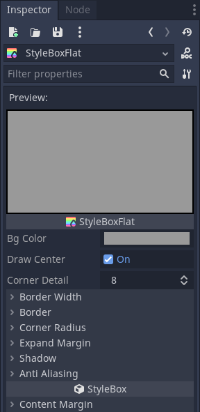

Styleboxes have an unique feature available, where you can pin an individual
stylebox from the list. Pinned stylebox acts like the leader of the pack, and
all styleboxes of the same type are updated alongside it when you change its
properties. This allows you to edit properties of several styleboxes at the
same time.

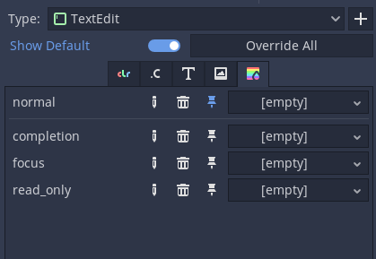

While theme types can be picked from a preview, they can also be added manually.
Clicking the plus button next to the type list opens the **Add item Type** menu.
In that menu you can either select a type from the list, or you can enter an
arbitrary name to create a custom type. Text field also filters the list of control
nodes.

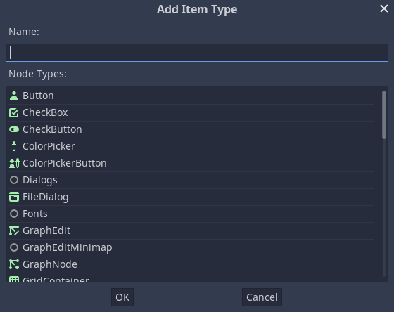

Manage and import items
-----------------------

Clicking the **Manage Items** button brings up the **Manage Theme Items** dialog. In
the **Edit Items** tab you can view and add theme types, as well as view and edit
the theme items of the selected type.

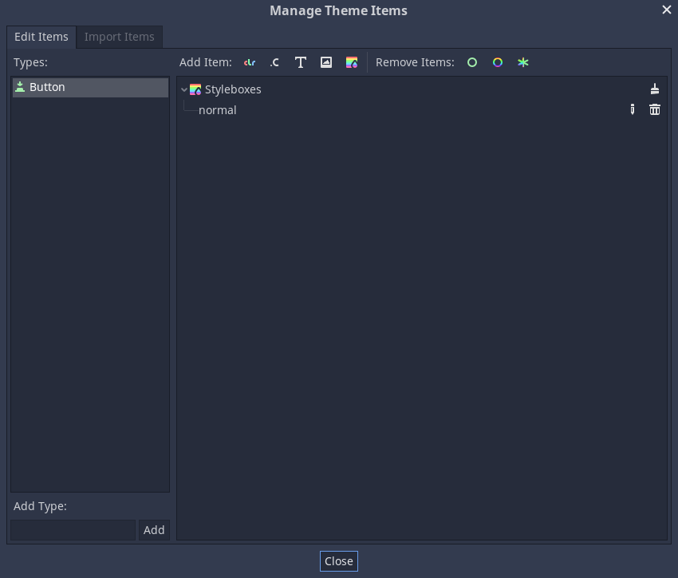

You can create, rename and remove individual theme items here by clicking the
corresponding **Add X Item** and specifying their name. You can also mass delete
theme items either by their data type (using the brush icon in the list) or by
their quality. **Remove Class Items** will remove all built-in theme items you
have customized for a control node type. **Remove Custom Items** will remove all
the custom theme items for the selected type. Finally, **Remove All Items** will
remove everything from the type.

From the **Import Items** tab you can import theme items from other themes. You can
import items from the default Godot theme, the Godot editor theme, or another custom
theme. You can import individual or multiple items, and you can decide whether to
copy or omit their data as well. There are several ways you can select and deselect the
items, including by hand, by hierarchy, by data type, and everything. Opting to
include the data will copy all theme items as they are to your theme. Omitting the data
will create the items of the corresponding data type and name, but will leave them empty,
creating a template of a theme in a way.

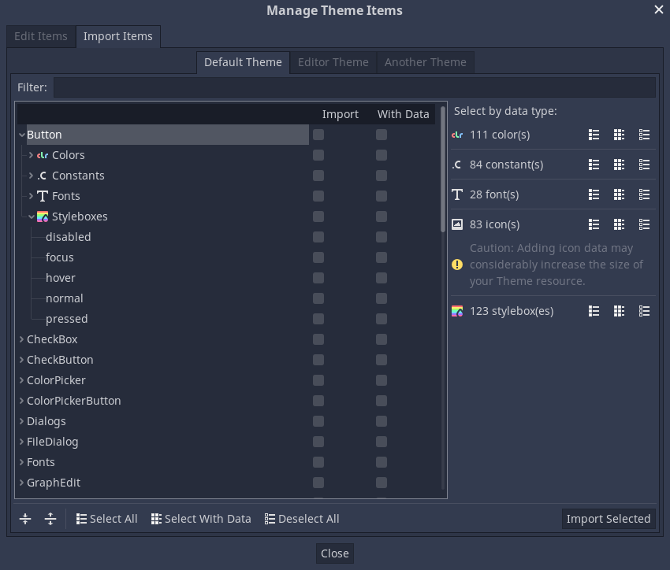
