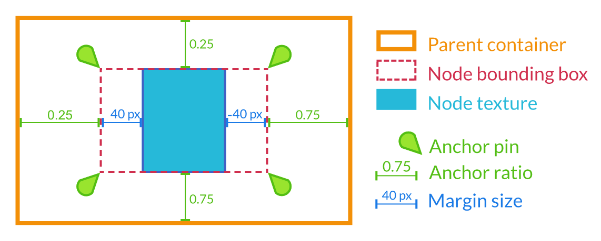
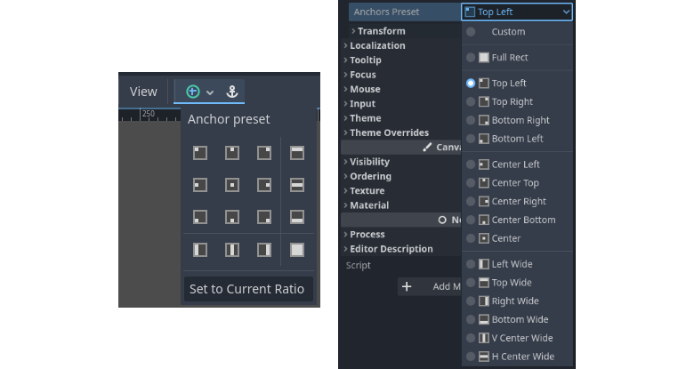
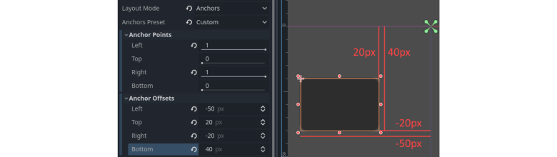

.. _doc_size_and_anchors:

Size and anchors
================

If a game was always going to be run on the same device and at the same
resolution, positioning controls would be a simple matter of setting the
position and size of each one of them. Unfortunately, that is rarely the
case.

Only TVs nowadays have a standard resolution and aspect ratio.
Everything else, from computer monitors to tablets, portable consoles
and mobile phones have different resolutions and aspect ratios.

There are several ways to handle this, but for now, let's just imagine
that the screen resolution has changed and the controls need to be
re-positioned. Some will need to follow the bottom of the screen, others
the top of the screen, or maybe the right or left borders.

This is done using the *margin* and *anchor* properties. Margins represent a
distance in pixels relative to the top-left corner of the parent control or
(in case there is no parent control) the viewport. Anchors adjust where the
margin distances are relative *to*. We can think of them as a percentage of the
parent's size, represented by a value between 0 and 1.0.

:ref:`Containers <doc_gui_containers>` are used to compose the layout of control
scenes, offering powerful layout and sizing functionality. The MarginContainer
is where we typically set margins for its child controls. When using containers,
controls will inherit the layout properties of their parent, removing the need
to modify the anchors of a control.

Layout Presets
--------------

Each control has an individual anchor that can be adjusted from the beginning
to the end of the parent. So the vertical (top, bottom) anchors adjust from 0
(top of parent) to 1.0 (bottom of parent) with 0.5 being the center. The
horizontal (left, right) anchors similarly adjust from left to right of the
parent.

Instead of manually setting the *anchor* properties of a control, you can use
the toolbar's Layout menu, above the viewport. Besides centering, it gives you
many options to align and resize control nodes. These will automatically set
the *anchor* properties. 

Note that changing the layout preset will overwrite the position and size of
the control. Set to Current Ratio will automatically adjust the control's anchor
points and offsets to match the current size and position of the control.

Custom Anchors
--------------

The *anchor* properties can be set manually using the custom anchors preset
option. Here we can change the exact placement and shape of the control
with the anchor points and offsets. Each control has four anchor points and
offsets: left, right, bottom, and top, which correspond to the respective edges
of the control. Anchor offsets represent the relative distance from the anchor
point to the corresponding edge of the control.

Adjusting the two horizontal or the two vertical anchors to different
values will make the control change size when the parent control does.
Here, the control is set to anchor its bottom-right corner to the
parent's bottom-right, while the top-left control margins are still
anchored to the top-left of the parent, so when re-sizing the parent,
the control will always cover it, leaving a 20 pixel margin:

.. image:: img/marginaround.png

Centering a control
-------------------

To center a control in its parent, set its anchors to 0.5 and each margin
to half of its relevant dimension. For example, the code below shows how
a TextureRect can be centered in its parent:

.. tabs::
 .. code-tab:: gdscript GDScript

    var rect = TextureRect.new()
    rect.texture = load("res://icon.png")
    rect.anchor_left = 0.5
    rect.anchor_right = 0.5
    rect.anchor_top = 0.5
    rect.anchor_bottom = 0.5
    var texture_size = rect.texture.get_size()
    rect.offset_left = -texture_size.x / 2
    rect.offset_right = texture_size.x / 2
    rect.offset_top = -texture_size.y / 2
    rect.offset_bottom = texture_size.y / 2
    add_child(rect)

 .. code-tab:: csharp

    var rect = new TextureRect();

    rect.Texture = ResourceLoader.Load<Texture>("res://icon.png");
    rect.AnchorLeft = 0.5f;
    rect.AnchorRight = 0.5f;
    rect.AnchorTop = 0.5f;
    rect.AnchorBottom = 0.5f;

    var textureSize = rect.Texture.GetSize();

    rect.OffsetLeft = -textureSize.x / 2;
    rect.OffsetRight = textureSize.x / 2;
    rect.OffsetTop = -textureSize.y / 2;
    rect.OffsetBottom = textureSize.y / 2;
    AddChild(rect);

Setting each anchor to 0.5 moves the reference point for the margins to
the center of its parent. From there, we set negative margins so that
the control gets its natural size.
