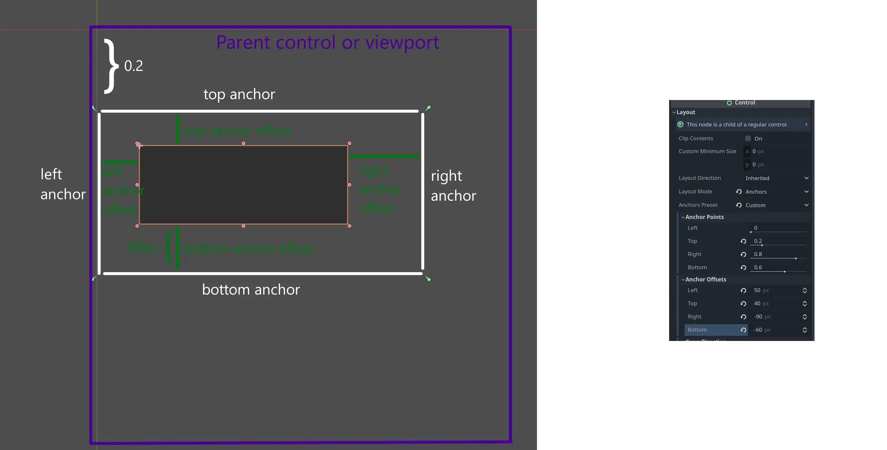
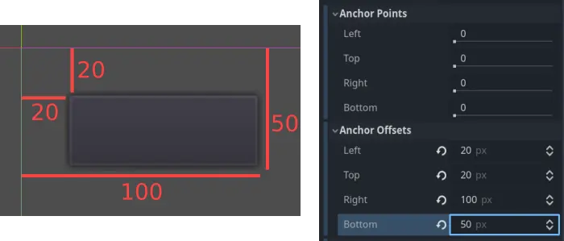
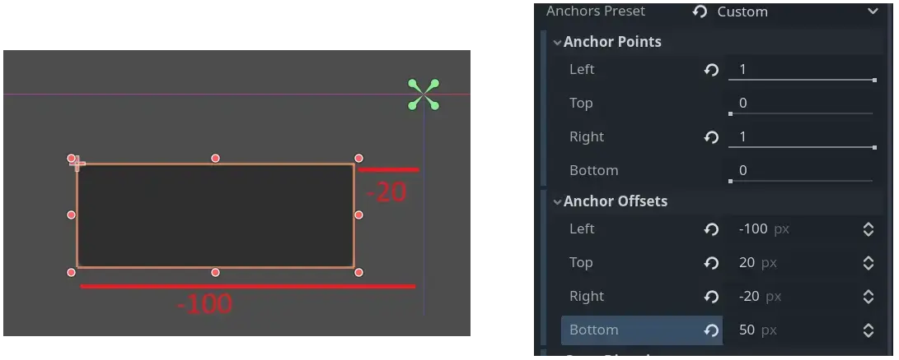
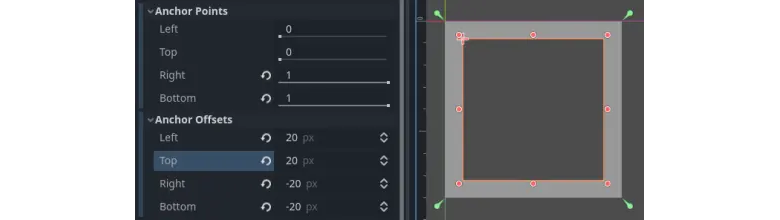
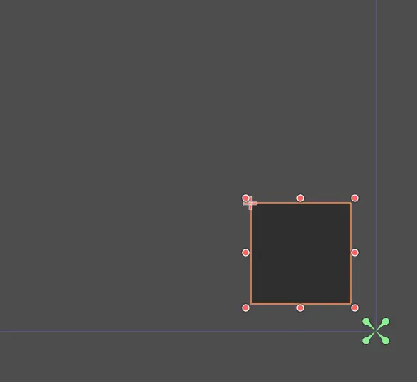
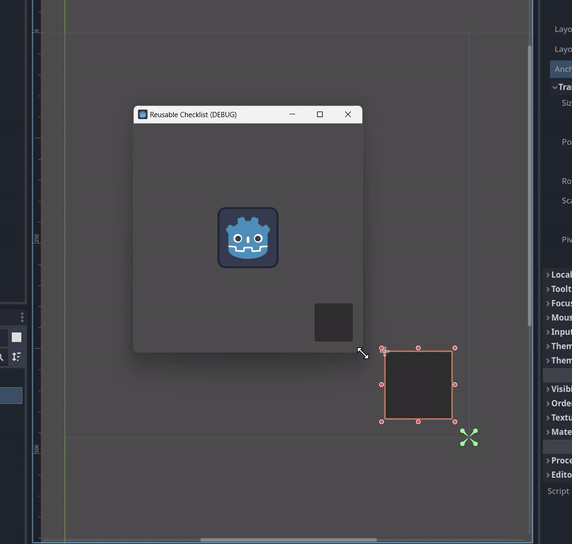

:article_outdated: True

.. _doc_size_and_anchors:

Size and anchors
================

If a game was always going to be run on the same device and at the same
resolution, positioning controls would be a simple matter of setting the
position and size of each one of them. Unfortunately, that is rarely the
case.

Only TVs nowadays have a standard resolution and aspect ratio.
Everything else, from computer monitors to tablets, portable consoles
and mobile phones have different resolutions and aspect ratios.

There are several ways to handle this, but for now, let's just imagine
that the screen resolution has changed and the controls need to be
re-positioned. Some will need to follow the bottom of the screen, others
the top of the screen, or maybe the right or left margins.

.. note::

   The simplest approach to control node positioning is to pick a layout
   preset from the toolbar above the viewport (see the section at the end).
   We go into a bit more detail here for demonstration purposes, and so you
   can get a better understanding of how the layout system works.

This is done by first selecting **Anchors** under Layout > Layout Mode and then
**Custom** Under Layout > Anchors Preset. This opens up a menu where we can
edit the **Anchor Points** and **Anchor Offset** properties. Each control
has four anchor points and their corresponding offsets: left, right, bottom,
and top. Anchor points represent a distance in the range of [0, 1] relative to
the equivalent point of the parent control or (in case there is no parent
control) the viewport.

The other important group of properties that affects positioning is the
anchor offsets. The *anchor points* adjust where the *anchor offsets*
are relative *to*. Each individual anchor point can be adjusted from the
beginning to the end of the parent. So the vertical (top, bottom) anchor points
adjust from 0 (top of parent) to 1.0 (bottom of parent) with 0.5 being the
center, and the control anchor offsets will be placed relative to that point.
The horizontal (left, right) anchor points similarly adjust from left to right
of the parent.

Note that when you wish the edge of a control to be above or left of the
anchor point, you must change the anchor offset value to be negative.

For example: when the horizontal anchors are changed to 1, the anchor offset
values become relative to the top-right corner of the parent control or
viewport.

Adjusting the two horizontal or the two vertical anchors to different
values will make the control change size when the parent control does.
Here, the control is set to anchor its bottom-right corner to the
parent's bottom-right, while the top-left control margins are still
anchored to the top-left of the parent, so when re-sizing the parent,
the control will always cover it, leaving a 20 pixel margin:

Centering a control
-------------------

To center a control in its parent, set its anchor points to 0.5 and each anchor
offset to half of its relevant dimension. For example, the code below shows
how a TextureRect can be centered in its parent:

.. tabs::
 .. code-tab:: gdscript GDScript

    var rect = TextureRect.new()
    rect.texture = load("res://icon.png")
    rect.anchor_left = 0.5
    rect.anchor_right = 0.5
    rect.anchor_top = 0.5
    rect.anchor_bottom = 0.5
    var texture_size = rect.texture.get_size()
    rect.offset_left = -texture_size.x / 2
    rect.offset_right = texture_size.x / 2
    rect.offset_top = -texture_size.y / 2
    rect.offset_bottom = texture_size.y / 2
    add_child(rect)

 .. code-tab:: csharp

    var rect = new TextureRect();

    rect.Texture = ResourceLoader.Load<Texture>("res://icon.png");
    rect.AnchorLeft = 0.5f;
    rect.AnchorRight = 0.5f;
    rect.AnchorTop = 0.5f;
    rect.AnchorBottom = 0.5f;

    var textureSize = rect.Texture.GetSize();

    rect.OffsetLeft = -textureSize.X / 2;
    rect.OffsetRight = textureSize.X / 2;
    rect.OffsetTop = -textureSize.Y / 2;
    rect.OffsetBottom = textureSize.Y / 2;
    AddChild(rect);

Setting each anchor point to 0.5 moves the reference point for the anchor
offsets to the center of its parent. From there, we set negative margins so
that the control gets its natural size.

Layout Presets
--------------

Instead of manually adjusting the margin and anchor values for every node, you
can use the toolbar's Layout menu, above the viewport. This offers multiple
common presets (e.g. top right, bottom left, center, full rect, bottom wide).

.. image:: img/layout_dropdown_menu.webp

After picking a preset (bottom right in the image below), you can also offset
the control node manually by simply dragging it away:

and it will work the same as if you had set an offset:

