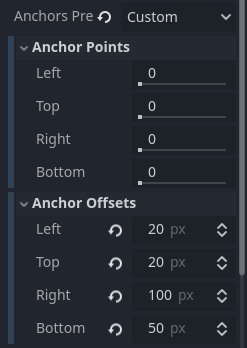
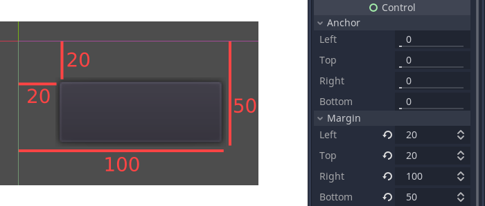
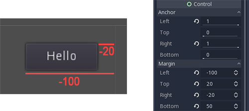
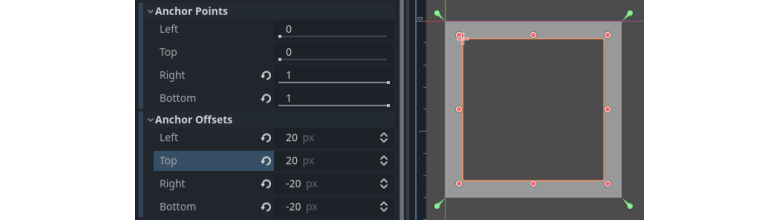
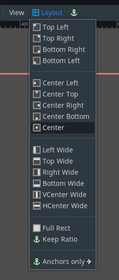

:article_outdated: True

.. _doc_size_and_anchors:

Size and anchors
================

If a game was always going to be run on the same device and at the same
resolution, positioning controls would be a simple matter of setting the
position and size of each one of them. Unfortunately, that is rarely the
case.

Only TVs nowadays have a standard resolution and aspect ratio.
Everything else, from computer monitors to tablets, portable consoles
and mobile phones have different resolutions and aspect ratios.

There are several ways to handle this, but for now, let's just imagine
that the screen resolution has changed and the controls need to be
re-positioned. Some will need to follow the bottom of the screen, others
the top of the screen, or maybe the right or left margins.

This is done by editing the *margin* properties of controls. Each
control has four margins: left, right, bottom, and top, which correspond
to the respective edges of the control. By default, all of
them represent a distance in pixels relative to the top-left corner of
the parent control or (in case there is no parent control) the viewport.

So to make the control wider you can make the right margin larger and/or
make the left margin smaller. This lets you set the exact placement
and shape of the control.

The *anchor* properties adjust where the margin distances are relative *to*.
Each margin has an individual anchor that can be adjusted from the
beginning to the end of the parent. So the vertical (top, bottom) anchors
adjust from 0 (top of parent) to 1.0 (bottom of parent) with 0.5 being
the center, and the control margins will be placed relative to that
point. The horizontal (left, right) anchors similarly adjust from left to
right of the parent.

Note that when you wish the edge of a control to be above or left of the
anchor point, you must change the margin value to be negative.

For example: when horizontal anchors are changed to 1, the margin values
become relative to the top-right corner of the parent control or viewport.

Adjusting the two horizontal or the two vertical anchors to different
values will make the control change size when the parent control does.
Here, the control is set to anchor its bottom-right corner to the
parent's bottom-right, while the top-left control margins are still
anchored to the top-left of the parent, so when re-sizing the parent,
the control will always cover it, leaving a 20 pixel margin:

Centering a control
-------------------

To center a control in its parent, set its anchors to 0.5 and each margin
to half of its relevant dimension. For example, the code below shows how
a TextureRect can be centered in its parent:

.. tabs::
 .. code-tab:: gdscript GDScript

    var rect = TextureRect.new()
    rect.texture = load("res://icon.png")
    rect.anchor_left = 0.5
    rect.anchor_right = 0.5
    rect.anchor_top = 0.5
    rect.anchor_bottom = 0.5
    var texture_size = rect.texture.get_size()
    rect.offset_left = -texture_size.x / 2
    rect.offset_right = texture_size.x / 2
    rect.offset_top = -texture_size.y / 2
    rect.offset_bottom = texture_size.y / 2
    add_child(rect)

 .. code-tab:: csharp

    var rect = new TextureRect();

    rect.Texture = ResourceLoader.Load<Texture>("res://icon.png");
    rect.AnchorLeft = 0.5f;
    rect.AnchorRight = 0.5f;
    rect.AnchorTop = 0.5f;
    rect.AnchorBottom = 0.5f;

    var textureSize = rect.Texture.GetSize();

    rect.OffsetLeft = -textureSize.X / 2;
    rect.OffsetRight = textureSize.X / 2;
    rect.OffsetTop = -textureSize.Y / 2;
    rect.OffsetBottom = textureSize.Y / 2;
    AddChild(rect);

Setting each anchor to 0.5 moves the reference point for the margins to
the center of its parent. From there, we set negative margins so that
the control gets its natural size.

Layout Presets
--------------

Instead of manually adjusting the margin and anchor values, you can use the
toolbar's Layout menu, above the viewport. Besides centering, it gives you many
options to align and resize control nodes.

