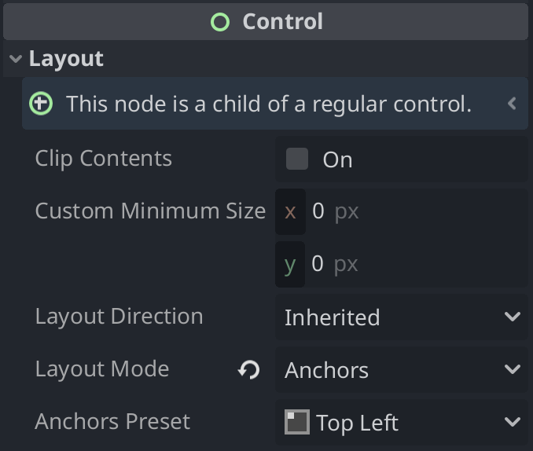
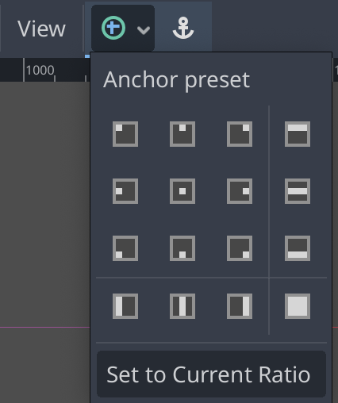
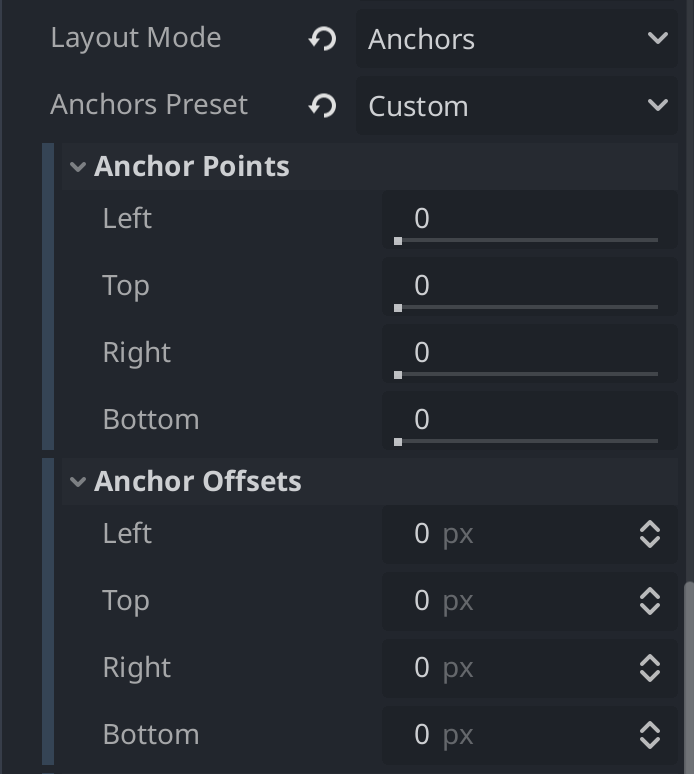

:article_outdated: True

.. _doc_size_and_anchors:

Size and anchors
================

If a game was always going to be run on the same device and at the same
resolution, positioning controls would be a simple matter of setting the
position and size of each one of them. Unfortunately, that is rarely the
case.

Only TVs nowadays have a standard resolution and aspect ratio.
Everything else, from computer monitors to tablets, portable consoles
and mobile phones have different resolutions and aspect ratios.

There are several ways to handle this, but for now, let's just imagine
that the screen resolution has changed and the controls need to be
re-positioned. Some will need to follow the bottom of the screen, others
the top of the screen, or maybe the right or left margins.

.. image:: img/anchors.png

A control node can be positioned using anchors under the ``Layout`` tab by
setting the ``Layout Mode`` property to ``Anchors``. You can now position the
anchor by setting the ``Anchors Preset`` property to a preset or to ``Custom``
to customize the anchor's position.

Anchor presets can also be set by using the toolbar's Layout menu, above the
viewport.

Custom Anchors
--------------

You can customize an anchor's position by setting the ``Anchors Preset``
property to ``Custom``. The ``Anchor Points`` properties anchor the ``Left``,
``Top``, ``Right``, and/or ``Bottom`` edges of the node to the origin, center,
or end of its parent control. The value of each property can be adjusted from
0 (the top or left of the parent) to 1 (the bottom or right of the parent),
with 0.5 being the center. The corresponding ``Anchor Offsets`` properties will
be placed relative to these points.

Adjusting the two horizontal or the two vertical anchor points to different
values will make the control change size when the parent control does.

The ``Anchor Offsets`` properties adjust the pixel distance of the ``Left``,
``Top``, ``Right``, and/or ``Bottom`` edges of the node relative to its
corresponding anchor point.

Note that when you wish the edge of a control to be above or left of the
anchor point, you must change the offset value to be negative.

Centering a control
-------------------

To center a control in its parent, set its anchors to 0.5 and each offset
to half of its relevant dimension. For example, the code below shows how
a TextureRect can be centered in its parent:

.. tabs::
 .. code-tab:: gdscript GDScript

    var rect = TextureRect.new()
    rect.texture = load("res://icon.png")
    rect.anchor_left = 0.5
    rect.anchor_right = 0.5
    rect.anchor_top = 0.5
    rect.anchor_bottom = 0.5
    var texture_size = rect.texture.get_size()
    rect.offset_left = -texture_size.x / 2
    rect.offset_right = texture_size.x / 2
    rect.offset_top = -texture_size.y / 2
    rect.offset_bottom = texture_size.y / 2
    add_child(rect)

 .. code-tab:: csharp

    var rect = new TextureRect();

    rect.Texture = ResourceLoader.Load<Texture>("res://icon.png");
    rect.AnchorLeft = 0.5f;
    rect.AnchorRight = 0.5f;
    rect.AnchorTop = 0.5f;
    rect.AnchorBottom = 0.5f;

    var textureSize = rect.Texture.GetSize();

    rect.OffsetLeft = -textureSize.X / 2;
    rect.OffsetRight = textureSize.X / 2;
    rect.OffsetTop = -textureSize.Y / 2;
    rect.OffsetBottom = textureSize.Y / 2;
    AddChild(rect);

Setting each anchor to 0.5 moves the reference point for the offsets to
the center of its parent. From there, we set negative offsets so that
the control gets its natural size.