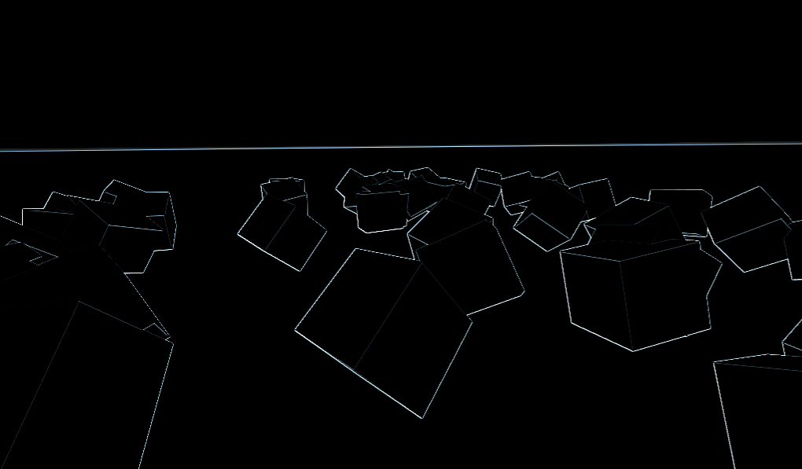

.. _doc_custom_postprocessing:

Custom post-processing 
======================

Introduction
------------

Godot provides many post-processing effects out of the box including, Bloom, DOF, and SSAO.
Sometimes you will want to write your own post-processing effect. This can be done easily
in Godot by rendering your scene into a :ref:`Viewport <class_Viewport>` and then rendering the 
:ref:`Viewport's <class_Viewport>` :ref:`texture <class_ViewportTexture>` to a full screen quad. 

.. note:: At the time of writing Godot does not support rendering to multiple buffers at the same 
          time so the post-processing shader will not have access to normals, or anything else. 
          You only have access to the fullscreen color texture. 

Screen reading shaders
----------------------

Before starting, a brief note on screen reading shaders is in order.

The easiest way to do a custom post-processing shader is to use Godot's built-in ability to read
from the screen texture. In order to take advantage of this you simply render an object over the 
entire scene (a sprite in 2D or a quad in 3D). And use ``texture(SCREEN_TEXTURE, SCREEN_UV)`` 
in the shader. Multi-pass post-processing shaders can even be used with a 
:ref:`BackBufferCopy <class_BackBufferCopy>` node. For more information on how do to this see the 
:ref:`Screen Reading Shaders Tutorial <doc_screen-reading_shaders>`.

Single pass
-----------

The primary benefit to using a :ref:`Viewport <class_Viewport>` is that you have full control over 
the rendering of the scene (including how frequently to update it) and you can take advantage of 
using the :ref:`ViewportContainer <class_ViewportContainer>` to render 3D objects within a 2D root scene.

First we need a :ref:`Viewport <class_Viewport>` to render our scene to. Then we need a scene that can 
render our :ref:`Viewport <class_Viewport>`. This can either be a 2D or 3D scene. The benefit 
of a 2D scene is it is easy to set up a fullscreen :ref:`ViewportContainer <class_ViewportContainer>` 
to display our :ref:`Viewport <class_Viewport>`. 

For this demo let's use a :ref:`Node2D <class_Node2D>` with a 
:ref:`ViewportContainer <class_ViewportContainer>` and finally a :ref:`Viewport <class_Viewport>`. 

Your hierarchy should look like this:

.. image:: img/post_hierarchy1.png

Inside the :ref:`Viewport <class_Viewport>` you can have whatever you want. This will contain 
your main scene. For this tutorial we will use a field of random boxes.

.. image:: img/post_boxes.png

In order to take advantage of the :ref:`Viewport <class_Viewport>`, attach a material to the 
:ref:`ViewportContainer <class_ViewportContainer>`. 

The benefit of using the :ref:`ViewportContainer <class_ViewportContainer>` is that the 
:ref:`Viewport <class_Viewport>` can be accessed easily in the shader with the built-in 
``TEXTURE`` uniform. You can choose not to use a :ref:`ViewportContainer <class_ViewportContainer>`, 
but if you do so you will need to create your own uniform in the shader and pass the 
:ref:`Viewport <class_Viewport>` texture in manually. To do so, add a uniform to the shader you use.

::

  //In Godot Shader
  uniform sampler2D ViewportTexture;

And you can pass the texture into the shader from GDScript like so:

::

  #In Gdscript
  func _ready():
    $Sprite.material.set_shader_param("ViewportTexture", $Viewport.get_texture())

Now, assuming you are using a :ref:`ViewportContainer <class_ViewportContainer>`, add a 
:ref:`ShaderMaterial <class_ShaderMaterial>` to the :ref:`ViewportContainer <class_ViewportContainer>`
and add the following code.

::

  shader_type canvas_item;

  void fragment() {
	  vec3 col = -8.0 * texture(TEXTURE, SCREEN_UV).xyz;
	  col += texture(TEXTURE, SCREEN_UV + vec2(0.0, SCREEN_PIXEL_SIZE.y)).xyz;
	  col += texture(TEXTURE, SCREEN_UV + vec2(0.0, -SCREEN_PIXEL_SIZE.y)).xyz;
	  col += texture(TEXTURE, SCREEN_UV + vec2(SCREEN_PIXEL_SIZE.x, 0.0)).xyz;
	  col += texture(TEXTURE, SCREEN_UV + vec2(-SCREEN_PIXEL_SIZE.x, 0.0)).xyz;
	  col += texture(TEXTURE, SCREEN_UV + SCREEN_PIXEL_SIZE.xy).xyz;
	  col += texture(TEXTURE, SCREEN_UV + SCREEN_PIXEL_SIZE.xy).xyz;
	  col += texture(TEXTURE, SCREEN_UV + vec2(-SCREEN_PIXEL_SIZE.x, SCREEN_PIXEL_SIZE.y)).xyz;
	  col += texture(TEXTURE, SCREEN_UV + vec2(SCREEN_PIXEL_SIZE.x, -SCREEN_PIXEL_SIZE.y)).xyz;
	  COLOR.xyz = col;
  }

The above code is for a single pass edge detection filter in this case we are using a 
`Sobel filter <https://en.wikipedia.org/wiki/Sobel_operator>`_. It reads pixels from a screen in a 
9x9 grid around the current pixel and adds them together. What makes it interesting is that 
it assigns weights to each pixel; +1 for each of the eight around the center and -8 for the 
center pixel. The choice of weights is called a "kernel". You can use different kernels to
achieve all kinds of different effects.

Multi-pass
----------

Multi-pass post-processing is useful for effects like blur which can be made significantly 
faster if done in two passes or for other effects that require the output of the previous 
stage of post-processing. It is done using the same method as single-pass post-processing
with the added complication that you need to be aware of the order in which the 
:ref:`Viewports <class_Viewport>` are rendered.

In order to make a multi-pass post-processing shader you stack :ref:`Viewports <class_Viewport>`. 
In the example above you rendered the contents of one :ref:`Viewport <class_Viewport>` into 
the root :ref:`Viewport <class_Viewport>` with a :ref:`ViewportContainer <class_ViewportContainer>`. 
You can do the same thing for a multi-pass shader. Just render the contents of one 
:ref:`Viewport <class_Viewport>` into another and then render the contents of that 
:ref:`Viewport <class_Viewport>` into the root :ref:`Viewport <class_Viewport>`.

Your scene hierarchy should look something like this

.. image:: img/post_hierarchy2.png

Godot will render the child :ref:`Viewport <class_Viewport>` first, so if the order matters for 
your shaders make sure that you assign the material you want used first to the lowest 
:ref:`ViewportContainer <class_ViewportContainer>` in the tree.

.. note:: You can also render your Viewports seperately without nesting them like this. You just 
          need to use two Viewports and render them in the proper order.

Everything else is the same as with the single-pass post-processing shader.

As an example, you could write a full screen Gaussian blur effect by attaching the following
pieces of code to each of the :ref:`ViewportContainers <class_ViewportContainer>`. For this
example, order does not matter.

::
  
  shader_type canvas_item;
  
  //Blurs the screen in the X-direction
  void fragment() {
	  vec3 col = texture(TEXTURE, SCREEN_UV).xyz * 0.16;
	  col += texture(TEXTURE, SCREEN_UV + vec2(SCREEN_PIXEL_SIZE.x, 0.0)).xyz * 0.15;
	  col += texture(TEXTURE, SCREEN_UV + vec2(-SCREEN_PIXEL_SIZE.x, 0.0)).xyz * 0.15;
	  col += texture(TEXTURE, SCREEN_UV + vec2(2.0 * SCREEN_PIXEL_SIZE.x, 0.0)).xyz * 0.12;
	  col += texture(TEXTURE, SCREEN_UV + vec2(2.0 * -SCREEN_PIXEL_SIZE.x, 0.0)).xyz * 0.12;
	  col += texture(TEXTURE, SCREEN_UV + vec2(3.0 * SCREEN_PIXEL_SIZE.x, 0.0)).xyz * 0.09;
	  col += texture(TEXTURE, SCREEN_UV + vec2(3.0 * -SCREEN_PIXEL_SIZE.x, 0.0)).xyz * 0.09;
	  col += texture(TEXTURE, SCREEN_UV + vec2(4.0 * SCREEN_PIXEL_SIZE.x, 0.0)).xyz * 0.05;
	  col += texture(TEXTURE, SCREEN_UV + vec2(4.0 * -SCREEN_PIXEL_SIZE.x, 0.0)).xyz * 0.05;
	  COLOR.xyz = col;
  }

::
  
  shader_type canvas_item;
  
  //Blurs the screen in the Y-direction
  void fragment() {
	  vec3 col = texture(TEXTURE, SCREEN_UV).xyz * 0.16;
	  col += texture(TEXTURE, SCREEN_UV + vec2(0.0, SCREEN_PIXEL_SIZE.y)).xyz * 0.15;
	  col += texture(TEXTURE, SCREEN_UV + vec2(0.0, -SCREEN_PIXEL_SIZE.y)).xyz * 0.15;
	  col += texture(TEXTURE, SCREEN_UV + vec2(0.0, 2.0 * SCREEN_PIXEL_SIZE.y)).xyz * 0.12;
	  col += texture(TEXTURE, SCREEN_UV + vec2(0.0, 2.0 * -SCREEN_PIXEL_SIZE.y)).xyz * 0.12;
	  col += texture(TEXTURE, SCREEN_UV + vec2(0.0, 3.0 * SCREEN_PIXEL_SIZE.y)).xyz * 0.09;
	  col += texture(TEXTURE, SCREEN_UV + vec2(0.0, 3.0 * -SCREEN_PIXEL_SIZE.y)).xyz * 0.09;
	  col += texture(TEXTURE, SCREEN_UV + vec2(0.0, 4.0 * SCREEN_PIXEL_SIZE.y)).xyz * 0.05;
	  col += texture(TEXTURE, SCREEN_UV + vec2(0.0, 4.0 * -SCREEN_PIXEL_SIZE.y)).xyz * 0.05;
	  COLOR.xyz = col;
  }

Using the above code you should end up with a full screen blur effect like below.

.. image:: img/post_blur.png

For more information on how :ref:`Viewports <class_Viewport>` work see the :ref:`Viewports Tutorial <doc_viewports>`.
