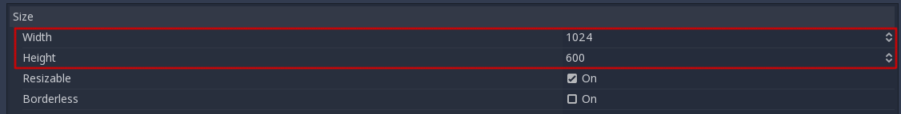
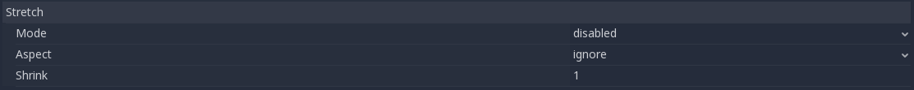

.. _doc_multiple_resolutions:

Multiple resolutions
====================

The problem of multiple resolutions
-----------------------------------

Developers often have trouble understanding how to best support multiple
resolutions in their games. For desktop and console games, this is more or less
straightforward, as most screen aspect ratios are 16:9 and resolutions
are standard (720p, 1080p, 1440p, 4K, …).

For mobile games, at first, it was easy. For many years, the iPhone and iPad
used the same resolution. When *Retina* was implemented, they just doubled
the pixel density; most developers had to supply assets in default and double
resolutions.

Nowadays, this is no longer the case, as there are plenty of different screen
sizes, densities, and aspect ratios. Non-conventional sizes are also becoming
increasingly popular, such as ultrawide displays.

For 3D games, there is not much of a need to support multiple resolutions (from
the aesthetic point of view). The 3D geometry will just fill the screen based on
the field of view, disregarding the aspect ratio. The main reason one may want
to support this, in this case, is for *performance* reasons (running in lower
resolution to increase frames per second).

For 2D and game UIs, this is a different matter, as art needs to be created
using specific pixel sizes in software such as Photoshop, GIMP or Krita.

Since layouts, aspect ratios, resolutions, and pixel densities can change so
much, it is no longer possible to design UIs for every specific screen.
Another method must be used.

One size fits all
-----------------

The most common approach is to use a single *base* resolution and
then fit it to everything else. This resolution is how most players are expected
to play the game (given their hardware). For mobile, Google has useful `stats
<https://developer.android.com/about/dashboards>`_ online, and for desktop,
Steam `also does <https://store.steampowered.com/hwsurvey/>`_.

As an example, Steam shows that the most common *primary display resolution* is
1920×1080, so a sensible approach is to develop a game for this resolution, then
handle scaling for different sizes and aspect ratios.

Godot provides a several useful tools to do this easily.

Base size
---------

A base size for the window can be specified in the Project Settings under
**Display → Window**.

However, what it does is not completely obvious; the engine will *not*
attempt to switch the monitor to this resolution. Rather, think of this
setting as the "design size", i.e. the size of the area that you work
with in the editor. This setting corresponds directly to the size of the
blue rectangle in the 2D editor.

There is often a need to support devices with screen and window sizes
that are different from this base size. Godot offers many ways to
control how the viewport will be resized and stretched to different
screen sizes.

Resizing
--------

There are several types of devices, with several types of screens, which
in turn have different pixel density and resolutions. Handling all of
them can be a lot of work, so Godot tries to make the developer's life a
little easier. The :ref:`Viewport <class_Viewport>`
node has several functions to handle resizing, and the root node of the
scene tree is always a viewport (scenes loaded are instanced as a child
of it, and it can always be accessed by calling
``get_tree().get_root()`` or ``get_node("/root")``).

In any case, while changing the root Viewport params is probably the
most flexible way to deal with the problem, it can be a lot of work,
code and guessing, so Godot provides a simple set of parameters in the
project settings to handle multiple resolutions.

Stretch settings
----------------

Stretch settings are located in the project settings, it's just a bunch
of configuration variables that provide several options:

Stretch Mode
^^^^^^^^^^^^

The **Stretch Mode** setting defines how the base size is stretched to fit
the resolution of the window or screen.

.. image:: img/stretch.png

The animations below use a "base size" of just 16×9 pixels to
demonstrate the effect of different stretch modes. A single sprite, also
16×9 pixels in size, covers the entire viewport, and a diagonal
:ref:`Line2D <class_Line2D>` is added on top of it:

.. image:: img/stretch_demo_scene.png

.. Animated GIFs are generated from:
.. https://github.com/ttencate/godot_scaling_mode

-  **Stretch Mode = Disabled** (default): No stretching happens. One
   unit in the scene corresponds to one pixel on the screen. In this
   mode, the **Stretch Aspect** setting has no effect.

   This is a good option if you want full control over every screen
   pixel, and is probably the best option for 3D games.

   .. image:: img/stretch_disabled_expand.gif

-  **Stretch Mode = 2D**: In this mode, the size specified in
   display/width and display/height in the project settings is
   stretched to cover the whole screen (taking the **Stretch Aspect**
   setting into account). This means that everything is rendered
   directly at the target resolution. 3D is largely unaffected,
   while in 2D, there is no longer a 1:1 correspondence between sprite
   pixels and screen pixels, which may result in scaling artifacts.

   This is a good option if your 2D artwork has a sufficiently high
   resolution and does not require pixel-perfect rendering. Consider
   enabling texture filtering and mipmapping on your 2D textures and
   fonts.

   .. image:: img/stretch_2d_expand.gif

-  **Stretch Mode = Viewport**: Viewport scaling means that the size of
   the root :ref:`Viewport <class_Viewport>` is set precisely to the
   base size specified in the Project Settings' **Display** section.
   The scene is rendered to this viewport first. Finally, this viewport
   is scaled to fit the screen (taking the **Stretch Aspect** setting into
   account).

   This mode is useful when working with pixel-precise games, or for the
   sake of rendering to a lower resolution to improve performance.

   .. image:: img/stretch_viewport_expand.gif

Stretch Aspect
^^^^^^^^^^^^^^

The second setting is the stretch aspect. Note that this only takes effect if
**Stretch Mode** is set to something other than **Disabled**.

In the animations below, you will notice gray and black areas. The black
areas are added by the engine and cannot be drawn into. The gray areas
are part of your scene, and can be drawn to. The gray areas correspond
to the region outside the blue frame you see in the 2D editor.

-  **Stretch Aspect = Ignore**: Ignore the aspect ratio when stretching
   the screen. This means that the original resolution will be stretched
   to exactly fill the screen, even if it's wider or narrower. This may
   result in nonuniform stretching: things looking wider or taller than
   designed.

   .. image:: img/stretch_viewport_ignore.gif

-  **Stretch Aspect = Keep**: Keep aspect ratio when stretching the
   screen. This means that the viewport retains its original size
   regardless of the screen resolution, and black bars will be added to
   the top/bottom of the screen ("letterboxing") or the sides
   ("pillarboxing").

   This is a good option if you know the aspect ratio of your target
   devices in advance, or if you don't want to handle different aspect
   ratios.

   .. image:: img/stretch_viewport_keep.gif

-  **Stretch Aspect = Keep Width**: Keep aspect ratio when stretching the
   screen. If the screen is wider than the base size, black bars are
   added at the left and right (pillarboxing). But if the screen is
   taller than the base resolution, the viewport will be grown in the
   vertical direction (and more content will be visible to the bottom).
   You can also think of this as "Expand Vertically".

   This is usually the best option for creating GUIs or HUDs that scale,
   so some controls can be anchored to the bottom
   (:ref:`doc_size_and_anchors`).

   .. image:: img/stretch_viewport_keep_width.gif

-  **Stretch Aspect = Keep Height**: Keep aspect ratio when stretching
   the screen. If the screen is taller than the base size, black
   bars are added at the top and bottom (letterboxing). But if the
   screen is wider than the base resolution, the viewport will be grown
   in the horizontal direction (and more content will be visible to the
   right). You can also think of this as "Expand Horizontally".

   This is usually the best option for 2D games that scroll horizontally
   (like runners or platformers).

   .. image:: img/stretch_viewport_keep_height.gif

-  **Stretch Aspect = Expand**: Keep aspect ratio when stretching the
   screen, but keep neither the base width nor height. Depending on the
   screen aspect ratio, the viewport will either be larger in the
   horizontal direction (if the screen is wider than the base size) or
   in the vertical direction (if the screen is taller than the original
   size).

   .. image:: img/stretch_viewport_expand.gif

Stretch Shrink
^^^^^^^^^^^^^^

The **Shrink** setting allows you to add an extra scaling factor on top of
what the **Stretch** options above already provide. The default value of 1
means that no scaling occurs.

If, for example, you set **Shrink** to 4 and leave **Stretch Mode** on
**Disabled**, each unit in your scene will correspond to 4×4 pixels on the
screen.

If **Stretch Mode** is set to something other than **Disabled**, the size of
the root viewport is scaled down by the **Shrink** factor, and pixels
in the output are scaled up by the same amount. This is rarely useful for
2D games, but can be used to increase performance in 3D games
by rendering them at a lower resolution.

From scripts
^^^^^^^^^^^^

To configure stretching at runtime from a script, use the
``get_tree().set_screen_stretch()`` function (see
:ref:`SceneTree.set_screen_stretch() <class_SceneTree_method_set_screen_stretch>`).

Reducing aliasing on downsampling
^^^^^^^^^^^^^^^^^^^^^^^^^^^^^^^^^

If the game has a very high base resolution (e.g. 3840×2160), aliasing might
appear when downsampling to something considerably lower like 1280×720.
Aliasing can be made less visible by shrinking all images by a factor of 2
upon loading. This can be done by calling the method below before
the game data is loaded:

::

    VisualServer.texture_set_shrink_all_x2_on_set_data(true)

Handling aspect ratios
^^^^^^^^^^^^^^^^^^^^^^

Once scaling for different resolutions is accounted for, make sure that
your *user interface* also scales for different aspect ratios. This can be
done using :ref:`anchors <doc_size_and_anchors>` and/or :ref:`containers
<doc_gui_containers>`.

Field of view scaling
^^^^^^^^^^^^^^^^^^^^^

The 3D Camera node's **Keep Aspect** property defaults to the **Keep Height**
scaling mode (also called *Hor+*). This is usually the best value for desktop
games and mobile games in landscape mode, as widescreen displays will
automatically use a wider field of view.

However, if your 3D game is intended to be played in portrait mode, it may make
more sense to use **Keep Width** instead (also called *Vert-*). This way,
smartphones with an aspect ratio taller than 16:9 (e.g. 19:9) will use a
*taller* field of view, which is more logical here.
