.. _doc_viewport_as_texture:

Using a Viewport as a texture
=============================

Introduction
------------

This tutorial will introduce you to using the :ref:`Viewport <class_Viewport>` as a
texture that can be applied to 3D objects. In order to do so it will walk you through the process
of making a procedural planet like the one below:

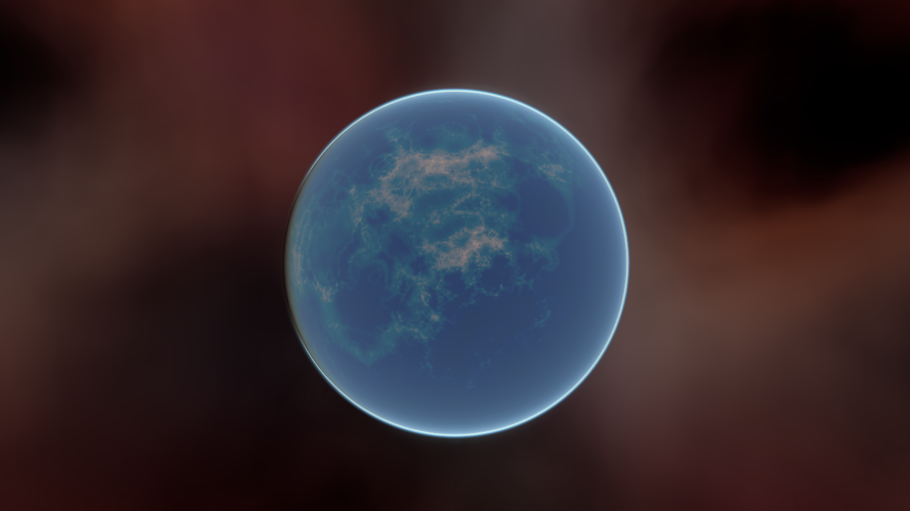

.. note:: This tutorial does not cover how to code a dynamic atmosphere like the one this planet has.

This tutorial assumes you are familiar with how to set up a basic scene including:
a :ref:`Camera <class_Camera>`, a :ref:`light source <class_OmniLight>`, a 
:ref:`Mesh Instance <class_MeshInstance>` with a :ref:`Primitive Mesh <class_PrimitiveMesh>`, 
and applying a :ref:`Spatial Material <class_SpatialMaterial>` to the mesh. The focus will be on using 
the :ref:`Viewport <class_Viewport>` to dynamically create textures that can be applied to the mesh.

During the course of this tutorial will cover the following topics:

- How to use a :ref:`Viewport <class_Viewport>` as a render texture
- Mapping a texture to a sphere with equirectangular mapping
- Fragment shader techniques for procedural planets
- Setting a Roughness map from a :ref:`Viewport Texture <class_ViewportTexture>`

Setting up the Viewport
-----------------------

First, add a :ref:`Viewport <class_Viewport>` to the scene.

Next, set the size of the :ref:`Viewport <class_Viewport>` to ``(1024, 512)``. The 
:ref:`Viewport <class_Viewport>` can actually be any size so long as the width is double the height. 
The width needs to be double the height so that the image will accurately map onto the 
sphere as we will be using equirectangular projection, but more on that later.

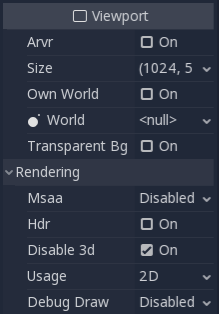

Next, disable HDR and disable 3D. We don't need HDR because our planets surface will not be especially
bright so values between ``0`` and ``1`` will be fine. And we will be using a :ref:`ColorRect <class_ColorRect>` 
to render the surface, so we don't need 3D either.

Select the Viewport and add a :ref:`ColorRect <class_ColorRect>` as a child.

Set the anchors "Right" and "Bottom" to ``1``, then make sure all the margins are set to ``0``. This
will ensure that the :ref:`ColorRect <class_ColorRect>` takes up the entire :ref:`Viewport <class_Viewport>`.

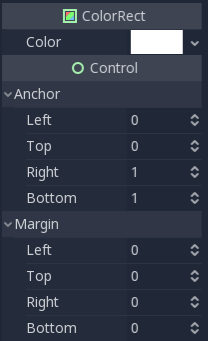

Next, we add a :ref:`Shader Material <class_ShaderMaterial>` to the :ref:`ColorRect <class_ColorRect>`.

.. note:: I'm assuming you are familiar with the basics of shading for this tutorial. Even if you aren't, all the code
          will still be provided so you should have no problem following along.

::

  shader_type canvas_item

  void fragment() {
    COLOR = vec4(UV.x, UV.y, 0.5, 1.0);
  }

The above code renders a gradient like the one below.

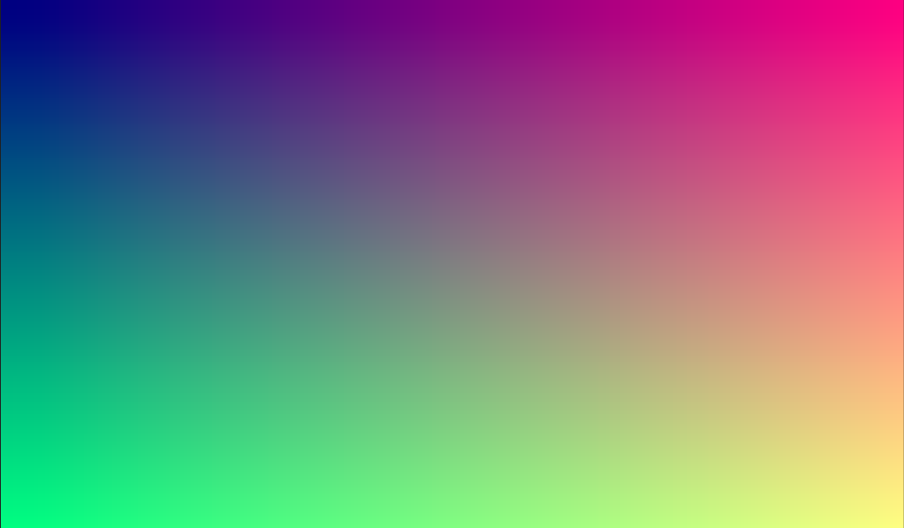

Now we have the basics of a :ref:`Viewport <class_Viewport>` that we render to and we have a unique image that we can
apply to the sphere.

Applying the texture
--------------------

Now we go into the :ref:`Mesh Instance <class_MeshInstance>` and add a :ref:`Spatial Material <class_SpatialMaterial>` 
to it. No need for a special :ref:`Shader Material <class_ShaderMaterial>` (although that would be a good idea 
for more advanced effects, like the atmosphere in the example above).

Open the newly created :ref:`Spatial Material <class_SpatialMaterial>` and scroll down to the "Albedo" section
and click beside the "Texture" property to add an Albedo Texture. Here we will apply the texture we made. 
Choose "New ViewportTexture"

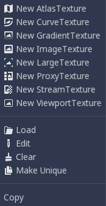

Then from the menu that pops up select the Viewport that we rendered to earlier.

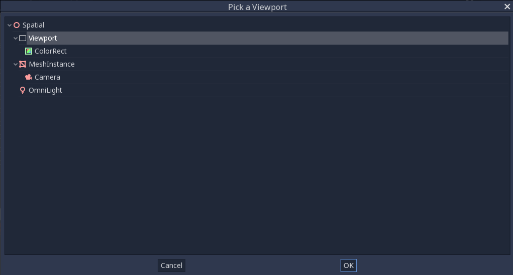

Your sphere should now be colored in with the colors we rendered to the Viewport

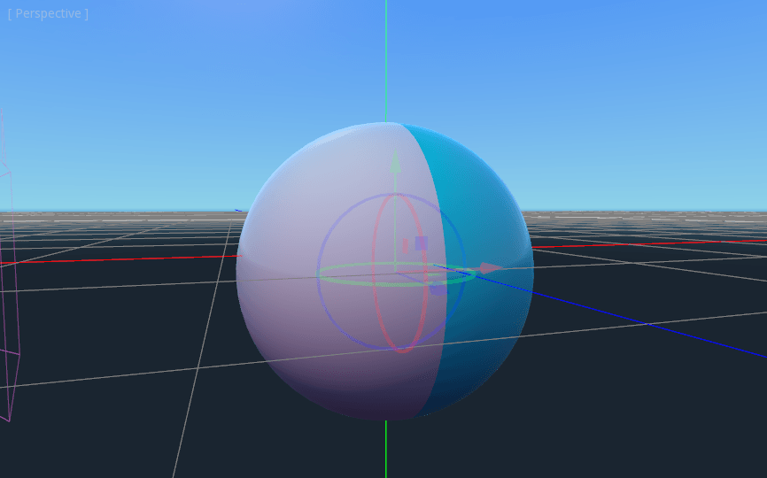

Notice the ugly seam that forms where the texture texture wraps around? This is because we are picking 
a color based on UV coordinates and UV coordinates do not wrap around the texture. This is a classic 
problem in 2D map projection. Gamedevs often have a 2-dimensional map they want to project 
onto a sphere but when it wraps around it has large seams. There is an elegant work around for this 
problem that we will illustrate in the next section.

Making the planet texture
-------------------------

So now when we render to our :ref:`Viewport <class_Viewport>` it appears magically on the sphere. But there is an ugly
seam created by our texture coordinates. So how do we get a range of coordinates that wrap around 
the sphere in a nice way? One solution is to to use a function that repeats on the domain of our texture.
``sin`` and ``cos`` are two such functions. Lets apply them to the texture and see what happens

::

  COLOR.xyz = vec3(sin(UV.x * 3.14159 * 4.0) * cos(UV.y * 3.14159 * 4.0) * 0.5 + 0.5);

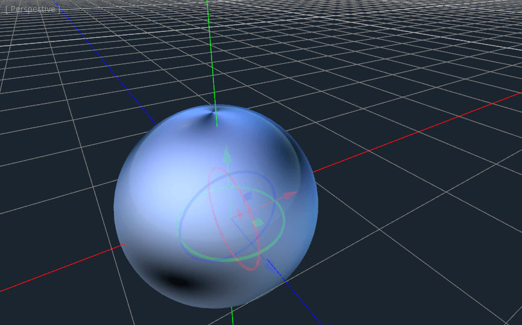

Not too bad. If you look around you can see that the seam has now disappeared, but in its place we 
have pinching at the poles. This pinching is due to the way Godot maps textures to spheres in its
:ref:`Spatial Material <class_SpatialMaterial>`. It uses a projection technique called equirectangular 
projection. Which translates a spherical map onto a 2D plane. 

.. note:: If you are interested in a little extra information on the technique, we will be converting from
          spherical coordinates into Cartesian coordinates. Spherical coordinates map the longitude and
          latitude of the sphere, while Cartesian coordinates are for all intents and purposes a 
          vector from the center of the sphere to the point. 

For each pixel we will calculate its 3D position on the sphere. From that we will use
3D noise to determine a color value. By calculating the noise in 3D we solve the problem
of the pinching at the poles. To understand why, picture the noise being calculated across the 
surface of the sphere instead of across the 2D plane. When you calculate across the 
surface of the sphere you never hit an edge, and hence you never create a seam or
a pinch point on the pole. The following code converts the ``UVs`` into Cartesion
coordinates.

::

  float theta = UV.y * 3.14159;
  float phi = UV.x * 3.14159 * 2.0;
  vec3 unit = vec3(0.0, 0.0, 0.0);

  unit.x = sin(phi) * sin(theta);
  unit.y = cos(theta) * -1.0;
  unit.z = cos(phi) * sin(theta);
  unit = normalize(unit);

And if we use ``unit`` as an output ``COLOR`` value we get.

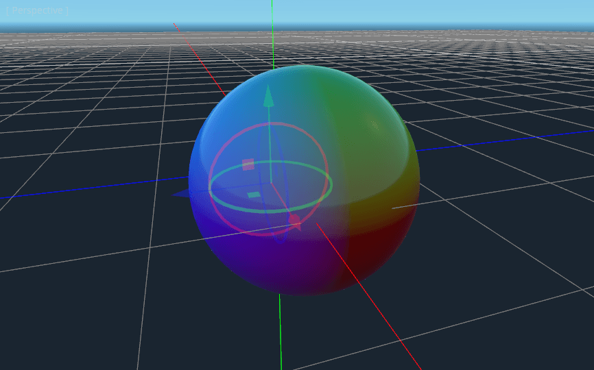

Now that we can calculate the 3D position of the surface of the sphere we can use 3D noise
to make the planet. We will be using this noise function directly from a `Shadertoy <https://www.shadertoy.com/view/4dffRH>`_:

::

  vec3 hash( vec3 p ) {
    p = vec3( dot(p,vec3(127.1, 311.7, 74.7)),
              dot(p,vec3(269.5, 183.3, 246.1)),
              dot(p,vec3(113.5, 271.9, 124.6)));

    return -1.0 + 2.0 * fract(sin(p) * 43758.5453123);
  }

  // return value noise (in x) and its derivatives (in yzw)
  vec4 noised( in vec3 x ) {
    // grid
    vec3 p = floor(x);
    vec3 w = fract(x);
    
    // quintic interpolant
    vec3 u = w * w * w * (w * (w * 6.0 - 15.0) + 10.0);
    vec3 du = 30.0 * w * w * (w * (w - 2.0) + 1.0);
    
    // gradients
    vec3 ga = hash( p + vec3(0.0, 0.0, 0.0) );
    vec3 gb = hash( p + vec3(1.0, 0.0, 0.0) );
    vec3 gc = hash( p + vec3(0.0, 1.0, 0.0) );
    vec3 gd = hash( p + vec3(1.0, 1.0, 0.0) );
    vec3 ge = hash( p + vec3(0.0, 0.0, 1.0) );
    vec3 gf = hash( p + vec3(1.0, 0.0, 1.0) );
    vec3 gg = hash( p + vec3(0.0, 1.0, 1.0) );
    vec3 gh = hash( p + vec3(1.0, 1.0, 1.0) );
    
    // projections
    float va = dot( ga, w - vec3(0.0, 0.0, 0.0) );
    float vb = dot( gb, w - vec3(1.0, 0.0, 0.0) );
    float vc = dot( gc, w - vec3(0.0, 1.0, 0.0) );
    float vd = dot( gd, w - vec3(1.0, 1.0, 0.0) );
    float ve = dot( ge, w - vec3(0.0, 0.0, 1.0) );
    float vf = dot( gf, w - vec3(1.0, 0.0, 1.0) );
    float vg = dot( gg, w - vec3(0.0, 1.0, 1.0) );
    float vh = dot( gh, w - vec3(1.0, 1.0, 1.0) );
	
    // interpolations
    return vec4( va + u.x*(vb-va) + u.y*(vc-va) + u.z*(ve-va) + u.x*u.y*(va-vb-vc+vd) + u.y*u.z*(va-vc-ve+vg) + u.z*u.x*(va-vb-ve+vf) + (-va+vb+vc-vd+ve-vf-vg+vh)*u.x*u.y*u.z,    // value
                 ga + u.x*(gb-ga) + u.y*(gc-ga) + u.z*(ge-ga) + u.x*u.y*(ga-gb-gc+gd) + u.y*u.z*(ga-gc-ge+gg) + u.z*u.x*(ga-gb-ge+gf) + (-ga+gb+gc-gd+ge-gf-gg+gh)*u.x*u.y*u.z +   // derivatives
                 du * (vec3(vb,vc,ve) - va + u.yzx*vec3(va-vb-vc+vd,va-vc-ve+vg,va-vb-ve+vf) + u.zxy*vec3(va-vb-ve+vf,va-vb-vc+vd,va-vc-ve+vg) + u.yzx*u.zxy*(-va+vb+vc-vd+ve-vf-vg+vh) ));
  }

.. note:: All credit goes to the initial author Inigo Quilez. It is published with the ``MIT`` licence.

Now to use ``noised``, add the following to the  ``fragment`` function:

::

  vec4 n = noised(unit * 5.0);
  COLOR.xyz = vec3(n.x * 0.5 + 0.5);

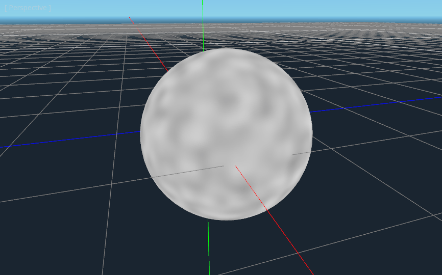

.. note:: In order to highlight the texture, I have set the material to unshaded.

You can see now that the noise indeed wraps seamlessly around the sphere. Although this
looks nothing like the planet you were promised. So lets move onto something more colorful.

Coloring the planet
-------------------

Now to make the planet colors. There are many ways to do this, if you look on `Shadertoy <https://www.shadertoy.com>`_
you will find all kinds of ways of mapping colors to procedural planet terrain. For now
we will stick with a simple gradient between water and land. 

To make a gradient in glsl we use the ``mix`` function. ``mix`` takes two values to interpolate
between and a third parameter to choose how much to interpolate between them, in essence
it *mixes* the two values together. In other APIs this function is often called ``lerp``.
Although, ``lerp`` is typically reserved for mixing two floats together, ``mix`` can take any
values whether it be floats or vector types. 

::

  COLOR.xyz = mix(vec3(0.05, 0.3, 0.5), vec3(0.9, 0.4, 0.1), n.x * 0.5 + 0.5);

The first color is blue for the ocean. The second color is a kind of reddish color (because
all alien planets need red terrain). And finally they are mixed together by ``n.x * 0.5 + 0.5``.
``n.x`` smoothly varies between ``-1`` and ``1``. So we map it into the ``0-1`` range that ``mix`` expects.
Now you can see that the colors change between blue and red. 

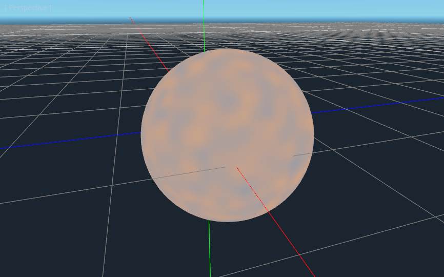

That is a little more blurry than we want. Planets typically have a relatively clear separation between
land and sea. In order to do that we will change the last term to ``smoothstep(-0.1, 0.0, n.x)``.
And thus the whole line becomes:

::

  COLOR.xyz = mix(vec3(0.05, 0.3, 0.5), vec3(0.9, 0.4, 0.1), smoothstep(-0.1, 0.0, n.x));

What ``smoothstep`` does is return ``0`` if the third parameter is below the first and return 1 if the
third parameter is larger than the second and smoothly blends between ``0`` and ``1`` if the third number
is between the first and the second. So in this line ``smoothstep`` returns ``0`` whenever ``n.x`` is less than ``-0.1``
and it returns ``1`` whenever ``n.x`` is above ``0``.

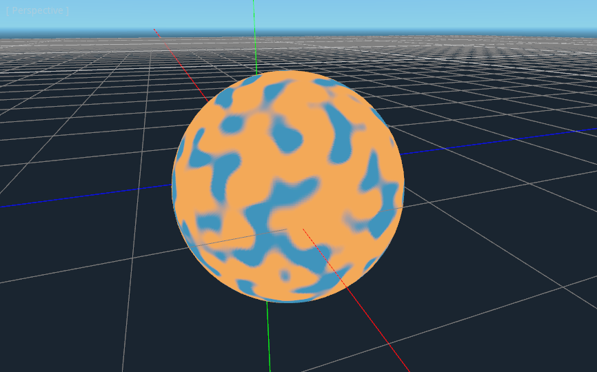

One more thing to make this a little more planet-y. The land shouldn't be so blobby lets make the edges
a little rougher. A trick that is often used in shaders to make rough looking terrain with noise is
to layer levels of noise over one another at various frequencies. We use one layer to make the 
overall blobby structure of the continents. Then another layer breaks up the edges a bit, and then
another, and so on. What we will do is calculate ``n`` with four lines of shader code
instead of just one. ``n`` becomes:

::

	vec4 n = noised(unit * 5.0) * 0.5;
	n += noised(unit * 10.0) * 0.25;
	n += noised(unit * 20.0) * 0.125;
	n += noised(unit * 40.0) * 0.0625;

And now the planet looks like:

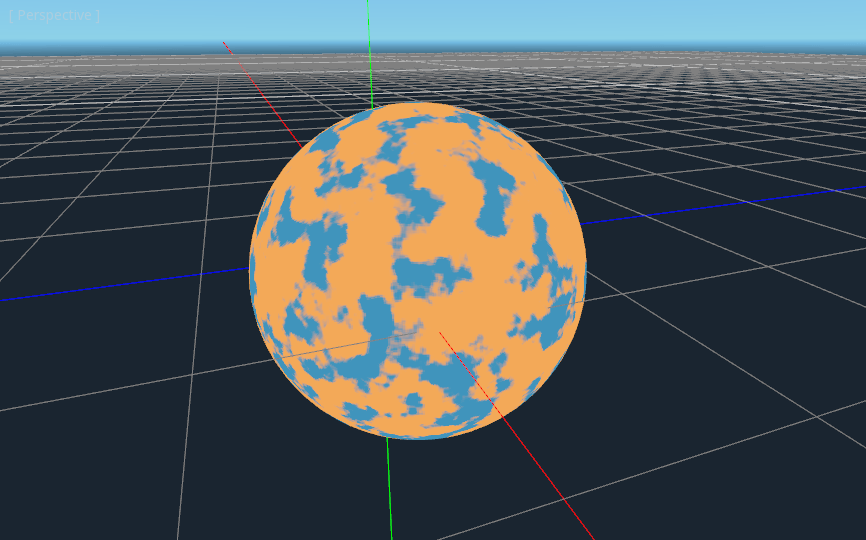

And with shading turned back on it looks like:

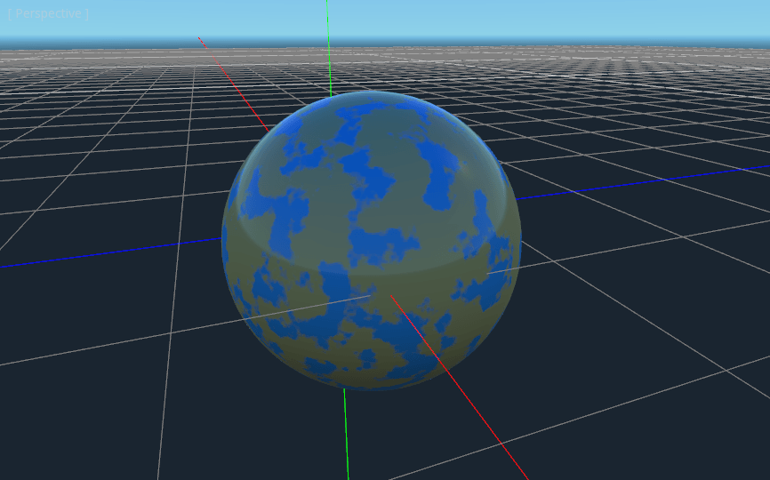

Making an ocean
---------------

One final thing to make this look more like a planet. The ocean and the land reflect light differently.
So we want the ocean to shine a little more than the land. We can do this by passing a fourth value
into the ``alpha`` channel of our output ``COLOR`` and using it as a Roughness map. 

::

  COLOR.a = 0.3 + 0.7 * smoothstep(-0.1, 0.0, n.x);

This line returns ``0.3`` for water and ``1.0`` for land. This means that the land is going to be quite
rough while the water will be quite smooth.

And then in the material under the "Metallic" section make sure ``Metallic`` is set to ``0`` and 
``Specular`` is set to ``1``. The reason for this is the water reflects light really well, but 
isn't metallic. These values are not physically accurate, but they are good enough for this demo.

Next under the "Roughness" section set ``Roughness`` to ``1`` and set the roughness texture to a 
:ref:`Viewport Texture <class_ViewportTexture>` pointing to our planet texture :ref:`Viewport <class_Viewport>`. 
Finally set the ``Texture Channel`` to ``Alpha``. This instructs the renderer to use the ``alpha`` 
channel of our output ``COLOR`` as the ``Roughness`` value.

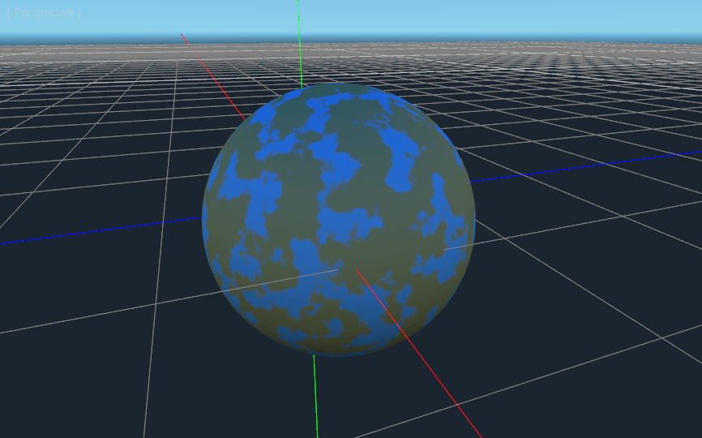

You'll notice that very little changes except that the planet is no longer reflecting the sky. 
This is happening because by default when something is rendered with an
alpha value it gets drawn as a transparent object over the background. And since the default background
of the :ref:`Viewport <class_Viewport>` is opaque, the ``alpha`` channel of the 
:ref:`Viewport Texture <class_ViewportTexture>` is ``1`` resulting in the planet texture being 
drawn with slightly fainter colors and a ``Roughness`` value of ``1`` everywhere. To correct this we 
go into the :ref:`Viewport <class_Viewport>` and set "Transparent Bg" to on. Since we are now 
rendering one transparent object on top of another we want to enable ``blend_premul_alpha``:

::

  render_mode blend_premul_alpha;

This pre-multiplies the colors by the ``alpha`` value and then blends them correctly together. Typically
when blending one transparent color on top of another, even if the background has an ``alpha`` of ``0`` (as it 
does in this case), you end up with weird color bleed issues. Setting ``blend_premul_alpha`` fixes that.

Now the planet should look like it is reflecting light on the ocean but not the land. If you haven't done
so already, add an :ref:`OmniLight <class_OmniLight>` to the scene so you can move it around and see the
effect of the reflections on the ocean.

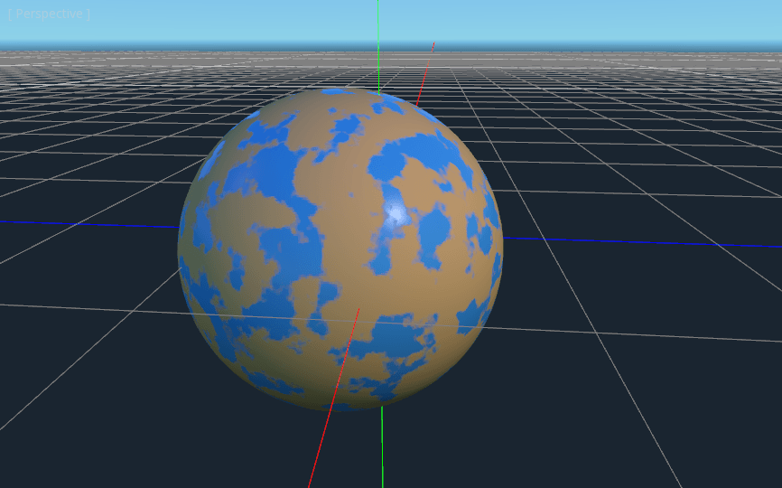

And there you have it. A simple procedural planet generated using a :ref:`Viewport <class_Viewport>`.
